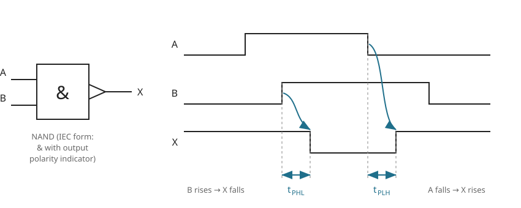
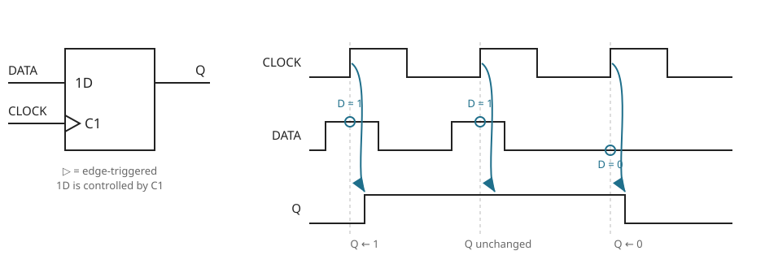
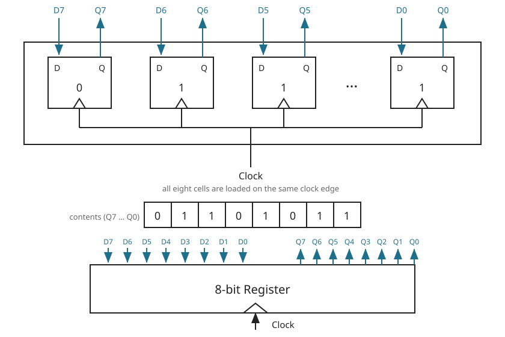
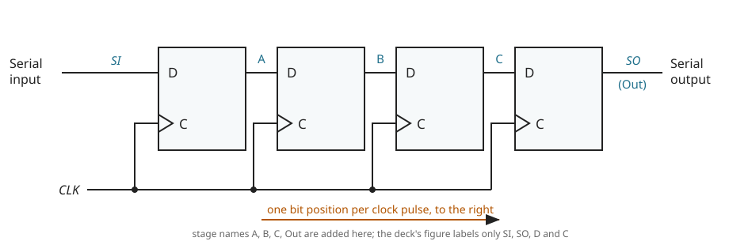
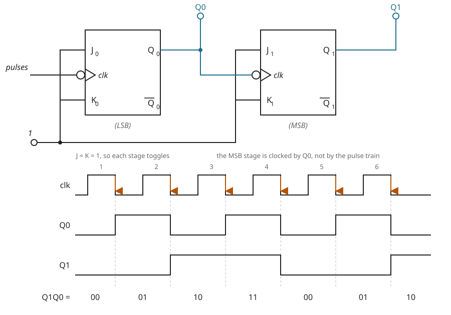
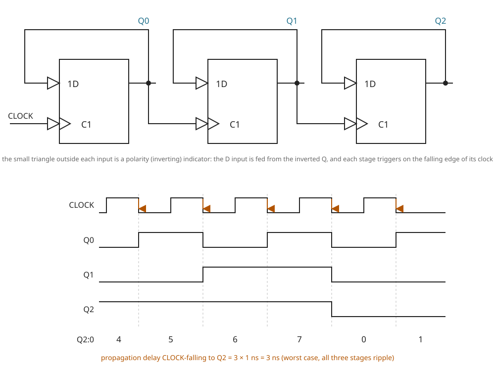
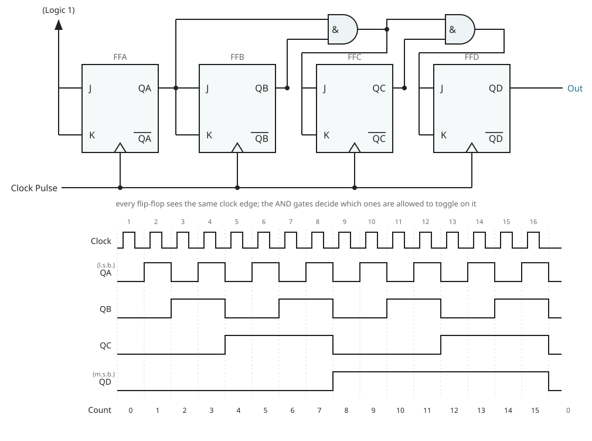
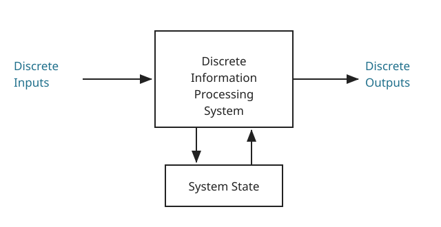
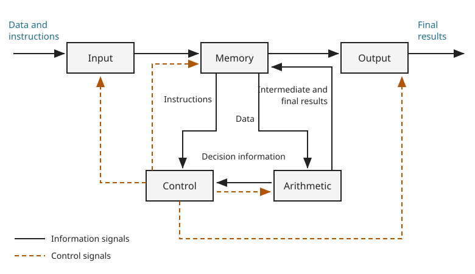

# 01 — Introduction and Recap

Chapter 1 has two halves and they carry very different weight.

- **Slides 2–4** set the historical scene: how the active device went from valve to VLSI, and the
  two "laws" the lecturer quotes about the economics of that.
- **Slides 6–20** are a recap of Digital Electronics I. This is the load-bearing half. Everything in
  it — the D flip-flop, registers, shift registers, ripple and synchronous counters — is the
  vocabulary that CH5 (finite state machines) and CH6 (algorithmic state machines) assume without
  re-teaching.
- **Slides 21–32** are a preview of the rest of the unit. Each topic there is taught properly in its
  own chapter, so it is summarised once, as a roadmap, in §7 below and not taught here.

Slides 1, 5 and 21 are title slides with no body content.

---

## Look-alike symbols in this chapter

Worth fixing before they cause trouble, because CH1 reuses letters across its two halves.

| Symbol | One meaning | The other meaning | Where they collide |
|---|---|---|---|
| $A$, $B$ | gate inputs ·CH1 slide 10 | shift-register stage names in the parallel-output vector $(A, B, C, \text{Out})$ ·CH1 slide 14 | slides 10 and 14 |
| $A$, $B$ | as above | the two flip-flop **state variables** of the sequential-circuit example ·CH1 slide 29 | slide 29 |
| $C$ | the **clock** pin label on a flip-flop symbol ·CH1 slides 14–16 | third shift-register stage in $(A, B, C, \text{Out})$ ·CH1 slide 14 | slide 14, in one figure |
| $C_L$ | output **load capacitance**, in pF ·CH1 slide 10 | — | do not read the $C$ of $C_L$ as a clock pin |
| $K$ | the **K** input of a JK flip-flop ·CH1 slide 18 | $k$, the number of **address lines** on a memory unit ·CH1 slide 25 | slides 18 and 25 |
| $1$ in "1D", "C1" | an **identifier**, not a logic level ·CH1 slide 11 | logic 1 on the J and K inputs ·CH1 slide 18 | slides 11 and 18 |

The last one bites hardest. On slide 11 the digit in $1\text{D}$ and $\text{C}1$ is a
cross-reference between pins; on slide 18 the digit tied to $J$ and $K$ is a genuine logic HIGH.

---

## 1. Evolution of electronic devices and scales of integration ·CH1 slides 2–4

No new symbols are introduced in this sub-topic.

### 1.1 The four device eras

The deck presents the progression as four photographs, in this order ·CH1 slide 2:

1. **Vacuum tubes**
2. **Discrete transistors**
3. **SSI and MSI integrated circuits** — small- and medium-scale integration
4. **VLSI surface-mount circuits** — very-large-scale integration

[fig] **Fig. 1-1** — four-panel photograph of vacuum tubes (a), discrete transistors (b), SSI/MSI
dual-in-line integrated circuits (c) and VLSI surface-mount packages (d) ·CH1 slide 2. Photographs
of hardware; not reproduced here.

The only technical content the slide carries is the ordering and the two acronyms. The deck does
**not** give gate counts or transistor counts for SSI, MSI, LSI or VLSI anywhere in CH1, so no
boundary figures are quoted here.

### 1.2 Microelectronics proliferation ·CH1 slide 3

- The **integrated circuit was invented in 1958**.
- World transistor production has **more than doubled every year** for the past twenty years — so
  every year more transistors are made than in all previous years combined.
- The deck's illustrative figure: roughly **50 transistors for every ant in the world**.

### 1.3 The two laws ·CH1 slide 3

**[def] Moore's Law** (stated 1965) — the *density* of transistors in an integrated circuit doubles
every **18 months**, i.e. every 1.5 years. The deck notes the law "holds for almost today".

**[def] Rock's Law** — the *cost of the capital equipment* needed to build semiconductors doubles
every **four years**.

The slide gives both in words only. Written as growth laws:

**[added] [eq: moores-law]**

$$\boxed{\;N(t) \;=\; N_0 \, 2^{\,t/T_M}, \qquad T_M = 1.5\ \text{years}\;}$$

**[added] [eq: rocks-law]**

$$\boxed{\;C(t) \;=\; C_0 \, 2^{\,t/T_R}, \qquad T_R = 4\ \text{years}\;}$$

where

- $N(t)$ — transistors per integrated circuit at time $t$ (dimensionless count)
- $N_0$ — transistors per integrated circuit at the reference time (dimensionless count)
- $C(t)$ — capital cost of a fabrication plant at time $t$ (currency)
- $C_0$ — that cost at the reference time (currency)
- $t$ — time elapsed from the reference (years)
- $T_M$ — Moore doubling period, $1.5$ years
- $T_R$ — Rock doubling period, $4$ years

The deck's closing remark ·CH1 slide 3:

> If Moore's Law is to hold, Rock's Law must fall or computers must shift to a radically different
> technology.

### 1.4 The trend chart ·CH1 slide 4

[fig] **Fig. 1-2** — log-linear chart of five microprocessor trends from 1973 to a projected 2030:
transistor count, single-thread performance, clock frequency, power in watts, and number of cores.
Transistor count continues to climb; clock frequency, thread performance and power all flatten from
about 2005, and core count begins to rise from that same date ·CH1 slide 4. Third-party figure; not
reproduced.

The chart carries no numbers the deck asks a student to use — it is context for §1.3. The one thing
to take from it is the shape: **transistor count kept doubling, clock frequency did not**, which is
why parallelism (cores) appears after 2005.

---

## 2. What a digital system is ·CH1 slides 6–9

| Symbol | Meaning | Units | Typical value |
|---|---|---|---|
| $+V_s$ | positive supply rail; the voltage that represents logic 1 | V | not given in CH1 |
| $0\ \text{V}$ | ground; the voltage that represents logic 0 | V | $0$ |

### 2.1 Definition ·CH1 slide 6

**[def]** A **digital system** processes **digital signals** — signals that can take only a limited
number of values (discrete steps). Usually just two values are used: the positive supply voltage
$+V_s$ and zero volts.

The deck's illustration is a digital panel meter: it can display 13.81 and 13.82 but nothing between
them.

[fig] **Fig. 1-3** — photograph of a digital panel meter reading 13.81, with the annotation that a
digital meter can display many values but not *every* value within its range ·CH1 slide 6. Product
photograph; not reproduced.

Digital systems are built from **logic gates, flip-flops, shift registers and counters**. The
general-purpose digital computer is the best-known example of a digital system ·CH1 slide 6.

### 2.2 Types of system ·CH1 slide 7

Two questions decide the type: *is there state?* and if so, *when is it updated?*

| | State present? | State updated | Name |
|---|---|---|---|
| 1 | no | — | **combinational logic system** |
| 2 | yes | at discrete times, e.g. once per clock tick | **synchronous sequential system** |
| 3 | yes | at any time | **asynchronous sequential system** |

For the combinational case the slide gives the defining relation in words:

$$\text{Output} \;=\; \text{Function}(\text{Input})$$

— the output depends on the present input only, with no memory of what came before.

**⚠ VERIFY (V01-1)** — the printed slide attaches the descriptor *"State updated at any time"* to
the bullet **"Synchronous sequential system"**, and leaves **"Asynchronous sequential system"** with
no descriptor at all. Read literally, the slide defines *synchronous* backwards. The corrected
reading is the table above: **discrete update times → synchronous; update at any time →
asynchronous**. The slide's own earlier sub-bullet, "State updated at discrete times (e.g. once per
clock tick)", is the synchronous case and is stranded under the parent bullet "With state present".

This distinction is the whole basis of CH5, so it is worth getting right at the outset. Everything
in §5 and §6 below is synchronous except the ripple counters, which are deliberately asynchronous.

### 2.3 Four ways to describe a digital system ·CH1 slide 8

The deck lists five description forms side by side:

1. **Schematic diagram and gates** — the drawn interconnection of primitives.
2. **Boolean equation** — the output as an algebraic expression of the inputs.
3. **Truth table** — every input combination against its output.
4. **Timing diagram** — the signals against time.
5. **Hardware description language (HDL)** — a textual model, previewed again on slide 32.

[fig] **Fig. 1-4** — montage of the five forms, using a seven-segment decoder as the running example
(schematic of AND/OR gates driving $\text{out}[6]$; the Boolean equation for $\text{out}6$; a truth
table of $\text{in}[3..0]$ against $\text{out}[6{:}0]$ for the digits 0–9; a three-signal timing
diagram; and a Verilog module for a 3-to-1 multiplexer) ·CH1 slide 8. Screenshots lifted from
third-party tool documentation; not reproduced.

Checked, since the montage carries live numbers: the truth table is a self-consistent
active-low seven-segment decoder in the bit order $g\,f\,e\,d\,c\,b\,a$, and the printed equation for
$\text{out}6$ reproduces every one of the ten specified rows. No defect.

### 2.4 Basic digital building blocks ·CH1 slide 9

The blocks the recap assumes you already own:

- **primitive logic gates** — AND, OR, NAND, NOR, XOR, XNOR, NOT
- **multiplexers** — including bussed (multi-bit) forms
- **arithmetic circuits** — add, subtract, multiply
- **encoders** — e.g. an $8 \times 3$ priority encoder
- **decoders** — e.g. a seven-segment decoder
- **flip-flops and registers** — three cascaded $1\text{D}$/$\text{C}1$ cells labelled $Q_0$, $Q_1$,
  $Q_2$, each carrying a polarity indicator on both inputs and each with its data input fed back
  from its own output

[fig] **Fig. 1-5** — montage of the six block families listed above, each with a small symbol or
truth table ·CH1 slide 9. Third-party figure; not reproduced. The flip-flop panel of this montage is
the very same circuit that reappears on slide 19, and is redrawn properly as Fig. 1-12 below.

---

## 3. Propagation delay ·CH1 slides 10 and 12

| Symbol | Meaning | Units | Typical value |
|---|---|---|---|
| $t_{PHL}$ | delay from the causing input change to the output going **HIGH to LOW** | ns | $4.5$ (74AC00) |
| $t_{PLH}$ | delay from the causing input change to the output going **LOW to HIGH** | ns | $6.0$ (74AC00) |
| $C_L$ | output load capacitance at which the delays are quoted | pF | $30$ |

### 3.1 Cause and effect ·CH1 slide 10

**[def] Propagation delay** — the time delay between a **cause** (an input changing) and its
**effect** (an output changing), assuming an output load capacitance of 30 pF.

The deck insists on the causal reading, because it is what makes the two subscripts meaningful. For
the NAND gate drawn on the slide:

- **Input B going high causes X to go low.**
- **Input A going low causes X to go high.**

The subscripts $PHL$ and $PLH$ refer to **the direction the output moves**, not the input.

[fig] **Fig. 1-6** — the IEC NAND symbol and its cause-and-effect waveform ·CH1 slide 10

```yaml
figure_data:
  type: gate-timing
  device: 74AC00
  gate: NAND
  symbol: IEC rectangle marked "&" with an output polarity indicator
  inputs: [A, B]
  output: X
  events:
    - {t: t1, change: "A 0->1", effect: "none (B still 0, X stays 1)"}
    - {t: t2, change: "B 0->1", effect: "X 1->0 after t_PHL"}
    - {t: t3, change: "A 1->0", effect: "X 0->1 after t_PLH"}
  load_capacitance_pF: 30
```



### 3.2 The deck's worked device: 74AC00 ·CH1 slide 10

**[ex]** 74AC00, Advanced CMOS 2-input NAND gate, at $C_L = 30\ \text{pF}$:

| Transition | Parameter | min | typ | max | Units |
|---|---|---|---|---|---|
| A rising $\rightarrow$ X falling | $t_{PHL}$ | $1.5$ | $4.5$ | $6.5$ | ns |
| A falling $\rightarrow$ X rising | $t_{PLH}$ | $1.5$ | $6.0$ | $8.0$ | ns |

Two things to read off this table:

- The two directions are **not** equal. For this part the rising-output transition is the slower one,
  $6.0$ ns typical against $4.5$ ns.
- The **max** column, not the typical, is what a timing budget must use.

**⚠ VERIFY (C01-3)** — slide 27 later summarises the same family as "new ones (74AC) much faster
(3 ns)", which does not agree with the $4.5$–$6.0$ ns typical figures printed here. Neither figure
is unreasonable on its own — propagation delay depends on supply voltage and load, and the deck
states the load only on slide 10 — but the two slides are inconsistent as printed. Use the slide 10
table, which states its conditions.

### 3.3 Flip-flop propagation delay ·CH1 slide 12

For the D flip-flop of §4 the deck quotes:

$$t_{pd}(\text{CLOCK}\!\uparrow \rightarrow Q) \;\approx\; 1\ \text{ns}$$

and makes a point that matters later: a **DATA-to-Q propagation delay does not make sense**, because
DATA changing does not cause $Q$ to change. Only the clock edge does.

---

## 4. The D flip-flop ·CH1 slides 11–12

| Symbol | Meaning | Units | Typical value |
|---|---|---|---|
| $D$ | data input of the flip-flop (pin marked $1\text{D}$) | — | 0 or 1 |
| $Q$ | flip-flop output, i.e. the stored state | — | 0 or 1 |
| $Q(t)$ | present state, immediately before the active clock edge | — | 0 or 1 |
| $Q(t+1)$ | next state, immediately after the active clock edge | — | 0 or 1 |
| CLOCK | clock input (pin marked $\text{C}1$) | — | — |
| $t_{pd}$ | clock-edge-to-output delay | ns | $1$ |

### 4.1 Reading the symbol ·CH1 slide 11

The deck uses IEC-style dependency notation, and spends a whole slide on how to read it:

| Mark | Meaning |
|---|---|
| $\triangleright$ | the input's effect happens on the **rising edge** |
| $\text{C}1$ | $\text{C}$ = clock input; the $1$ **after** the letter says "this input *is* input number 1" |
| $1\text{D}$ | $\text{D}$ = data input; the $1$ **before** the letter says "this input *is controlled by* input number 1" |

The rule that generalises it ·CH1 slide 11:

- a number **after** a letter **identifies** a particular input;
- a number **before** a letter means that input **is controlled by** one of the other inputs.

So $1\text{D}$ and $\text{C}1$ together say: the data input is captured under the control of the
clock input.

### 4.2 Cause and effect ·CH1 slide 12

Four statements, and they are the whole behaviour:

1. A rising clock edge causes $Q$ to change after a short delay. **This is the only time $Q$ ever
   changes.**
2. The value of $D$ **just before** the rising clock edge is the new $Q$.
3. The propagation delay from clock edge to $Q$ is typically $1$ ns.
4. A DATA-to-$Q$ propagation delay is meaningless, because DATA changing does not cause $Q$ to
   change.

**[added] [eq: d-flip-flop-characteristic]** — the deck states (2) in words only; algebraically it is

$$\boxed{\;Q(t+1) \;=\; D(t)\;}$$

evaluated at the active clock edge.

[fig] **Fig. 1-7** — D flip-flop symbol and timing diagram ·CH1 slides 11 and 12

```yaml
figure_data:
  type: flip-flop-timing
  device: D flip-flop, positive-edge triggered
  symbol_pins: {data: "1D", clock: "C1 with dynamic input indicator", output: "Q"}
  clock_edges_rising: [e1, e2, e3]
  d_at_edge:  {e1: 1, e2: 1, e3: 0}
  q_after_edge: {e1: 1, e2: 1, e3: 0}
  note: "Q changes only at a rising clock edge; between edges D moves freely with no effect"
  clock_to_q_delay_ns: 1
```



Trace it once and the rest of the chapter follows: at edge 1 the sampled $D$ is 1, so $Q$ goes high;
at edge 2 the sampled $D$ is again 1, so $Q$ does not move even though $D$ has been up and down in
between; at edge 3 the sampled $D$ is 0, so $Q$ falls.

---

## 5. Registers and shift registers ·CH1 slides 13–16

| Symbol | Meaning | Units | Typical value |
|---|---|---|---|
| $n$ | number of bits, i.e. number of flip-flops | — | $8$ (slide 13), $4$ (slides 14–16) |
| $D_i$ | parallel data input of bit $i$ | — | 0 or 1 |
| $Q_i$ | parallel data output of bit $i$ | — | 0 or 1 |
| $SI$ | serial input of a shift register | — | 0 or 1 |
| $SO$ | serial output of a shift register | — | 0 or 1 |
| $N_{\text{shift}}$ | number of clock pulses needed to load a word serially | — | $4$ for a nibble |

### 5.1 Register ·CH1 slide 13

**[def]** A **register** is a group of flip-flops sharing one clock. An $n$-bit register is $n$ D
flip-flops loaded together on the same clock edge, so it holds an $n$-bit word.

The deck's example holds $01101011$ in eight cells and is then abstracted into a single block with
$D_7 \ldots D_0$ in and $Q_7 \ldots Q_0$ out.

[fig] **Fig. 1-8** — 8-bit register, at flip-flop level and as one block ·CH1 slide 13

```yaml
figure_data:
  type: register
  width_bits: 8
  cell: D flip-flop, edge-triggered
  clock: single common clock to all eight cells
  inputs:  [D7, D6, D5, D4, D3, D2, D1, D0]
  outputs: [Q7, Q6, Q5, Q4, Q3, Q2, Q1, Q0]
  example_contents: "01101011"
  contents_bit_order: "leftmost cell is Q7, rightmost is Q0"
```



### 5.2 Shift register ·CH1 slide 14

**[def]** A **shift register** is a register capable of shifting its binary information in one
direction or in both directions.

For the register drawn on slide 14 — four D flip-flops, output of each feeding the $D$ of the next,
all on one clock:

- the data input is the **serial input**, also called the **shift-right input**;
- the data output is the **serial output**;
- the four stage outputs taken together are the **parallel output**;
- **each clock pulse shifts the contents one bit position to the right**;
- the serial input determines what goes into the **leftmost** flip-flop during the shift;
- the serial output is taken from the output of the **rightmost** flip-flop.

**⚠ VERIFY (C01-1)** — the bullets name signals that do not appear on the figure. They speak of a
data input "In", a data output "Out" and "the vector $(A, B, C, \text{Out})$", but the drawn figure
labels only $SI$, $SO$, $D$ and $C$. The mapping is: $\text{In} = SI$, $\text{Out} = SO$, and $A$,
$B$, $C$ are the first three stage outputs, left to right. Fig. 1-9 below carries those stage names
so the bullet can be read against the picture.

[fig] **Fig. 1-9** — 4-bit serial-in serial-out shift register ·CH1 slides 14, 15 and 16

```yaml
figure_data:
  type: shift-register
  width_bits: 4
  direction: right
  cell: D flip-flop, edge-triggered
  clock: single common clock (CLK) to all four stages
  serial_input: SI          # enters the leftmost stage
  serial_output: SO         # taken from the rightmost stage
  stage_outputs: [A, B, C, Out]   # left to right; names from the slide-14 bullets, not on the figure
  transfer_per_clock: "A <- SI ; B <- A ; C <- B ; Out <- C"
  state_notation: "the 4-bit pattern is written left to right as (A, B, C, Out)"
```



Written as a transfer, one clock pulse does

$$A \leftarrow SI, \qquad B \leftarrow A, \qquad C \leftarrow B, \qquad \text{Out} \leftarrow C$$

all simultaneously, on the same edge.

### 5.3 [ex] Worked example — storing a nibble ·CH1 slides 15–16

**The question, as set** ·CH1 slide 15:

> The figure below shows a 4-bit in serial out shift register that is shifted from left. Assuming
> that the register is initially clear, develop a state table to clearly show the 4-bit pattern after
> the third clock pulse if we wish to store the nibble 1100.

**The deck's solution** ·CH1 slide 16:

- The register is given a serial input with serial data $1100$; the shift register is initially
  cleared to $0000$.
- Since $1100$ has to end up stored in the register, the bits are entered **least significant bit
  first**.

| Shift no. | Register state | Remark (as printed) |
|---|---|---|
| 0 | $0000$ | Initial State |
| 1 | $0000$ | They are entered from the right |
| 2 | $0000$ | |
| **3** | $\mathbf{1000}$ | As they are shifted from left |
| 4 | $1100$ | Four shifts to store this data |

**⚠ VERIFY (C01-2)** — two wording problems in the solution as printed, neither of which changes the
answer:

1. The sentence "bits will be entered LSB" is truncated; it should read "**LSB first**".
2. The remarks "They are entered from the right" (row 1) and "As they are shifted from left"
   (row 3) look contradictory. They are not: the first refers to the **data word**, whose bits are
   taken starting from its right-hand (least significant) end, and the second refers to the
   **register**, into which those bits are shifted from the left-hand end. Read either one as
   applying to the other and the trace comes out reversed.

#### Rederivation

The bit that must finish in the rightmost stage has to be fed **first**, because it has the furthest
to travel. Target contents, left to right, are $(A, B, C, \text{Out}) = (1,1,0,0)$, so the serial
input sequence is that target read backwards:

$$SI: \quad 0,\; 0,\; 1,\; 1$$

Applying $A \leftarrow SI,\ B \leftarrow A,\ C \leftarrow B,\ \text{Out} \leftarrow C$ once per
pulse, from $0000$:

$$\text{after pulse 1 } (SI=0): \quad 0000$$

$$\text{after pulse 2 } (SI=0): \quad 0000$$

$$\text{after pulse 3 } (SI=1): \quad 1000$$

$$\text{after pulse 4 } (SI=1): \quad 1100$$

**Answer to the question as asked:** after the third clock pulse the 4-bit pattern is
$\mathbf{1000}$ — the row the slide highlights. The full nibble is not in place until the fourth
pulse.

Recomputed and matched against the slide row by row; all five rows agree.

**[added]** Sanity check on the bit order. Had the most significant bit been fed first — $1,1,0,0$ —
the trace would run $1000 \rightarrow 1100 \rightarrow 0110 \rightarrow 0011$, storing $0011$: the
nibble reversed. That is why "LSB first" is not an arbitrary choice.

**[added] [eq: shift-register-load-time]** — the general result the example is an instance of:

$$\boxed{\;N_{\text{shift}} \;=\; n\;}$$

An $n$-bit word loaded serially needs exactly $n$ clock pulses, one per bit, whatever the pattern.
Here $n = 4$, which is the slide's "Four shifts to store this data".

---

## 6. Counters ·CH1 slides 17–20

| Symbol | Meaning | Units | Typical value |
|---|---|---|---|
| $J$, $K$ | the two control inputs of a JK flip-flop | — | 0 or 1 |
| $Q_0$ | counter output, least significant bit | — | 0 or 1 |
| $Q_1$, $Q_2$, … | successively more significant counter bits | — | 0 or 1 |
| $Q_A \ldots Q_D$ | the four stage outputs of the synchronous counter, $Q_A$ = l.s.b. | — | 0 or 1 |
| $n$ | number of counter stages | — | $2$, $3$ or $4$ in CH1 |
| $t_{pd}$ | propagation delay of one stage, clock edge to $Q$ | ns | $1$ |
| $t_{pd,\text{total}}$ | worst-case delay from the clock edge to the last stage settling | ns | $3$ for $n = 3$ |

### 6.1 Definition ·CH1 slide 17

**[def]** **Counters** are sequential circuits which "count" through a specific state sequence. They
can count up, count down, or count through other fixed sequences.

[fig] **Fig. 1-10** — side-by-side comparison of a 2-stage **asynchronous** counter (the clock drives
the first flip-flop only; the second is clocked from the first stage's $Q$) and a 2-stage
**synchronous** counter (both flip-flops share the clock; the second stage's $J$ and $K$ are driven
from the first stage's $Q$). In the asynchronous circuit both flip-flops have $J$ and $K$ tied HIGH;
in the synchronous circuit only the first does ·CH1 slide 17. Textbook scan; not reproduced.
The two architectures are drawn properly as Fig. 1-11 and Fig. 1-13 below.

That one difference — **where the second stage gets its clock** — is the entire asynchronous /
synchronous distinction.

### 6.2 The JK flip-flop function table ·CH1 slide 18

| $J$ | $K$ | $Q(t+1)$ | Action |
|---|---|---|---|
| 0 | 0 | $Q(t)$ | No change |
| 0 | 1 | $0$ | Reset |
| 1 | 0 | $1$ | Set |
| 1 | 1 | $Q'(t)$ | Complement |

The counters below use only the last row: hold $J = K = 1$ and the flip-flop **toggles** on every
active clock edge.

**[added] [eq: jk-flip-flop-characteristic]** — the deck gives the table but not the algebra:

$$\boxed{\;Q(t+1) \;=\; J\,\overline{Q(t)} \;+\; \overline{K}\,Q(t)\;}$$

Check it against the table: $J=K=0$ gives $Q(t+1) = Q(t)$; $J=0,K=1$ gives $0$; $J=1,K=0$ gives $1$;
$J=K=1$ gives $\overline{Q(t)}$. All four rows reproduce.

### 6.3 2-bit ripple counter using JK flip-flops ·CH1 slide 18

How the circuit is set up ·CH1 slide 18:

- **$J$ and $K$ inputs maintained at logic 1** — both stages are supplied with a HIGH.
- **Negative-triggered** clock pulse: a stage changes only when its clock input goes from 1 to 0.
- $Q_0$ is the **LSB**, $Q_1$ is the **MSB**.
- $Q_0$ — not the incoming pulse train — is what clocks the second stage.

Behaviour, in the deck's own steps:

1. Initially the flip-flop is at state 0.
2. The flip-flop stays in that state until the applied clock goes from 1 to 0.
3. Because $J$ and $K$ are 1, the flip-flop toggles, so it changes state from 0 to 1.
4. The process continues for all pulses of the clock.
5. The counter counts $00, 01, 10, 11$, then resets itself and starts again.

[fig] **Fig. 1-11** — 2-bit ripple counter and its waveform ·CH1 slide 18

```yaml
figure_data:
  type: counter-circuit-and-timing
  architecture: ripple (asynchronous)
  stages: 2
  flip_flop: JK, negative-edge triggered
  control_inputs: "J0 = K0 = J1 = K1 = 1 (tied to logic 1), so every stage toggles"
  clocking:
    stage0: "external pulse train"
    stage1: "Q0"
  bit_significance: {Q0: LSB, Q1: MSB}
  state_sequence: ["00", "01", "10", "11", "00", "01"]
  modulus: 4
  direction: up
```



#### Rederiving the state sequence

Start from $Q_1Q_0 = 00$. Stage 0 toggles on every falling edge of the pulse train; stage 1 toggles
on every falling edge of $Q_0$.

| Falling edge | $Q_0$ before | $Q_0$ after | Did $Q_0$ fall? | $Q_1$ after | $Q_1Q_0$ |
|---|---|---|---|---|---|
| — | — | 0 | — | 0 | $00$ |
| 1 | 0 | 1 | no | 0 | $01$ |
| 2 | 1 | 0 | yes | 1 | $10$ |
| 3 | 0 | 1 | no | 1 | $11$ |
| 4 | 1 | 0 | yes | 0 | $00$ |
| 5 | 0 | 1 | no | 0 | $01$ |
| 6 | 1 | 0 | yes | 1 | $10$ |

Recomputed by simulation; the sequence $00, 01, 10, 11, 00, 01$ printed under the slide's waveform
is reproduced exactly.

Note *why* this counts **up** rather than down: $Q_1$ toggles when $Q_0$ falls, i.e. on the
$1 \rightarrow 0$ transition of the lower bit, which is precisely when a binary carry occurs. Clock
the second stage from $\overline{Q_0}$ instead and the same circuit counts down.

### 6.4 Ripple counters in general ·CH1 slide 19

The deck's second ripple example is a 3-bit counter built from D flip-flops rather than JK.

Two things to notice, in the deck's words ·CH1 slide 19:

- **Notice inverters on the CLOCK and DATA inputs.** The inversion on the data input makes
  $D = \overline{Q}$, which turns a D flip-flop into a toggle; the inversion on the clock input makes
  the stage respond to the **falling** edge of whatever clocks it.
- **The least significant bit of a number is always labelled 0** — hence $Q_0$, $Q_1$, $Q_2$.

The stated delay ·CH1 slide 19:

$$t_{pd,\text{total}} \;=\; 3 \times 1\ \text{ns} \;=\; 3\ \text{ns}$$

**[eq: ripple-counter-total-delay]** — generalising the slide's arithmetic:

$$\boxed{\;t_{pd,\text{total}} \;=\; n \, t_{pd}\;}$$

where $n$ is the number of stages the change has to ripple through and $t_{pd}$ is the per-stage
clock-to-output delay. This is the defining weakness of the ripple architecture: the settling time
grows **linearly with the word length**, because stage $k$ cannot start until stage $k-1$ has
finished.

The slide's state diagram is drawn "not including transient states" — an important qualifier. During
the $7 \rightarrow 0$ transition the outputs pass briefly through $6$ and $4$ as the change ripples,
and those transients are real; they are simply omitted from the diagram.

[fig] **Fig. 1-12** — 3-bit ripple counter using D flip-flops, with waveform ·CH1 slide 19

```yaml
figure_data:
  type: counter-circuit-and-timing
  architecture: ripple (asynchronous)
  stages: 3
  flip_flop: D, with a polarity (inverting) indicator on both the 1D and the C1 input
  feedback: "each stage's D is driven from its own inverted Q, so the stage toggles"
  clocking:
    stage0: "CLOCK"
    stage1: "Q0"
    stage2: "Q1"
  effective_trigger: "falling edge of each stage's own clock input"
  count_window_shown: [4, 5, 6, 7, 0, 1]
  full_cycle: [0, 1, 2, 3, 4, 5, 6, 7]
  modulus: 8
  stage_delay_ns: 1
  worst_case_delay_ns: 3
  state_diagram: "0 -> 1 -> 2 -> 3 -> 4 -> 5 -> 6 -> 7 -> 0, transient states excluded"
```



Recomputed: starting from $Q_2Q_1Q_0 = 100$ (count 4) and toggling on falling edges as described,
the successive counts are $4, 5, 6, 7, 0, 1$ — exactly the row printed under the slide's waveform —
and the full cycle is $0$ through $7$.

### 6.5 Synchronous counter ·CH1 slide 20

In the synchronous architecture **every flip-flop is clocked by the same signal**. What changes from
stage to stage is not the clock but the *enable*: the $J$ and $K$ inputs are gated so that a stage
toggles only when all the less significant stages are already 1.

For the deck's binary 4-bit synchronous up counter ·CH1 slide 20:

$$J_A = K_A = 1$$

$$J_B = K_B = Q_A$$

$$J_C = K_C = Q_A \cdot Q_B$$

$$J_D = K_D = Q_A \cdot Q_B \cdot Q_C$$

with the third product formed by cascading the two AND gates, the second gate taking the first
gate's output and $Q_C$.

[fig] **Fig. 1-13** — 4-bit synchronous up counter and its waveform ·CH1 slide 20

```yaml
figure_data:
  type: counter-circuit-and-timing
  architecture: synchronous
  stages: 4
  flip_flop: JK
  clocking: "one clock line to FFA, FFB, FFC and FFD"
  enables:
    FFA: "J = K = 1 (Logic 1)"
    FFB: "J = K = QA"
    FFC: "J = K = QA . QB          (AND gate 1)"
    FFD: "J = K = (QA . QB) . QC   (AND gate 2, cascaded from gate 1)"
  bit_significance: {QA: l.s.b., QD: m.s.b.}
  output_tap: "Out, taken from QD"
  count_sequence_binary: ["0000","0001","0010","0011","0100","0101","0110","0111","1000","1001","1010","1011","1100","1101","1110","1111","0000"]
  modulus: 16
  direction: up
```



Recomputed from the four enable equations above: the state sequence is $0, 1, 2, \ldots, 15$ and then
back to $0$, matching the binary row and the decimal Count row printed under the slide's waveform,
and matching the halving of frequency from $Q_A$ to $Q_B$ to $Q_C$ to $Q_D$.

#### Ripple against synchronous — the trade

| | Ripple (asynchronous) | Synchronous |
|---|---|---|
| Clock | only the first stage sees the input clock | all stages share one clock |
| Stage enable | none; every stage toggles when clocked | AND-gated from the lower stages |
| Settling | $n\,t_{pd}$, grows with word length | one $t_{pd}$, independent of word length |
| Transient states | yes, outputs pass through wrong codes while rippling | no |
| Gate count | lowest | extra AND gates per stage |

This table is assembled from what CH1 states across slides 17–20; the deck does not present it as a
table itself.

---

## 7. Roadmap — what the rest of the unit covers ·CH1 slides 21–32

Slides 21 to 32 are a preview. **Every topic in them is taught properly in its own chapter**, so
they are recorded here once, as a map, and not taught. Slide 21 is the section title.

Three of the preview slides are general framing rather than a preview of any one chapter, and are
worth keeping in the introduction.

### 7.1 A digital system, abstractly ·CH1 slide 22

**[def]** A digital system takes information **inputs** and discrete internal information — its
**system state** — and generates a set of discrete information **outputs**.

[fig] **Fig. 1-14** — block diagram of a digital system ·CH1 slide 22

```yaml
figure_data:
  type: block-diagram
  blocks: [Discrete Information Processing System, System State]
  external_input: Discrete Inputs
  external_output: Discrete Outputs
  internal_loop: "processing system writes System State; System State feeds back into the processing system"
```



Compare this with §2.2: a system with no System State block is combinational; one with it is
sequential.

### 7.2 Basic organisation of a digital computer ·CH1 slide 23

[fig] **Fig. 1-15** — the five-block organisation of a digital computer ·CH1 slide 23

```yaml
figure_data:
  type: block-diagram
  blocks: [Input, Memory, Output, Control, Arithmetic]
  information_signals:
    - {from: external, to: Input, label: "Data and instructions"}
    - {from: Input, to: Memory}
    - {from: Memory, to: Output}
    - {from: Output, to: external, label: "Final results"}
    - {from: Memory, to: Control, label: "Instructions"}
    - {from: Memory, to: Arithmetic, label: "Data"}
    - {from: Arithmetic, to: Control, label: "Decision information"}
    - {from: Arithmetic, to: Memory, label: "Intermediate and final results"}
  control_signals:
    - {from: Control, to: Input}
    - {from: Control, to: Memory}
    - {from: Control, to: Arithmetic}
    - {from: Control, to: Output}
  legend: {solid: information signals, dashed: control signals}
```



The split worth remembering is **information signals against control signals**. Control reaches every
other block; nothing reaches Control except instructions from Memory and decision information from
Arithmetic. That is the datapath/controller division CH6 formalises as an algorithmic state machine.

### 7.3 Levels of abstraction ·CH1 slide 24

A digital system such as a computer is stacked, from the top:

| Level | Examples given |
|---|---|
| Application Software | programs |
| Operating Systems | device drivers |
| **Architecture** | instructions, registers |
| **Micro-architecture** | datapaths, controllers |
| **Logic** | adders, memories |
| **Digital Circuits** | AND gates, NOT gates |
| Analog Circuits | amplifiers, filters |
| Devices | transistors, diodes |
| Physics | electrons |

The slide brackets the four bold rows — Architecture down to Digital Circuits — as the **focus of
this course**.

### 7.4 The preview slides, and where each is taught

| Slide | Previewed | Taught in |
|---|---|---|
| 25 | memory units ($k$ address lines, $2^k$ words, $n$ bits per word); programmable-logic taxonomy: PLD splitting into SPLD and CPLD, alongside FPGA | CH3 — Memory and Programmable Logic Devices |
| 26 | the programming process: design entry (HDL or graphic) → functional simulation → synthesis → implementation → timing simulation → download; the role of a compiler | CH3 |
| 27 | logic families: NMOS, CMOS (4000 and 74AC/74HC series), TTL (74 series, LS and AS), ECL | CH2 — Digital Logic Families |
| 28 | timing methodologies: contamination delay $t_{cd}$, propagation delay $t_{pd}$, setup time $t_s$, hold time $t_h$, clock-to-Q delay $t_{\text{clk-}Q}$ | CH5 — Finite State Machines and Sequential Circuit Design |
| 29 | sequential-circuit analysis: circuit diagram → state equations → state table → state diagram, then state reduction and assignment | CH5 |
| 30 | state machines: Mealy and Moore block structures, next-state and output tables, state sequence | CH5 |
| 31 | ADC (sampler → holding circuit → quantizer → encoder) and DAC (signal input gate circuit → voltage switching → weighted-resistor or R-2R network → amplifier) | CH4 — Signal Conversion |
| 32 | Verilog as an HDL: netlist description with built-in primitive gates, internal nets declared as wires, used for simulation, timing analysis, test analysis and logic synthesis | not stated in CH1; HDL also appears in the slide-8 montage |

Slide 25 also poses a question the deck leaves open and does not answer:

**[exercise]** ·CH1 slide 25 — *What is the difference between a Microcontroller and PLD?*

Set for the student; unsolved here and unsolved in the deck.

Checked but not taught, because it belongs to CH5: the state equations on slide 29 —
$A(t+1) = A(t)x(t) + B(t)x(t)$, $B(t+1) = A'(t)x(t)$, $Y(t) = [A(t) + B(t)]x'(t)$ — reproduce all
eight rows of the printed state table and every arc of the printed state diagram; and on slide 30 the
decimal next-state table, the binary $NS1,NS0/Y$ table and the algebraic output forms
($Y=A$, $Y=0$, $Y=\overline{A}$, $Y=1$ for states 0 to 3) are mutually consistent. No defect in
either.

---

## Slide coverage

| Slide | Status |
|---|---|
| 1 | deck title slide — no content |
| 2 | taught, §1.1 (photograph captioned, not reproduced) |
| 3 | taught, §1.2–1.3 |
| 4 | captioned, §1.4 (third-party chart, not reproduced) |
| 5 | section title "A Recap of Digital Electronics I" — no content |
| 6 | taught, §2.1 |
| 7 | taught, §2.2 — defect V01-1 |
| 8 | captioned and cross-checked, §2.3 |
| 9 | captioned, §2.4 |
| 10 | taught, §3.1–3.2 — inconsistency C01-3 with slide 27 |
| 11 | taught, §4.1 |
| 12 | taught, §3.3 and §4.2 |
| 13 | taught, §5.1 |
| 14 | taught, §5.2 — defect C01-1 |
| 15 | taught, §5.3 (worked example, question) |
| 16 | taught, §5.3 (worked example, solution) — defect C01-2 |
| 17 | taught, §6.1 (figure captioned, redrawn as Figs. 1-11 and 1-13) |
| 18 | taught, §6.2–6.3, state sequence rederived |
| 19 | taught, §6.4, count sequence rederived |
| 20 | taught, §6.5, count sequence rederived |
| 21 | section title "Overview of Digital Electronics II" — no content |
| 22 | taught, §7.1 |
| 23 | taught, §7.2 |
| 24 | taught, §7.3 |
| 25 | roadmap, §7.4 — carries the chapter's only exercise |
| 26 | roadmap, §7.4 |
| 27 | roadmap, §7.4 — inconsistency C01-3 |
| 28 | roadmap, §7.4 |
| 29 | roadmap, §7.4 — state table and diagram checked, consistent |
| 30 | roadmap, §7.4 — state and output tables checked, consistent |
| 31 | roadmap, §7.4 |
| 32 | roadmap, §7.4 |

All 32 slides accounted for.

---

## Verification summary

Four flags, recorded in full in `flags/01.md`: one substantive (V01-1) and three cosmetic
(C01-1, C01-2, C01-3).

Every number in the chapter was recomputed rather than read: the shift-register state table
(slides 15–16), the 2-bit ripple counter sequence (slide 18), the 3-bit ripple counter sequence and
its 3 ns settling figure (slide 19), the 4-bit synchronous count sequence (slide 20), the
seven-segment truth table and $\text{out}6$ equation in the slide-8 montage, and the state tables on
slides 29 and 30. Apart from the four flags above, everything printed checks out.

---

## Note on file size

This file is about 40 KB, at the split threshold in the format spec but **not** split, because CH1 is
a single 32-slide handout and the spec's rule is one handout per topic file. If it ever has to be
divided, the natural cut is between §4 and §5 — the combinational and single-flip-flop material on
one side, the multi-flip-flop material (registers, shift registers, counters) on the other — giving
"01a — Devices, digital systems and the D flip-flop" (slides 1–12) and "01b — Registers and counters"
(slides 13–20), with the roadmap of §7 attached to whichever half is loaded first.
