# 02 — Digital Logic Families

The deck falls into two halves ·CH2 slide 2.

1. **Characteristics** — the parameters by which any family is specified and compared (slides 3–19).
2. **Classification and circuits** — diode logic, RTL, DTL, TTL and CMOS, each drawn out at
   transistor level (slides 20–42).

Slide 43 sets homework.

This chapter is the theoretical partner of the 7400/7403 laboratory already in this knowledge base.
Where a slide covers ground the lab also covers, a cross-reference is given and tagged `[added]`.

---

## 1. Integrated circuits and scale of integration

**Symbols and terms**

| Term | Meaning | Units | Typical value |
|---|---|---|---|
| SSI | small-scale integration | gates per chip | fewer than 10 |
| MSI | medium-scale integration | gates per chip | 10 to 100 |
| LSI | large-scale integration | gates per chip | 100 to thousands |
| VLSI | very-large-scale integration | gates per chip | thousands upward |
| ULSI | ultra-large-scale integration | transistors per chip | more than $10^6$ |

[def] An **integrated circuit** — informally a *chip* — is a semiconductor crystal, most often
silicon, carrying the electronic components for the digital gates and storage elements, all
interconnected on the chip itself ·CH2 slide 3.

A **logic family** is then a collection of such chips that share input, output and internal circuit
characteristics, but perform different logic functions — AND, OR, NOT and so on ·CH2 slide 3.
That shared electrical behaviour is the whole point: parts from one family interoperate without
further thought.

**Growth in transistor count** ·CH2 slide 3

- 2 300 transistors — 1971, the 4-bit 4004 microprocessor.
- 2.27 billion — 2011, six-core Core i7 / eight-core Xeon E5.
- over 67 billion — 2023, a 12-core 64-bit ARM64 system-on-chip.

⚠ VERIFY (V02-1) — **the two integration-scale lists in the deck do not agree.** Slide 3 counts
*gates*; slide 4, headed "Number of transistors", repeats the same boundaries but relabels them and
adds two more tiers. Slide 4 prints LSI as 100 to 1 000 and VLSI as 1 000 to 10 000 "or thousands
gates", while slide 3 prints LSI as 100 to thousands of gates and VLSI as thousands to hundreds of
millions of gates. Teach the slide 3 boundaries as *gate* counts and slide 4's SLSI/ULSI tiers as
*transistor* counts, and note that the middle of slide 4's list is inconsistent with its own
heading. See `flags/02.md`.

[fig] MOSFET symbol, drain-gate-source labelled, reproduced from a third-party source alongside the
integration list ·CH2 slide 4. Not redrawn here; the same symbol is drawn properly in Fig. 2-12.

---

## 2. The characteristics that define a family

Seven parameters, all introduced together ·CH2 slide 5. Everything in slides 6–19 elaborates one of
them.

| Characteristic | What it states |
|---|---|
| Logic levels | the signal-value ranges for 1 and 0, separately at the inputs and at the outputs |
| Propagation delay | the time for a change at an input to produce a change at the output |
| Fan-in | the number of inputs available on a gate |
| Fan-out | the number of standard loads a gate output can drive — the *loading factor* |
| Noise margin | the largest external noise voltage that can sit on a valid input without corrupting the output |
| Power dissipation | the power drawn from the supply and consumed by the gate |
| Cost per gate | the gate's contribution to the cost of the integrated circuit |

---

## 3. Logic-level definitions

**Symbols**

| Symbol | Meaning | Units | Typical value (TTL) |
|---|---|---|---|
| $v_I$ | instantaneous input voltage | V | 0 to 5 |
| $v_O$ | instantaneous output voltage | V | 0 to 5 |
| $V_+$, $V_-$ | positive and negative supply rails | V | 5, 0 |
| $V_H$ | nominal high-logic voltage at the output | V | 3.4 |
| $V_L$ | nominal low-logic voltage at the output | V | 0.2 |
| $V_{OH}$ | guaranteed output voltage for an input of $V_{IL}$ | V | 2.4 min |
| $V_{OL}$ | guaranteed output voltage for an input of $V_{IH}$ | V | 0.4 max |
| $V_{IH}$ | minimum input voltage recognised as a high level | V | 2.0 |
| $V_{IL}$ | maximum input voltage recognised as a low level | V | 0.8 |
| $V_{REF}$ | switching threshold of the ideal inverter | V | 2.5 |

### 3.1 The ideal inverter

The ideal inverter has a **voltage transfer characteristic** (VTC) that is a single vertical step at
$V_{REF}$: the output sits at $V_H$ for every input below the threshold and at $V_L$ for every input
above it ·CH2 slide 6. $V_+$ and $V_-$ are the supply rails; $V_H$ and $V_L$ describe the high and
low logic levels **at the output**.

Any real inverter is a switch with a resistive load ·CH2 slide 7. The deck draws four equivalent
versions of the same idea, in order of increasing realism.

1. The inverter symbol, powered from $V_+$ and ground.
2. A mechanical switch in series with a pull-up resistor $R$.
3. An n-channel MOSFET $M_S$ carrying drain current $i_D$ in place of the switch.
4. An npn transistor $Q_S$ carrying collector current $i_C$ in place of the switch.

The single conclusion: when the switch is closed the output is pulled to the low rail; when open,
$R$ pulls it to $V_+$.

### 3.2 The real characteristic, and where the four thresholds come from

[fig] **Fig. 2-1** — the voltage transfer characteristic with its four defined levels, and the
resulting level bands ·CH2 slides 6, 8 and 12

```yaml
figure_data:
  type: transfer-characteristic
  axes: {x: v_I, y: v_O}
  output_levels: {V_H: nominal-high, V_OH: guaranteed-min-high, V_OL: guaranteed-max-low, V_L: nominal-low}
  input_thresholds: {V_IH: min-recognised-high, V_IL: max-recognised-low}
  unity_gain_points:
    - {at: V_IL, output: V_OH, slope: -1}
    - {at: V_IH, output: V_OL, slope: -1}
  between: high-gain transition region
  noise_margins: {NM_H: V_OH - V_IH, NM_L: V_IL - V_OL}
```

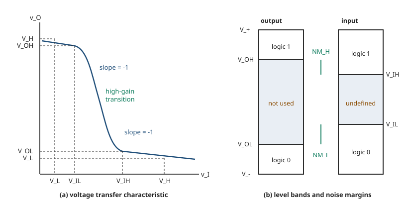

The two thresholds $V_{IL}$ and $V_{IH}$ are **defined by the curve itself**: they are the input
voltages at which the slope of the transfer characteristic passes through $-1$ ·CH2 slide 8.
Between them lies the high-gain transition region, and any input landing there produces an output in
the **undefined logic state**.

[def] The six levels, as the deck states them ·CH2 slide 8:

- $V_L$ — the nominal voltage corresponding to a low-logic state at the **output** of a logic gate,
  for $v_I = V_H$.
- $V_H$ — the nominal voltage corresponding to a high-logic state at the **output** of a logic gate,
  for $v_I = V_L$.
- $V_{IL}$ — the maximum input voltage that will be recognised as a low input logic level.
- $V_{IH}$ — the minimum input voltage that will be recognised as a high input logic level.
- $V_{OH}$ — the output voltage corresponding to an input voltage of $V_{IL}$.
- $V_{OL}$ — the output voltage corresponding to an input voltage of $V_{IH}$.

⚠ VERIFY (V02-2) — the slide prints $V_L$ as the low-logic voltage "**at the input** of a logic
gate for $v_i = V_H$". That cannot be right: $V_L$ is an *output* quantity, and the slide's own
$V_H$ entry one line later correctly says "at the output". Read $V_L$ as an output level. The
printed version is worth recognising because it appears verbatim on the page.

### 3.3 The numbers for TTL and CMOS

Standard input and output levels ·CH2 slide 9.

| Level | TTL | +5 V CMOS | +3.3 V CMOS |
|---|---|---|---|
| $V_{IH(\min)}$ | 2.0 V | 3.5 V | 2.0 V |
| $V_{IL(\max)}$ | 0.8 V | 1.5 V | 0.8 V |
| $V_{OH(\min)}$ | 2.4 V | 4.4 V | 2.4 V |
| $V_{OL(\max)}$ | 0.4 V | 0.33 V | 0.4 V |

- TTL parts are optimised for a 5 V supply and tolerate very little above or below it ·CH2 slide 9.
- CMOS parts may be optimised for 5 V, 3.3 V, 2.5 V or 1.8 V, and most tolerate a much wider supply
  range than TTL ·CH2 slide 9.

[fig] Band diagrams for TTL, +5 V CMOS and +3.3 V CMOS input and output ranges, with the
unacceptable band shaded, lifted from a published textbook ·CH2 slide 9. Captioned, not
reproduced — the numbers above carry all of its content.

[added] The lab's transfer-characteristic measurement (Fig. 4-4 and Part 4 of
`labs/lab-01-ttl-nand-nor.md`) is exactly this curve measured on a 7403; the threshold read off the
plotted grid is the $V_{REF}$ of slide 6.

---

## 4. Propagation delay and dynamic response

**Symbols**

| Symbol | Meaning | Units | Typical value |
|---|---|---|---|
| $\tau_{PHL}$ | propagation delay, output high to low | s | 10 ns |
| $\tau_{PLH}$ | propagation delay, output low to high | s | 10 ns |
| $\tau_P$ | average propagation delay | s | 10 ns |
| $t_r$ | rise time, 10% to 90% | s | 5 ns |
| $t_f$ | fall time, 90% to 10% | s | 5 ns |
| $\Delta V$ | logic swing, $V_H - V_L$ | V | 3.2 |
| $V_{50\%}$ | mid-swing reference level | V | 1.8 |

Propagation delay is the time between a change reaching the **50% point of the input** and the
resulting change reaching the **50% point of the output** ·CH2 slide 10.

The reference level is the mid-point of the logic swing.

$$V_{50\%} = \frac{V_H + V_L}{2}$$

[eq: fifty-percent-point] ·CH2 slide 10

The two delays are measured separately and are usually unequal, so a single average figure is
quoted.

$$\boxed{\;\tau_P = \frac{\tau_{PHL} + \tau_{PLH}}{2}\;}$$

[eq: average-propagation-delay] ·CH2 slide 10

⚠ VERIFY (V02-3) — the slide's two parenthetical glosses are **interchanged**. It prints
"$\tau_{PHL}$, *delay time in going from logical 0 to logical 1 state (LOW to HIGH)*" and
"$\tau_{PLH}$, *delay time in going from logical 1 to logical 0 state (HIGH to LOW)*". The subscript
order is the correct convention and the waveform beside it confirms it: $\tau_{PHL}$ is marked on
the edge where the **output** falls from $V_H$ to $V_L$. Read the subscripts, not the words:

- $\tau_{PHL}$ — output going **H**igh to **L**ow.
- $\tau_{PLH}$ — output going **L**ow to **H**igh.

### 4.1 Rise and fall times

Rise and fall times are read between the 10% and 90% points of the transition, not the 50% point
·CH2 slide 14.

$$V_{10\%} = V_L + 0.1\,\Delta V$$

$$V_{90\%} = V_L + 0.9\,\Delta V = V_H - 0.1\,\Delta V$$

[eq: rise-fall-reference-levels] ·CH2 slide 14 — with $\Delta V = V_H - V_L$. The two forms of
$V_{90\%}$ are algebraically identical; substituting $\Delta V$ gives
$V_L + 0.9(V_H - V_L) = V_H - 0.1(V_H - V_L)$ for every $V_H$, $V_L$.

[fig] **Fig. 2-2** — input and output waveforms of an inverting gate, with $t_r$, $t_f$,
$\tau_{PHL}$ and $\tau_{PLH}$ marked ·CH2 slides 10 and 14

```yaml
figure_data:
  type: timing-diagram
  traces:
    - {name: v_I, levels: [V_L, V_H], edges: [rise, fall]}
    - {name: v_O, levels: [V_H, V_L], edges: [fall, rise], relation: inverting}
  reference_levels: {rise_fall: [10%, 90%], delay: 50%}
  intervals:
    - {name: t_r, on: v_I, from: 10%, to: 90%}
    - {name: t_f, on: v_I, from: 90%, to: 10%}
    - {name: tau_PHL, from: "v_I 50% rising", to: "v_O 50% falling"}
    - {name: tau_PLH, from: "v_I 50% falling", to: "v_O 50% rising"}
```

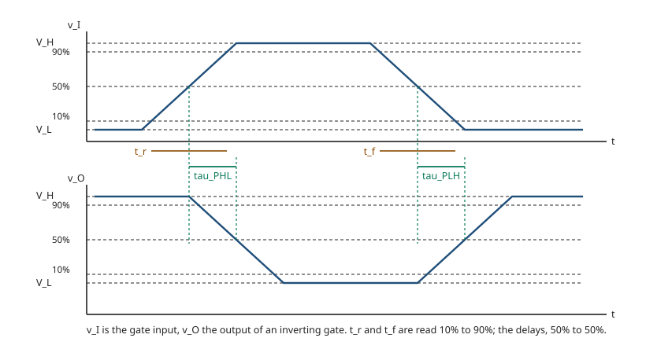

[added] Lab Part 5 and Fig. 4-2 of `labs/lab-01-ttl-nand-nor.md` measure exactly this: the effect of
capacitive loading on $t_r$, $t_f$ and hence on $\tau_P$.

---

## 5. Fan-in and fan-out

| Term | Meaning | Units | Typical value |
|---|---|---|---|
| fan-in | number of inputs on the gate | dimensionless | 2 to 8 |
| fan-out | number of driven inputs the output can support | dimensionless | 10 (standard TTL) |

- **Fan-in** is the number of inputs a gate in the family provides. A three-input XOR gate has a
  fan-in of 3 ·CH2 slide 11.
- **Fan-out** is the number of inputs driven by one gate output. An XOR gate driving four inverters
  has a fan-out of 4 ·CH2 slide 11.

[fig] Two small logic diagrams, a three-input XOR labelled "fan-in = 3" and an XOR driving four
inverters labelled "fan-out = 4" ·CH2 slide 11. Captioned only — both are third-party line art and
the statements above carry their content.

[added] The lab works fan-out quantitatively rather than by counting symbols: it defines the **unit
load** and determines fan-out as the ratio of available output drive current to the current one load
input demands. See "the unit load and fan-out" in `labs/lab-01-ttl-nand-nor.md`, and Part 3(a),
Fig. 4-8.

---

## 6. Noise margins

**Symbols**

| Symbol | Meaning | Units | Typical value |
|---|---|---|---|
| $NM_H$ | high-level noise margin | V | 0.4 (TTL) |
| $NM_L$ | low-level noise margin | V | 0.4 (TTL) |
| $V_{NH}$ | the deck's alternative name for $NM_H$ | V | — |
| $V_{NL}$ | the deck's alternative name for $NM_L$ | V | — |

[def] Noise margins are safety margins that stop a circuit producing an erroneous output when its
inputs carry noise ·CH2 slide 12. They are defined separately for the two input levels.

$$\boxed{\;NM_L = V_{IL} - V_{OL}\;}$$

[eq: noise-margin-low] ·CH2 slide 12

$$\boxed{\;NM_H = V_{OH} - V_{IH}\;}$$

[eq: noise-margin-high] ·CH2 slide 12

Read them off Fig. 2-1: $NM_H$ is the gap between the *worst* high a driver guarantees to deliver
and the *worst* high a receiver promises to accept. $NM_L$ is the same gap at the bottom of the
range. Anything landing between $V_{IL}$ and $V_{IH}$ is in the undefined state.

⚠ VERIFY (C02-1) — slide 12 names these $NM_L$ and $NM_H$; slide 13 works the same example with
$V_{NL}$ and $V_{NH}$. They are the same two quantities. Both names appear in the deck, so both
appear in the nomenclature file.

### [ex] Example 1 — noise margins for CMOS and TTL ·CH2 slide 13

**Problem.** Determine the HIGH-level and LOW-level noise margins for CMOS and for TTL, using the
level data of slide 9.

**For 5 V CMOS**, with $V_{IH(\min)} = 3.5$ V, $V_{IL(\max)} = 1.5$ V, $V_{OH(\min)} = 4.4$ V and
$V_{OL(\max)} = 0.33$ V:

$$V_{NH} = V_{OH(\min)} - V_{IH(\min)}$$

$$V_{NH} = 4.4\ \text{V} - 3.5\ \text{V}$$

$$V_{NH} = 0.9\ \text{V}$$

$$V_{NL} = V_{IL(\max)} - V_{OL(\max)}$$

$$V_{NL} = 1.5\ \text{V} - 0.33\ \text{V}$$

$$V_{NL} = 1.17\ \text{V}$$

**For TTL**, with $V_{IH(\min)} = 2$ V, $V_{IL(\max)} = 0.8$ V, $V_{OH(\min)} = 2.4$ V and
$V_{OL(\max)} = 0.4$ V:

$$V_{NH} = 2.4\ \text{V} - 2\ \text{V} = 0.4\ \text{V}$$

$$V_{NL} = 0.8\ \text{V} - 0.4\ \text{V} = 0.4\ \text{V}$$

**Answer.** A TTL gate is immune to up to 0.4 V of noise in both the HIGH and the LOW input state;
5 V CMOS tolerates 0.9 V high and 1.17 V low ·CH2 slide 13.

All four figures recomputed and confirmed. This is the quantitative basis for the "CMOS high, TTL
low" row of the comparison table on slide 42.

[added] The lab reaches the same conclusion from the measured curve rather than from datasheet
limits — see Discussion 7 of `labs/lab-01-ttl-nand-nor.md`, which reads the threshold off the
transfer characteristic and argues the margin either side of it.

---

## 7. Power requirements

**Symbols**

| Symbol | Meaning | Units | Typical value |
|---|---|---|---|
| $V_{CC}$ | supply rail of a bipolar (TTL) part | V | 5 |
| $V_{DD}$ | supply rail of a MOS part | V | 5 or 3.3 |
| $I_{CCH}$ | supply current drawn with the output HIGH | A | 2 mA |
| $I_{CCL}$ | supply current drawn with the output LOW | A | 3.6 mA |
| $I_{CC(\text{avg})}$ | average supply current | A | 2.8 mA |
| $P_{D(\text{avg})}$ | average power dissipation | W | 14 mW |

Every IC needs supply power. The rail is called $V_{CC}$ in TTL and $V_{DD}$ in MOS ·CH2 slide 15.

The current a TTL gate draws is different in the two output states, so two figures are quoted and
averaged.

$$\boxed{\;I_{CC(\text{avg})} = \frac{I_{CCH} + I_{CCL}}{2}\;}$$

[eq: average-supply-current] ·CH2 slide 15

$$\boxed{\;P_{D(\text{avg})} = I_{CC(\text{avg})} \times V_{CC}\;}$$

[eq: average-power-dissipation] ·CH2 slide 15

The average holds **only at a 50% duty cycle**, where the output is HIGH half the time and LOW the
other half; that is the condition under which manufacturers specify the figure ·CH2 slide 15.

[fig] Measurement arrangement for $I_{CCH}$ and $I_{CCL}$ — a quad NAND package with all gates
driven, ammeter in the $+V_{CC}$ lead. In (a) each gate has an input at 0 so every output is 1 and
the meter reads $I_{CCH}$; in (b) all inputs are 1 so every output is 0 and the meter reads
$I_{CCL}$ ·CH2 slide 16. A scanned textbook page; captioned, not reproduced.

### [ex] Example 2 — average power dissipation ·CH2 slide 17

**Problem.** A certain gate draws 2 mA when its output is HIGH and 3.6 mA when its output is LOW.
What is its average power dissipation if $V_{CC}$ is 5 V and the gate is operated on a 50% duty
cycle?

**Average supply current.**

$$I_{CC} = \frac{I_{CCH} + I_{CCL}}{2}$$

$$I_{CC} = \frac{2\ \text{mA} + 3.6\ \text{mA}}{2}$$

$$I_{CC} = 2.8\ \text{mA}$$

**Average power dissipation.**

$$P_D = V_{CC}\,I_{CC}$$

$$P_D = 5\ \text{V} \times 2.8\ \text{mA}$$

$$P_D = 14\ \text{mW}$$

⚠ VERIFY (V02-4) — **the slide's units are wrong by a factor of $10^3$.** The question states
2 mA and 3.6 mA; the solution then writes $2\ \mu\text{A} + 3.6\ \mu\text{A}$, giving
$I_{CC} = 2.8\ \mu\text{A}$ and $P_D = 14\ \mu\text{W}$. The mantissas are right — 2.8 and 14 — but
the prefix is not: with milliamps in, the answers are **2.8 mA and 14 mW**. Carry milliamps
throughout. The slide also writes the supply as "5v" rather than 5 V.

---

## 8. Current sourcing and sinking

**Symbols**

| Symbol | Meaning | Units | Typical value |
|---|---|---|---|
| $I_{IH}$ | current into a load input held HIGH | A | 40 µA |
| $I_{IL}$ | current out of a load input held LOW | A | 1.6 mA |

Two directions, depending on the driving gate's output state ·CH2 slide 18.

- **Current sourcing.** The driving gate's output is HIGH at $V_{OH}$. Current flows *out* of the
  driver, into the load gate's input, as $I_{IH}$. The driver supplies the current.
- **Current sinking.** The driving gate's output is LOW at $V_{OL}$. Current flows *out* of the load
  gate's input and *into* the driver, as $I_{IL}$. The driver receives — sinks — the current.

The asymmetry matters: in TTL the sink current per load is far larger than the source current, so
the LOW state is what limits fan-out.

[fig] Two NAND gates cascaded, drawn once with the driver HIGH and the sourced $I_{IH}$ arrowed, and
once with the driver LOW and the sunk $I_{IL}$ arrowed ·CH2 slide 18. A scanned textbook page;
captioned, not reproduced.

[added] This is the mechanism behind the unit load of `labs/lab-01-ttl-nand-nor.md`: one unit load
is defined by the input current a single 7400 input demands, and Part 3(a) measures it directly.

---

## 9. Unused inputs

Unused inputs must **not** be left floating. Either tie them to $V_{CC}$ through a 1.0 kΩ resistor,
or tie them to ground ·CH2 slide 19.

Which of the two you choose is set by the gate: an unused NAND input tied HIGH and an unused NOR
input tied LOW both leave the logic function of the remaining inputs untouched — the deck's figure
shows exactly that pairing.

[added] A floating TTL input behaves as a logic 1, which is why the lab deliberately leaves several
gate inputs as open stubs (pin 2 in Fig. 4-10; pins 2 and 5 in Fig. 4-12 of
`labs/lab-01-ttl-nand-nor.md`). Slide 19 gives the reason it is bad practice anyway: a floating node
picks up noise, and in CMOS it produces genuinely undefined behaviour rather than a reliable 1 —
a point the deck returns to on slide 37.

---

## 10. Classification of the logic families

The families split first by device type ·CH2 slide 20.

- **Unipolar** — one carrier type, built from MOSFETs.
  - PMOS — p-channel MOSFET.
  - NMOS — n-channel MOSFET.
  - CMOS — complementary MOSFET.
- **Bipolar** — built from bipolar junction transistors.
  - **Saturated** — the transistors are driven into saturation: RTL, DTL, TTL, HTL, DCTL.
  - **Unsaturated** — the transistors are kept out of saturation: Schottky TTL, ECL.

Expansions ·CH2 slide 20:

| Abbreviation | Expansion |
|---|---|
| RTL | resistor-transistor logic |
| DTL | diode-transistor logic |
| TTL | transistor-transistor logic |
| ECL | emitter-coupled logic |
| MOS | metal-oxide semiconductor |
| CMOS | complementary metal-oxide semiconductor |
| DCTL | direct-coupled transistor logic |
| HTL | high-threshold logic |

Keeping a transistor out of saturation removes the stored-charge delay of pulling it back out again,
which is why the unsaturated branch is the fast one — and why Schottky TTL appears there rather than
beside standard TTL.

[fig] Classification tree, coloured boxes, taken from a third-party source ·CH2 slide 20.
Reproduced above as a list rather than as an image. The slide spells the Schottky branch
"Schotkey" — see C02-6.

---

## 11. Diode logic

Diodes with a resistive load implement simple gates ·CH2 slide 21.

[fig] **Fig. 2-3** — diode OR and diode AND gates ·CH2 slide 21

```yaml
figure_data:
  type: schematic
  circuits:
    - name: diode-OR
      function: "Z = A + B"
      nets:
        - {from: A, through: D1, orientation: "anode at A, cathode at Z"}
        - {from: B, through: D2, orientation: "anode at B, cathode at Z"}
        - {from: Z, through: R, to: ground}
      output: {node: Z, also_labelled: v_O}
    - name: diode-AND
      function: "Z = A . B"
      supply: "+5 V"
      nets:
        - {from: A, through: D1, orientation: "cathode at A, anode at Z"}
        - {from: B, through: D2, orientation: "cathode at B, anode at Z"}
        - {from: "+5 V", through: R, to: Z}
      output: {node: Z}
```

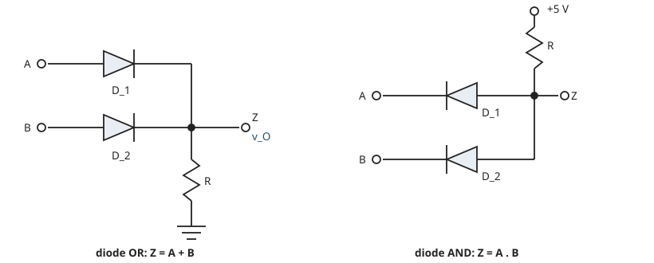

**How to read the orientation.** The diode arrowheads decide the function.

- **OR** — anodes at the inputs, cathodes commoned at $Z$, $R$ to ground. Any input driven HIGH
  forward-biases its diode and pulls $Z$ up. All inputs LOW leaves every diode off and $R$ holds
  $Z$ at 0.
- **AND** — cathodes at the inputs, anodes commoned at $Z$, $R$ to $+5$ V. Any input pulled LOW
  forward-biases its diode and clamps $Z$ down. Only with every input HIGH do all diodes turn off
  and $R$ pull $Z$ up.

### Why diode logic died ·CH2 slide 22

- It permits only the OR and AND functions — NOR and NAND arise only as special cases.
- It suffers a **voltage drop from one stage to the next**.
- It is used for simple stand-alone logic but not inside integrated circuits.
- These restrictions have made it obsolete.

[added] The second point, put numerically with a 0.7 V silicon drop and a 5 V swing: an OR gate
driven from 5 V delivers

$$V_O = 5\ \text{V} - 0.7\ \text{V} = 4.3\ \text{V}$$

and a second identical stage delivers $4.3 - 0.7 = 3.6$ V. The level walks toward the threshold with
every stage and there is no gain anywhere to restore it. Adding a transistor to restore the level is
precisely what DTL does.

---

## 12. Resistor-transistor logic (RTL)

**Symbols**

| Symbol | Meaning | Units | Typical value |
|---|---|---|---|
| $R_C$ | collector load resistor | Ω | 640 |
| $R_1, R_2$ | input base resistors | Ω | 450 |
| $Q_1, Q_2$ | switching transistors, npn | — | — |
| $V+$, $V-$ | positive and negative supply rails | V | 3.6, 0 |

RTL is built from resistors and bipolar junction transistors: the resistors form the input network,
the transistors act as switches ·CH2 slide 23.

[fig] **Fig. 2-4** — the RTL gate ·CH2 slide 23

```yaml
figure_data:
  type: schematic
  name: rtl-nor
  function: "Y = NOT (A + B)"
  supply: "+V_CC through R_C"
  devices:
    - {id: Q1, type: npn, base_via: R_1, base_from: A}
    - {id: Q2, type: npn, base_via: R_2, base_from: B}
  topology: "Q1 and Q2 collectors commoned at Y; emitters commoned to ground; single collector load R_C"
  output: Y
```

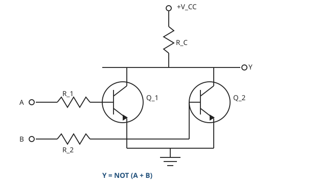

**Operation.** The two transistors sit in parallel under one collector resistor.

- Either input HIGH drives base current through its resistor, saturates that transistor and pulls
  $Y$ to $V_{CE(\text{sat})}$ — a logic 0.
- Only with both inputs LOW are both transistors off, and $R_C$ pulls $Y$ up to a logic 1.

So the basic RTL gate is a **NOR**.

### [exercise] Identify the gates ·CH2 slide 24

The slide asks: *determine the gates depicted in the following RTL circuits.* Four circuits are
drawn; only the third carries its answer on the page, printed as $A \cdot B = Q$.

[fig] **Fig. 2-5** — the three distinct circuits of slide 24 ·CH2 slide 24

```yaml
figure_data:
  type: schematic
  circuits:
    - id: i
      inputs: [A]
      devices: [{id: Q1, type: npn}]
      nets: ["A to base node", "R_1 from base node to V-", "series diode from base node to base of Q1, anode at node", "R_2 from V+ to collector", "Q at collector", "emitter to ground"]
    - id: ii
      inputs: [A, B]
      devices: [{id: Q1, type: npn}]
      nets: ["A through R_3 to base node", "B through R_4 to base node", "R_1 from base node to V-", "series diode from base node to base of Q1, anode at node", "R_2 from V+ to collector", "Q at collector", "emitter to ground"]
    - id: iii
      inputs: [A, B]
      devices: [{id: T1, type: npn}, {id: T2, type: npn}]
      nets: ["A through R to base of T1", "B through R to base of T2", "T1 collector to +V_CC", "T1 emitter to T2 collector", "T2 emitter to output", "R from output to ground"]
      printed_answer: "A . B = Q"
  note: "the deck draws circuit (ii) twice, bottom left and bottom right - see C02-2. (i) and (ii) carry a series base diode; (iii) has no negative rail and no diode"
```

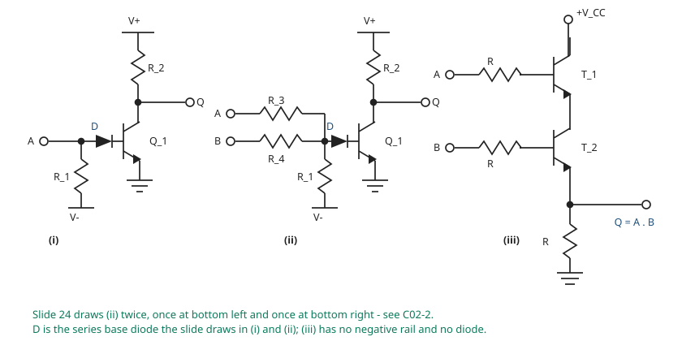

[added] **Answers.**

- **(i)** One input into one common-emitter stage. HIGH in gives LOW out. It is an **inverter**,
  $Q = \overline{A}$.
- **(ii)** Two inputs summed by $R_3$ and $R_4$ into one base. Either input HIGH turns $Q_1$ on and
  pulls the collector down; only both LOW leaves it up. It is a **NOR**,
  $Q = \overline{A + B}$ — the same function as Fig. 2-4, built with a resistive summing network
  instead of two transistors.
- **(iii)** Two emitter followers stacked in series. Current reaches the output resistor only if
  *both* transistors conduct, so both inputs must be HIGH. It is an **AND**, and the slide prints
  the answer: $Q = A \cdot B$.

⚠ VERIFY (C02-2) — the slide shows **four** circuits but only **three** distinct ones: the
bottom-left and bottom-right schematics are identical, down to the labels $R_1$ to $R_4$, $Q_1$ and
the terminal names. Answer three, not four.

[added] **The mark on each base lead is a diode.** At working magnification the solid triangle on
the base lead is followed by its own short cathode bar, before the lead continues into the
transistor: a diode in series with the base, anode at the summing node, cathode at the base. It is
drawn in circuits (i) and (ii) and is now shown in Fig. 2-5.

It is there because $R_1$ returns the base to a **negative** rail $V-$. With the inputs LOW the base
would otherwise be pulled below the emitter, and the reverse breakdown of an emitter-base junction
is only about 5 to 7 V, so a large enough $V-$ would break it down. The series diode blocks that
reverse current and stands off the reverse voltage itself.

The slide corroborates this on its own page: circuit (iii) runs from $+V_{CC}$ alone, has no
negative rail, and carries **no** diode. The deck never states any of this in words — the reasoning
above is ours.

### Advantages and limitations ·CH2 slide 25

| Advantages | Limitations |
|---|---|
| Almost as simple as diode logic, and inexpensive | High power dissipation, especially with the transistor at logic 1 |
| Runs from a low supply voltage per gate | Poor noise immunity |
| Sometimes used as inexpensive small-signal amplifiers, or to interface linear to digital circuits | Poor speed |
| Minimum transistor count for a given logic expression | Not designed for linear operation |
| | Low noise margin |

---

## 13. Diode-transistor logic (DTL)

**Symbols**

| Symbol | Meaning | Units | Typical value |
|---|---|---|---|
| $D_1, D_2, D_3$ | input diodes | — | — |
| $R_1$ | pull-up on the diode node | Ω | 2 k |
| $R_2$ | base feed resistor | Ω | 1 k |
| $R_3$ | base bleed resistor to $-V_{BB}$ | Ω | 5 k |
| $C_1$ | speed-up capacitor across $R_2$ | F | 100 pF |
| $R_L$ | collector load | Ω | 2 k |
| $-V_{BB}$ | negative bias rail holding the base off | V | −2 |

Since diode gates are limited to AND and OR, the diodes are combined with a transistor to complete
the basic logic functions ·CH2 slide 26. The result is:

- essentially diode logic with transistor amplification,
- reduced power consumption,
- faster than RTL.

The amplification is what recovers the level that the diode drop of §11 destroyed.

[fig] **Fig. 2-6** — the DTL NAND gate ·CH2 slide 26

```yaml
figure_data:
  type: schematic
  name: dtl-nand
  function: "output = NOT (A . B . C)"
  supplies: ["+V_CC", "-V_BB"]
  input_stage:
    diodes: [D1, D2, D3]
    orientation: "cathodes at the inputs, anodes commoned at the diode node"
    pull_up: {R_1: "from +V_CC to the diode node"}
  coupling:
    R_2: "diode node to base of Q1"
    C_1: "in parallel with R_2, speed-up capacitor"
    R_3: "base of Q1 to -V_BB"
  output_stage:
    device: {id: Q1, type: npn}
    load: {R_L: "from +V_CC to collector"}
    output_node: collector
```

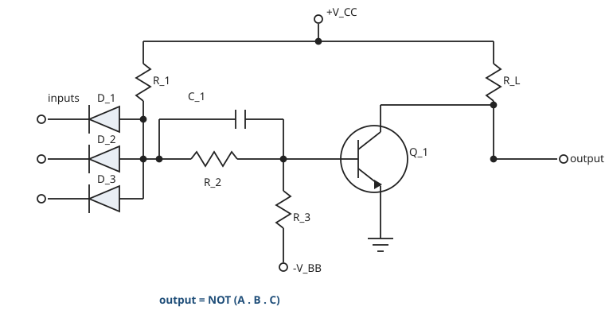

**Operation.**

- Any input LOW pulls the diode node down through that diode. The node cannot reach the voltage
  needed to drive $Q_1$'s base, $R_3$ holds the base at $-V_{BB}$, $Q_1$ is off, and $R_L$ pulls the
  output HIGH.
- All inputs HIGH turns every diode off. $R_1$ pulls the node up, current flows through $R_2$ into
  the base, $Q_1$ saturates, and the output goes LOW.

That is the NAND function. $C_1$ across $R_2$ passes the leading edge of the base drive directly,
shortening the turn-on time.

### [ex] Example 3 — identify the function of a diode-plus-transistor circuit ·CH2 slide 27

**Problem, as set.** Two inputs $A$ and $B$, each through a switch and a diode, into the base of an
MMBT3904 npn transistor via 1 kΩ; a 1 kΩ collector load to +5 V; output $Y$ at the collector.
*Fill in the truth table. What logic function is this circuit?*

[fig] **Fig. 2-7** — the circuit of the slide-27 example ·CH2 slide 27

```yaml
figure_data:
  type: schematic
  name: dtl-example
  supply: "+5 V"
  devices:
    - {id: Q, type: npn, part: MMBT3904}
  input_stage:
    diodes: [D_A, D_B]
    orientation: "anodes at the inputs A and B, cathodes commoned"
  coupling: {R_base: "1 k from the common cathode node to the base"}
  load: {R_C: "1 k from +5 V to the collector"}
  output: {node: collector, label: Y}
  emitter: ground
```

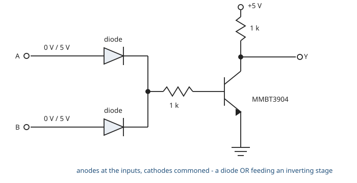

**The orientation decides the answer.** Unlike Fig. 2-6, the diode **anodes** face the inputs and
the cathodes are commoned. So a diode conducts only when *its own input is driven HIGH*, and the
common node is a diode **OR**, feeding an inverting common-emitter stage.

- Both inputs LOW — neither diode conducts, no base drive, transistor off, $R_C$ pulls $Y$ up.
- Either input HIGH — that diode conducts, base current flows, transistor saturates, $Y$ goes LOW.

[added] **Completed truth table** — the slide leaves it blank.

| $A$ | $B$ | $Y$ |
|---|---|---|
| 0 | 0 | 1 |
| 0 | 1 | 0 |
| 1 | 0 | 0 |
| 1 | 1 | 0 |

[added] **Answer.** $Y = \overline{A + B}$ — a **NOR** gate. Note that it is *not* the NAND of
slide 26: the diode orientation is reversed and there is no pull-up on the diode node.

⚠ VERIFY (C02-3) — the blank truth table on the slide is headed $A$, $A$, $Y$. The second column
must be $B$.

---

## 14. Transistor-transistor logic (TTL)

**Symbols**

| Symbol | Meaning | Units | Typical value |
|---|---|---|---|
| $R_1$ | input-transistor base resistor | Ω | 4 k |
| $R_2$ | phase-splitter collector resistor | Ω | 1.6 k |
| $R_3$ | pull-up transistor collector resistor | Ω | 130 |
| $R_4$ | phase-splitter emitter resistor | Ω | 1.0 k |
| $V_{BE}$ | base-emitter drop of a conducting transistor | V | 0.7 |
| $V_{CE(\text{sat})}$ | collector-emitter voltage of a saturated transistor | V | 0.2 |

TTL integrates npn transistors, pn junction diodes and diffused resistors in a single monolithic
structure ·CH2 slide 28. It was introduced in 1964 by Texas Instruments, and the **NAND gate is the
family's basic building block**. It is used in computer controls, consumer electronics and
industrial control systems.

Sub-families ·CH2 slide 28: standard TTL, low-power TTL, Schottky TTL, advanced Schottky TTL,
high-power TTL, fast TTL.

The switching model the deck uses throughout ·CH2 slide 28: a saturated (ON) transistor is a closed
switch to ground; an OFF transistor is an open switch. Both are drawn with the collector resistor
still in place.

### 14.1 The TTL inverter

[fig] **Fig. 2-8** — the standard TTL inverter with totem-pole output ·CH2 slide 29

```yaml
figure_data:
  type: schematic
  name: ttl-inverter
  supply: "+V_CC = 5 V"
  components:
    R_1: 4k
    R_2: 1.6k
    R_3: 130
    R_4: 1.0k
  devices:
    - {id: Q1, role: input transistor, type: npn}
    - {id: Q2, role: phase splitter, type: npn}
    - {id: Q4, role: totem-pole pull-up, type: npn}
    - {id: Q3, role: totem-pole pull-down, type: npn}
    - {id: D1, role: input clamp, from: input, to: ground}
    - {id: D2, role: level shift, between: "Q4 emitter and output"}
  totem_pole: [Q4, D2, Q3]
  node_voltages_input_high:
    Q1_base: 2.1
    Q2_base: 1.4
    Q3_base: 0.7
    Q2_collector: 0.9
    output: 0.2
  node_voltages_input_low:
    Q1_base: 0.7
    Q2: off
    Q3: off
    Q4: on
```

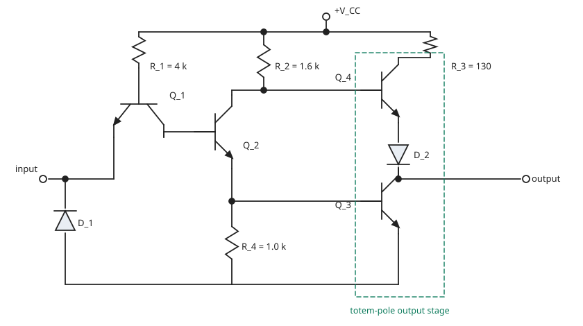

**Input HIGH — output LOW** ·CH2 slide 29(a).

- $Q_1$'s base-emitter junction is **reverse-biased**; its base-collector junction conducts instead
  and passes current into $Q_2$.
- Stacking three forward drops from ground fixes $Q_1$'s base at
  $3 \times 0.7 = 2.1$ V, $Q_2$'s base at $2 \times 0.7 = 1.4$ V and $Q_3$'s base at 0.7 V.
- $Q_2$ is ON, $Q_3$ is ON, the output is pulled to $V_{CE(\text{sat})} \approx 0.2$ V.
- $Q_4$ is OFF: turning it on would need $0.2 + 0.7 + 0.7 = 1.6$ V at its base, and the saturated
  $Q_2$ holds its collector far below that.

**Input LOW — output HIGH** ·CH2 slide 29(b).

- $Q_1$'s base-emitter junction conducts, base at 0.7 V, and $Q_1$ saturates, so $I_C = 0$ into
  $Q_2$.
- $Q_2$ is OFF, $Q_3$'s base is at 0 V so $Q_3$ is OFF.
- $R_2$ pulls $Q_4$'s base up, $Q_4$ turns ON and sources the output HIGH through $R_3$ and $D_2$.

$D_2$ exists to guarantee $Q_4$ and $Q_3$ are never on together: it adds a diode drop to the voltage
$Q_4$ needs before it can conduct.

⚠ VERIFY (C02-5) — slide 29(a) labels $Q_2$'s collector "$\cong 0.7$ V". With $Q_2$ saturated that
node sits at $V_{BE3} + V_{CE(\text{sat})2} = 0.7 + 0.2 = 0.9$ V. The conclusion is unaffected —
either figure is well below the 1.6 V $Q_4$ would need — but quote 0.9 V.

[added] Fig. 4-1(a) of `labs/lab-01-ttl-nand-nor.md` is this same totem-pole output stage, drawn for
the 7400.

### 14.2 The TTL gate — multi-emitter input

[exercise] Slide 30 asks: *determine the type of gate.* It draws the inverter of Fig. 2-8 with
$Q_1$ replaced by a **two-emitter** transistor, one emitter per input, plus clamp diodes $D_1$ and
$D_2$ on the two inputs.

[added] **Answer.** A **two-input TTL NAND** with a totem-pole output. Either emitter pulled LOW
turns $Q_1$ on and starves $Q_2$, so the output goes HIGH; only with both inputs HIGH does the
output go LOW.

The multi-emitter transistor is a fabrication trick, not a new device: the deck draws its equivalent
as a diode network — $D_1$ and $D_2$ from base to each emitter, and $D_3$ from base to collector
·CH2 slide 30. That equivalent is exactly the diode-AND of §11, which is why TTL's input stage
behaves like DTL's.

### 14.3 The standard 3-input TTL NAND

[fig] **Fig. 2-9** — standard 3-input TTL NAND gate ·CH2 slide 31

```yaml
figure_data:
  type: schematic
  name: ttl-nand-3input
  supply: "+V_CC = 5 V"
  components: {R_1: 4k, R_2: 1.6k, R_3: 130, R_4: 1.0k}
  devices:
    - {id: Q1, role: three-emitter input transistor, emitters: [A, B, C]}
    - {id: Q2, role: phase splitter}
    - {id: Q3, role: totem-pole pull-up, note: "deck numbering - the upper device"}
    - {id: Q4, role: totem-pole pull-down, note: "deck numbering - the lower device"}
    - {id: D, role: level shift, between: "Q3 emitter and output"}
  output: {node: Y, function: "Y = NOT (A . B . C)"}
```

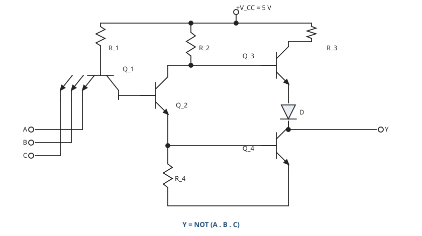

⚠ VERIFY (C02-4) — **the totem-pole numbering changes between slides.** On slides 29 and 30 the
pull-up is $Q_4$ and the pull-down is $Q_3$; on slide 31 the pull-up is $Q_3$ and the pull-down is
$Q_4$. Both figures are otherwise the same circuit. Identify the devices by position — upper is the
pull-up, lower is the pull-down — not by number.

### 14.4 Open-collector gates

[fig] **Fig. 2-10** — open-collector inverter, without and with the external pull-up ·CH2 slide 32

```yaml
figure_data:
  type: schematic
  name: open-collector
  components: {R_1: 4k, R_2: 1.6k, R_3: 1.0k}
  devices:
    - {id: Q1, role: input transistor}
    - {id: Q2, role: phase splitter}
    - {id: Q3, role: output pull-down, collector: unconnected}
    - {id: D1, role: input clamp}
  removed_vs_totem_pole: [pull-up transistor, level-shift diode, 130 ohm collector resistor]
  external: {R: "pull-up from +V_CC to the output, fitted by the user"}
  symbol: "inverter triangle with a diamond and underscore inside the body"
```

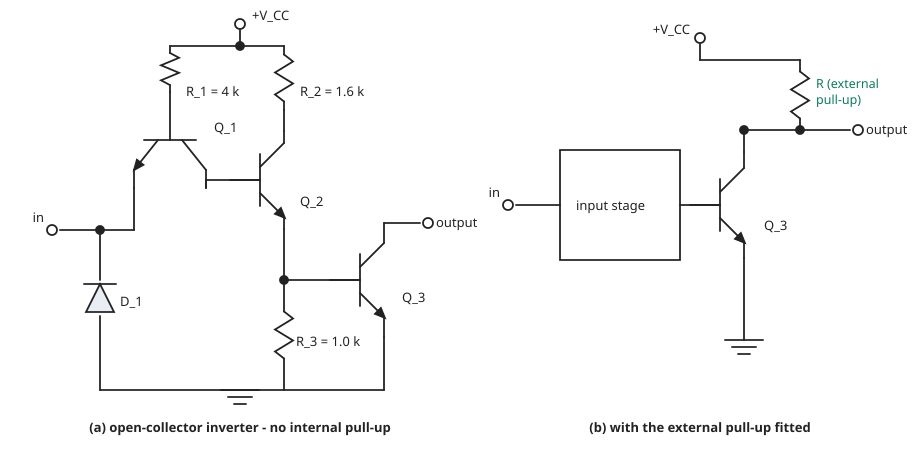

The whole upper half of the totem pole is deleted. The output transistor's collector is brought out
bare: the gate can pull the output LOW but cannot drive it HIGH at all. An **external pull-up
resistor** must be fitted for the output to reach a valid 1 ·CH2 slide 32. The distinguishing symbol
is the diamond-and-bar inside the gate body.

[added] Fig. 4-1(b) of `labs/lab-01-ttl-nand-nor.md` is this circuit as built in the 7403, and the
lab's Part 4 and Part 5 both run on the 7403 precisely because an open-collector output lets an
external resistor set the load.

### 14.5 Tri-state gates

[fig] **Fig. 2-11** — tri-state TTL gate ·CH2 slide 33

```yaml
figure_data:
  type: schematic
  name: tristate-ttl
  supply: "+V_CC"
  components: [R_1, R_2, R_3, R_4, R_5]
  devices:
    - {id: Q1, role: input transistor}
    - {id: Q2, role: enable transistor}
    - {id: Q3, role: phase splitter}
    - {id: Q4, role: totem-pole pull-up}
    - {id: Q5, role: totem-pole pull-down}
    - {id: D1, role: "steers Q3 base low when the gate is disabled"}
    - {id: D2, role: level shift}
  states:
    - {enable: LOW, input: HIGH, output: LOW,  note: enabled - normal logic}
    - {enable: LOW, input: LOW,  output: HIGH, note: enabled - normal logic}
    - {enable: HIGH, input: X,   output: high-Z, note: disabled - output open}
```

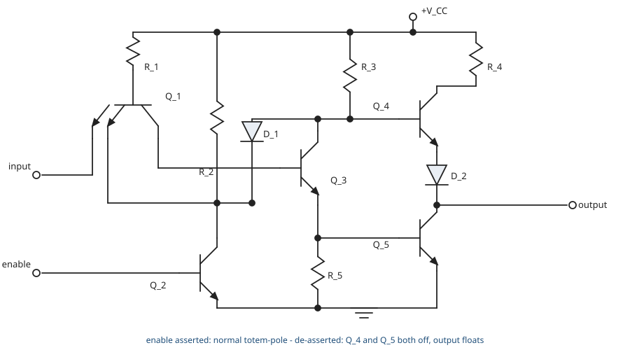

A third output condition is added to HIGH and LOW: **high impedance**, in which the output is
electrically disconnected ·CH2 slide 33.

- **Enable asserted** — the gate behaves as an ordinary totem-pole inverter: HIGH in gives LOW out,
  LOW in gives HIGH out.
- **Enable de-asserted** — the input becomes a *don't care* and both output transistors are turned
  off together, so the output floats OPEN.

That is the mechanism that lets many outputs share one bus: exactly one is enabled at a time and the
rest present no load.

### 14.6 Further examples ·CH2 slide 34

Slide 34 sets no problem of its own. It points at Examples 15-3 (page 875) to 15-7 (page 879) of the
class textbook, *Digital Fundamentals*, 11th edition, by Thomas L. Floyd. The examples themselves
are not reproduced here — they are copyrighted third-party material, and the deck gives only the
reference.

---

## 15. CMOS

**Symbols**

| Symbol | Meaning | Units | Typical value |
|---|---|---|---|
| $V_{DD}$ | MOS supply rail | V | 5 or 3.3 |
| $V_{GS}$ | gate-to-source voltage | V | 0 to 5 |
| G, D, S | gate, drain, source terminals | — | — |
| $Q_1, Q_2$ | complementary pair in an inverter | — | — |
| $Q_1 \ldots Q_4$ | the four devices of a two-input CMOS gate | — | — |

CMOS is **complementary metal-oxide semiconductor**: two *types* of transistor in the output
circuit — one n-channel MOSFET and one p-channel MOSFET ·CH2 slide 35.

**Symbol convention** ·CH2 slide 35. In this deck the substrate arrow on an n-channel device points
*toward* the channel; on a p-channel device it points *away*. Read the arrow, not the position on
the page.

**Each device as a switch** ·CH2 slides 35 and 36:

| Device | Turns ON when | With source grounded / at $V_{DD}$ |
|---|---|---|
| n-channel enhancement | gate is **higher** than source | gate at +5 V, source at 0 V |
| p-channel enhancement | gate is **lower** than source | gate at 0 V, source at $V_{DD}$ |

⚠ VERIFY (V02-5) — slide 36 draws both enhancement stages with the **source grounded** and the
drain taken up through a load resistor to $V_{DD}$. That is correct for the n-channel device and
wrong for the p-channel one. With its source at 0 V, a p-channel MOSFET needs a *negative* gate
voltage to satisfy the slide's own rule "gate must be lower than source", which a 0 V to +5 V logic
system can never supply. Corrected form: **the p-channel source goes to $V_{DD}$**, the drain to the
load resistor down to ground, and the output is taken at the drain — then a 0 V gate turns it on and
a +5 V gate turns it off. This is exactly how the p-channel device is connected in the CMOS inverter
two slides later, so the deck is inconsistent with itself here.

### 15.1 Why CMOS ·CH2 slide 37

- Very low **static** power consumption — no DC path from $V_{DD}$ to ground in either steady state.
- Full swing: the output reaches rail to rail.
- Scales well, which is what makes large integration possible.
- Other variants, NMOS and PMOS, are obsolete.

Two cautions the slide raises:

- **Do not leave inputs floating.** In TTL a floating input floats to HIGH; in CMOS the result is
  undefined behaviour.
- CMOS is susceptible to **electrostatic damage**.

⚠ VERIFY (C02-6) — the slide heads the first item "Complimentar y MOS (CMOS)". The word is
*complementary*, and the deck spells it correctly on slide 35. The same class of typographic slip
appears on slides 20, 17 and 28 — all collected under C02-6 in `flags/02.md`.

### 15.2 The CMOS inverter

[fig] **Fig. 2-12** — CMOS inverter ·CH2 slide 38

```yaml
figure_data:
  type: schematic
  name: cmos-inverter
  supply: "+V_DD"
  devices:
    - {id: Q1, channel: p, source: V_DD, drain: output, gate: input}
    - {id: Q2, channel: n, source: ground, drain: output, gate: input}
  truth_table:
    - {in: 0, Q1: on,  Q2: off, out: 1}
    - {in: 1, Q1: off, Q2: on,  out: 0}
```

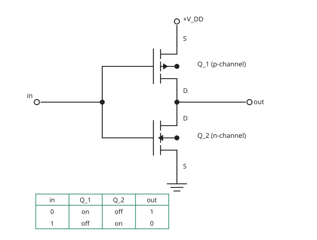

Both gates are tied to the same input; the two drains are tied to the output. Because the devices
are complementary, exactly one of them conducts in each steady state ·CH2 slide 38.

- Input LOW: $Q_1$ (p-channel) ON, $Q_2$ (n-channel) OFF, output pulled to $V_{DD}$.
- Input HIGH: $Q_1$ OFF, $Q_2$ ON, output pulled to ground.

Neither state leaves a conducting path from $V_{DD}$ to ground, which is the whole reason the static
power is negligible.

### 15.3 CMOS NAND and NOR

[fig] **Fig. 2-13** — CMOS NAND gate ·CH2 slide 39

```yaml
figure_data:
  type: schematic
  name: cmos-nand
  function: "X = NOT (A . B)"
  supply: "+V_DD"
  p_channel: {devices: [Q1, Q2], arrangement: parallel, between: [V_DD, output]}
  n_channel: {devices: [Q3, Q4], arrangement: series, between: [output, ground]}
  gates: {Q1: A, Q3: A, Q2: B, Q4: B}
  table:
    - {A: L, B: L, Q1: S, Q2: S, Q3: C, Q4: C, X: H}
    - {A: L, B: H, Q1: S, Q2: C, Q3: C, Q4: S, X: H}
    - {A: H, B: L, Q1: C, Q2: S, Q3: S, Q4: C, X: H}
    - {A: H, B: H, Q1: C, Q2: C, Q3: S, Q4: S, X: L}
  legend: {C: cutoff (off), S: saturation (on), H: HIGH, L: LOW}
```

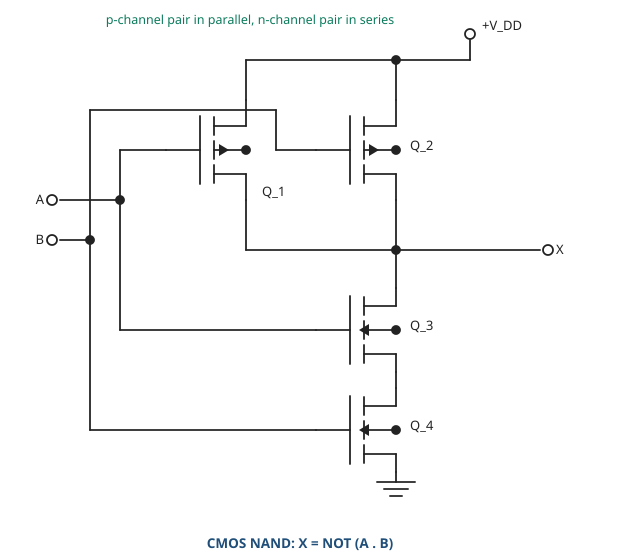

[fig] **Fig. 2-14** — CMOS NOR gate ·CH2 slide 40

```yaml
figure_data:
  type: schematic
  name: cmos-nor
  function: "X = NOT (A + B)"
  supply: "+V_DD"
  p_channel: {devices: [Q1, Q2], arrangement: series, between: [V_DD, output]}
  n_channel: {devices: [Q3, Q4], arrangement: parallel, between: [output, ground]}
  gates: {Q1: A, Q3: A, Q2: B, Q4: B}
  table:
    - {A: L, B: L, Q1: S, Q2: S, Q3: C, Q4: C, X: H}
    - {A: L, B: H, Q1: S, Q2: C, Q3: C, Q4: S, X: L}
    - {A: H, B: L, Q1: C, Q2: S, Q3: S, Q4: C, X: L}
    - {A: H, B: H, Q1: C, Q2: C, Q3: S, Q4: S, X: L}
  legend: {C: cutoff (off), S: saturation (on), H: HIGH, L: LOW}
```

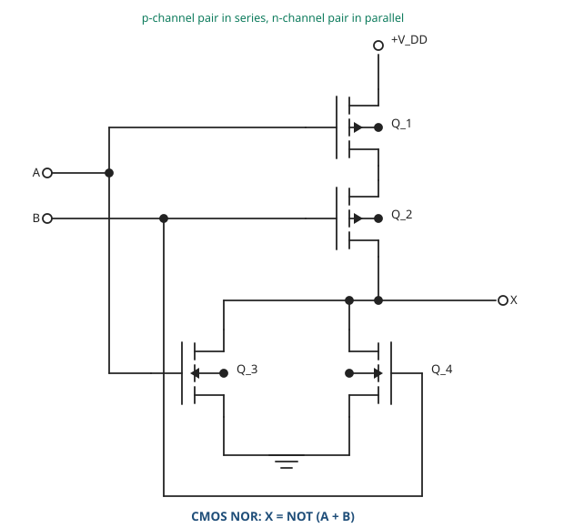

**The rule that generates both circuits.** The n-channel network and the p-channel network are
*duals*: whatever the pull-down does in series, the pull-up does in parallel, and vice versa.

- **NAND** — n-channel pair in **series**, so the output is pulled LOW only when both inputs are
  HIGH; p-channel pair in **parallel**, so either input LOW pulls the output HIGH ·CH2 slide 39.
- **NOR** — n-channel pair in **parallel**, so either input HIGH pulls the output LOW; p-channel
  pair in **series**, so the output is pulled HIGH only when both inputs are LOW ·CH2 slide 40.

Both device-state tables printed on slides 39 and 40 were rederived cell by cell from the gate
connections above and agree in all 32 entries.

### 15.4 CMOS family evolution ·CH2 slide 41

| Series | Character |
|---|---|
| 4000 | Wide supply range, high noise margin, low speed, weak output drive. Practically obsolete. |
| 74C | Pin-compatible with TTL, low speed. Obsolete, replaced by HC/HCT. |
| 74HC/HCT | Drastic increase in speed, higher output drive. HCT input levels are TTL-compatible. |
| 74AC/ACT | Functionally but not pin-compatible with TTL. Improved noise immunity and speed; ACT inputs are TTL-compatible. |
| 74AHC/AHCT | Improved speed, lower power, lower drive capability. |
| BiCMOS | CMOS/bipolar hybrid. Low power, high speed; bus-interface parts (74BCT, 74ABT). |
| 74LVC/ALVC/LV/AVC | Reduced supply voltage. LVC does 5 V/3.3 V translation; ALVC is fast 3.3 V only; AVC is optimised for 2.5 V, down to 1.2 V. |

**General trend** ·CH2 slide 41: dynamic losses are reduced by successively lowering the supply —
12 V → 5 V → 3.3 V → 2.5 V → 1.8 V. Power reduction is one of the keys to progressive growth of
integration.

### 15.5 CMOS against TTL ·CH2 slide 42

| Characteristic | CMOS | TTL |
|---|---|---|
| Voltage levels | wide range | fixed, typically 5 V |
| Power consumption | low | high |
| Technology | MOSFET | bipolar junction transistor |
| Noise immunity | high | low |
| Fan-out capability | high | lower |
| Speed | slow propagation delays | fast propagation delays |
| Power supply | typically 5 V or 3.3 V | typically 5 V |
| Applications | battery-operated devices, high-density ICs | high-speed applications, memory systems |

[added] The speed row describes the classical comparison — 4000-series CMOS against standard TTL —
and should be read against slide 41, which records that 74HC and later CMOS brought a "drastic
increase in speed". The noise-immunity row is the Example 1 result: 0.9 V and 1.17 V for CMOS
against 0.4 V and 0.4 V for TTL.

---

## 16. Homework ·CH2 slide 43

[exercise] Set on the last slide and **not worked here** — it is the student's to do. Transcribed in
full:

> **From class textbook,**
>
> 1. Emitter-Coupled Logic (ECL) Circuits — pg. 882
> 2. PMOS, NMOS, and E²CMOS — pg. 884
> 3. Problems - pg. 887 - 893

The textbook is the one named on slide 34: *Digital Fundamentals*, 11th edition, by Thomas L. Floyd.
Items 1 and 2 are reading; item 3 is the end-of-chapter problem set. Note that ECL and the plain
PMOS/NMOS families appear in the classification of slide 20 but are **not** taught anywhere in this
deck — the homework is where they are covered.

---

## Slide coverage

| Slides | Treatment |
|---|---|
| 1 | Title slide — no content |
| 2 | Outline — reproduced at the top of this file |
| 3–4 | §1, integrated circuits and integration scale; V02-1 raised |
| 5 | §2, the seven characteristics |
| 6–8 | §3, logic-level definitions and the transfer characteristic; Fig. 2-1; V02-2 raised |
| 9 | §3.3, TTL and CMOS level tables; textbook band diagram captioned |
| 10 | §4, propagation delay; Fig. 2-2; V02-3 raised |
| 11 | §5, fan-in and fan-out; figures captioned |
| 12 | §6, noise-margin definitions; C02-1 raised |
| 13 | §6, Example 1, all four figures recomputed |
| 14 | §4.1, rise and fall times — same waveform figure as slide 10 |
| 15 | §7, power requirements |
| 16 | §7, $I_{CCH}$/$I_{CCL}$ measurement figure captioned |
| 17 | §7, Example 2, recomputed; V02-4 raised |
| 18 | §8, current sourcing and sinking; figure captioned |
| 19 | §9, unused inputs |
| 20 | §10, classification; tree redrawn as a list; C02-6 raised |
| 21 | §11, diode logic; Fig. 2-3 |
| 22 | §11, disadvantages of diode logic |
| 23 | §12, the RTL gate; Fig. 2-4 |
| 24 | §12, gate-identification exercise; Fig. 2-5; C02-2 raised |
| 25 | §12, RTL advantages and limitations |
| 26 | §13, the DTL NAND; Fig. 2-6 |
| 27 | §13, Example 3; Fig. 2-7; truth table completed; C02-3 raised |
| 28 | §14, TTL introduction and sub-families |
| 29 | §14.1, TTL inverter; Fig. 2-8; C02-5 raised |
| 30 | §14.2, two-input TTL NAND identification exercise |
| 31 | §14.3, standard 3-input TTL NAND; Fig. 2-9; C02-4 raised |
| 32 | §14.4, open-collector gates; Fig. 2-10 |
| 33 | §14.5, tri-state gates; Fig. 2-11 |
| 34 | §14.6, pointer to textbook examples 15-3 to 15-7; not reproduced |
| 35 | §15, MOSFET symbols and the switch model |
| 36 | §15, P- and N-channel enhancement stages; V02-5 raised |
| 37 | §15.1, why CMOS; C02-6 raised |
| 38 | §15.2, CMOS inverter; Fig. 2-12 |
| 39–40 | §15.3, CMOS NAND and NOR; Fig. 2-13 and Fig. 2-14; both device tables rederived |
| 41 | §15.4, CMOS family evolution |
| 42 | §15.5, CMOS against TTL |
| 43 | §16, homework, transcribed and left unsolved |

Every slide in the range 1–43 is accounted for.

**File size note.** This file is roughly 50 KB, above the ~40 KB guidance. It is not split, because
the two halves are one continuous argument: the characteristics of slides 3–19 are exactly the
parameters the circuits of slides 20–42 are then compared on, and Example 1 and Example 3 both
depend on definitions from the first half. If a split is later judged necessary, the natural line is
between §9 (unused inputs, slide 19) and §10 (classification, slide 20) — the deck's own outline
draws the same line.
