# 03 — Semiconductor Memory

**Scope.** This file covers only the **memory half** of Chapter 3 — slides 1 to 33. The deck's
second half (slides 34 to 66) deals with programmable logic devices, and is written up separately
in **04 — Programmable Logic Devices**. Slide 2 lists both halves as one chapter ·CH3 slide 2.

Six defects were found in this slide range. Each is flagged inline where it is used and collected
in the file's flag list.

---

## 1. Introduction — what a memory unit is

### Symbols

| Symbol | Meaning | Units | Typical value |
|---|---|---|---|
| $k$ | number of address lines on a memory unit | dimensionless (count) | 8 – 32 |
| $n$ | number of bits in one word (word length) | bit | 1, 8, 16 |
| $2^k$ | number of addressable words | word | 1024, 65536 |

A **memory unit** is a collection of cells able to store a large quantity of binary
information ·CH3 slide 3. [def]

- Information arriving from an input device is stored in memory.
- Information going to an output device is taken from memory.

Two families are recognised ·CH3 slide 3:

- **Random-access memory (RAM)** — stores binary information for later use, and supports both
  operations:
  - **write** — storing data *into* memory;
  - **read** — transferring data *out of* memory.
- **Read-only memory (ROM)** — performs the read operation only. It is itself a programmable logic
  device.

### The three characteristics of semiconductor memory

·CH3 slide 4 [def]

| Characteristic | What it measures |
|---|---|
| **Density** | how much data the memory can store |
| **(Non-)volatility** | whether the data survives the removal of power |
| **Read/write capability** | whether the contents can be updated |

These three are the axes the rest of the chapter uses to separate SRAM, DRAM, ROM, EPROM, EEPROM
and Flash from one another.

---

## 2. The basic memory array, address and capacity

### Symbols

| Symbol | Meaning | Units | Typical value |
|---|---|---|---|
| cell | one storage element, holding a single $1$ or $0$ | — | — |
| address | the location of a unit of data within the array | — | $0 \ldots 2^k-1$ |
| capacity | total number of data units the memory can hold | bit or byte | 64 bit … 4 G |

A **cell** is each storage element in a memory that can retain either a $1$ or a $0$ ·CH3 slide 5.
[def]

Memories are built as **arrays** of cells. The same 64 cells can be organised in several ways —
$8 \times 8$, $16 \times 4$ or $64 \times 1$ ·CH3 slide 5.

[fig] **Fig. 3-1** — 64 cells in three organisations ·CH3 slide 5

```yaml
figure_data:
  type: memory-array
  total_cells: 64
  organisations:
    - {rows: 8,  columns: 8, label: "(a) 8 × 8 array"}
    - {rows: 16, columns: 4, label: "(b) 16 × 4 array"}
    - {rows: 64, columns: 1, label: "(c) 64 × 1 array"}
  note: "rows are numbered from 1 in the deck's figure, not from 0"
```

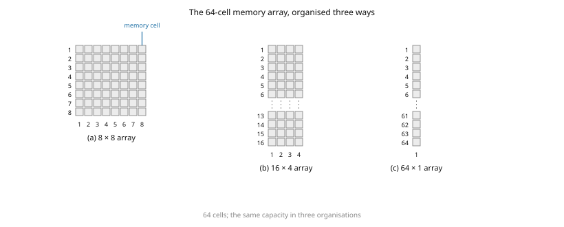

Two definitions follow directly ·CH3 slide 6: [def]

- The **address** of a unit of data is its location in the array — a row number for a byte-organised
  memory, or a (row, column) pair for a bit-organised one.
- The **capacity** is the total number of data units that can be stored.

[fig] **Fig. 3-2** — physical structure of a 64-bit memory; the address of a single blue bit (row 5,
column 4) and of a blue byte (row 3); an $8 \times 8$ bit array expanded to a $64 \times 8$ bit
memory module, whose blue byte is at row 5, column 8 ·CH3 slide 6. Photographic renderings of a
packaged chip and a memory module; **not redrawn** — third-party artwork.

---

## 3. Write and read operations

### Symbols

| Symbol | Meaning | Units | Typical value |
|---|---|---|---|
| Memory Enable | chip-level enable input | logic level | $0$ or $1$ |
| Read/Write | direction-control input | logic level | $0$ = write, $1$ = read |

**Transferring a new word into memory** (write) ·CH3 slide 7:

1. Apply the binary address of the desired word to the **address lines**.
2. Apply the data bits to be stored to the **data input lines**.
3. Activate the **write** input.

**Transferring a stored word out of memory** (read) ·CH3 slide 7:

1. Apply the binary address of the desired word to the **address lines**.
2. Activate the **read** input.

Commercial parts often replace the separate read and write inputs with two control inputs
·CH3 slide 7:

| Memory Enable | Read/Write | Memory operation |
|---|---|---|
| $0$ | $\times$ | none |
| $1$ | $0$ | write to selected word |
| $1$ | $1$ | read from selected word |

$\times$ denotes a don't-care.

### The two operations on a byte-organised array

·CH3 slide 8. Address code $101_2 = 5$ selects word 5; the byte $10001101$ on the data bus replaces
whatever address 5 held. On the read side, address code $011_2 = 3$ selects word 3, the Read command
is applied, and the contents of address 3 appear on the data bus — **the read does not erase the
word**.

[fig] **Fig. 3-3** — the write operation and the read operation ·CH3 slide 8

```yaml
figure_data:
  type: memory-operation
  array: 8 words × 8 bits, byte-organised
  write:
    address_code: "101"
    address_decimal: 5
    data_bus: "10001101"
    array_after:
      0: "10101111"
      1: "00101001"
      2: "10000001"
      3: "11111100"       # see C03-1
      4: "00000110"
      5: "10001101"       # newly written
      6: "11111111"
      7: "00001111"
  read:
    address_code: "011"
    address_decimal: 3
    data_bus: "11000001"
    array_shown:
      0: "10101111"
      1: "00101001"
      2: "10000001"
      3: "11000001"       # see C03-1
      4: "00000110"
      5: "10001101"
      6: "11111111"
      7: "00001111"
```

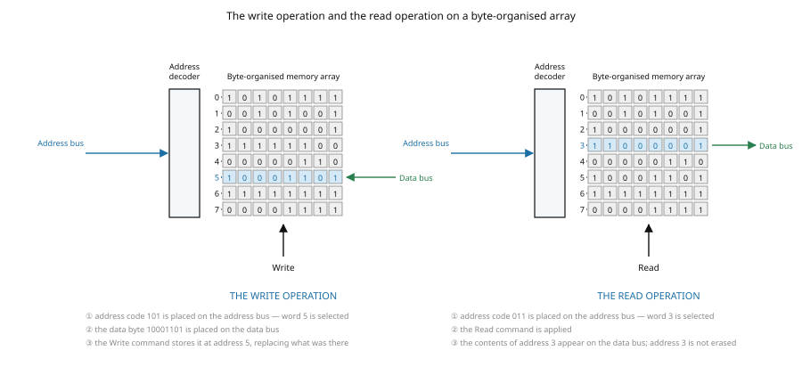

⚠ VERIFY (C03-1) — the two panels of this figure show the **same** array (rows 0, 1, 2, 4, 5, 6, 7
agree, and row 5 in the read panel is exactly the byte just written), yet they disagree about
address 3: the write panel prints $11111100$ and the read panel prints $11000001$. Only one can be
right. Teach the *procedure*, which is unaffected; treat the byte at address 3 as whatever the panel
in front of you says. Cosmetic — figure inconsistency.

---

## 4. RAM versus ROM, and array-logic notation

A typical **programmable logic device** may hold hundreds to millions of gates interconnected
through hundreds to thousands of internal paths ·CH3 slide 9.

- **ROM is a programmable logic device (PLD)** — its binary information is embedded in the
  hardware ·CH3 slide 9. [def]
- Other programmable devices named on the same slide: **PLA**, **PAL**, **FPGA**. All four are
  developed in file 04.

**Array-logic notation.** Because a PLD gate may have hundreds of inputs, drawing every input line
is impractical, so array logic uses a compressed symbol ·CH3 slide 9:

- **Conventional symbol** — an OR gate with several input wires drawn individually, one output wire.
- **Array logic symbol** — a *single* horizontal wire drawn into the gate; the vertical input
  literals ($A$, $\overline{A}$, $B$, $\overline{B}$) cross it, and an **$\times$ at a crossing marks
  a connection**, i.e. that literal is an input to the OR.

On slide 9 the crosses are placed on $A$ and $\overline{B}$, and the slide asks "Output = ?" without
answering it. Reading the crosses gives [added]

$$\text{Output} = A + \overline{B}$$

### Where the memory types sit on the three axes

·CH3 slide 10 presents this as a three-circle Venn diagram of **high density**, **non-volatile** and
**electrically updatable**. Rendered as a table: [added — same content, tabulated]

| Device | High density | Non-volatile | Electrically updatable |
|---|---|---|---|
| EPROM, ROM | ✓ | ✓ | — |
| DRAM | ✓ | — | ✓ |
| Flash | ✓ | ✓ | ✓ |
| EEPROM, SRAM + battery | — | ✓ | ✓ |

[fig] **Fig. 3-4** — three-circle Venn diagram placing ROM/EPROM, DRAM, Flash, EEPROM and
battery-backed SRAM ·CH3 slide 10. Not redrawn; the table above carries the whole content.

---

## 5. Random-access memory

### Symbols

| Symbol | Meaning | Units | Typical value |
|---|---|---|---|
| $k$ | address lines | count | 10, 16, 32 |
| $n$ | bits per word | bit | 1, 8, 16 |
| K | $2^{10}$ | — | 1024 |
| M | $2^{20}$ | — | 1 048 576 |
| G | $2^{30}$ | — | 1 073 741 824 |

**Random access** means the time taken to transfer to or from *any* location is the same, whatever
the location — which is where the name comes from ·CH3 slide 11. [def]

A memory unit stores binary information in groups of bits called **words** ·CH3 slide 11:

- $1$ byte $=$ $8$ bits
- $1$ word $=$ $2$ bytes (the convention this deck adopts)

Communication with the outside world uses three groups of lines ·CH3 slide 11:

- data input and output lines,
- address selection lines,
- control lines specifying the direction of transfer.

[fig] **Fig. 3-5** — memory-unit block diagram ·CH3 slide 11

```yaml
figure_data:
  type: block-diagram
  block: "Memory unit, 2^k words, n bits per word"
  inputs:
    - {name: "address", width: k, side: left}
    - {name: "Read",  width: 1, side: left}
    - {name: "Write", width: 1, side: left}
    - {name: "data in",  width: n, side: top}
  outputs:
    - {name: "data out", width: n, side: bottom}
```

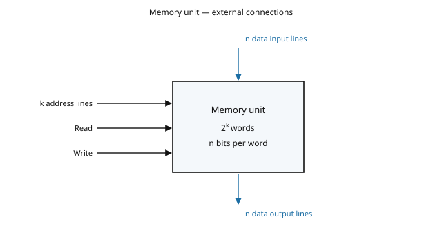

### Content of a memory

Each word is given an identification number called its **address**, running from $0$ up to
$2^k - 1$, where $k$ is the number of address lines ·CH3 slide 12. [eq: address-lines-to-words]

$$\boxed{\;\text{number of words} = 2^{k}\;}$$

- $k$ — number of address lines (dimensionless count)

The total store follows immediately: [eq: memory-capacity-bits]

$$\boxed{\;\text{capacity} = 2^{k} \times n \ \text{bits}\;}$$

- $n$ — word length in bits

Sizes are quoted with the letters $K = 2^{10}$, $M = 2^{20}$, $G = 2^{30}$ ·CH3 slide 12.

[ex] **Worked example — reading off the address-line count** ·CH3 slide 12

$$64\text{K} = 64 \times 2^{10} = 2^{6} \times 2^{10} = 2^{16}$$

$$2\text{M} = 2 \times 2^{20} = 2^{21}$$

$$4\text{G} = 4 \times 2^{30} = 2^{2} \times 2^{30} = 2^{32}$$

So a 64K memory needs $16$ address lines, a 2M memory $21$, and a 4G memory $32$. All three figures
recomputed and correct.

The slide's own address table shows a $1024 \times 16$ memory ·CH3 slide 12:

| Binary address | Decimal | Memory content |
|---|---|---|
| $0000000000$ | $0$ | $1011010101011101$ |
| $0000000001$ | $1$ | $1010101110001001$ |
| $0000000010$ | $2$ | $0000110101000110$ |
| ⋮ | ⋮ | ⋮ |
| $1111111101$ | $1021$ | $1001110100010100$ |
| $1111111110$ | $1022$ | $0000110100011110$ |
| $1111111111$ | $1023$ | $1101111000100101$ |

Checked: $10$ address bits give $2^{10} = 1024$ words numbered $0$ to $1023$; $1111111101_2 = 1021$
and $1111111110_2 = 1022$ as printed; every content word is $16$ bits long. All correct.

---

## 6. Types of memory, and the RAM family

Two access disciplines ·CH3 slide 13: [def]

- **Random-access memory** — word locations may be thought of as separated in space, each word
  occupying one particular location. **Access time is the same regardless of location.**
- **Sequential-access memory** — the information is stored in some medium and is not immediately
  accessible; it becomes available only at certain intervals of time. A magnetic disk or tape is the
  example given. **Access time is variable**, because it depends on the position of the word relative
  to the reading head.

### The RAM family

·CH3 slide 14 gives the family tree. Tabulated: [added — same content, tabulated]

| Branch | Members |
|---|---|
| **Static RAM (SRAM)** | Asynchronous SRAM (ASRAM); Synchronous SRAM with burst feature (SB SRAM) |
| **Dynamic RAM (DRAM)** | Fast Page Mode DRAM (FPM DRAM); Extended Data Out DRAM (EDO DRAM); Burst EDO DRAM (BEDO DRAM); Synchronous DRAM (SDRAM) |

[fig] **Fig. 3-6** — the RAM family tree ·CH3 slide 14. Not redrawn; the table carries it.

### Volatility

·CH3 slide 22:

- Memory that **loses its stored information when power is turned off** is **volatile**. Both static
  and dynamic RAM are volatile, because the binary cells need external power to maintain the stored
  information. [def]
- **Non-volatile memory** — magnetic disk, ROM — retains its contents after power is removed. [def]

Two comparative claims from the same slide, repeated on slide 25:

- DRAM typically has **four times the density** of SRAM ·CH3 slide 22 ·CH3 slide 25.
- DRAM storage costs **three to four times less per bit** than SRAM, and needs less power
  ·CH3 slide 22.

---

## 7. Static RAM

### Symbols

| Symbol | Meaning | Units | Typical value |
|---|---|---|---|
| Select | cell-select (row-select) input | logic level | $0$ or $1$ |
| $N$ | internal node at the select-gate output | logic level | $0$ or $1$ |
| $Q$, $\overline{Q}$ | the latch's complementary outputs | logic level | $0$ or $1$ |
| $C_1$, $C_2$ | complementary storage nodes of the six-transistor cell | logic level | $0$ or $1$ |
| $T_1 \ldots T_6$ | the six transistors of the CMOS cell | — | — |
| WL | word line (the address line of the cell) | logic level | $0$ or $1$ |
| BL, $\overline{\text{BL}}$ | complementary bit lines | logic level | $0$ or $1$ |

SRAM consists essentially of **internal latches** that store the binary information, and the stored
information **remains valid as long as power is applied** ·CH3 slide 15. [def]

Its trade-off profile ·CH3 slide 15:

- easier to use, **shorter read and write cycles**;
- **low density, low capacity, high cost, high speed, high power consumption**.

### The latch cell as the slide draws it

[fig] **Fig. 3-7** — SRAM latch memory cell ·CH3 slide 15

```yaml
figure_data:
  type: gate-schematic
  gates:
    - {id: G1, type: NAND, inputs: [Select, "Data in"], output: N}
    - {id: G2, type: INV,  inputs: [N], output: Nbar}
    - {id: G3, type: NAND, inputs: [N, Qbar],  output: Q,    drawn_as: "OR shape with bubbled inputs"}
    - {id: G4, type: NAND, inputs: [Nbar, Q],  output: Qbar, drawn_as: "OR shape with bubbled inputs"}
  output_terminal: {name: "Data out", net: Q}
  behaviour_as_drawn:
    - {Select: 1, Data_in: 1, Q: 1}
    - {Select: 1, Data_in: 0, Q: 0}
    - {Select: 0, Data_in: X, Q: 0, note: "does not hold — see V03-1"}
```

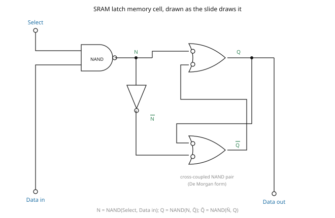

Reading the gates off the render:

$$N = \overline{\text{Select} \cdot \text{Data in}}$$

$$\overline{N} = \text{Select} \cdot \text{Data in}$$

$$Q = \overline{N \cdot \overline{Q}} \qquad \overline{Q} = \overline{\overline{N} \cdot Q}$$

Writing works as intended:

- $\text{Select} = 1$, $\text{Data in} = 1$ $\Rightarrow$ $N = 0$, $\overline{N} = 1$
  $\Rightarrow$ $Q = 1$.
- $\text{Select} = 1$, $\text{Data in} = 0$ $\Rightarrow$ $N = 1$, $\overline{N} = 0$
  $\Rightarrow$ $Q = 0$.

⚠ VERIFY (V03-1) — **de-selecting the cell destroys a stored $1$.** With
$\text{Select} = 0$ the NAND forces $N = 1$ and the inverter forces $\overline{N} = 0$; the lower
gate is then held at $\overline{Q} = 1$ and the upper gate settles at $Q = 0$ whatever was stored.
The cell as drawn holds a $0$ but not a $1$, so it is not a working memory cell. Enumerated in
software over all four $(\text{Select}, \text{Data in})$ combinations and both latch start states.
Substantive.

**The standard cell.** A gated-D latch needs the inverter on the *data* path feeding a **second**
gating NAND, not on the output of the first: [added]

$$\overline{S} = \overline{\text{Select} \cdot \text{Data in}} \qquad
  \overline{R} = \overline{\text{Select} \cdot \overline{\text{Data in}}}$$

$$Q = \overline{\overline{S}\cdot\overline{Q}} \qquad \overline{Q} = \overline{\overline{R}\cdot Q}$$

With $\text{Select} = 0$ both $\overline{S}$ and $\overline{R}$ go to $1$, the latch is inactive and
the stored bit is held. Verified over all eight input/state combinations.

### The SRAM array

·CH3 slide 16 shows the same latch cell replicated on a grid: horizontal **Row Select 0 … Row
Select n** lines, four columns of cells, and a **Data Input/Output Buffers and Control** block at the
bottom driving four bidirectional **Data I/O Bit 0 … Bit 3** lines.

[fig] **Fig. 3-8** — SRAM cell array with row-select lines and I/O buffers ·CH3 slide 16. Not
redrawn; the cell itself is Fig. 3-7 and the array wiring is the same idea as Fig. 3-11.

### The six-transistor CMOS cell

·CH3 slide 17. Binary values are stored using traditional flip-flop logic-gate configurations; the
cell holds its data as long as power is supplied; the address line opens or closes a switch.

[fig] **Fig. 3-9** — six-transistor static RAM cell ·CH3 slide 17

```yaml
figure_data:
  type: transistor-schematic
  transistors:
    - {id: T3, kind: PMOS, role: "pull-up of inverter 1",  gate_net: C2, drain_net: C1, source_net: VDD}
    - {id: T1, kind: NMOS, role: "pull-down of inverter 1", gate_net: C2, drain_net: C1, source_net: GND}
    - {id: T4, kind: PMOS, role: "pull-up of inverter 2",  gate_net: C1, drain_net: C2, source_net: VDD}
    - {id: T2, kind: NMOS, role: "pull-down of inverter 2", gate_net: C1, drain_net: C2, source_net: GND}
    - {id: T5, kind: NMOS, role: "access", gate_net: address_line, between: [bit_line_B, C1]}
    - {id: T6, kind: NMOS, role: "access", gate_net: address_line, between: [bit_line_Bbar, C2]}
  nets: [VDD, GND, C1, C2, bit_line_B, bit_line_Bbar, address_line]
  invariant: "C2 = NOT C1 ; bit line B carries C1, bit line B-bar carries C2"
```

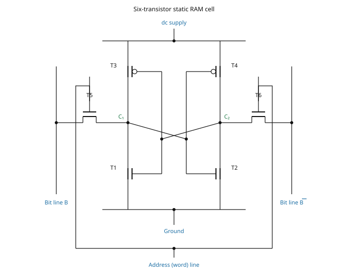

The slide adds a state box ·CH3 slide 17:

> $B = 1$ — Address Line is activated ($T_5$ = ON, $T_6$ = ON); $T_2$ = OFF, $T_3$ = OFF,
> $T_1$ = ON, $T_4$ = ON

⚠ VERIFY (V03-2) — **the heading and the transistor states contradict each other.** The four listed
states are mutually consistent, but only with $C_1 = 0$ and $C_2 = 1$:

- $T_1$ ON needs its gate high, and $T_1$'s gate is $C_2$, so $C_2 = 1$;
- $T_3$ OFF then follows, because $T_3$ is a PMOS whose gate is also $C_2$;
- $T_2$ OFF needs $C_1 = 0$ ($T_2$'s gate is $C_1$);
- $T_4$ ON follows, $T_4$ being a PMOS with its gate on $C_1$.

Bit line $B$ reaches node $C_1$ through $T_5$, so this state is $B = 0$, not $B = 1$. **Read the
heading as $B = 0$** (equivalently $\overline{B} = 1$). Substantive. If the intended state really is
$B = 1$, then all four transistor states must be inverted: $T_1$ OFF, $T_3$ ON, $T_2$ ON, $T_4$ OFF.

### Write, hold and read on the cell

·CH3 slide 18 (a hand-annotated slide showing two cross-coupled inverters $I_1$, $I_2$ between two
access transistors $M_1$, $M_2$) lists:

> **Write** — WL $= 0$; data is held in Latch mode
> **Read** — WL $= 1$; Access Transistors are turned ON

⚠ VERIFY (V03-3) — **the first bullet is mislabelled.** WL $= 0$ turns both access transistors off,
which disconnects the cell from the bit lines: that is the **hold (standby)** state, exactly as the
second line of the same bullet says ("data is held in Latch mode"). A **write** requires WL $= 1$ so
that the write drivers on BL and $\overline{\text{BL}}$ can force the cross-coupled pair over.
Corrected form: [added]

| Operation | WL | Bit lines | Access transistors |
|---|---|---|---|
| **Hold** | $0$ | floating / precharged | off |
| **Write** | $1$ | driven hard to the new value and its complement | on |
| **Read** | $1$ | precharged, then sensed | on |

Substantive — as printed, the write operation is impossible.

The same slide's right-hand column repeats the cell twice, once as a **transistor diagram** (the six
MOSFETs) and once as an **inverter diagram** (two triangles labelled $Q$ and $\overline{Q}$ between
two access transistors on the word line). Both say the same thing as Fig. 3-9.

---

## 8. Dynamic RAM

### Symbols

| Symbol | Meaning | Units | Typical value |
|---|---|---|---|
| Row | word line of the cell | logic level | $0$ or $1$ |
| Column | bit line of the cell | logic level | $0$ or $1$ |
| $D_{\text{IN}}$ | data input to the cell's input buffer | logic level | $0$ or $1$ |
| $D_{\text{OUT}}$ | data output from the sense amplifier | logic level | $0$ or $1$ |
| $R/\overline{W}$ | read (HIGH) / write (LOW) control | logic level | $0$ or $1$ |
| Refresh | refresh-buffer enable | logic level | $0$ or $1$ |

DRAM stores binary information as **electric charge on capacitors** ·CH3 slide 19. [def]

- The capacitors are provided inside the chip by MOS transistors.
- The charge **leaks away with time**, so the cells must be periodically recharged — **refreshed**.
- DRAM offers reduced power consumption and larger storage capacity per chip.
- Profile: **high density, high capacity, low cost, low speed, low power consumption**
  ·CH3 slide 19.

[fig] **Fig. 3-10** — one-transistor, one-capacitor DRAM cell ·CH3 slide 19

```yaml
figure_data:
  type: transistor-schematic
  transistors:
    - {id: M1, kind: NMOS, gate_net: row, between: [column, storage_node]}
  components:
    - {id: Cs, kind: capacitor, between: [storage_node, ground]}
  nets: [row, column, storage_node, ground]
  rule: "row HIGH connects the storage capacitor to the bit line; row LOW isolates it"
```

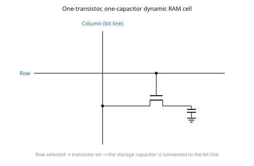

### The four operations on a DRAM cell

·CH3 slide 20 is an **image-only slide** — it carries no text layer at all — with four panels plus a
sense-amplifier array. Its four panels, read off the render:

| Panel | Refresh | Row | $R/\overline{W}$ | $D_{\text{IN}}$ | $D_{\text{OUT}}$ | Bit line | Effect |
|---|---|---|---|---|---|---|---|
| (a) writing a $1$ | LOW | HIGH | LOW | HIGH | — | HIGH | current $I$ charges the capacitor to a stored $1$ |
| (b) writing a $0$ | LOW | HIGH | LOW | LOW | — | LOW | the capacitor discharges to a stored $0$ |
| (c) reading a $1$ | LOW | HIGH | HIGH | — | HIGH | HIGH | charge flows out of the cell onto the bit line into the sense amplifier |
| (d) refreshing a stored $1$ | HIGH | HIGH | HIGH | — | HIGH | HIGH | the refresh buffer drives the sensed value back into the cell |

Note the pattern: $R/\overline{W}$ LOW writes, HIGH reads; **Refresh is the only input that changes
between reading (c) and refreshing (d)**.

[fig] **Fig. 3-11** — basic operation of a DRAM cell, four panels, plus a four-column DRAM array with
one sense amplifier per bit line and the stored $1$s marked in red ·CH3 slide 20. Not redrawn — the
four-panel figure is third-party textbook artwork; the table above carries its content and the cell
itself is Fig. 3-10.

[fig] **Fig. 3-12** — DRAM organisation hierarchy: **rank** (a module of eight chips with its I/O
pins) → **chip (device)** with its row decoder and sense amplifiers → **bank** ($8\text{K}$ across,
$16\text{K}$ down) built from **sub-arrays** wired by global word lines and global bit lines →
**MAT** ($512 \times 512$, with local word line and local bit line, row and column marked) →
**cells** (four one-transistor one-capacitor cells at a local word-line/bit-line crossing)
·CH3 slide 21. This slide is also image-only, and the figure is **plainly lifted from a published
paper on DRAM organisation**: it is described here and deliberately **not reproduced or redrawn**.

---

## 9. Memory decoding

### Symbols

| Symbol | Meaning | Units | Typical value |
|---|---|---|---|
| BC | binary cell — the one-bit storage block | — | — |
| $S$, $R$ | set and reset inputs of the internal latch | logic level | $0$ or $1$ |
| EN | decoder enable, driven by Memory enable | logic level | $0$ or $1$ |

The **binary cell (BC)** is the equivalent logic of a cell storing one bit ·CH3 slide 23. [def] Its
rules:

- $\text{Read/Write} = 0$ with $\text{select} = 1$ — input data goes **into** the S-R latch (write).
- $\text{Read/Write} = 1$ with $\text{select} = 1$ — output data comes **out of** the S-R latch
  (read).

[fig] **Fig. 3-13** — binary cell: logic diagram and block symbol ·CH3 slide 23

```yaml
figure_data:
  type: gate-schematic
  gates:
    - {id: INV1, type: INV, inputs: [Input],      output: Input_bar}
    - {id: INV2, type: INV, inputs: [ReadWrite],  output: Write_enable}
    - {id: A1,   type: AND, inputs: [Select, Input,     Write_enable], output: S}
    - {id: A2,   type: AND, inputs: [Select, Input_bar, Write_enable], output: R}
    - {id: A3,   type: AND, inputs: [Select, ReadWrite, latch_Q],      output: Output}
  latch: {type: "S-R latch built from NOR gates", set: S, reset: R, output: latch_Q}
  block_symbol: {name: BC, left: Input, right: Output, top: Select, bottom: Read/Write}
```

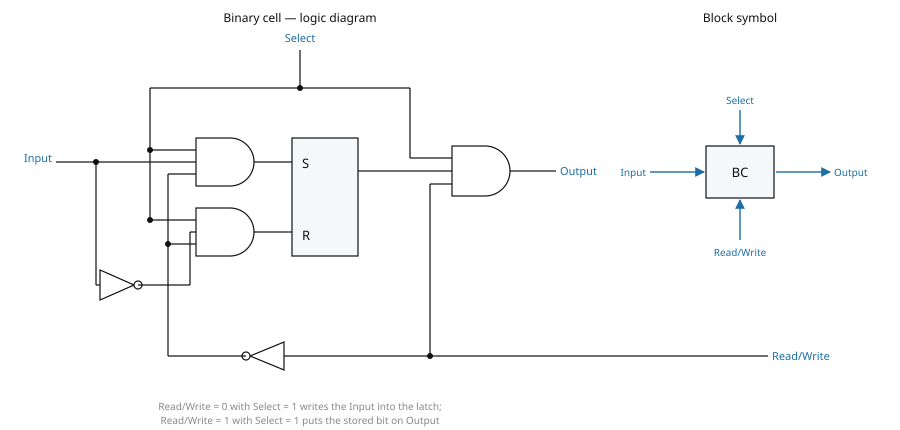

The lecturer's own annotation on the slide identifies the latch as an **SR latch with NOR gates**
·CH3 slide 23.

### A 4 × 4 RAM

·CH3 slide 24. Four words of four bits each.

- A memory with four words needs **two address lines**, since $2^2 = 4$.
- The address inputs drive a **$2 \times 4$ decoder** whose EN input is the **Memory enable**.
- During a **read**, the four bits of the selected word pass **through OR gates** to the output
  terminals.
- During a **write**, the data on the input lines is transferred into the four binary cells of the
  selected word.

[ex] **Worked example — sizing the 4 × 4 RAM** [added — the arithmetic the slide implies]

$$\text{words} = 2^{k} = 2^{2} = 4 \qquad n = 4 \ \text{bits}$$

$$\text{cells} = 4 \times 4 = 16 \ \text{binary cells}$$

$$\text{OR gates} = n = 4, \ \text{each with } 2^{k} = 4 \ \text{inputs}$$

[fig] **Fig. 3-14** — 4 × 4 RAM decoding structure ·CH3 slide 24

```yaml
figure_data:
  type: memory-decoding
  words: 4
  bits_per_word: 4
  decoder: {type: "2 × 4", enable: "Memory enable (EN)"}
  cell: BC
  word_lines: [Word 0, Word 1, Word 2, Word 3]
  per_column:
    input: "one common Input data line feeding all four BCs in the column"
    output: "four BC outputs OR-ed together into one Output data line"
  read_write: "one common Read/Write line to every BC"
```

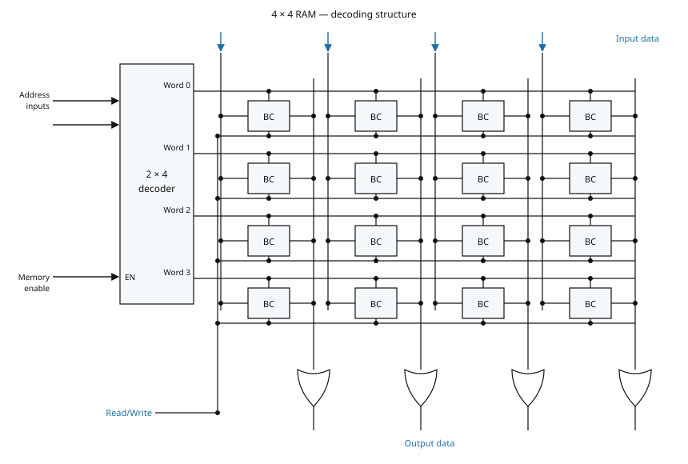

---

## 10. Address multiplexing

### Symbols

| Symbol | Meaning | Units | Typical value |
|---|---|---|---|
| $\overline{\text{RAS}}$ | row address strobe, active low | logic level | $0$ or $1$ |
| $\overline{\text{CAS}}$ | column address strobe, active low | logic level | $0$ or $1$ |

Comparative facts the slide opens with ·CH3 slide 25:

- SRAM contains **6 transistors per cell**; DRAM contains **one MOS transistor and one capacitor per
  cell**.
- DRAM therefore reaches higher storage capacity per unit area — **four times that of SRAM** — with
  lower power consumption.
- DRAM's typical word size is **1 bit**, and it is preferred for the large memories in PCs.
- DRAM is available from **64K to 256M bits**.

**The problem address multiplexing solves.** A $64\text{K} \times 1$ DRAM would need $16$ address
pins. Splitting the address in two halves and strobing them in one after the other halves the pin
count — fewer pins means a smaller package ·CH3 slide 25. [def]

- $\overline{\text{RAS}}$ — **Row Address Strobe**: latches the first half into the row register.
- $\overline{\text{CAS}}$ — **Column Address Strobe**: latches the second half into the column
  register.

[ex] **Worked example — capacity of the multiplexed array** ·CH3 slide 25

$$\text{capacity} = 256 \times 256 = 2^{8} \times 2^{8} = 2^{16} = 65\,536\ \text{bits} = 64\text{K}$$

Recomputed and correct. Note that the $8$-bit address bus is used **twice**, so the effective address
width is $16$ bits — consistent with $2^{16} = 64\text{K}$.

[fig] **Fig. 3-15** — address multiplexing in a 64K × 1 DRAM ·CH3 slide 25

```yaml
figure_data:
  type: block-diagram
  address_bus_width: 8
  blocks:
    - {name: "8-bit row register",    strobe: RAS_bar}
    - {name: "8 × 256 decoder",       driven_by: "8-bit row register", strobe: RAS_bar}
    - {name: "8-bit column register", strobe: CAS_bar}
    - {name: "8 × 256 decoder",       driven_by: "8-bit column register", strobe: CAS_bar}
    - {name: "256 × 256 memory cell array"}
  other_pins: [Read/Write, Data in, Data out]
  capacity_bits: 65536
```

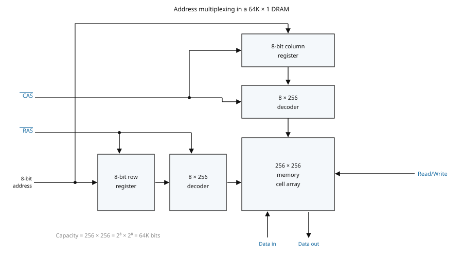

---

## 11. Error detection and correction

### Symbols

| Symbol | Meaning | Units | Typical value |
|---|---|---|---|
| $n$ | number of **data** bits in the word | bit | 8 |
| $k$ | number of **check (parity)** bits added | bit | 4 |
| $P_1, P_2, P_4, P_8$ | parity bits, placed at the power-of-two positions | bit | $0$ or $1$ |
| $C_1, C_2, C_4, C_8$ | check bits computed on read-back | bit | $0$ or $1$ |
| $C$ | the syndrome, $C_8C_4C_2C_1$ read as a binary number | — | $0 \ldots 12$ |
| $P$ | overall parity bit for SEC-DED | bit | $0$ or $1$ |

Dynamic physical interaction of electrical signals may cause occasional errors in storing and
retrieving binary information, so memories use codes to protect against them ·CH3 slide 26.

Two kinds ·CH3 slide 26: [def]

- **Error detection** — uses **parity bits**. The parity method is a detection method only.
- **Error correction** — uses **multiple parity bits**, each generated over a *group* of bits. On
  read-back:
  - if the check parity bits are all correct → **no error**;
  - if one or more check bits are wrong → they form a pattern called the **syndrome**, which
    identifies **which bit is incorrect**.

The **Hamming code** is the error-correction method taught here ·CH3 slide 26.

### The Hamming code

·CH3 slide 27:

- It is an error-correction code.
- It uses **several parity bits per word**.
- It can **detect and correct 1-bit errors**.

Construction rules ·CH3 slide 27: [def]

1. $k$ parity bits are added to $n$ data bits, giving a word of $n + k$ bits.
2. Bit positions are numbered from $1$ to $n+k$ — **there is no position $0$**.
3. **Parity bits occupy the power-of-two positions** ($1, 2, 4, 8, \ldots$).
4. The remaining positions carry the data bits, in order.

The number of check bits needed satisfies [eq: hamming-check-bit-count] [added — the standard
condition; the deck states only the resulting table on slide 30]

$$\boxed{\;2^{k} \ \ge\ n + k + 1\;}$$

- $n$ — data bits; $k$ — check bits

For $n = 8$: $k = 4$ gives $2^4 = 16 \ge 8 + 4 + 1 = 13$ ✓, while $k = 3$ gives $8 \ge 12$ ✗. So
$k = 4$ and the coded word is $12$ bits long, exactly as the deck uses.

### Placing the data word 11000100

·CH3 slide 27. The $8$-bit data word $11000100$ goes into positions $3, 5, 6, 7, 9, 10, 11, 12$:

| Bit position | 1 | 2 | 3 | 4 | 5 | 6 | 7 | 8 | 9 | 10 | 11 | 12 |
|---|---|---|---|---|---|---|---|---|---|---|---|---|
| | $P_1$ | $P_2$ | $1$ | $P_4$ | $1$ | $0$ | $0$ | $P_8$ | $0$ | $1$ | $0$ | $0$ |

Checked cell by cell against the data word: $1,1,0,0,0,1,0,0$ maps to positions
$3,5,6,7,9,10,11,12$ in order. Correct.

[fig] **Fig. 3-16** — the 12-bit Hamming layout with each parity bit's coverage ·CH3 slides 27–28

```yaml
figure_data:
  type: code-layout
  data_word: "11000100"
  n: 8
  k: 4
  total_bits: 12
  parity_positions: [1, 2, 4, 8]
  data_positions:  [3, 5, 6, 7, 9, 10, 11, 12]
  coverage:
    P1: [1, 3, 5, 7, 9, 11]
    P2: [2, 3, 6, 7, 10, 11]
    P4: [4, 5, 6, 7, 12]
    P8: [8, 9, 10, 11, 12]
  code_word: "001110010100"
```

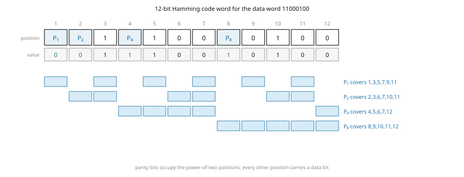

### Parity generation

·CH3 slide 28. Each parity bit is the exclusive-OR of the **data** positions it covers:
[eq: hamming-parity-equations]

$$P_1 = \text{XOR}(3,5,7,9,11)$$

$$P_2 = \text{XOR}(3,6,7,10,11)$$

$$P_4 = \text{XOR}(5,6,7,12)$$

$$P_8 = \text{XOR}(9,10,11,12)$$

Every one of these four was rederived from the rule "$P_{2^i}$ covers every position whose binary
representation has bit $i$ set, itself excluded" and matches the slide exactly. Correct.

[ex] **Worked example — generating the four parity bits** ·CH3 slides 27–28

Data bits: position 3 $= 1$, 5 $= 1$, 6 $= 0$, 7 $= 0$, 9 $= 0$, 10 $= 1$, 11 $= 0$, 12 $= 0$.

$$P_1 = 1 \oplus 1 \oplus 0 \oplus 0 \oplus 0 = 0$$

$$P_2 = 1 \oplus 0 \oplus 0 \oplus 1 \oplus 0 = 0$$

$$P_4 = 1 \oplus 0 \oplus 0 \oplus 0 = 1$$

$$P_8 = 0 \oplus 1 \oplus 0 \oplus 0 = 1$$

$$\boxed{\;\text{12-bit code word} = 001110010100\;}$$

Recomputed independently; this matches the "No error" row of the table on ·CH3 slide 29 bit for bit.

### The syndrome

·CH3 slide 28. On read-back, four check bits are formed — this time **including** the parity
position itself: [eq: hamming-syndrome-equations]

$$C_1 = \text{XOR}(1,3,5,7,9,11)$$

$$C_2 = \text{XOR}(2,3,6,7,10,11)$$

$$C_4 = \text{XOR}(4,5,6,7,12)$$

$$C_8 = \text{XOR}(8,9,10,11,12)$$

All four rederived and correct. Written in the order $C_8C_4C_2C_1$ they form the **syndrome**, and
its value read as a binary number is **the position of the erroneous bit**; $0000$ means no error.

[ex] **Worked example — three read-backs** ·CH3 slide 29

| Case | Bit pattern read back | $C_8C_4C_2C_1$ | Meaning |
|---|---|---|---|
| No error | $001110010100$ | $0000$ | correct word |
| Bit 1 error | $101110010100$ | $0001$ | position $1$ is wrong |
| Bit 5 error | $001100010100$ | $0101$ | position $5$ is wrong |

Working for the bit-5 case:

$$C_1 = 0 \oplus 1 \oplus 0 \oplus 0 \oplus 0 \oplus 0 = 1$$

$$C_2 = 0 \oplus 1 \oplus 0 \oplus 0 \oplus 1 \oplus 0 = 0$$

$$C_4 = 1 \oplus 0 \oplus 0 \oplus 0 \oplus 0 = 1$$

$$C_8 = 1 \oplus 0 \oplus 1 \oplus 0 \oplus 0 = 0$$

$$C_8C_4C_2C_1 = 0101_2 = 5$$

Both error rows and all three bit patterns were recomputed from the code word and match the slide
exactly.

### The full syndrome table

·CH3 slide 29 tabulates the syndrome for every error position. Recomputed row by row by flipping one
bit of the code word at a time:

| Position of error | $C_8$ | $C_4$ | $C_2$ | $C_1$ |
|---|---|---|---|---|
| No error | $0$ | $0$ | $0$ | $0$ |
| 1 | $0$ | $0$ | $0$ | $1$ |
| 2 | $0$ | $0$ | $1$ | $0$ |
| 3 | $0$ | $0$ | $1$ | $1$ |
| 4 | $0$ | $1$ | $0$ | $0$ |
| 5 | $0$ | $1$ | $0$ | $1$ |
| 6 | $0$ | $1$ | $1$ | $0$ |
| 7 | $0$ | $1$ | $1$ | $1$ |
| 8 | $1$ | $0$ | $0$ | $0$ |
| 9 | $1$ | $0$ | $0$ | $1$ |
| 10 | $1$ | $0$ | $1$ | $0$ |
| 11 | $1$ | $0$ | $1$ | $1$ |
| **12** | $1$ | **$1$** | $0$ | $0$ |

⚠ VERIFY (V03-4) — **the last row of the slide's table is wrong.** For an error in position 12 the
slide prints $C_8C_4C_2C_1 = 1\,0\,0\,0$, which is a duplicate of the row for position 8 and would
send the correction logic to the wrong bit. The correct value is $1\,1\,0\,0$, because position 12
appears in **both** $C_8 = \text{XOR}(8,9,10,11,12)$ and $C_4 = \text{XOR}(4,5,6,7,12)$, so flipping
bit 12 flips both check bits. The sanity check is the one the whole scheme rests on: the syndrome
read as a binary number must equal the position, and $1100_2 = 12$ while $1000_2 = 8$. Substantive.

Every other row was verified against $12 = 1100_2$-style position arithmetic and is correct.

---

## 12. Single-error correction, double-error detection

·CH3 slide 30.

- The Hamming code on its own **can detect and correct only a single error**.
- Adding **one further parity bit** over the whole coded word upgrades it to **correct a single
  error and detect double errors** (SEC-DED).

For the running example the 12-bit code word becomes $001110010100\,P_{13}$, and $P_{13}$ is chosen
for **even** parity over all 13 bits: [eq: sec-ded-parity-bit]

$$P_{13} = \text{XOR}(\text{all 12 code bits})$$

[ex] **Worked example — the thirteenth bit** ·CH3 slide 30

The code word $001110010100$ contains five $1$s, so

$$P_{13} = 1 \qquad \Rightarrow \qquad \text{13-bit word} = 0011100101001$$

On read-back the overall parity is recomputed:

$$P = \text{XOR}(0011100101001) = 0$$

because the 13-bit word now contains six $1$s. Both figures recomputed; the slide's
$001110010100\ \mathbf{1}$ and its statement that $P = 0$ means correct parity are right.

**The four cases** ·CH3 slide 30: [def]

| Syndrome $C$ | Overall parity $P$ | Interpretation |
|---|---|---|
| $C = 0$ | $P = 0$ | no error occurred |
| $C \ne 0$ | $P = 1$ | a **single** error occurred — it can be corrected |
| $C \ne 0$ | $P = 0$ | a **double** error occurred — detected but **not** correctable |
| $C = 0$ | $P = 1$ | the error is in the $P_{13}$ bit itself |

All four cases are logically consistent: a single bit flip in the 12-bit body changes the syndrome
*and* the overall parity; two flips change the syndrome but leave the overall parity even; a flip of
$P_{13}$ alone leaves the syndrome at zero.

### How many check bits for how many data bits

·CH3 slide 30 gives the range table. Every row was recomputed from
$n_{\max} = 2^{k} - k - 1$:

| Check bits $k$ | Range of data bits $n$ | $2^{k} - k - 1$ |
|---|---|---|
| $3$ | $2$ – $4$ | $8 - 3 - 1 = 4$ ✓ |
| $4$ | $5$ – $11$ | $16 - 4 - 1 = 11$ ✓ |
| $5$ | $12$ – $26$ | $32 - 5 - 1 = 26$ ✓ |
| $6$ | $27$ – $57$ | $64 - 6 - 1 = 57$ ✓ |
| $7$ | $58$ – $120$ | $128 - 7 - 1 = 120$ ✓ |

Each lower bound is one more than the previous row's upper bound, which is what the inequality
requires. The whole table is correct as printed.

---

## 13. Read-only memory

### Symbols

| Symbol | Meaning | Units | Typical value |
|---|---|---|---|
| $k$ | address inputs of the ROM | count | 5 |
| $n$ | data outputs of the ROM | count | 8 |
| $2^k \times n$ | ROM size — words × bits per word | — | $32 \times 8$ |
| $A_0 \ldots A_{n-1}$ | ROM data outputs | logic level | $0$ or $1$ |
| $I_0 \ldots I_{k-1}$ | ROM address inputs | logic level | $0$ or $1$ |

A ROM block has **$k$ address inputs and $n$ data outputs** ·CH3 slide 31. The number of words
follows from the address width — $k$ address lines specify $2^k$ words — so the part is described as
a $2^k \times n$ ROM. [eq: rom-organisation]

$$\boxed{\;2^{k} \times n \ \text{ROM} \;=\; \text{a } k \times 2^{k} \text{ decoder} \;+\; n \ \text{OR gates}\;}$$

- decoder side — **fixed AND gates** (each decoder output is one AND of the address literals)
- OR side — **programmable OR gates** (the connections into them are what gets programmed)

·CH3 slide 31 states the split exactly this way: "ROM = a Decoder + OR Gate", with the decoder
labelled *fixed AND gates* and the output array *programmable OR gates*.

**A ROM has no data inputs, because it has no write operation** ·CH3 slide 31.

[fig] **Fig. 3-17** — ROM cells ·CH3 slide 31. Two MOS cells sit at a row/column crossing, each with
its source at $+V_{DD}$ and its drain on the column line. In the cell **storing a 1** the transistor
gate is connected to the row line, so selecting the row turns the transistor on; in the cell
**storing a 0** the gate lead is left **disconnected** from the row line, so the transistor never
turns on. Not redrawn — the difference is a single wire, described here in full.

### Construction of a ROM

[ex] **Worked example — a 32 × 8 ROM** ·CH3 slide 32

- The unit holds **32 words of 8 bits each**.
- **5 input lines** form the binary numbers $0$ through $31$ for the address, since
  $2^5 = 32$ and $31 = 11111_2$.
- Each output of the decoder represents one memory address.
- **Each OR gate must be considered as having 32 inputs** — one per decoder output.
- Generalising: a $2^k \times n$ ROM has an internal $k \times 2^k$ decoder and $n$ OR gates.

Substituting $k = 5$, $n = 8$:

$$\text{decoder} = 5 \times 32 \qquad \text{OR gates} = 8, \ \text{each of } 32 \ \text{inputs}$$

$$\text{stored bits} = 2^{5} \times 8 = 32 \times 8 = 256 \ \text{bits}$$

All figures recomputed and consistent with the slide.

[fig] **Fig. 3-18** — construction of a 32 × 8 ROM ·CH3 slide 32

```yaml
figure_data:
  type: rom-construction
  size: "32 × 8"
  address_inputs: [I0, I1, I2, I3, I4]
  decoder: "5 × 32"
  decoder_outputs: 32          # numbered 0 … 31
  or_gates: 8
  inputs_per_or_gate: 32
  data_outputs: [A7, A6, A5, A4, A3, A2, A1, A0]
  stored_bits: 256
```

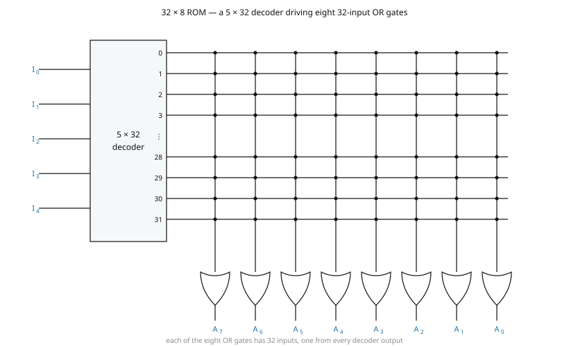

### Types of ROM

·CH3 slide 33. The required paths in a ROM may be programmed in **four different ways**:

1. **Mask programming** — done in the **fabrication** process.
2. **Programmable ROM (PROM)** — programmed by **blowing a fuse or leaving it intact**.
3. **Erasable PROM (EPROM)** — placing the device under a special **ultraviolet light** for a given
   period erases the pattern.
4. **Electrically-erasable PROM (EEPROM)** — erased with an **electrical signal** instead of
   ultraviolet light.

The ROM family, as the slide's tree draws it:

| Member | Programmed by | Erased by |
|---|---|---|
| Mask ROM | the fabrication mask | not erasable |
| Programmable ROM (PROM) | blowing fuses | not erasable |
| Erasable PROM (EPROM) | electrically | ultraviolet light |
| Ultraviolet EPROM (UV EPROM) | electrically | ultraviolet light |
| Electrically Erasable PROM (EEPROM) | electrically | an electrical signal |

⚠ VERIFY (C03-2) — the text enumerates **four** programming methods while the tree beneath it draws
**five** family members, listing *Erasable PROM (EPROM)* and *Ultraviolet EPROM (UV EPROM)* as
separate siblings of ROM. They are the same device in the text — item 3 defines EPROM *as* the
ultraviolet-erasable part — and in practice UV EPROM and EEPROM are sub-types **of** EPROM rather
than siblings of it. Cosmetic: no numerical or logical claim depends on it, but a question asking
"name the members of the ROM family" has two defensible answers depending on which half of the slide
is used.

[fig] **Fig. 3-19** — the ROM family tree, five boxes below a single Read-Only Memory (ROM) node
·CH3 slide 33. Not redrawn; the table above carries it.

---

## Exercises

There are **no homework or exercise items in slides 1–33**. The deck's set problems for this chapter
fall on slides 64–66, inside the programmable-logic half, and are transcribed in file 04.

---

## Slide coverage

| Slide | Status |
|---|---|
| 1 | title slide — no content |
| 2 | chapter outline — cited in the scope note |
| 3 | taught — §1 introduction, RAM and ROM |
| 4 | taught — §1 three characteristics |
| 5 | taught — §2, redrawn as Fig. 3-1 |
| 6 | taught — §2 address and capacity; Fig. 3-2 captioned (third-party artwork) |
| 7 | taught — §3 write and read procedures, control-input table |
| 8 | taught — §3, redrawn as Fig. 3-3; defect C03-1 |
| 9 | taught — §4 RAM vs ROM, array-logic notation |
| 10 | taught — §4, Venn diagram captioned and tabulated (Fig. 3-4) |
| 11 | taught — §5, redrawn as Fig. 3-5; RAM-module photograph not reproduced |
| 12 | taught — §5 content of a memory; worked example, all figures recomputed |
| 13 | taught — §6 random vs sequential access |
| 14 | taught — §6 RAM family, captioned and tabulated (Fig. 3-6) |
| 15 | taught — §7, redrawn as Fig. 3-7; defect V03-1 |
| 16 | taught — §7 SRAM array, captioned (Fig. 3-8) |
| 17 | taught — §7, redrawn as Fig. 3-9; defect V03-2 |
| 18 | taught — §7 write/hold/read; defect V03-3 |
| 19 | taught — §8, redrawn as Fig. 3-10 |
| 20 | **image-only slide**, read from the render — §8 four-panel operation table (Fig. 3-11) |
| 21 | **image-only slide**, read from the render — §8 DRAM organisation; third-party paper figure, captioned only (Fig. 3-12) |
| 22 | taught — §6 volatility, density and cost comparisons |
| 23 | taught — §9, redrawn as Fig. 3-13 |
| 24 | taught — §9, redrawn as Fig. 3-14; sizing example |
| 25 | taught — §10, redrawn as Fig. 3-15; capacity example recomputed |
| 26 | taught — §11 detection vs correction |
| 27 | taught — §11 Hamming construction rules and bit layout |
| 28 | taught — §11 parity and syndrome equations, all eight rederived |
| 29 | taught — §11 worked read-backs and full syndrome table; defect V03-4 |
| 30 | taught — §12 SEC-DED, four cases, check-bit range table recomputed |
| 31 | taught — §13 ROM block diagram and cells (Fig. 3-17 captioned) |
| 32 | taught — §13, redrawn as Fig. 3-18; 32 × 8 example |
| 33 | taught — §13 types of ROM; defect C03-2 (Fig. 3-19 captioned) |

Slides 34–66 are out of scope for this file; see **04 — Programmable Logic Devices**.

---

## Verification flags raised in this file

| ID | Slide | Class | One line |
|---|---|---|---|
| V03-1 | 15 | substantive | the latch cell as drawn cannot hold a stored $1$ when de-selected |
| V03-2 | 17 | substantive | the box headed $B = 1$ lists transistor states that correspond to $B = 0$ |
| V03-3 | 18 | substantive | "Write — WL $= 0$" describes the hold state; a write needs WL $= 1$ |
| V03-4 | 29 | substantive | syndrome for an error at position 12 printed as $1000$; should be $1100$ |
| C03-1 | 8 | cosmetic | the write and read panels of one figure disagree about the contents of address 3 |
| C03-2 | 33 | cosmetic | four programming methods in the text, five family members in the tree |

Full entries are in `flags/03.md`.

---

## File size note

This file is about **46 KB**, above the repository's ~40 KB guideline. It is left whole because the
memory half of Chapter 3 is one continuous argument: the cell (§7–§8) is what the decoder (§9)
addresses, and the address (§10) is what the error-correction scheme (§11–§12) protects.

If a split is later forced, the natural cut is **between §10 and §11** — everything up to address
multiplexing is *how memory is built and addressed*, and everything from error detection onward is
*coding theory applied to memory*, with no shared symbols except $n$ and $k$ (whose meanings differ
either side of the cut: word length and address lines before, data bits and check bits after — see
the clash note in the nomenclature hand-back).
