# 04 — Programmable Logic Devices

**This file continues Chapter 3 from file 03.** Slides 1–33 of CH3 cover memory (RAM, decoding,
error detection and correction, ROM) and are held in `03-semiconductor-memory.md`. This file picks
the deck up at slide 34, where it turns to programmable logic, and carries it to the end of the
chapter at slide 66.

---

## 4.1 What a PLD is, and why programmable logic exists

### Symbols used in this sub-topic

| Symbol | Meaning | Units | Typical value |
|---|---|---|---|
| $n$ | number of input lines to the PLD | — (count) | 3–16 |
| $p$ | number of product-term lines the AND array produces | — (count) | 4–64 |
| $m$ | number of output lines the OR array produces | — (count) | 2–8 |
| $A,\;B,\;C,\;D$ | Boolean input variables | — (logic 0/1) | — |
| $F_1,\;F_2$ | Boolean output functions | — (logic 0/1) | — |

[def] A **combinational PLD** is an integrated circuit with programmable gates divided into an
**AND array** and an **OR array**, giving an AND–OR sum-of-products implementation ·CH3 slide 34.

It contains two kinds of array, and only two ·CH3 slide 34:

- an array of AND gates — forms the product terms;
- an array of OR gates — sums those products.

**Advantages the deck lists** ·CH3 slide 34:

- low space requirement;
- low reproduction cost;
- low power consumption;
- easy programming.

### Why programmable logic at all

The argument on slide 35 is economic, not electrical:

1. It is most economical to produce an IC in **large volumes**.
2. But many situations need only **small volumes** of a given IC.
3. And many situations need **changes made in the field** — for example the firmware of a product
   still under development.

A programmable logic device resolves the contradiction: it is *produced* in large volumes and then
*programmed* to implement many different low-volume designs ·CH3 slide 35.

- **Field-programmable** means the user can program the device outside the manufacturer's
  environment ·CH3 slide 35.
- Most modern PLDs are **erasable and reprogrammable**, which allows a device or its firmware to be
  updated, errors to be corrected, and the same part to be reused for a different design ·CH3 slide 35.

[fig] **Fig. 4-1** — the deck illustrates the idea with a small crosspoint drawing captioned
"Concept of Logic Programming": four vertical lines carry $A$, $\bar{A}$, $B$ and $\bar{B}$; three
horizontal lines feed one OR gate; a cross is placed where $\bar{A}$ meets the first horizontal line
and where $\bar{B}$ meets the second, so the gate delivers
$$F = \bar{A} + \bar{B}$$
The caption underneath reads "Locations of connections determine the logic function implemented"
·CH3 slide 35. The same convention is drawn properly in Fig. 4-5 below.

### Hardware programming technologies

Slide 36 sorts the technologies by *when* and *how often* a device can be programmed.

| Class | Technology | Reprogrammable? | Survives power loss? |
|---|---|---|---|
| In the factory | mask programming (changing the VLSI mask) during manufacture | no | yes |
| Programmable once | fuse; anti-fuse | no | yes |
| Reprogrammable, volatile | single-bit storage element | yes | **no** — programming lost when chip power is lost |
| Reprogrammable, non-volatile | UV erasable; electrically erasable, e.g. Flash | yes | yes |

·CH3 slide 36

---

## 4.2 The general structure of a PLD

### Symbols used in this sub-topic

| Symbol | Meaning | Units | Typical value |
|---|---|---|---|
| $P_i$ | the $i$-th product term on a product-term line | — (logic 0/1) | — |
| $c_{ij}$ | state of the crosspoint joining product $i$ to output $j$: 1 = link intact | — (logic 0/1) | 0 or 1 |

The signal path has four stages ·CH3 slide 37:

1. Inputs are applied to a set of **buffer/inverters**. Each produces both the **true** and the
   **complemented** value of its input.
2. Those $2n$ lines are the inputs to an **array of AND gates**, which generates $p$ **product
   terms**.
3. The product terms are the inputs to an **array of OR gates**, realising $m$ **sum-of-product**
   expressions.
4. **One or both** of the gate arrays is programmable — the designer specifies the connections
   inside an array.

[eq: pld-sum-of-products] [added] Written out, output $j$ of any PLD is

$$F_j \;=\; \sum_{i=1}^{p} c_{ij}\,P_i , \qquad P_i \;=\; \prod_{k=1}^{n} \ell_{ik}$$

where $\ell_{ik}$ is either $x_k$, $\bar{x}_k$ or absent, according to the crosspoints programmed in
the AND array, and $c_{ij}\in\{0,1\}$ is the crosspoint state in the OR array. Everything that
follows in this file is a choice about which of the two sets of crosspoints the manufacturer lets
the designer set.

[fig] **Fig. 4-2** — general structure of a PLD ·CH3 slide 37

```yaml
figure_data:
  type: block-diagram
  stages: [input-buffers, and-array, or-array]
  input_lines: n
  buffer_outputs: 2n            # true and complement of every input
  product_term_lines: p
  output_lines: m
  programmable: "one or both arrays"
```

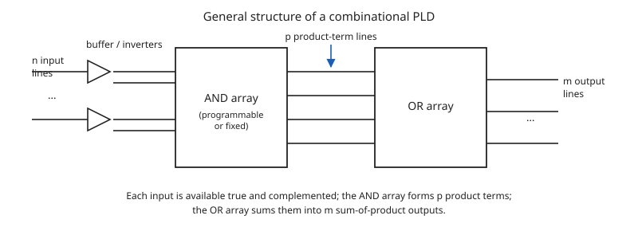

---

## 4.3 ROM, PAL and PLA — which array is programmable

This is the single most examinable point in the whole range. Slide 38 puts the three
configurations side by side; only the pattern of "fixed" and "programmable" changes.

$$\boxed{\;
\begin{array}{lll}
\textbf{PROM} & \text{AND array fixed (a decoder)} & \text{OR array programmable}\\
\textbf{PAL}  & \text{AND array programmable}      & \text{OR array fixed}\\
\textbf{PLA}  & \text{AND array programmable}      & \text{OR array programmable}
\end{array}\;}$$

·CH3 slide 38

Read the same table by the *connections* rather than the arrays, which is how the slide draws it:

| Device | Inputs → AND array | AND array | AND → OR array | OR array |
|---|---|---|---|---|
| (a) PROM | fixed connections | fixed (decoder) | **programmable** connections | **programmable** |
| (b) PAL | **programmable** connections | **programmable** | fixed connections | fixed |
| (c) PLA | **programmable** connections | **programmable** | **programmable** connections | **programmable** |

·CH3 slide 38

Two consequences worth carrying into the examples:

- A PROM's AND array is a full decoder, so it generates **every** minterm of the inputs whether it
  is wanted or not. Programming is purely a matter of choosing which minterms each output sums.
- A PAL's OR array is fixed, so **a product term cannot be shared between two OR gates**
  ·CH3 slide 50. A PLA's can.

[fig] **Fig. 4-3** — ROM, PAL and PLA configurations ·CH3 slide 38

```yaml
figure_data:
  type: comparison-block-diagram
  rows:
    - {device: PROM, in_to_and: fixed,        and_array: "fixed (decoder)", and_to_or: programmable, or_array: programmable}
    - {device: PAL,  in_to_and: programmable, and_array: programmable,      and_to_or: fixed,        or_array: fixed}
    - {device: PLA,  in_to_and: programmable, and_array: programmable,      and_to_or: programmable, or_array: programmable}
```

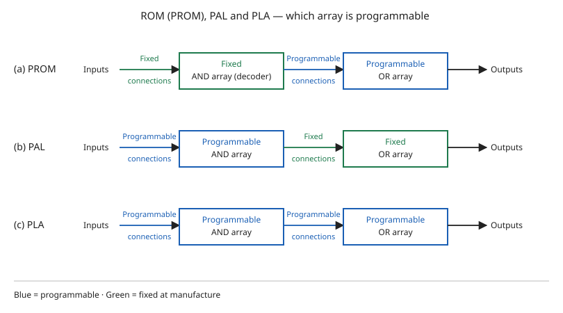

---

## 4.4 Programming a PLD: fuses and notation

### Symbols used in this sub-topic

| Symbol | Meaning | Units | Typical value |
|---|---|---|---|
| $a,\;b,\;c,\;d$ | Boolean input literals feeding one gate | — (logic 0/1) | — |
| cross ($\times$) | fusible link **intact** at that crosspoint | — | — |
| dot ($\bullet$) | **hard-wired** connection, not fusible | — | — |

### Fuses

In a programmable array the connection to each gate input can be modified — for example by giving
every gate input its own **fuse** ·CH3 slide 39.

- With every fuse intact, the four-input AND gate realises
  $$P = abcd$$
- To obtain the product term $bc$ instead, the $a$ and $d$ connections are removed by **blowing**
  the corresponding fuses ·CH3 slide 39.

So **programming is a hardware procedure**, not a software one ·CH3 slide 39.

An **erasable PLD** is one whose connections can be reset to their original condition and
reprogrammed — by exposure to ultraviolet light, or by electrical signals ·CH3 slide 39. A PLD
programmed by the user is called **field programmable** ·CH3 slide 39.

[fig] **Fig. 4-4** — programming by blowing fuses ·CH3 slide 39

```yaml
figure_data:
  type: fuse-programming
  gate: AND
  inputs: [a, b, c, d]
  before: {links_intact: [a, b, c, d], output: "abcd"}
  after:  {links_intact: [b, c],       links_blown: [a, d], output: "bc"}
```

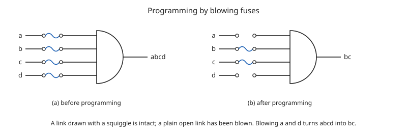

### PLD notation

Drawing every fuse is impossible for an array of any size, so PLD diagrams use a shorthand
·CH3 slide 40:

- **A cross at the intersection** denotes that a fusible link **is intact**.
- **Lack of a cross** indicates the fuse is blown, or that no connection exists.
- **A junction dot** indicates a **hard-wired** connection that is not fusible.

A programmable connection between two lines is logically a **switch** that can be set open or
closed, and the intersection between two lines is called a **cross-point** ·CH3 slide 42.

Reading the six panels the deck reproduces, with three input lines $a$, $b$, $c$:

| Panel | Gate | Crosspoints marked | Output |
|---|---|---|---|
| (a) | AND | $a$, $b$, $c$ all crossed | $abc$ |
| (b) | OR | $a$, $b$, $c$ all crossed | $a+b+c$ |
| (c) | AND | $a$ and $c$ crossed, $b$ blown | $ac$ |
| (d) | OR | $a$ and $b$ crossed, $c$ blown | $a+b$ |
| (g) | AND | $a$, $b$, $c$ hard-wired (dots) | $abc$ |
| (h) | OR | $a$, $b$, $c$ hard-wired (dots) | $a+b+c$ |

·CH3 slide 40 — ⚠ VERIFY (C04-5): the slide's panels jump from (d) to (g); parts (e) and (f) of the
source figure are not shown. Nothing is lost, but do not go looking for them.

[fig] **Fig. 4-5** — PLD notation for crosspoints ·CH3 slide 40

```yaml
figure_data:
  type: notation-key
  lines: [a, b, c]
  panels:
    - {id: a, gate: AND, marks: [cross, cross, cross], output: "abc"}
    - {id: b, gate: OR,  marks: [cross, cross, cross], output: "a+b+c"}
    - {id: c, gate: AND, marks: [cross, none,  cross], output: "ac"}
    - {id: d, gate: OR,  marks: [cross, cross, none],  output: "a+b"}
    - {id: g, gate: AND, marks: [dot, dot, dot],       output: "abc"}
    - {id: h, gate: OR,  marks: [dot, dot, dot],       output: "a+b+c"}
  key: {cross: "link intact", none: "blown / no connection", dot: "hard-wired, not fusible"}
```

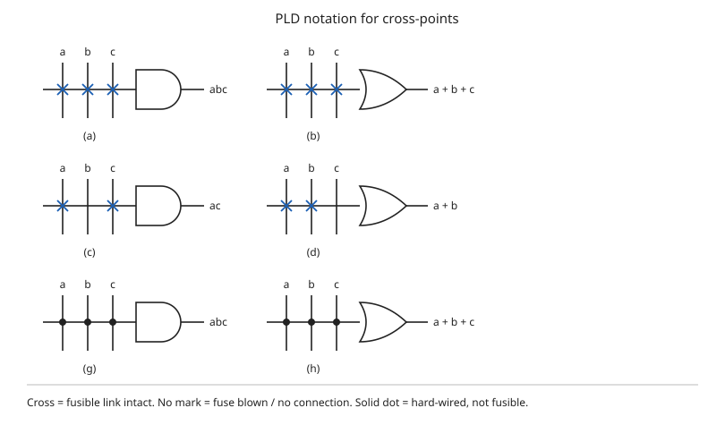

---

## 4.5 Programmable read-only memory (PROM)

### Symbols used in this sub-topic

| Symbol | Meaning | Units | Typical value |
|---|---|---|---|
| $I_4 \ldots I_0$ | PROM address inputs (5 of them here) | — (logic 0/1) | — |
| $A_7 \ldots A_0$ | PROM data outputs (8 of them here) | — (logic 0/1) | — |
| $2^n$ | number of words a decoder of $n$ inputs selects | — (count) | $2^5=32$ |

**Watch the letters here.** In this sub-topic $A_7\ldots A_0$ are *data output bits*, whereas from
§4.6 onward $A$, $B$, $C$, $D$ are *Boolean input variables*. The deck reuses the letter without
comment.

The PROM is the first of the three configurations ·CH3 slide 41:

- fixed connections from the inputs into a **fixed AND array**, which is a **decoder**;
- **programmable connections** from the decoder outputs into a **programmable OR array**.

[eq: prom-decoder-size] A decoder driven by $n$ address inputs selects one of

$$\boxed{\;2^{n}\ \text{words}\;}$$

so the example uses a $5\times 32$ decoder for its five inputs ·CH3 slide 43.

### [ex] Example — a 32 × 8 PROM ·CH3 slides 42–43

The deck gives a partial truth table for a PROM with five inputs and eight outputs, then shows the
matching fuse map. Both are reproduced below; the programming convention on slide 43 is

$$0 \rightarrow \text{no connection}, \qquad 1 \rightarrow \text{connection}$$

**ROM truth table (partial)** ·CH3 slide 42

| $I_4$ | $I_3$ | $I_2$ | $I_1$ | $I_0$ | $A_7$ | $A_6$ | $A_5$ | $A_4$ | $A_3$ | $A_2$ | $A_1$ | $A_0$ |
|---|---|---|---|---|---|---|---|---|---|---|---|---|
| 0 | 0 | 0 | 0 | 0 | 1 | 0 | 1 | 1 | 0 | 1 | 1 | 0 |
| 0 | 0 | 0 | 0 | 1 | 0 | 0 | 0 | 1 | 1 | 1 | 0 | 1 |
| 0 | 0 | 0 | 1 | 0 | 1 | 1 | 0 | 0 | 0 | 1 | 0 | 1 |
| 0 | 0 | 0 | 1 | 1 | 1 | 0 | 1 | 1 | 0 | 0 | 1 | 0 |
| ⋮ | ⋮ | ⋮ | ⋮ | ⋮ | ⋮ | ⋮ | ⋮ | ⋮ | ⋮ | ⋮ | ⋮ | ⋮ |
| 1 | 1 | 1 | 0 | 0 | 0 | 0 | 0 | 0 | 1 | 0 | 0 | 1 |
| 1 | 1 | 1 | 0 | 1 | 1 | 1 | 1 | 0 | 0 | 0 | 1 | 0 |
| 1 | 1 | 1 | 1 | 0 | 0 | 1 | 0 | 0 | 1 | 0 | 1 | 0 |
| 1 | 1 | 1 | 1 | 1 | 0 | 0 | 1 | 1 | 0 | 0 | 1 | 1 |

The slide then states that **address 3 = 10110010** is held in permanent storage using fuse links
·CH3 slide 43.

**Check that claim.** Address 3 is the input word $I_4I_3I_2I_1I_0 = 00011$, whose row of the table
reads

$$A_7A_6A_5A_4A_3A_2A_1A_0 \;=\; 1\,0\,1\,1\,0\,0\,1\,0$$

which is $10110010$ — the slide is right. Every one of the eight printed rows was checked
crosspoint by crosspoint against the fuse map on the same slide and all eight agree.

**What the fuse map shows.** Each decoder output line 0…31 runs horizontally across eight vertical
output columns. A cross at a crossing means the link is intact, so that word contributes a 1 to that
output bit; no cross means the link is blown and the bit reads 0. Because the decoder asserts
exactly one horizontal line at a time, each OR gate simply passes the stored bit of the selected
word.

[fig] **Fig. 4-6** — PROM fuse map, 32 words × 8 bits ·CH3 slide 43

```yaml
figure_data:
  type: fuse-map
  device: PROM
  decoder: {inputs: 5, outputs: 32, fixed: true}
  or_plane: {columns: 8, names: [A7, A6, A5, A4, A3, A2, A1, A0], programmable: true}
  convention: {cross: "link intact = stored 1", blank: "link blown = stored 0"}
  rows_shown:
    0:  "10110110"
    1:  "00011101"
    2:  "11000101"
    3:  "10110010"
    28: "00001001"
    29: "11100010"
    30: "01001010"
    31: "00110011"
```

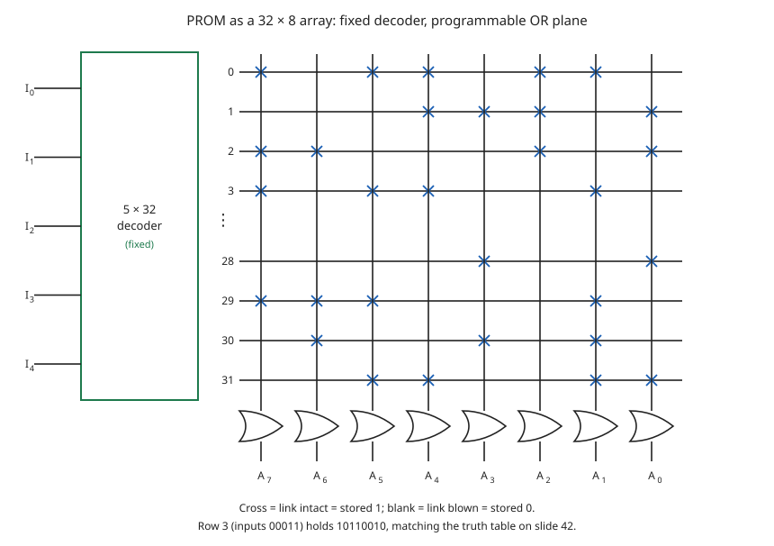

---

## 4.6 Programmable logic array (PLA)

### Symbols used in this sub-topic

| Symbol | Meaning | Units | Typical value |
|---|---|---|---|
| $n$ | number of PLA inputs | — (count) | 3 |
| $k$ | number of product terms (the deck's letter for $p$ on slide 37) | — (count) | 4 |
| $m$ | number of PLA outputs | — (count) | 2 |
| T | output taken **true** (its XOR input is tied to 0) | — | — |
| C | output taken **complemented** (its XOR input is tied to 1) | — | — |
| $\oplus$ | exclusive-OR | — | — |

**Two letter clashes to keep straight.** The deck writes the product-term count as $p$ on slide 37
and as $k$ on slide 45 — same quantity. And the column header **C** in a PLA programming table means
*complement*, not the input variable $C$; both appear on slide 45.

In a PLA, the **decoder of the PROM is replaced by an array of AND gates that can be programmed to
generate any product term of the input variables**, and those product terms are then connected to
OR gates to give the sum of products for the required Boolean functions ·CH3 slide 44. Both
connection sets are programmable ·CH3 slide 44.

### Output polarity

Each OR output passes through an XOR gate whose second input is itself a programmable connection
·CH3 slide 44:

[eq: xor-polarity-control]
$$x \oplus 1 = \bar{x} \qquad\text{(output inverted)}$$
$$x \oplus 0 = x \qquad\;\;\text{(output unchanged)}$$

So a function can be implemented in whichever of its two forms — true or complement — needs fewer
product terms, and the XOR fuse restores the wanted polarity at the pin.

### Reading a PLA programming table

The table has three blocks ·CH3 slide 45:

| Block | Meaning |
|---|---|
| Product term, and its number | which AND gate |
| Inputs $A\;B\;C$ | 1 = the true literal is connected; 0 = the complement is connected; – = not connected |
| Outputs $F_1\;F_2$ | 1 = this product joins that OR gate; – = it does not |

Two conventions come with it ·CH3 slide 45:

- an open terminal at the input of an **AND** gate behaves like a **1**;
- an open terminal at the input of an **OR** gate behaves like a **0**.

That is exactly why an unused product line does not disturb a sum.

### [ex] Example — the PLA circuit on slide 45

Functions implemented:

$$F_1 = AB' + AC + A'BC'$$
$$F_2 = (AC + BC)'$$

Programming table as printed ·CH3 slide 45:

| Product term | # | $A$ | $B$ | $C$ | $F_1$ (T) | $F_2$ (C) |
|---|---|---|---|---|---|---|
| $AB'$ | 1 | 1 | 0 | – | 1 | – |
| $AC$ | 2 | 1 | – | 1 | 1 | 1 |
| $BC$ | 3 | – | 1 | 1 | – | 1 |
| $A'BC'$ | 4 | 0 | 1 | 0 | 1 | – |

**Recomputed.** Enumerating all eight input combinations from the table alone:

- the sum built for $F_1$ from rows 1, 2 and 4 gives minterms $\{2,4,5,7\}$, and $F_1$ is marked T,
  so $F_1 = \sum(2,4,5,7)$;
- the sum built for $F_2$ from rows 2 and 3 gives $\{3,5,7\}$, and $F_2$ is marked C, so
  $F_2 = \overline{\sum(3,5,7)} = \sum(0,1,2,4,6)$.

Evaluating the two printed algebraic expressions directly gives the same two minterm sets, so the
table, the expressions and the fuse map on slide 45 agree.

[eq: pla-fuse-count] [added] The device size follows from $n$, $k$ and $m$:

$$\text{AND-array crosspoints} = 2nk, \qquad
\text{OR-array crosspoints} = km, \qquad
\text{polarity crosspoints} = 2m$$

The last of these is two per output — one to the 0 line and one to the 1 line — of which exactly one
is left intact. For slide 45's PLA, $n=3$, $k=4$, $m=2$, giving $24$, $8$ and $4$, which is exactly
what the drawn figure contains.

[fig] **Fig. 4-7** — example PLA circuit: three inputs, four products, two outputs ·CH3 slide 45

```yaml
figure_data:
  type: pla-circuit
  inputs: [A, B, C]
  columns: [C, C', B, B', A, A']     # left to right, as the deck draws them
  products:
    1: {term: "AB'", literals: [B', A]}
    2: {term: "AC",  literals: [C, A]}
    3: {term: "BC",  literals: [C, B]}
    4: {term: "A'BC'", literals: [C', B, A']}
  or_plane:
    F1: [1, 2, 4]
    F2: [2, 3]
  polarity: {F1: 0, F2: 1}           # XOR second input
  outputs:
    F1: "AB' + AC + A'BC'"
    F2: "(AC + BC)'"
  minterms: {F1: [2,4,5,7], F2: [0,1,2,4,6]}
```

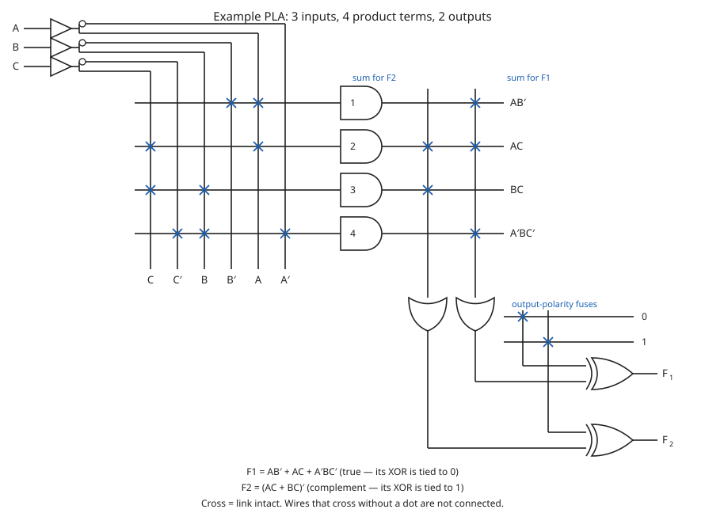

---

## 4.7 [ex] Worked example 1 — implementing two functions with a PLA

**Problem** ·CH3 slide 46. Implement the following two Boolean functions with a PLA:

$$F_1(A,B,C) = \textstyle\sum(0,1,2,4)$$
$$F_2(A,B,C) = \textstyle\sum(0,5,6,7)$$

**Step 1 — simplify both functions, and both complements.** The deck maps each function twice,
grouping the 1-cells and then the 0-cells ·CH3 slide 46:

$$F_1 = A'B' + A'C' + B'C' \qquad\text{(from the 1s)}$$
$$F_1 = (AB + AC + BC)' \qquad\text{(from the 0s)}$$

$$F_2 = AB + AC + A'B'C' \qquad\text{(from the 1s)}$$
$$F_2 = (A'C + A'B + AB'C')' \qquad\text{(from the 0s)}$$

**Step 2 — choose the pair of forms that share the most products** ·CH3 slide 47. Taking $F_1$ in
its complemented form and $F_2$ in its true form:

$$F_1 = (AB + AC + BC)'$$
$$F_2 = AB + AC + A'B'C'$$

The two now share $AB$ and $AC$, so four distinct product terms cover both functions.

**Step 3 — write the programming table** ·CH3 slide 47:

| Product term | # | $A$ | $B$ | $C$ | $F_1$ (C) | $F_2$ (T) |
|---|---|---|---|---|---|---|
| $AB$ | 1 | 1 | 1 | – | 1 | 1 |
| $AC$ | 2 | 1 | – | 1 | 1 | 1 |
| $BC$ | 3 | – | 1 | 1 | 1 | – |
| $A'B'C'$ | 4 | 0 | 0 | 0 | – | 1 |

Note the output headers: $F_1$ is **C** (complemented at the XOR, so its fuse ties to 1) and $F_2$
is **T** (true, fuse ties to 0).

**Verification.** Rebuilding both outputs from the table alone, minterm by minterm:

$$F_1: \quad \overline{AB + AC + BC} = \overline{\textstyle\sum(3,5,6,7)} = \textstyle\sum(0,1,2,4) \;\checkmark$$
$$F_2: \quad AB + AC + A'B'C' = \textstyle\sum(0,5,6,7) \;\checkmark$$

Both match the stated problem. The four intermediate expressions on slide 46 were also checked
independently and each reproduces its own minterm list.

[fig] **Fig. 4-8** — the deck draws the implementation on slide 47: three buffer/inverters feeding
six column lines $C,\,C',\,B,\,B',\,A,\,A'$, four AND gates numbered 1–4 producing $AB$, $AC$,
$BC$ and $A'B'C'$, two OR gates, and two XOR gates with a two-row polarity block marked 0 and 1.
Its structure is identical to Fig. 4-9 below; only the crosspoints in the OR plane and the two
polarity fuses differ ·CH3 slide 47.

---

## 4.8 [ex] Worked example 2 — four products, two outputs, maximum sharing

**Problem** ·CH3 slide 48. Implement $F_1(A,B,C)$ and $F_2(A,B,C)$ on a PLA with **3 inputs, 4
products and 2 outputs**, with programmable inversion. The slide poses it as five sub-questions:

1. give the K-map specifications;
2. how can this be implemented with only four products?
3. complete the programming table;
4. choose the implementations ($F$ or $\bar{F}$) that use the largest number of **shared** products;
5. how many products are needed if $F_1$ and $F_2$ are implemented directly?

**The two maps** ·CH3 slide 48. Reading the printed K-maps cell by cell:

| $A$ \ $BC$ | 00 | 01 | 11 | 10 |
|---|---|---|---|---|
| **0** | 0 | 1 | 0 | 1 |
| **1** | 1 | 0 | 0 | 0 |

$$F_1 = \textstyle\sum(1,2,4)$$

| $A$ \ $BC$ | 00 | 01 | 11 | 10 |
|---|---|---|---|---|
| **0** | 0 | 0 | 1 | 0 |
| **1** | 0 | 1 | 1 | 1 |

$$F_2 = \textstyle\sum(3,5,6,7)$$

**The four expressions the slide derives** ·CH3 slide 48:

$$F_1 = A'B'C + A'BC' + AB'C'$$
$$\bar{F_1} = AB + AC + BC + A'B'C'$$
$$F_2 = AB + AC + BC$$
$$\bar{F_2} = A'C' + A'B' + B'C'$$

All four were rederived from the maps and all four are correct: $F_1$'s sum-of-1s gives
$\{1,2,4\}$; $\bar{F_1}$ gives $\{0,3,5,6,7\}$, whose complement is $\{1,2,4\}$; $F_2$ gives
$\{3,5,6,7\}$; $\bar{F_2}$ gives $\{0,1,2,4\}$, whose complement is $\{3,5,6,7\}$.

**Answer to (2) and (4).** Implementing $F_1$ in **complemented** form and $F_2$ in **true** form
makes $AB$, $AC$ and $BC$ common to both, so the whole design needs only the four products
$AB$, $AC$, $BC$ and $A'B'C'$ ·CH3 slides 48–49.

**Programming table** ·CH3 slide 48:

| Product term | # | $A$ | $B$ | $C$ | $F_1$ (C) | $F_2$ (T) |
|---|---|---|---|---|---|---|
| $AB$ | 1 | 1 | 1 | – | 1 | 1 |
| $AC$ | 2 | 1 | – | 1 | 1 | 1 |
| $BC$ | 3 | – | 1 | 1 | 1 | 1 |
| $A'B'C'$ | 4 | 0 | 0 | 0 | 1 | – |

**Verification.** Rebuilt from the table alone:

$$F_1: \quad \overline{AB + AC + BC + A'B'C'} = \overline{\textstyle\sum(0,3,5,6,7)} = \textstyle\sum(1,2,4)\;\checkmark$$
$$F_2: \quad AB + AC + BC = \textstyle\sum(3,5,6,7)\;\checkmark$$

**The circuit** ·CH3 slide 49. The deck's own annotations on that slide are worth keeping:

- the shared block of crosspoints in the OR plane is labelled "Good sharing of products";
- "we actually need $F_1$ as an output, not $\bar{F_1}$ — so invert $\bar{F_1}$ with the XOR", i.e.
  $F_1$'s polarity fuse ties to **1** and $F_2$'s ties to **0**;
- "we implement $\bar{F_1}$ using the PLA then invert it, as this is more economical".

⚠ VERIFY (C04-1): the legend on slide 49 prints "$\times$ Fuse intact / **1** Fuse blown". The same
legend on slide 45 prints "$\times$ Fuse intact / $+$ Fuse blown", and elsewhere in the deck a 1
means a *connection* (slide 43). Read the second legend symbol as $+$, not as the digit 1.

⚠ VERIFY (C04-3): slide 49 also prints "We **inclement** F1 Using the PLA then invert it" — read
*implement*.

**Answer to (5).** Implementing $F_1$ and $F_2$ directly in their true forms would need
$A'B'C + A'BC' + AB'C'$ (three products) plus $AB + AC + BC$ (three more), with nothing in common —
**six product terms** instead of four. [added] — the deck poses the question but leaves the count to
the student.

[fig] **Fig. 4-9** — PLA sharing four product terms between two outputs ·CH3 slide 49

```yaml
figure_data:
  type: pla-circuit
  inputs: [A, B, C]
  columns: [C, C', B, B', A, A']
  products:
    1: {term: "AB",     literals: [B, A]}
    2: {term: "AC",     literals: [C, A]}
    3: {term: "BC",     literals: [C, B]}
    4: {term: "A'B'C'", literals: [C', B', A']}
  or_plane:
    F1bar: [1, 2, 3, 4]
    F2:    [1, 2, 3]
  polarity: {F1: 1, F2: 0}
  outputs:
    F1: "(AB + AC + BC + A'B'C')'"
    F2: "AB + AC + BC"
  minterms: {F1: [1,2,4], F2: [3,5,6,7]}
```

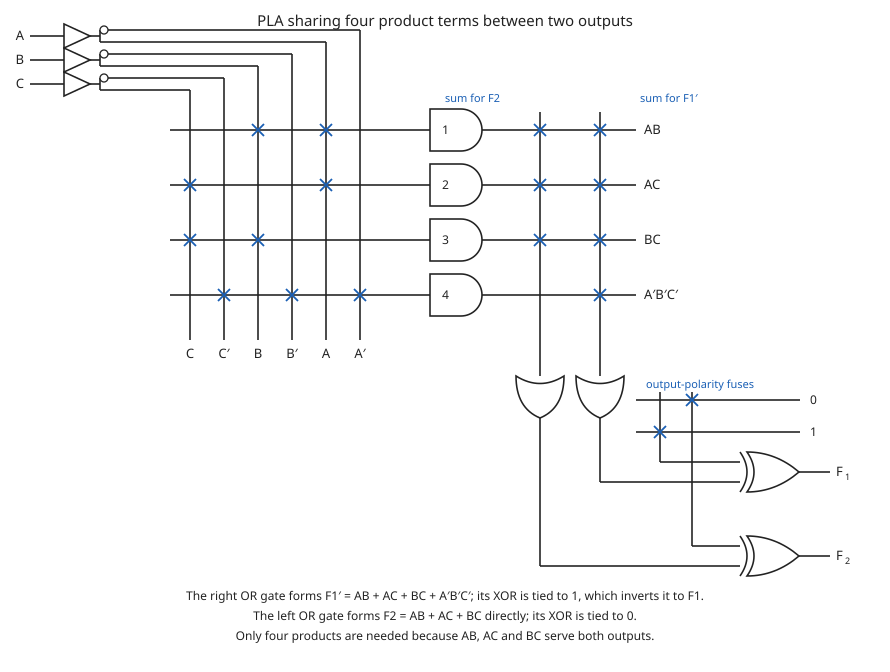

---

## 4.9 Programmable array logic (PAL)

### Symbols used in this sub-topic

| Symbol | Meaning | Units | Typical value |
|---|---|---|---|
| $w,\;x,\;y,\;z$ | the four PAL output functions of this example | — (logic 0/1) | — |
| $w'$ | complement of the fed-back output $w$ | — (logic 0/1) | — |
| $X$ | output of the small three-gate PAL on slide 50 | — (logic 0/1) | — |

**Letter clash.** $w$ and $x$ are *output functions* here, but $x$ was the dummy variable in the XOR
identity of §4.6 and $w$ also appears as a **column literal** in the fuse map, because the PAL feeds
$w$ back into its own AND array.

In a PAL the AND array is programmable and the OR array is fixed ·CH3 slide 50. Three consequences,
all stated on the slide:

- **The Boolean functions must be simplified to fit into each section** — each OR gate has a fixed
  number of product-term inputs.
- **A product term cannot be shared among two or more OR gates**, unlike a PLA. Each function is
  therefore simplified by itself, without regard to common product terms.
- The output terminals are sometimes driven by **three-state buffers or inverters**.

[fig] **Fig. 4-10** — slide 50 also shows a miniature PAL: four column lines $A$, $\bar{A}$, $B$,
$\bar{B}$ feed three two-input AND gates through hard connections, and the three AND outputs are
hard-wired into one OR gate, giving
$$X = AB + A\bar{B} + \bar{A}\bar{B}$$
The connections drawn are $AB$ on gate 1, $A\bar{B}$ on gate 2 and $\bar{A}\bar{B}$ on gate 3, so
the printed expression is correct ·CH3 slide 50. Not redrawn — the fuse map of Fig. 4-11 shows the
same idea at full size.

### [ex] Worked example — a four-input, four-output PAL

**Problem** ·CH3 slide 51. Implement, on a PAL with four inputs, four outputs and a **three-wide
AND–OR structure** (three product terms per OR gate):

$$w(A,B,C,D) = \textstyle\sum(2,12,13)$$
$$x(A,B,C,D) = \textstyle\sum(7,8,9,10,11,12,13,14,15)$$
$$y(A,B,C,D) = \textstyle\sum(0,2,3,4,5,6,7,8,10,11,15)$$
$$z(A,B,C,D) = \textstyle\sum(1,2,8,12,13)$$

**Simplified** ·CH3 slide 51:

$$w = ABC' + A'B'CD'$$
$$x = A + BCD$$
$$y = A'B + CD + B'D'$$
$$z = ABC' + A'B'CD' + AC'D' + A'B'C'D$$
$$\phantom{z} = w + AC'D' + A'B'C'D$$

**Verification.** Each simplified expression was expanded back to its minterm list:

| Function | Expansion of the simplified form | Target |
|---|---|---|
| $w$ | $\{2,12,13\}$ | $\sum(2,12,13)$ ✓ |
| $x$ | $\{7,8,9,10,11,12,13,14,15\}$ | ✓ |
| $y$ | $\{0,2,3,4,5,6,7,8,10,11,15\}$ | ✓ |
| $z$ | $\{1,2,8,12,13\}$ | ✓ |
| $z$ as $w + AC'D' + A'B'C'D$ | $\{1,2,8,12,13\}$ | ✓ |

**The trick the example is built around** ·CH3 slide 52. As written, $z$ has **four** product terms,
one more than the three-wide OR gate can take. But $ABC' + A'B'CD'$ is exactly $w$, which the PAL
has already formed and can feed back into its own AND array as a single literal. Substituting it
reduces $z$ **from four product terms to three**, and the design fits.

**PAL programming table** ·CH3 slide 52. A 1 connects the true literal, a 0 connects the complement,
a dash means no connection:

| Product term | $A$ | $B$ | $C$ | $D$ | $w$ | Output |
|---|---|---|---|---|---|---|
| 1 | 1 | 1 | 0 | – | – | $w = ABC' + A'B'CD'$ |
| 2 | 0 | 0 | 1 | 0 | – | |
| 3 | – | – | – | – | – | |
| 4 | 1 | – | – | – | – | $x = A + BCD$ |
| 5 | – | 1 | 1 | 1 | – | |
| 6 | – | – | – | – | – | |
| 7 | 0 | 1 | – | – | – | $y = A'B + CD + B'D'$ |
| 8 | – | – | 1 | 1 | – | |
| 9 | – | 0 | – | 0 | – | |
| 10 | – | – | – | – | 1 | $z = w + AC'D' + A'B'C'D$ |
| 11 | 1 | – | 0 | 0 | – | |
| 12 | 0 | 0 | 0 | 1 | – | |

Every one of the twelve rows was checked against the crosspoints drawn in the fuse map on the same
slide, and all twelve agree.

**Rows 3 and 6 are the interesting ones.** They carry no connections at all, so every fuse on those
two product lines is left intact and the AND gate sees both polarities of every variable:

[eq: unused-product-term]
$$P \;=\; A\cdot A' \cdot B\cdot B' \cdot C\cdot C' \cdot D \cdot D' \cdot w \cdot w' \;=\; 0$$

An unused product term is therefore permanently 0 and contributes nothing to its OR gate — which is
why the fuse map annotates those two gates "all fuses intact (always = 0)" ·CH3 slide 52.

⚠ VERIFY (V04-1): the fuse map on slide 52 labels its ten columns **twice**, once above and once
below the array. The top row reads $A\;A'\;B\;B'\;C\;C'\;D\;D'\;w\;w'$, which is right; the bottom
row prints $A\;A'\;\mathbf{B'}\;B'\;C\;C'\;D\;D'\;w\;w'$ — the third column is labelled $B'$ when it
carries $B$. Product term 5 has a cross in that column and must read $BCD$, not $B'CD$. Use the top
label row.

[fig] **Fig. 4-11** — PAL fuse map for the four-output example ·CH3 slide 52

```yaml
figure_data:
  type: fuse-map
  device: PAL
  and_array: {programmable: true, columns: [A, A', B, B', C, C', D, D', w, w']}
  or_array: {fixed: true, width: 3}     # three product terms hard-wired per OR gate
  products:
    1:  {literals: [A, B, C'],        output: w}
    2:  {literals: [A', B', C, D'],   output: w}
    3:  {literals: [],                output: w,  note: "unused, all fuses intact, always 0"}
    4:  {literals: [A],               output: x}
    5:  {literals: [B, C, D],         output: x}
    6:  {literals: [],                output: x,  note: "unused, all fuses intact, always 0"}
    7:  {literals: [A', B],           output: y}
    8:  {literals: [C, D],            output: y}
    9:  {literals: [B', D'],          output: y}
    10: {literals: [w],               output: z}
    11: {literals: [A, C', D'],       output: z}
    12: {literals: [A', B', C', D],   output: z}
  feedback: {signal: w, into_columns: [w, w']}
  outputs:
    w: "ABC' + A'B'CD'"
    x: "A + BCD"
    y: "A'B + CD + B'D'"
    z: "w + AC'D' + A'B'C'D"
```

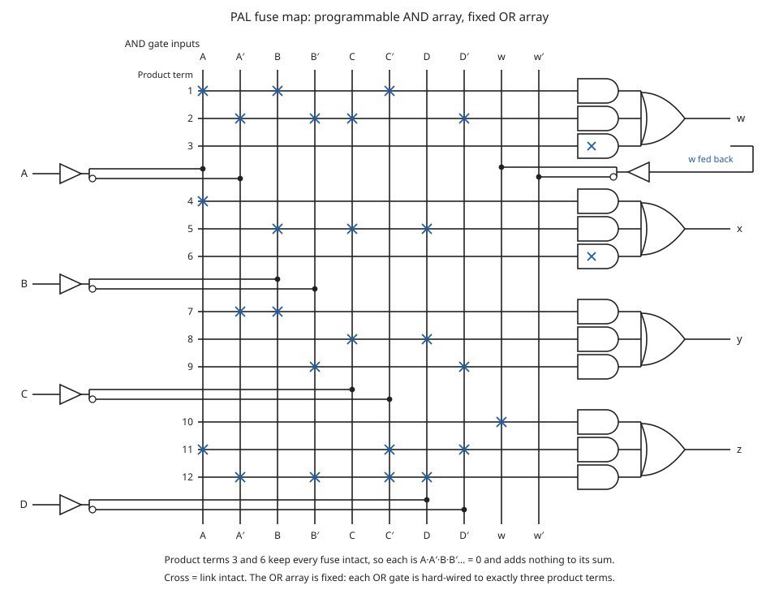

---

## 4.10 Sequential programmable devices

### Symbols used in this sub-topic

| Symbol | Meaning | Units | Typical value |
|---|---|---|---|
| CLK | common clock input to every flip-flop in the device | — (logic 0/1) | — |
| OE | output-enable input controlling the three-state buffers | — (logic 0/1) | — |
| $D$ | data input of the macrocell flip-flop | — (logic 0/1) | — |
| $Q$ | flip-flop output, also fed back into the array | — (logic 0/1) | — |

Sequential programmable devices include **both gates and flip-flops** ·CH3 slide 53. There are
several types; the deck looks at **three major types** without going into their detailed
construction ·CH3 slide 53:

1. Sequential (or simple) programmable logic device — **SPLD**
2. Complex programmable logic device — **CPLD**
3. Field-programmable gate array — **FPGA**

·CH3 slide 54

[fig] **Fig. 4-12** — slide 54 draws the shape all three share: inputs enter an **AND–OR array
(PAL or PLA)**; some array outputs go straight to the device outputs, the rest clock a bank of
**flip-flops** whose outputs are both device outputs and **fed back** into the array inputs
·CH3 slide 54. Not redrawn: the same feedback loop appears at full detail in Fig. 4-13.

### FPLS — field-programmable logic sequencer

- The **first** programmable device developed to support sequential circuit implementation
  ·CH3 slide 55.
- A typical FPLS is organised around a **PLA with several outputs driving flip-flops**
  ·CH3 slide 55.
- Its flip-flops are flexible: each can be programmed to operate as either a **JK** or a **D** type
  ·CH3 slide 55.
- It **did not succeed commercially**, because it has too many programmable connections
  ·CH3 slide 55.

### SPLD and the macrocell

- Each section of an SPLD is called a **macrocell** ·CH3 slide 56.
- [def] A **macrocell** is a circuit containing a **sum-of-products combinational logic function**
  and an **optional flip-flop** ·CH3 slide 56.
- The deck assumes an AND–OR sum of products, but in practice any two-level implementation can be
  used ·CH3 slide 56.
- The AND–OR array inside a macrocell **is the same as in the combinational PAL** ·CH3 slide 57.

Reading the macrocell drawing on slide 57 from left to right: the AND array forms five product
terms; one OR gate sums them; its output drives the $D$ input of a flip-flop clocked by the common
CLK line; the flip-flop output leaves through a **three-state buffer** enabled by OE; and the output
is **fed back into the array** through an inverting buffer, so it is available as both a true and a
complemented column.

[fig] **Fig. 4-13** — SPLD macrocell ·CH3 slide 57

```yaml
figure_data:
  type: macrocell
  and_array: {product_terms: 5, programmable: true}
  or_gate: {inputs: 5}
  flip_flop: {type: D, clock: CLK, shared: "common CLK for the whole device"}
  output_buffer: {type: three-state, enable: OE}
  feedback: {from: "flip-flop output", into: "array columns, true and complement"}
```

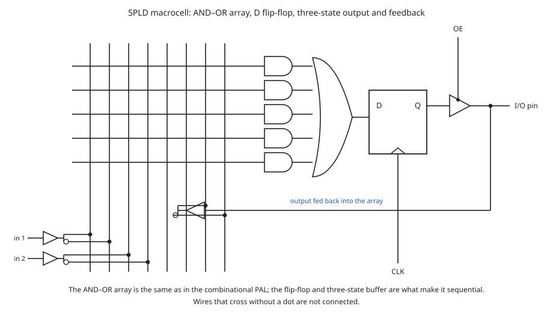

---

## 4.11 CPLD — complex programmable logic device

- A typical SPLD holds **8 to 10 macrocells** in one IC package. All the flip-flops are connected to
  the common **CLK** input and all the three-state buffers are controlled by the output-enable
  input ·CH3 slide 58.
- Designing a digital system with PLDs often needs **several devices connected together** to cover
  the whole specification. For that kind of application it is more economical to use a **CPLD**
  ·CH3 slide 58.
- [def] A **CPLD is a collection of individual PLDs on a single integrated circuit**
  ·CH3 slide 58.
- The blocks are joined by a **programmable switch matrix**, and each PLD block carries **8 to 16
  macrocells** ·CH3 slide 59.

⚠ VERIFY (C04-2): slide 58 writes that the three-state buffers are controlled by "the **EO**
input". The macrocell figure on slide 57 labels the same signal **OE** (output enable), which is the
standard name. Read OE.

[fig] **Fig. 4-14** — general configuration of a CPLD ·CH3 slide 59

```yaml
figure_data:
  type: block-diagram
  device: CPLD
  pld_blocks: 8                     # four above and four below in the deck's drawing
  macrocells_per_block: "8 to 16"
  interconnect: {name: "programmable switch matrix", bidirectional: true}
  io_blocks: 2                      # one at each end of the switch matrix
```

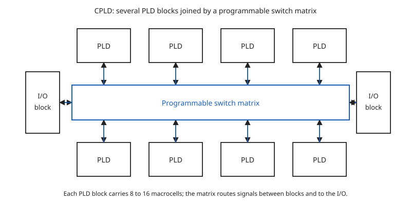

---

## 4.12 Gate arrays and FPGA

### Abbreviations used in this sub-topic

| Abbreviation | Meaning | Units | Typical value |
|---|---|---|---|
| FPGA | field-programmable gate array | — | — |
| CLB | configurable logic block, also called logic array block (LAB) | — (count per device) | not given in the deck |
| LUT | look-up table — a truth table stored in SRAM | — (bits) | not given in the deck |
| SRAM | static RAM holding the look-up-table contents | — | — |

### Gate array

- The basic component used in **VLSI design** is the **gate array** ·CH3 slide 60.
- A gate array consists of a pattern of gates fabricated in an area of silicon that is **repeated
  thousands of times** until the entire chip is covered with gates ·CH3 slide 60.
- Arrays of **one thousand to a hundred thousand gates** are fabricated within a single IC chip,
  depending on the technology used ·CH3 slide 60.

### FPGA

- [def] An **FPGA** is a VLSI circuit that can be **programmed in the user's location**
  ·CH3 slide 61.
- A typical FPGA **logic block** consists of **look-up tables, multiplexers, gates and flip-flops**
  ·CH3 slide 61.
- [def] A **look-up table** is a **truth table stored in an SRAM**; it provides the combinational
  circuit functions for the logic block ·CH3 slide 61.
- **CLB** is the configurable logic block, also known as the **logic array block (LAB)**
  ·CH3 slide 61.

Because the combinational function of a CLB is held as a truth table in SRAM, an FPGA is
reprogrammed by *loading memory* rather than by blowing anything — which is what makes it volatile
in the sense of slide 36.

[fig] **Fig. 4-15** — FPGA: CLBs, I/O blocks and programmable interconnections ·CH3 slide 61

```yaml
figure_data:
  type: block-diagram
  device: FPGA
  elements:
    - {name: CLB, role: "configurable logic block (logic array block, LAB)", contents: [look-up-tables, multiplexers, gates, flip-flops]}
    - {name: "I/O block", role: "interface between an external pin and the interconnect"}
    - {name: "programmable interconnections", role: "row and column routing channels between blocks"}
  arrangement: "CLBs in a two-dimensional array, routing channels between rows and columns, I/O blocks around the edge"
```

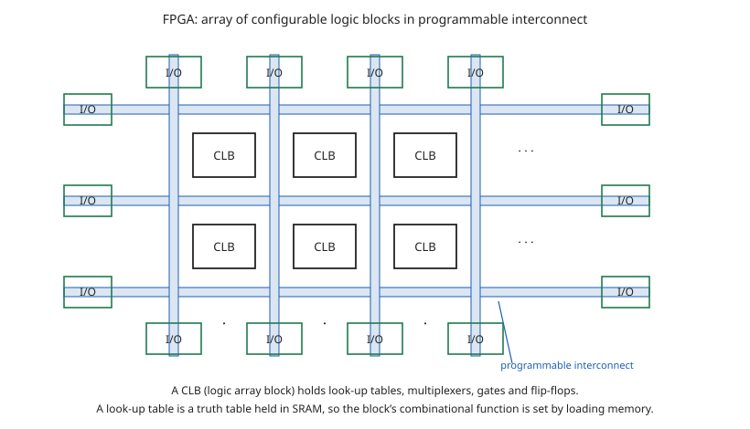

[fig] **Fig. 4-16** — basic CLBs within the global row/column programmable interconnects
·CH3 slides 62–63

```yaml
figure_data:
  type: block-diagram
  device: FPGA
  unit: CLB
  contents: {logic_modules: "several per CLB", local_interconnect: "joins the logic modules inside one CLB"}
  global: {row_interconnect: horizontal, column_interconnect: vertical}
  connections: bidirectional
```

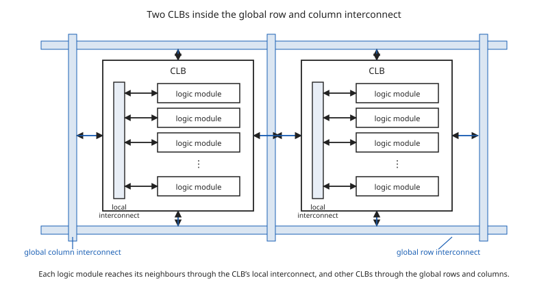

⚠ VERIFY (C04-6): slides 62 and 63 carry the **same** figure and the same sentence; slide 62 has no
title and slide 63 is titled "Cont…". There is no second figure to look for.

---

## 4.13 Homework set in the deck

The deck closes with three homework slides. They are transcribed here **in full and left unsolved**,
as set for the student.

### [exercise] Homework — reading ·CH3 slide 64

- Programmable ROMs — Section 11-4 pg. 653
  - PROMs
  - EPROMs
  - EEPROMs
  - UV EPROMs
- The Flash Memory — Section 11-5 pg. 656
- Memory Expansion — Section 11-6 pg. 661
- Magnetic and Optical Storage — Section 11-8 pg. 671

### [exercise] Homework — problems 1 to 3 ·CH3 slide 65

1. The following memory units are specified by the number of words times the number of bits per
   word. How many address lines and input-output lines are needed in each case?
   (a) $4\mathrm{K} \times 16$, (b) $2\mathrm{G} \times 8$, (c) $16\mathrm{M} \times 32$,
   (d) $256\mathrm{K} \times 64$.
2. Give the number of bytes stored in the memories listed in Problem 1.
3. Word number 723 in a memory of $1024 \times 16$ contains the binary equivalent of 3,451. List the
   10-bit address and the 16-bit memory content of the word.

### [exercise] Homework — problems 4 and 5 ·CH3 slide 66

4. Specify the size of a ROM (number of words and number of bits per word) that will accommodate the
   truth table for the following combinational circuit components:
   - a) a binary multiplier that multiplies two 4-bit,
   - b) a 4-bit adder-subtractor,
   - c) a quadruple 2-to-1-line multiplexers with common select and enable inputs, and
   - d) a BCD-to-seven-segment decoder with an enable input.
5. Tabulate the truth table for an $8 \times 4$ ROM that implements the Boolean functions
   - a) $A(x,y,z) = \sum(1,2,4,6)$
   - b) $B(x,y,z) = \sum(0,1,6,7)$
   - c) $C(x,y,z) = \sum(2,6)$
   - d) $D(x,y,z) = \sum(1,2,3,5,7)$

⚠ VERIFY (C04-4): problem 4(a) is printed as "a binary multiplier that multiplies two 4-bit," — the
noun is missing. It is transcribed above exactly as printed; read it as *two 4-bit numbers*.

**These five problems belong to the memory half of Chapter 3** (file 03) as much as to this one —
problems 1 to 3 and 5 are memory-sizing questions, and 5 asks for a ROM truth table. They are
recorded here because they are printed on slides in this range.

---

## Slide coverage

| Slides | Content | Where it appears here |
|---|---|---|
| 34 | Programmable Logic Device — definition, two arrays, advantages | §4.1 |
| 35 | Why programmable logic; concept of logic programming figure | §4.1, Fig. 4-1 |
| 36 | Hardware programming technologies | §4.1 |
| 37 | General structure of a PLD | §4.2, Fig. 4-2 |
| 38 | ROM, PAL and PLA configurations | §4.3, Fig. 4-3 (boxed) |
| 39 | Programming a PLD — blowing fuses; erasable PLD | §4.4, Fig. 4-4 |
| 40 | PLD notation — cross, no cross, junction dot | §4.4, Fig. 4-5 (C04-5) |
| 41 | PROM block diagram | §4.5 — same diagram as row (a) of slide 38 |
| 42 | Example: PROM — partial ROM truth table; cross-point defined | §4.5 |
| 43 | PROM fuse map; address 3 = 10110010 | §4.5, Fig. 4-6 |
| 44 | Programmable logic array — block diagram, XOR polarity | §4.6 |
| 45 | Example PLA circuit, programming table, fuse map | §4.6, Fig. 4-7 |
| 46 | Example: $F_1=\sum(0,1,2,4)$, $F_2=\sum(0,5,6,7)$ — K-maps | §4.7 |
| 47 | Solution — chosen forms, programming table, circuit | §4.7, Fig. 4-8 (caption only) |
| 48 | Example: 3 inputs, 4 products, 2 outputs; maps and table | §4.8 |
| 49 | Circuit for slide 48, with sharing and XOR inversion | §4.8, Fig. 4-9 (C04-1, C04-3) |
| 50 | Programmable array logic — rules; small PAL figure | §4.9, Fig. 4-10 (caption only) |
| 51 | PAL example: $w,x,y,z$; simplified functions; logic diagram | §4.9 |
| 52 | PAL table and fuse map; unused product terms | §4.9, Fig. 4-11 (V04-1) |
| 53 | Sequential programmable devices — introduction | §4.10 |
| 54 | The three major types; AND–OR array + flip-flops diagram | §4.10, Fig. 4-12 (caption only) |
| 55 | FPLS | §4.10 |
| 56 | SPLD and the macrocell — definition | §4.10 |
| 57 | Macrocell circuit | §4.10, Fig. 4-13 |
| 58 | CPLD — macrocell count, motivation, definition | §4.11 (C04-2) |
| 59 | CPLD general configuration | §4.11, Fig. 4-14 |
| 60 | Gate array | §4.12 |
| 61 | FPGA — definition, logic block, look-up table, CLB | §4.12, Fig. 4-15 |
| 62 | CLBs within the global interconnects | §4.12, Fig. 4-16 |
| 63 | Same figure and sentence as slide 62 | §4.12 (C04-6, duplicate) |
| 64 | Homework — reading list | §4.13 |
| 65 | Homework — problems 1 to 3 | §4.13 |
| 66 | Homework — problems 4 and 5 | §4.13 (C04-4) |

All 33 slides in the range 34–66 are accounted for. No slide in this range is blank or a title
slide.

**File size note.** This file is a little over 40 KB. It is deliberately kept whole: slides 34–66 are
one continuous argument, from "what is programmable" through the three array configurations to the
devices built out of them, and every worked example depends on the ROM/PAL/PLA distinction
established at slide 38. If it must ever be split, the natural cut is **after §4.9** — §§4.1–4.9 are
the combinational PLDs and carry all four worked examples and all the examinable detail, while
§§4.10–4.12 are descriptive coverage of sequential devices, CPLDs and FPGAs with no calculation in
them.
