# 05 — Analogue-to-Digital Conversion

Covers slides 1–29 of Chapter 4. Slides 30–49 of the same deck are digital-to-analogue conversion
and are carried in **06 — Digital-to-Analogue Conversion**; the DAC block that appears inside the
successive-approximation and sigma-delta converters below is treated properly there.

Handout code used throughout: `CH4`. The printed footer number equals the PDF page number, so
`·CH4 slide 16` is the slide with "Example" as its title.

Ten defects were raised against these slides — five substantive, five cosmetic. Each is flagged
inline at the point of use and collected in `flags/05.md`.

---

## 5.1 Signal types and what an ADC is

·CH4 slides 3–4

| Symbol | Meaning | Units | Typical |
|---|---|---|---|
| $x(t)$ | continuous-time (analogue) signal | V | — |
| $x[n]$ | discrete-time sample sequence | V | — |
| $t$ | time | s | — |
| $n$ | sample index in $x[n]$ | — | $0,1,2,\ldots$ |

[def] An **analogue signal** is continuous in time: it takes a value at every instant, and that
value stands for some other time-varying quantity — a speedometer needle as a function of speed, a
radio's volume as a function of knob position ·CH4 slide 3.

[def] A **digital signal** is discrete in time and has only two states, on and off ·CH4 slide 3.

- Computers can only process digitised signals ·CH4 slide 3.

[def] An **analogue-to-digital converter (ADC)** is an integrated circuit that converts a signal
from analogue (continuous) to digital (discrete) form ·CH4 slide 4.

- It is the link between the analogue world of transducers and the digital world of signal
  processing and data handling ·CH4 slide 4.

---

## 5.2 The conversion process: sampling, quantisation, coding

·CH4 slides 5–6

| Symbol | Meaning | Units | Typical |
|---|---|---|---|
| $T$ | sampling interval on the slide-5 axes | s | — |
| $L$ | number of quantisation levels | — | $2^n$ |
| $n$ | number of bits in the code word | — | 3, 4, 8, 12 |

[def] **Pulse code modulation (PCM)** is the process of converting the amplitude of each pulse into
a stream of 1s and 0s ·CH4 slide 5. It runs in three stages, in this order ·CH4 slide 5:

1. **Sampling** — conversion of a continuous-time signal into a discrete-time signal.
2. **Quantisation** — representing the sampled amplitudes by a finite set of levels; it converts a
   continuous-amplitude sample into a discrete-amplitude sample.
3. **Coding** — designating each quantised level by a binary code.

[fig] **Fig. 5-1** — the analogue-to-digital signal chain, assembled from ·CH4 slides 5, 9 and 10

```yaml
figure_data:
  type: block-diagram
  stages: [anti-aliasing low-pass filter, sample and hold, quantiser, encoder]
  stage_roles:
    anti-aliasing low-pass filter: "passes f below f_c, with f_c < f_s/2"
    sample and hold: "freezes each sample for the conversion time"
    quantiser: "rounds to the nearest of L = 2^n levels"
    encoder: "assigns each level its binary code"
  signal_state:
    input: continuous in time and amplitude
    after_sample_and_hold: discrete in time
    after_encoder: discrete in time and amplitude
```

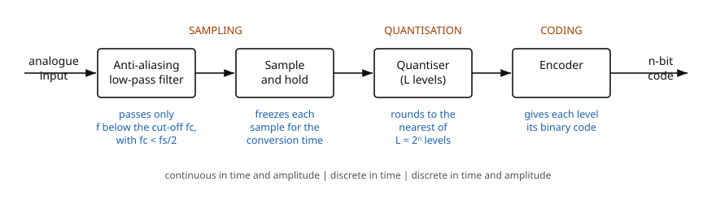

### The three questions the deck attaches to each stage

·CH4 slide 6

- **Sampling** — how are the discrete-time samples obtained? How can a continuous-time signal be
  reconstructed from a discrete set of samples? Under what conditions can it be recovered *exactly*?
- **Quantisation** — how many levels should be chosen? What values should they take? How should the
  original signal's values be mapped onto them?
- **Encoding** — how are bits allocated to each quantised level?

[ex] **Reading the PCM stream off slide 5.** The quantisation panel shows seven samples taking the
levels $4, 6, 5, 3, 1, 1, 2$ on a three-bit ($000$–$111$) axis ·CH4 slide 5. Encoding each in three
bits and concatenating:

$$4 \to 100,\quad 6 \to 110,\quad 5 \to 101,\quad 3 \to 011,\quad 1 \to 001,\quad 1 \to 001,\quad 2 \to 010$$

$$\text{stream} = 100\;110\;101\;011\;001\;001\;010$$

That is $7 \times 3 = 21$ bits, and it reproduces the coded waveform printed on the slide exactly —
the figure is self-consistent.

---

## 5.3 Sampling and the Nyquist criterion

·CH4 slides 7–8

| Symbol | Meaning | Units | Typical |
|---|---|---|---|
| $T_s$ | sampling interval (the slide also writes it $T$) | s | $25\ \mu\text{s}$ |
| $f_s$ | sampling rate, or sampling frequency | Hz (samples/s) | 40 kHz |
| $f_{\max}$ | highest frequency present in the signal | Hz | 20 kHz |
| $x(t)$, $x[n]$ | analogue signal, sampled sequence | V | — |

The analogue signal is sampled every $T_s$ seconds ·CH4 slide 7. The reciprocal of that interval is
the sampling rate:

[eq: sampling-rate]

$$\boxed{\;f_s = \frac{1}{T_s}\;}$$

- $f_s$ — sampling rate, in samples per second, which for this purpose is the same unit as Hz
- $T_s$ — sampling interval, in seconds

The sampling rate is defined as the number of samples acquired per unit time ·CH4 slide 7. The
higher the sampling rate, the better the digital signal approximates the analogue one ·CH4 slide 7.

Sampling itself is the process of converting a continuous-time signal $x(t)$ into a discrete-time
sequence $x[n]$, by taking the value of $x(t)$ once every sampling period ·CH4 slide 7:

$$x[n] = x(nT_s)$$

⚠ VERIFY (C05-4) — slide 7 uses **both** $T_S$ and $T$ for the sampling interval, within four lines
of each other. They are the same quantity. This file writes $T_s$ throughout.

### The sampling (Nyquist) theorem

To recover the analogue signal from its samples, the sampling rate must be at least twice the
maximum frequency present in the signal ·CH4 slide 8:

[eq: nyquist-rate]

$$\boxed{\;f_s \;\ge\; 2 f_{\max} \qquad\Longleftrightarrow\qquad T_s \;\le\; \frac{1}{2 f_{\max}}\;}$$

- $f_{\max}$ — the highest frequency component present in the analogue signal, in Hz
- $2f_{\max}$ — the **Nyquist rate**

⚠ VERIFY (C05-3) — the slide's prose says the rate must be "**greater than** twice the maximum
frequency", but the formula printed directly underneath is $f_s \ge 2f_{\max}$, and the bullet
between them says "at least twice". Strictly the recovery condition is $f_s > 2f_{\max}$: at exactly
$f_s = 2f_{\max}$ a component sitting on $f_{\max}$ can be sampled at its zero crossings every time
and vanish. Reproduce the printed $\ge$ in an exam, but know why the strict inequality is the safe
one.

[fig] **Fig. 5-2** — sampling a continuous-time signal ·CH4 slides 7–8

```yaml
figure_data:
  type: waveform
  traces:
    - {name: x(t), kind: continuous, role: analogue input}
    - {name: sampling pulses, kind: impulse-train, period: T_s}
    - {name: x[n], kind: samples, rule: "x[n] = x(nT_s)"}
  annotations:
    - "T_s marked between two adjacent pulses"
    - "f_s = 1/T_s ; Nyquist requires f_s >= 2 f_max"
```

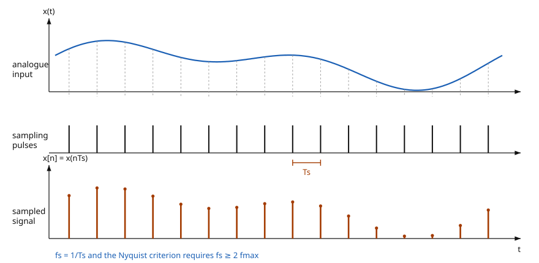

[added] **Quick check with numbers** — the deck sets no example here. For audio band-limited to
$f_{\max} = 20\ \text{kHz}$:

$$f_s \ge 2 \times 20\ \text{kHz} = 40\ \text{kHz}$$

$$T_s \le \frac{1}{40\times10^{3}\ \text{Hz}} = 25\ \mu\text{s}$$

---

## 5.4 Aliasing and the anti-aliasing filter

·CH4 slide 9

| Symbol | Meaning | Units | Typical |
|---|---|---|---|
| $f_c$ | cut-off frequency of the anti-aliasing filter | Hz | — |
| $f_{\text{sample}}$ | the slide's alternative name for $f_s$ | Hz | — |

[def] If the signal is sampled at less than the Nyquist rate, the recovery process returns
frequencies entirely different from those in the original signal. These masquerading components are
called **aliases** ·CH4 slide 9.

- Before sampling, the analogue input must be filtered by a low-pass **anti-aliasing filter**, which
  removes every frequency above a limit set by the sampling rate ·CH4 slide 9.
- The filter limits the input to only those frequencies that satisfy the sampling theorem
  ·CH4 slide 9.

[eq: anti-alias-cutoff]

$$\boxed{\;f_c < \tfrac{1}{2} f_{\text{sample}}\;}$$

- $f_c$ — the filter's cut-off frequency, in Hz
- $f_{\text{sample}}$ — the sampling rate, in Hz; the same quantity as $f_s$ above

[fig] **Fig. 5-3** — filtered baseband and the first sampling image ·CH4 slide 9

```yaml
figure_data:
  type: spectrum
  lobes:
    - {name: filtered analogue spectrum, extent: "0 to f_c", shape: low-pass}
    - {name: first sampling image, centre: f_s, shape: "mirrored about f_s"}
  condition: "f_c < f_s/2 keeps the lobes disjoint"
  failure_mode: "overlap of the lobes is aliasing"
```

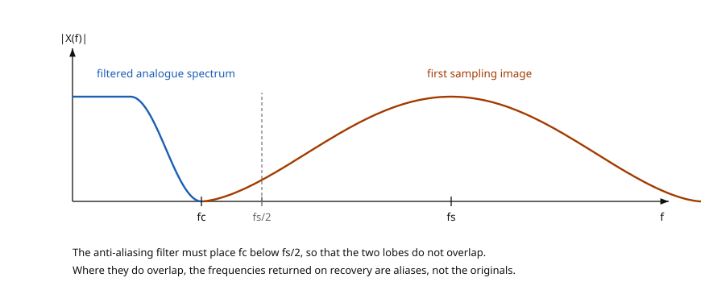

---

## 5.5 Sample-and-hold

·CH4 slide 10

| Symbol | Meaning | Units | Typical |
|---|---|---|---|
| $C_H$ | hold capacitor, which stores the sampled level | F | — |

(The only new symbol here; $T_s$, $x(t)$ and $f_s$ carry over from §5.3.)

After filtering and sampling, the sampled level must be **held constant until the next sample
occurs** ·CH4 slide 10.

- The operation produces a "stairstep" waveform that approximates the analogue input ·CH4 slide 10.
- That held level is what the quantiser actually measures, which is why every quantisation figure in
  this chapter is drawn as a staircase rather than a curve.

[fig] **Fig. 5-4** — sample-and-hold, and the stairstep it produces ·CH4 slide 10

```yaml
figure_data:
  type: waveform-plus-circuit
  panels:
    - {name: input, trace: filtered analogue input, markers: sample instants}
    - {name: output, trace: held stairstep, note: "one flat step per sampling interval"}
  circuit_inset:
    status: added
    elements: [series sample switch, hold capacitor C_H to ground, unity-gain buffer]
    operation: "switch closes to sample, opens to hold; C_H retains the level, buffer drives the quantiser"
```

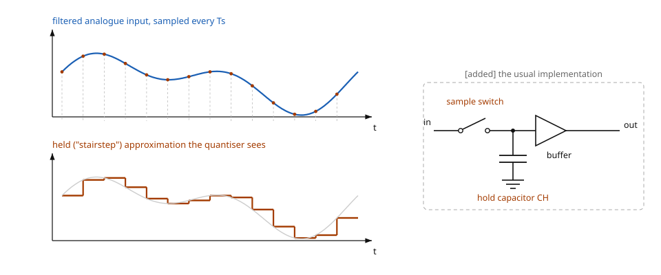

---

## 5.6 Quantisation and encoding

·CH4 slides 11–13

| Symbol | Meaning | Units | Typical |
|---|---|---|---|
| $L$ | number of quantisation levels (zones) | — | 4, 16 |
| $\Delta$ | quantisation step — the height of one zone | V | — |
| $n$ | bits per code word | — | 2, 4 |
| $\max$, $\min$ | upper and lower limits of the sampled amplitude range | V | — |
| $e_q$ | quantisation error | V | $\le \Delta/2$ |

[def] **Quantisation** makes the *range* of a signal discrete, so the quantised signal takes only a
discrete — usually finite — set of values ·CH4 slide 11.

- Unlike sampling, quantisation is generally **irreversible** and loses information ·CH4 slide 11.
- It therefore introduces distortion into the quantised signal that cannot afterwards be removed
  ·CH4 slide 11.

[def] **Encoding** is representing each of that discrete set of values as a code ·CH4 slide 11.

Sampling produces pulses whose amplitudes lie anywhere between two limits, a minimum and a maximum,
and there are infinitely many possible values between them. Those infinite values are mapped onto a
finite set by dividing the span into $L$ zones, each of height $\Delta$ ·CH4 slide 12:

[eq: quantisation-step]

$$\boxed{\;\Delta = \frac{\max - \min}{L}\;}$$

- $\Delta$ — quantisation step, in volts
- $\max - \min$ — the full amplitude span being converted, in volts
- $L$ — the number of zones, equal to the number of quantisation levels

[eq: quantisation-levels] [added] — the slides do not print this relation, but slide 12 is the
$n = 2$ case and slide 13 the $n = 4$ case of it:

$$\boxed{\;L = 2^{\,n}\;}$$

**The levels-versus-steps trap.** With $L = 2^n$ levels there are $2^n$ *zones* but only
$2^n - 1$ *gaps between the extreme code centres*. Two conventions therefore circulate:

$$\Delta = \frac{\max-\min}{2^{\,n}} \qquad\text{(zone height — the one slides 12 and 15 use)}$$

$$\Delta = \frac{\max-\min}{2^{\,n}-1} \qquad\text{(spacing of the code centres — the one implied by slide 23's transfer formula)}$$

Both appear in this chapter and both are defensible; what matters is not mixing them inside one
question. Every number printed in slides 12, 13, 15, 16 and 17 was recomputed on the first
convention and is internally consistent.

[eq: quantisation-error] [added]

$$\boxed{\;|e_q| \le \frac{\Delta}{2}\;}$$

- $e_q$ — the difference between the true sampled amplitude and the level assigned to it, in volts;
  this is the irreversible loss slide 11 describes

### 4-level quantisation

·CH4 slide 12

Two bits, so $L = 2^2 = 4$ levels and codes $00$ to $11$. The deck tabulates thirteen sample
intervals of one waveform.

[ex] **Slide 12's table, recomputed.** Each level is written in two bits:

| Sample interval | 1 | 2 | 3 | 4 | 5 | 6 | 7 | 8 | 9 | 10 | 11 | 12 | 13 |
|---|---|---|---|---|---|---|---|---|---|---|---|---|---|
| Quantisation level | 0 | 1 | 2 | 1 | 1 | 1 | 1 | 2 | 3 | 3 | 3 | 3 | 3 |
| Code | 00 | 01 | 10 | 01 | 01 | 01 | 01 | 10 | 11 | 11 | 11 | 11 | 11 |

All thirteen codes reproduce. The staircase drawn on the slide sits in the zone each code names, so
figure and table agree.

[fig] **Fig. 5-5** — sample-and-hold output quantised to four levels ·CH4 slide 12

```yaml
figure_data:
  type: quantisation-staircase
  bits: 2
  levels: 4
  intervals: 13
  level_sequence: [0, 1, 2, 1, 1, 1, 1, 2, 3, 3, 3, 3, 3]
  code_sequence: ["00","01","10","01","01","01","01","10","11","11","11","11","11"]
  boundaries: "L+1 dashed decision lines; the staircase holds mid-zone for one interval"
```

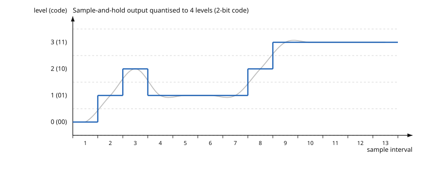

### 16-level quantisation

·CH4 slide 13

The same waveform, now with four bits: $L = 2^4 = 16$ levels, codes $0000$ to $1111$.

[ex] **Slide 13's table, recomputed.**

| Sample interval | 1 | 2 | 3 | 4 | 5 | 6 | 7 | 8 | 9 | 10 | 11 | 12 | 13 |
|---|---|---|---|---|---|---|---|---|---|---|---|---|---|
| Quantisation level | 0 | 5 | 8 | 7 | 5 | 4 | 6 | 10 | 14 | 15 | 15 | 15 | 14 |
| Code | 0000 | 0101 | 1000 | 0111 | 0101 | 0100 | 0110 | 1010 | 1110 | 1111 | 1111 | 1111 | 1110 |

All thirteen four-bit codes reproduce.

**Cross-check between the two slides** — going from 16 levels to 4 levels discards the two least
significant bits, so the slide-12 level should be the slide-13 level divided by four and truncated:

$$\left\lfloor \frac{0,5,8,7,5,4,6,10,14,15,15,15,14}{4} \right\rfloor = 0,1,2,1,1,1,1,2,3,3,3,3,3$$

which is slide 12's sequence, interval for interval. The two tables are mutually consistent — a
useful check, because it means either can be rebuilt from the other in an exam.

[fig] **Fig. 5-6** — the same waveform quantised to sixteen levels ·CH4 slide 13

```yaml
figure_data:
  type: quantisation-staircase
  bits: 4
  levels: 16
  intervals: 13
  level_sequence: [0, 5, 8, 7, 5, 4, 6, 10, 14, 15, 15, 15, 14]
  code_sequence: ["0000","0101","1000","0111","0101","0100","0110","1010","1110","1111","1111","1111","1110"]
  relation_to_fig_5_5: "level_16 // 4 == level_4, interval by interval"
```

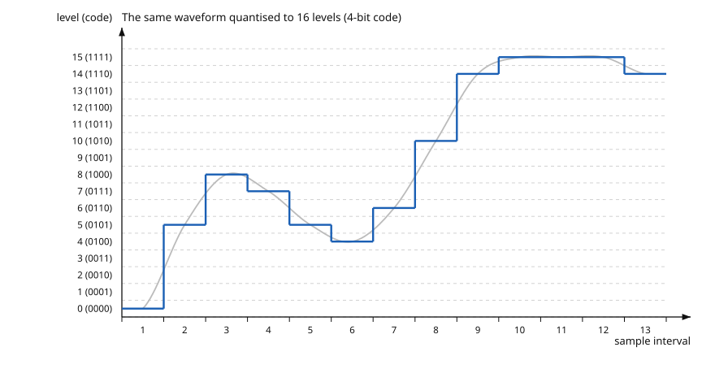

Four times as many levels, and the staircase follows the curve visibly more closely — the same
waveform, the same sampling instants, four times finer amplitude resolution.

---

## 5.7 The comparator — the building block every converter uses

·CH4 slide 14

| Symbol | Meaning | Units | Typical |
|---|---|---|---|
| $V_{\text{in}}$ | input voltage to the op-amp stage | V | — |
| $V_{\text{out}}$ | op-amp output voltage | V | — |
| $R_i$ | input resistor of the inverting amplifier | $\Omega$ | — |
| $R_f$ | feedback resistor of the inverting amplifier | $\Omega$ | — |

The deck opens its treatment of conversion methods with the op-amp ·CH4 slide 14.

- An op-amp is a linear amplifier with two inputs — inverting and non-inverting — and one output.
- Used with feedback through $R_f$ it is an inverting amplifier.
- Used **without** feedback it is a **comparator**: two inputs, and an output that swings hard one
  way or the other depending on which input is larger. Every converter in the rest of this file
  contains at least one.

[eq: inverting-gain]

$$\boxed{\;\frac{V_{\text{out}}}{V_{\text{in}}} = -\frac{R_f}{R_i}\;}$$

- the minus sign is the inversion; the closed-loop gain magnitude is set only by the resistor ratio
- the inverting input sits at a **virtual ground** (0 V) ·CH4 slide 14

[fig] **Fig. 5-7** *(caption only — third-party textbook figure, not reproduced)* — slide 14 carries
a three-part figure lifted from a textbook: **(a)** the op-amp symbol, with the inverting input
marked $-$ and the non-inverting input marked $+$; **(b)** the op-amp as an inverting amplifier,
with $R_i$ from $V_{\text{in}}$ to the inverting input, $R_f$ wrapped from output back to that same
node, the non-inverting input grounded, the inverting node annotated "virtual ground (0 V)" and the
input impedance drawn as a large resistance inside the triangle; **(c)** the op-amp as a comparator,
with $V_{\text{in1}}$ on the inverting input, $V_{\text{in2}}$ on the non-inverting input and no
feedback path at all ·CH4 slide 14.

---

## 5.8 The flash ADC

·CH4 slide 15

| Symbol | Meaning | Units | Typical |
|---|---|---|---|
| $V_{\text{REF}}$ | converter reference voltage, top of the ladder | V | $+8$ V |
| $V_{\text{in}}$ | held analogue input from the sample-and-hold | V | 0 to $V_{\text{REF}}$ |
| $\Delta V$ | resolution — one step of the ladder | V | 1 V |
| $n$ | number of output bits | — | 3 |
| $R$ | one rung of the reference ladder | $\Omega$ | — |
| $D_2 D_1 D_0$ | parallel binary output | logic | — |

How it works ·CH4 slide 15:

1. A resistor ladder divides $V_{\text{REF}}$ into uniform steps.
2. Each step feeds one high-speed comparator, which compares that reference against the analogue
   input. A comparator outputs HIGH when $V_{\text{in}}$ exceeds its own reference.
3. A priority encoder selects the highest-numbered comparator that is HIGH and puts out its binary
   number.

[eq: flash-comparators]

$$\boxed{\;N_{\text{comp}} = 2^{\,n} - 1\;}$$

- $N_{\text{comp}}$ — comparators needed for an $n$-bit flash converter; for $n = 3$ that is 7

[eq: flash-resolution]

$$\boxed{\;\Delta V = \frac{V_{\text{REF}}}{2^{\,n}}\;}$$

- $\Delta V$ — one least-significant-bit step, in volts

⚠ VERIFY (C05-5) — slide 15 writes the bit count as lower-case $n$ in the comparator-count bullet
and as upper-case $N$ in the resolution formula, two lines apart. They are the same quantity.

Note the two counts are deliberately different, and the ladder is what reconciles them: **$2^n$
equal resistors** produce **$2^n - 1$ internal taps**, one per comparator, at
$\tfrac{1}{8}V_{\text{REF}}, \tfrac{2}{8}V_{\text{REF}}, \ldots, \tfrac{7}{8}V_{\text{REF}}$ for the
3-bit case. So the step is $V_{\text{REF}}/2^n$ while the comparator count is $2^n - 1$; neither
figure is a typo for the other.

[fig] **Fig. 5-8** — 3-bit flash ADC ·CH4 slide 15

```yaml
figure_data:
  type: schematic
  converter: flash
  bits: 3
  ladder:
    resistors: 8
    value: R (all equal)
    top: +V_REF
    bottom: ground
    taps: [1/8, 2/8, 3/8, 4/8, 5/8, 6/8, 7/8]   # of V_REF
  comparators:
    count: 7
    minus_input: ladder tap
    plus_input: V_in from sample-and-hold
    output: HIGH when V_in exceeds that tap
  encoder:
    type: priority
    inputs: "0 (tied low) .. 7"
    outputs: [D2, D1, D0]
    enable: EN driven by the enable pulses
  step: "delta_V = V_REF / 2^n = V_REF/8"
```

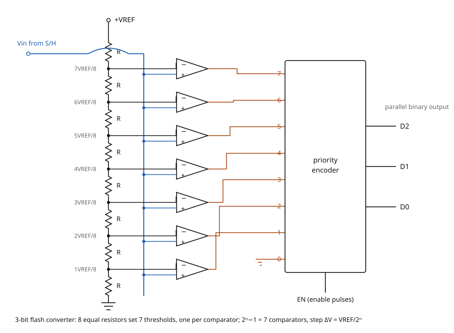

### Worked example — 3-bit flash ADC with $V_{\text{REF}} = +8\ \text{V}$

·CH4 slides 16–17

[ex] **Problem** ·CH4 slide 16 — determine the binary code output of the 3-bit flash ADC for the
input signal drawn on the slide and the encoder enable pulses shown. For this example
$V_{\text{REF}} = +8\ \text{V}$.

**Step 1 — the step size.**

$$\Delta V = \frac{V_{\text{REF}}}{2^{\,n}} = \frac{8\ \text{V}}{2^{3}} = \frac{8}{8} = 1\ \text{V}$$

So the seven comparator thresholds sit at $1, 2, 3, 4, 5, 6, 7\ \text{V}$.

**Step 2 — read the held level at each of the twelve enable pulses.** The slide's own solution
tabulates them ·CH4 slide 17:

| Pulse | 1 | 2 | 3 | 4 | 5 | 6 | 7 | 8 | 9 | 10 | 11 | 12 |
|---|---|---|---|---|---|---|---|---|---|---|---|---|
| $V$ / V | 4.5 | 6.5 | 7.5 | 6.8 | 4.8 | 2 | 0.4 | 1.8 | 3.7 | 5.7 | 6.8 | 7.8 |

**Step 3 — count how many thresholds each level has passed.** With a 1 V step that is simply the
input truncated to the whole volt below it:

$$4.5 \to 4 \to 100 \qquad 6.5 \to 6 \to 110 \qquad 7.5 \to 7 \to 111 \qquad 6.8 \to 6 \to 110$$

$$4.8 \to 4 \to 100 \qquad 2.0 \to 2 \to 010 \qquad 0.4 \to 0 \to 000 \qquad 1.8 \to 1 \to 001$$

$$3.7 \to 3 \to 011 \qquad 5.7 \to 5 \to 101 \qquad 6.8 \to 6 \to 110 \qquad 7.8 \to 7 \to 111$$

**Answer** ·CH4 slide 17:

$$100,\;110,\;111,\;110,\;100,\;010,\;000,\;001,\;011,\;101,\;110,\;111$$

All twelve codes were recomputed and all twelve agree with the slide, including the three-line
$D_2 D_1 D_0$ timing diagram drawn beneath the table: $D_2$ is HIGH for pulses 1–5 and 10–12, $D_1$
for 2, 3, 4, 6, 9, 11, 12, and $D_0$ for 3, 8, 9, 10, 12. No defect found in this example.

[added] Two reading notes. First, pulse 6 sits at exactly $2.0\ \text{V}$, on a threshold; the
answer $010$ tells you the comparators are being taken to trip at $V_{\text{in}} \ge V_{\text{ref}}$
rather than strictly greater than. Second, the levels are read off a graph, so slide 16's
waveform gives roughly 7.7 V at pulse 3 where slide 17's table says 7.5 V — the code is $111$ either
way. Use the table.

[fig] **Fig. 5-9** — the worked example: held input, enable pulses and the three output bits
·CH4 slides 16–17

```yaml
figure_data:
  type: waveform
  converter: flash
  bits: 3
  V_REF: 8 V
  step: 1 V
  pulses: 12
  sampled_volts: [4.5, 6.5, 7.5, 6.8, 4.8, 2.0, 0.4, 1.8, 3.7, 5.7, 6.8, 7.8]
  codes: ["100","110","111","110","100","010","000","001","011","101","110","111"]
  traces: [held analogue input, enable pulses, D2, D1, D0]
```

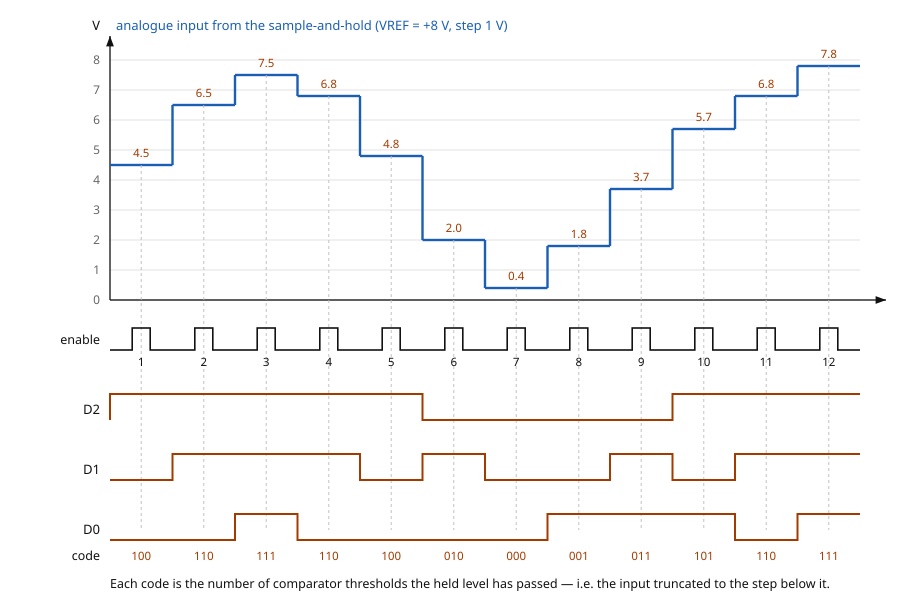

---

## 5.9 Homework — flash ADC

[exercise] ·CH4 slide 18 · **printed due date: 6th August 2025** — historical, from a previous run
of the unit, not a current deadline. Transcribed in full and left **unsolved**; it is set for the
student.

> A 3-bit Flash ADC is used to digitize an analog input signal. The reference voltage
> $V_{REF}$ is 8V.
>
> i. Determine the number of comparators required for this Flash ADC.
> ii. Calculate the voltage resolution of the ADC.
> iii. Determine the digital output for an analog input voltage of 5.5, 5.8, 3.8, and 4.6 V.

Everything needed is in §5.8: the comparator count, the resolution formula, and the truncation rule
demonstrated on twelve levels in the worked example.

---

## 5.10 The successive-approximation ADC

·CH4 slides 19–22

| Symbol | Meaning | Units | Typical |
|---|---|---|---|
| $V_{\text{in}}$ | held analogue input | V | 5.3 V |
| $V_{\text{DAC}}$ | DAC output fed back to the comparator | V | — |
| $V_{\text{REF}}$ | reference applied to the internal DAC | V | 5 V |
| $n$ | number of bits, and the number of clocks per conversion | — | 4 |
| $T_{\text{CLK}}$ | clock period | s | $1\ \mu\text{s}$ |
| $t_{\text{conv}}$ | conversion time | s | $n T_{\text{CLK}}$ |
| $D_3 \ldots D_0$ | parallel binary output, MSB first | logic | — |

The algorithm ·CH4 slide 19:

1. Starting with the MSB, each bit in the **successive-approximation register (SAR)** is activated
   and tested through the internal digital-to-analogue converter.
2. After each test the DAC produces an output voltage representing the bit.
3. The comparator compares that voltage with the input signal. **If the input is larger, the bit is
   retained; otherwise it is reset to 0.**

- The method is fast and has a **fixed** conversion time for all inputs ·CH4 slide 19.
- The number of clocks is $n$ ·CH4 slide 19.

[eq: sar-conversion-time]

$$\boxed{\;t_{\text{conv}} = n \, T_{\text{CLK}}\;}$$

- $n$ — bits in the converter, one clock period per bit
- $T_{\text{CLK}}$ — clock period, in seconds

⚠ VERIFY (V05-1) — slide 20's annotation box reverses the decision. It prints "Vin > VDAC:
Comparator output goes low. The bit in the SAR goes low as well. Vin < VDAC: Comparator output goes
high. The SAR keeps that bit high." That contradicts three other things in the same deck:
slide 19's rule quoted above, slide 21's flowchart (the **yes** branch of $V_{IN} > V_{DAC}$ goes to
"set the bit"), and slide 20's own drawn polarity, where $V_{\text{in}}$ enters the **+** input and
$V_{\text{DAC}}$ the **−** input, so the comparator output is HIGH whenever the input is the larger.
**Teach the corrected form:** $V_{\text{in}} > V_{\text{DAC}}$ ⇒ comparator HIGH ⇒ trial bit kept. Slide 20's figure also labels the DAC output node VDC while its annotation calls the same
node VDAC.

[fig] **Fig. 5-10** — successive-approximation ADC ·CH4 slides 19–20

```yaml
figure_data:
  type: block-diagram
  converter: successive-approximation
  blocks: [sample and hold, comparator, control logic, SAR, n-bit DAC]
  nets:
    - {from: V_in, to: sample and hold}
    - {from: sample and hold, to: comparator +}
    - {from: n-bit DAC, to: comparator -, name: V_DAC}
    - {from: comparator, to: control logic}
    - {from: control logic, to: SAR}
    - {from: SAR, to: n-bit DAC, note: trial code}
    - {from: SAR, to: parallel binary output}
    - {from: SAR, to: serial binary output}
    - {from: CLK, to: SAR}
    - {from: V_REF, to: n-bit DAC}
  decision_rule: "V_in > V_DAC -> keep the trial bit; otherwise clear it"
  clocks_per_conversion: n
```

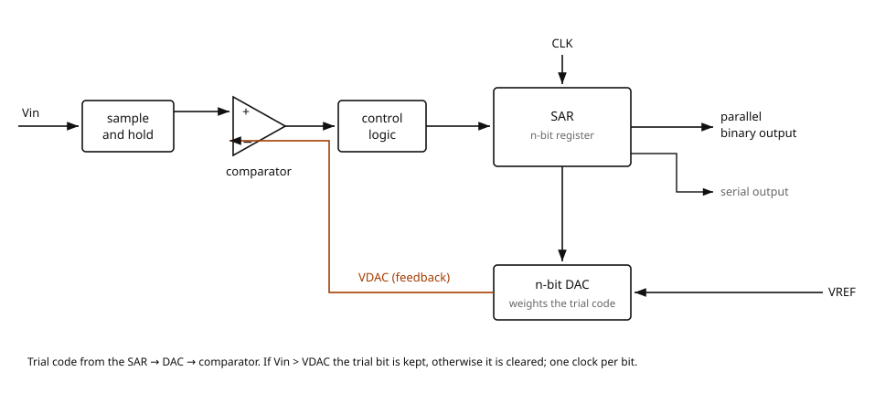

[fig] **Fig. 5-11** — the SAR algorithm as a flowchart ·CH4 slide 21

```yaml
figure_data:
  type: flowchart
  nodes: [start, sample V_in, clear all n bits, set the trial bit to 1, "V_in > V_DAC ?",
          keep that bit, clear that bit, "all n bits tested ?", move to the next lower bit, end]
  edges:
    - {from: "V_in > V_DAC ?", on: yes, to: keep that bit}
    - {from: "V_in > V_DAC ?", on: no, to: clear that bit}
    - {from: "all n bits tested ?", on: no, to: move to the next lower bit}
    - {from: move to the next lower bit, to: set the trial bit to 1}
    - {from: "all n bits tested ?", on: yes, to: end}
  loop_cost: one clock period per pass, n passes, MSB first
```

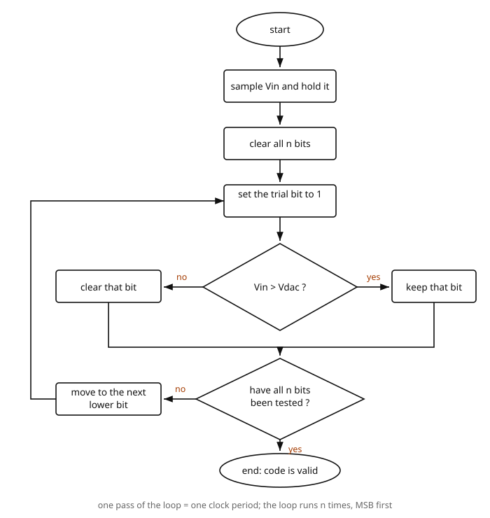

### The 4-bit search, node by node

·CH4 slide 22

The slide draws every combination a four-bit SAR can reach as a binary tree, with one particular
conversion path ticked and the rejected branches crossed out.

[ex] **Reconstructing the slide's path.** The circles carry both the trial code and its DAC voltage.
From those pairs the step size follows:

$$\Delta V = \frac{5.000\ \text{V}}{1000_2} = \frac{5.000}{8} = 0.625\ \text{V}$$

Every other circle on the slide agrees with that step — $0100 \to 2.500$, $1100 \to 7.500$,
$1010 \to 6.250$, $1110 \to 8.750$, $1001 \to 5.625$, $1011 \to 6.875$ — so the DAC's full scale is
$16 \times 0.625 = 10\ \text{V}$, which the slide never states.

The ticked path, with the rule "keep the bit if $V_{\text{in}}$ is the larger":

$$\text{trial 1: } 1000 \to 5.000\ \text{V}, \quad V_{\text{in}} > V_{\text{DAC}} \Rightarrow \text{bit 3 kept}$$

$$\text{trial 2: } 1100 \to 7.500\ \text{V}, \quad V_{\text{in}} < V_{\text{DAC}} \Rightarrow \text{bit 2 cleared}$$

$$\text{trial 3: } 1010 \to 6.250\ \text{V}, \quad V_{\text{in}} < V_{\text{DAC}} \Rightarrow \text{bit 1 cleared}$$

$$\text{trial 4: } 1001 \to 5.625\ \text{V}, \quad V_{\text{in}} < V_{\text{DAC}} \Rightarrow \text{bit 0 cleared}$$

$$\Rightarrow \text{final code } 1000$$

Four trials for four bits, as $t_{\text{conv}} = nT_{\text{CLK}}$ requires. The path is consistent
with any input in $5.000\ \text{V} \le V_{\text{in}} < 5.625\ \text{V}$ — for instance 5.3 V — and
the slide does not name the input, only the path.

⚠ VERIFY (V05-2) — in the full tree on the right of slide 22, the second-level node on the
"Vin > VDAC" branch is printed **0100**. It must be **1100**: 0100 is already the node on the
opposite ("VDAC > Vin") branch, and the two children drawn under it, 1010 and 1110, are reachable
only from 1100. A node whose value is below the first trial cannot be the branch taken when the
input was found to be above it.

⚠ VERIFY (V05-3) — in the worked path on the left of slide 22, the branch rejected at the fourth
trial is printed **1010 / 6.25 V**. From trial code $1001$ the only two outcomes are $1000$
(bit cleared, 5.000 V) and $1001$ (bit kept, 5.625 V); $1010$ was the *third* trial and cannot
reappear as a fourth-trial outcome. The slide's own right-hand tree confirms it, showing the two
leaves under 1001 as 1000 and 1001.

[fig] **Fig. 5-12** — the 4-bit successive-approximation search, corrected ·CH4 slide 22

```yaml
figure_data:
  type: decision-tree
  converter: successive-approximation
  bits: 4
  lsb: 0.625 V
  dac_full_scale: 10 V
  input_range_consistent_with_path: "5.000 V <= V_in < 5.625 V"
  path:
    - {trial: 1, code: "1000", v_dac: 5.000, rejected: "0100 / 2.500", outcome: bit3 kept}
    - {trial: 2, code: "1100", v_dac: 7.500, rejected: "1110 / 8.750", outcome: bit2 cleared}
    - {trial: 3, code: "1010", v_dac: 6.250, rejected: "1011 / 6.875", outcome: bit1 cleared}
    - {trial: 4, code: "1001", v_dac: 5.625, rejected: "1001 / 5.625", outcome: bit0 cleared}
  result: "1000"
  deviation_from_slide: "slide 22 prints the trial-4 rejected node as 1010 / 6.25 V — see V05-3"
```

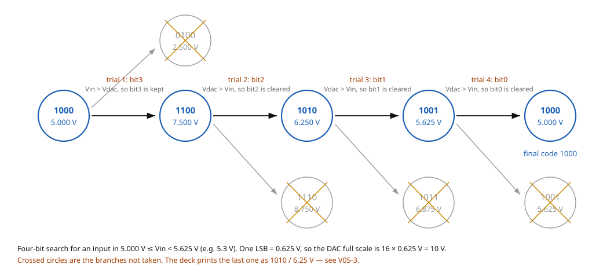

---

## 5.11 Homework — SAR ADC and the digital ramp converter

[exercise] ·CH4 slide 23 · **printed due date: 6th August 2025** — historical, not current.
Transcribed in full, left **unsolved**.

> A 4-bit Successive Approximation Register ADC is used to digitize an analog input signal. The
> reference voltage $V_{REF}$ is 5V, and the clock frequency $f_{CLK}$ is 1 MHz.
>
> i. Calculate the number of clock cycles required for a single conversion.
> ii. Determine the total conversion time.
> iii. Calculate the digital output for an analog input voltage of 3.2 V. use the formula
>
> $$\text{Digital out} = \left(\frac{V_{in}}{V_{red}}\right) \times (2^{n} - 1)$$
>
> iv. Repeat the same process using SAR flowchart

[eq: adc-transfer] — the transfer relation the question hands you, with the misprint corrected:

$$\boxed{\;\text{Digital out} = \left(\frac{V_{\text{in}}}{V_{\text{REF}}}\right)\left(2^{\,n}-1\right)\;}$$

⚠ VERIFY (C05-1) — the slide prints the denominator as $V_{red}$, which is not a quantity defined
anywhere in the chapter; it is $V_{REF}$, named in the question's own opening line. The slide also
numbers its fourth item "i." instead of "iv." — reproduced above as **iv** for readability.

[exercise] ·CH4 slide 24 · **printed due date: 6th August 2025** — historical, not current.

> Draw and discuss Digital Ramp ADC

Left **unsolved**. Note that the digital-ramp (counter-type) converter is *not* taught anywhere in
slides 1–29 — it appears only in the comparison table on slide 28 — so this exercise deliberately
sends the student outside the deck.

---

## 5.12 The dual-slope ADC

·CH4 slide 25

| Symbol | Meaning | Units | Typical |
|---|---|---|---|
| $V_{\text{in}}$ | analogue input, selected by the switch in phase 1 | V | — |
| $-V_{\text{REF}}$ | reference of opposite polarity, selected in phase 2 | V | — |
| $R$, $C$ | integrator input resistor and feedback capacitor | $\Omega$, F | — |
| $A_1$, $A_2$ | integrator op-amp, comparator op-amp | — | — |
| $n$ | the count the counter reaches | — | — |
| $T_1$, $T_2$ | fixed integrate time, variable de-integrate time | s | — |

A ramp generator (integrator) is used to produce the dual-slope characteristic ·CH4 slide 25:

1. The converter integrates the input voltage for a **fixed time** while the counter counts to $n$.
2. Control logic then switches to the $V_{\text{REF}}$ input.
3. A **fixed-slope** ramp starts from $-V$ as the counter counts. When it reaches 0 V, the counter
   output is latched.

Because the same $R$ and $C$ set both slopes, they cancel between the two phases — which is why this
converter is the accurate, drift-tolerant one in the comparison table.

[eq: dual-slope-count] [added] — the relation the two phases imply; the deck states the mechanism
but not the formula:

$$\boxed{\;n_{\text{count}} = 2^{\,n}\,\frac{V_{\text{in}}}{V_{\text{REF}}}\;}$$

- $n_{\text{count}}$ — the count latched at the zero crossing
- $2^{\,n}$ — the fixed count of the first phase, for an $n$-stage counter

[fig] **Fig. 5-13** — dual-slope ADC ·CH4 slide 25

```yaml
figure_data:
  type: schematic
  converter: dual-slope
  blocks: [SW, R, integrator A1 with feedback C, comparator A2, AND gate, counter, latches, control logic]
  nets:
    - {from: V_in, to: SW pole 1}
    - {from: -V_REF, to: SW pole 2}
    - {from: SW, through: R, to: A1 inverting input}
    - {from: A1 output, to: A2 inverting input}
    - {from: A2 output, to: AND gate input}
    - {from: CLK, to: AND gate input}
    - {from: AND gate, to: counter clock C}
    - {from: A2 output, to: control logic}
    - {from: control logic, to: SW (switch control)}
    - {from: control logic, to: counter R (CLEAR)}
    - {from: control logic, to: latches EN}
    - {from: counter, to: latches}
    - {from: latches, to: "D7..D0 binary or BCD output"}
  non_inverting_inputs: grounded on both op-amps
```

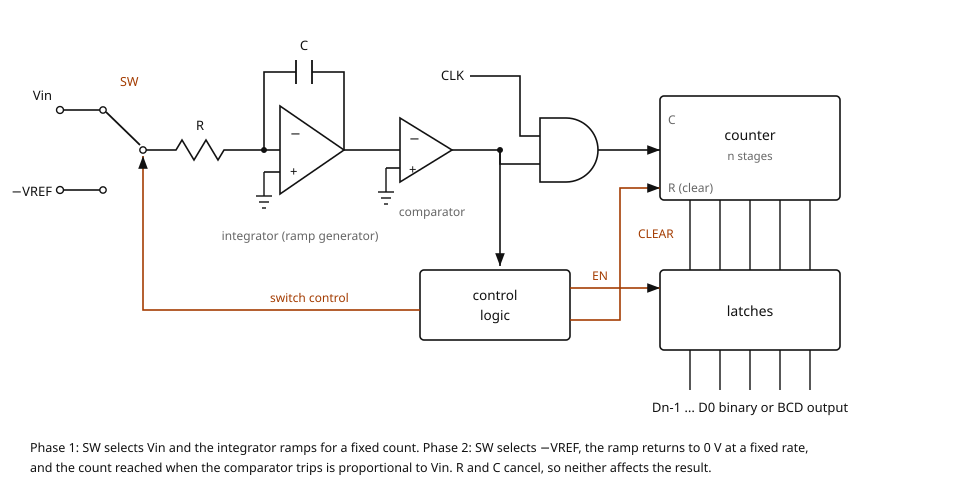

[fig] **Fig. 5-14** [added] — the two slopes, for three different inputs. Slide 25 describes the
ramp but does not draw it.

```yaml
figure_data:
  type: waveform
  status: added
  traces: three integrator ramps for small, medium and large V_in
  phase_1: {duration: fixed, slope: proportional to V_in}
  phase_2: {slope: fixed, set by V_REF, duration: proportional to V_in}
  latched_counts: n1 < n2 < n3
  key_point: "R, C and the clock rate cancel between the phases"
```

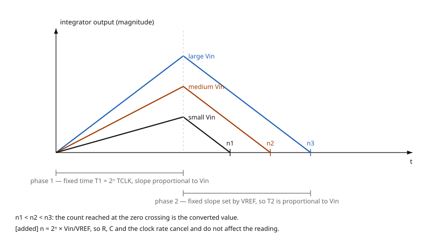

---

## 5.13 The sigma-delta ADC

·CH4 slides 26–27

| Symbol | Meaning | Units | Typical |
|---|---|---|---|
| $\Delta$ | the difference signal at the summing point | V | — |
| $\Sigma$ | the summing junction itself | — | — |
| $n$ | bits of the output counter | — | 12 |

Operation ·CH4 slide 26:

- A summing point forms a difference; an integrator accumulates it; a **1-bit quantiser** turns the
  result into a single-bit data stream.
- That stream is fed back through a **1-bit DAC** to the negative input of the summing point.
- **The density of 1s at the output is proportional to the input signal.**

One option is then to count the one-bit quantised output for a set interval and latch the counter
output as the parallel binary code ·CH4 slide 27.

- Sigma-delta ADCs can reach high resolution and are good at rejecting noise such as 60 Hz mains
  interference; they are available as ICs with internal programmable amplifiers, and are widely used
  in instrumentation ·CH4 slide 27.

⚠ VERIFY (V05-5) — slide 26's opening sentence says the converter takes "the difference between two
samples of the analog input signal". Its own block diagram says otherwise: the summing point has the
analogue input on **+** and the **DAC feedback** on **−**, so the difference formed is
input minus the fed-back quantised value, not input sample minus previous input sample. Teach the
diagram, not the sentence.

The density figure on slide 26 is self-consistent: over a window of $2^{12} = 4096$ clock periods it
marks $4096$ ones at $+\text{MAX}$, $2048$ ones at mid-scale and $0$ ones at $-\text{MAX}$ — exactly
half the window at half-scale, which is what "density proportional to the input" means.

[fig] **Fig. 5-15** — sigma-delta ADC, with the counting option of slide 27 ·CH4 slides 26–27

```yaml
figure_data:
  type: block-diagram
  converter: sigma-delta
  blocks: [summing point, integrator, 1-bit quantiser, 1-bit DAC, n-bit counter, latch]
  nets:
    - {from: analogue input, to: summing point +}
    - {from: 1-bit DAC, to: summing point -}
    - {from: summing point, to: integrator, name: delta}
    - {from: integrator, to: 1-bit quantiser}
    - {from: 1-bit quantiser, to: 1-bit stream output}
    - {from: 1-bit stream, to: 1-bit DAC}
    - {from: 1-bit stream, to: n-bit counter}
    - {from: n-bit counter, to: latch}
    - {from: latch, to: n-bit binary code output}
  density_rule: {plus_max: 4096 ones, mid_scale: 2048 ones, minus_max: 0 ones, window: 4096 clocks}
```

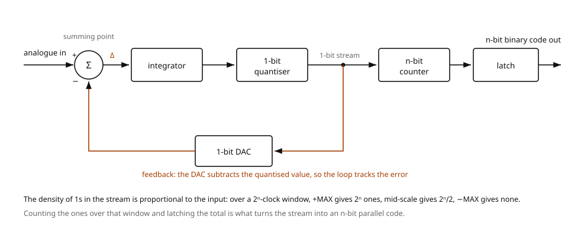

---

## 5.14 Comparing the converters

·CH4 slides 28–29

The deck's table, with the defect corrected ·CH4 slide 28:

| Type | Speed | Cost | Resolution / bits | Clocks per conversion | Conversion time |
|---|---|---|---|---|---|
| Dual slope | slow | low | 12–16 | $2^{\,n+1}$ ⚠ | $2^{\,n+1} T_{\text{CLK}}$ ⚠ |
| Counter type / digital ramp | slow | low | 8–12 | $2^{\,n}-1$ | $(2^{\,n}-1)T_{\text{CLK}}$ |
| Flash | very fast | high | 4–8 | 1 | $T_{\text{CLK}}$ |
| Successive approximation | medium–fast | medium | 8–16 | $n$ | $n\,T_{\text{CLK}}$ |
| Sigma-delta | slow–medium | medium–high | 16–24 | $2^{\,n}$ | $2^{\,n} T_{\text{CLK}}$ |

[eq: dual-slope-clock-count] ⚠ VERIFY (V05-4) — the slide prints the dual-slope figures as $2^{n}+1$ clocks and
$(2^{n}+1)T_{\text{CLK}}$. The exponent has lost its bracket: the dual-slope converter integrates
for a full $2^{n}$ counts and then de-integrates for up to $2^{n}$ more, so the worst case is
$2^{\,n+1} = 2 \times 2^{n}$ clocks. The two disagree badly at the resolutions the same row quotes —
at $n = 12$, $2^{n}+1 = 4097$ against $2^{\,n+1} = 8192$. Reproduce the printed form only if a
question quotes it back.

⚠ VERIFY (C05-2) — the second row is headed "Couter Type"; read "Counter Type".

**The rest of the table checks out.** The counter-type row is right because an $n$-stage counter
reaches at most $2^{n}-1$; the flash row is right because all comparators decide at once; the SAR row
matches slide 19's $n T_{\text{CLK}}$; the sigma-delta row matches the $2^{n}$-clock counting window
of slide 26.

### Summary

·CH4 slide 29

- **Dual slope** — high resolution and accuracy where long conversion times are tolerable, such as
  digital voltmeters.
- **Counter type / digital ramp** — simple and cheap, but slow; for less demanding applications.
- **Flash** — the fastest, for high-speed work such as digital oscilloscopes, but the most expensive.
- **Successive approximation** — a good balance of speed, cost and resolution; the general-purpose
  choice.
- **Sigma-delta** — high resolution and accuracy for audio and precision measurement, but slower and
  more complex.

Note the pattern behind the table: cost buys parallelism. Flash spends $2^n-1$ comparators to finish
in one clock; SAR spends one comparator and $n$ clocks; the integrating converters spend one
comparator and thousands of clocks, and get accuracy back in exchange.

---

## Verification flags raised in this file

Full entries, with what each slide prints and why it is wrong, are in `flags/05.md`.

| ID | Slide | One line |
|---|---|---|
| V05-1 | 20 | SAR annotation reverses the comparator decision, contradicting slides 19 and 21 and its own drawn polarity |
| V05-2 | 22 | second-level node of the full tree printed 0100; must be 1100 |
| V05-3 | 22 | trial-4 rejected node printed 1010 / 6.25 V; must be 1001 / 5.625 V |
| V05-4 | 28 | dual-slope clocks printed $2^n+1$; should be $2^{\,n+1}$ |
| V05-5 | 26 | sigma-delta described as differencing two input samples; the diagram differences input against DAC feedback |
| C05-1 | 23 | $V_{red}$ for $V_{REF}$; fourth list item numbered "i." |
| C05-2 | 28 | "Couter Type" for "Counter Type" |
| C05-3 | 8 | prose "greater than twice" against the printed $f_s \ge 2f_{\max}$ |
| C05-4 | 7 | $T_S$ and $T$ both used for the sampling interval on one slide |
| C05-5 | 15 | $n$ and $N$ both used for the bit count, two lines apart |

---

## Slide coverage

| Slide | Status |
|---|---|
| 1 | title slide — "Chapter 4 – Signal Conversion (ADC & DAC)"; no content |
| 2 | outline: 1. Analog to Digital Conversion, 2. Digital to Analog Conversion; §5.1 onwards covers item 1, file 06 covers item 2 |
| 3 | taught — §5.1 (signal types) |
| 4 | taught — §5.1 (what an ADC is) |
| 5 | taught — §5.2, including the PCM bit stream recomputed |
| 6 | taught — §5.2 (points to consider) |
| 7 | taught — §5.3; C05-4 raised |
| 8 | taught — §5.3 (Nyquist); C05-3 raised |
| 9 | taught — §5.4 (aliasing, anti-aliasing filter) |
| 10 | taught — §5.5 (sample-and-hold) |
| 11 | taught — §5.6 (quantisation and encoding) |
| 12 | taught — §5.6, table recomputed |
| 13 | taught — §5.6, table recomputed and cross-checked against slide 12 |
| 14 | taught — §5.7 (op-amp and comparator); its textbook figure captioned, not reproduced |
| 15 | taught — §5.8 (flash ADC); C05-5 raised |
| 16 | taught — §5.8, worked example statement |
| 17 | taught — §5.8, worked example solution, all 12 codes recomputed |
| 18 | transcribed — §5.9 homework, unsolved |
| 19 | taught — §5.10 (SAR) |
| 20 | taught — §5.10; V05-1 raised |
| 21 | taught — §5.10 (flowchart) |
| 22 | taught — §5.10 (4-bit tree); V05-2 and V05-3 raised |
| 23 | transcribed — §5.11 homework, unsolved; C05-1 raised |
| 24 | transcribed — §5.11 homework, unsolved |
| 25 | taught — §5.12 (dual slope) |
| 26 | taught — §5.13 (sigma-delta); V05-5 raised |
| 27 | taught — §5.13 (counting option) |
| 28 | taught — §5.14 (comparison); V05-4 and C05-2 raised |
| 29 | taught — §5.14 (summary) |

Every slide from 1 to 29 is accounted for. Slides 30–49 are the DAC half of the same deck and
belong to **06 — Digital-to-Analogue Conversion**.

---

## Note on file size

This file is about 43 KB, a little over the ~40 KB the format guide flags. It is left whole
deliberately: slides 1–29 are one continuous argument — sample, quantise, encode, then four ways of
doing it — and the converter sections lean on the sampling and quantisation results throughout.

If a split is ever forced, the natural seam is **between §5.6 and §5.7**: §§5.1–5.6 are the
conversion *process* (sampling, aliasing, holding, quantising, coding, with no circuits at all), and
§§5.7–5.14 are the *converter circuits* that implement it. Nothing after §5.7 depends on anything in
§§5.1–5.6 except the two boxed relations $L = 2^n$ and $\Delta V = V_{\text{REF}}/2^n$.
