# 06 — Digital-to-Analogue Conversion

Covers slides 30–49 of Chapter 4, the second half of the signal-conversion deck. Slides 1–29 are
analogue-to-digital conversion and are carried in **05 — Analogue-to-Digital Conversion**.

Handout code used throughout: `CH4`. The printed footer number equals the PDF page number, so
`·CH4 slide 39` is the slide titled "Binary-Weighted-Input DAC".

This is the most example-dense range in the chapter: **seven worked examples in twenty slides**, and
the examples carry the teaching. Every number below has been recomputed; the R/2R network has been
re-solved by nodal analysis rather than trusted to the printed formula.

Fifteen defects were raised — nine substantive, six cosmetic. Each is flagged inline at the point of
use and collected in `flags/06.md`.

---

## 6.1 What a DAC is for

·CH4 slide 30

- Once the digital data has been processed, it is converted back to analogue form ·CH4 slide 30.

That single line is the whole of slide 30. It closes the loop opened on slide 4: a transducer's
analogue signal goes in through an ADC, is processed digitally, and comes back out through a DAC.

---

## 6.2 The D/A transfer relation

·CH4 slide 31

| Symbol | Meaning | Units | Typical |
|---|---|---|---|
| $K$ | proportionality factor — the analogue change produced by one LSB | V (or A) per step | $0.5$ V |
| $D$ | decimal equivalent of the applied binary code | — | 0 to $2^N-1$ |
| $N$ | number of input bits | — | 4, 5, 8, 10, 12 |
| $V_{\text{FS}}$ | full-scale output — the output at the largest code | V (or A) | 5 V, 9.99 V |

[def] A **digital-to-analogue converter** produces an analogue output proportional to the decimal
value of the binary word at its inputs ·CH4 slide 31.

[eq: dac-transfer]

$$\boxed{\;\text{Analogue output} = K \times \text{digital value}\;}$$

- $K$ — the proportionality factor, which the slide names explicitly as the **resolution** of the
  converter ·CH4 slide 31. It is the step size: the output change caused by incrementing the input
  code by one.
- The digital value is the plain decimal equivalent of the code, so a 4-bit converter spans
  $D = 0$ to $D = 15$.

Two consequences worth holding on to:

- Only **one** measured (code, output) pair is needed to pin down $K$; everything else follows.
- $K$ carries the units of the output. A current-output DAC has $K$ in amperes per step.

### [ex] Example 1 — 4-bit converter, code 0110

·CH4 slide 31

> A 4-bit D/A converter produces an output voltage of 4.5 V for an input code of 1001. What will be
> the value of the output voltage for an input code of 0110?

Convert the reference code to decimal:

$$1001_2 = 2^3 + 0 + 0 + 2^0 = 8 + 1 = 9$$

Find the proportionality factor from the one pair given:

$$4.5\ \text{V} = K \times 9$$

$$K = \frac{4.5}{9} = 0.5\ \text{V per step}$$

Convert the wanted code and scale:

$$0110_2 = 0 + 2^2 + 2^1 + 0 = 4 + 2 = 6$$

$$\text{Analogue output} = 0.5 \times 6 = 3\ \text{V}$$

Recomputed and confirmed. Note in passing that $K = 0.5$ V fixes this converter's full scale at
$0.5 \times 15 = 7.5$ V.

### [ex] Example 2 — same converter, code 0011

·CH4 slide 32

> A 4-bit D/A converter produces an output voltage of 4.5 V for an input code of 1001. What will be
> the value of the output voltage for an input code of 0011?

Identical set-up, so $K = 4.5/9 = 0.5$ V per step.

$$0011_2 = 0 + 0 + 2^1 + 2^0 = 3$$

$$\text{Analogue output} = 0.5 \times 3 = 1.5\ \text{V}$$

⚠ VERIFY (C06-1) — the slide's working is headed "For 0110," although the code being converted is
$0011$. The label has been carried over from slide 31; the arithmetic underneath is right.

### [ex] Example 3 — 5-bit converter, code 11101

·CH4 slide 33

> A 5-bit D/A converter produces an output voltage of 10 V for an input code of 10100. What will be
> the value of the output voltage for an input code of 11101?

$$10100_2 = 2^4 + 2^2 = 16 + 4 = 20$$

$$10\ \text{V} = K \times 20 \quad\Longrightarrow\quad K = \frac{10}{20} = 0.5\ \text{V per step}$$

$$11101_2 = 2^4 + 2^3 + 2^2 + 2^0 = 16 + 8 + 4 + 1 = 29$$

$$\text{Analogue output} = 0.5 \times 29 = 14.5\ \text{V}$$

Recomputed and confirmed. The same C06-1 slip appears here: the working is again headed
"For 0110,", although the code is $11101$.

---

## 6.3 Resolution

·CH4 slide 34

| Symbol | Meaning | Units | Typical |
|---|---|---|---|
| $V_{\text{res}}$ | resolution — one step of the output | V (or A) | $4.888$ mV |
| $V_{\text{FS}}$ | full-scale output | V (or A) | 5 V, 10 mA |
| $N$ | number of input bits | — | 8, 10, 12 |
| $2^{N}-1$ | number of **steps** from zero code to full-scale code | — | 255, 1023, 4095 |
| $2^{N}$ | number of **states** (distinct output levels) | — | 256, 1024, 4096 |

[def] **Resolution** is the smallest change that occurs in the analogue output as a result of a
change in the digital input ·CH4 slide 34.

[eq: dac-resolution]

$$\boxed{\;\text{Resolution} = \frac{V_{\text{FS}}}{2^{\,N}-1}\;}$$

⚠ VERIFY (V06-1) — the slide's own gloss reads "$2^N - 1$ = no of states, $N$ = no of bits". The
count of **states** is $2^N$; $2^N - 1$ is the count of **steps between** them. Slide 48 makes the
intended reading explicit when it defines resolution as "the reciprocal of the number of steps in
the output" — steps, not states. The formula itself is right; only the label under it is wrong.

[eq: dac-percentage-resolution] [added] — used on slides 37 and 48 but never written out as a
formula:

$$\boxed{\;\%\ \text{resolution} = \frac{1}{2^{\,N}-1}\times 100\,\%\;}$$

This is the step expressed as a fraction of full scale, so it is a pure number — it does **not**
depend on what the full-scale output happens to be.

[fig] **Fig. 6-1** [added] — the DAC transfer characteristic, drawn for $N = 3$ so that the step,
the state count and the step count are all visible at once

```yaml
figure_data:
  type: transfer-staircase
  bits: 3
  codes: [000, 001, 010, 011, 100, 101, 110, 111]
  states: 8
  steps: 7
  step_size: V_FS/(2^N - 1) = V_FS/7
  full_scale_reached_at: "111"
  note: "output at code 000 is zero; output at code 111 is V_FS"
```

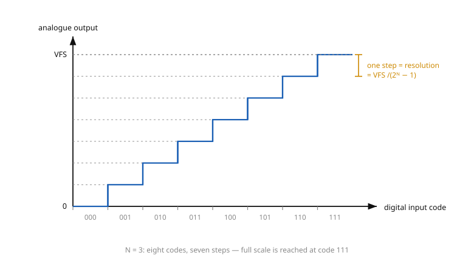

### The $2^{N}$ versus $2^{N}-1$ distinction

This chapter uses **both** denominators, in different halves, and the two must not be mixed inside
one question.

$$\Delta = \frac{V_{\text{FS}}}{2^{\,N}-1} \qquad\text{spacing of adjacent code outputs — the DAC half, slides 34, 35, 36, 37, 48}$$

$$\Delta = \frac{\max - \min}{2^{\,n}} \qquad\text{height of one quantisation zone — the ADC half, slides 12, 13, 15}$$

- The DAC half is **internally consistent**: every one of slides 34–37 and 48 uses $2^N - 1$, and the
  $K$ values on slides 31–33 agree with it.
- The ADC half is not the same convention — see §5.6 of the companion file, where the same split is
  recorded from the other side.
- **Which to use.** If the quantity given is a *full-scale output* — the output actually produced at
  the top code — there are $2^N - 1$ steps between zero and it, so divide by $2^N - 1$. If a
  continuous *span* is being cut into bins, there are $2^N$ bins, so divide by $2^N$.
- **How much it matters.** The two differ by the factor $2^N/(2^N-1)$: 33 % at $N = 2$, 0.39 % at
  $N = 8$, 0.024 % at $N = 12$. Negligible in a 12-bit data sheet, decisive in a 2-bit exercise —
  and always decisive for marks, because the examiner is checking which one was chosen.

### [ex] Example 4 — resolution of a 10-bit DAC

·CH4 slide 35

> What is the resolution of a 10-bit DAC whose full scale output is 5 V?

$$V_{\text{res}} = \frac{V_{\text{FS}}}{2^{\,N}-1} = \frac{5\ \text{V}}{2^{10}-1} = \frac{5}{1023}$$

$$V_{\text{res}} = 4.888\times 10^{-3}\ \text{V} = 4.888\ \text{mV}$$

⚠ VERIFY (V06-2) — the slide prints $8.888\times 10^{-3}$ V. The division is $5/1023 = 0.0048876$,
so the leading digit should be a 4, not an 8. Quick check in the other direction:
$8.888\ \text{mV}\times 1023 = 9.09$ V, which is not the 5 V the question gives. Teach
$4.888$ mV.

### [ex] Example 5 — how many bits for a required resolution

·CH4 slide 36

> How many bits are required for a DAC so that its full scale output is 10 mA and its resolution is
> less than 40 µA?

The requirement is that one step be **smaller** than 40 µA:

$$\frac{10\times 10^{-3}\ \text{A}}{2^{\,N}-1} < 40\times 10^{-6}\ \text{A}$$

$$2^{\,N}-1 > \frac{10\times 10^{-3}}{40\times 10^{-6}} = 250$$

$$2^{\,N} > 251$$

$$N\log_{10}2 > \log_{10}251 \quad\Longrightarrow\quad N > \frac{\log_{10}251}{\log_{10}2} = 7.97$$

$$\boxed{\;N = 8\ \text{bits}\;}$$

[eq: bits-for-resolution] [added] — the general form of the last two lines:

$$N \ge \left\lceil \log_2\!\left(\frac{V_{\text{FS}}}{V_{\text{res}}} + 1\right)\right\rceil$$

Confirming the answer directly, which is the check worth doing in an exam:

$$N = 7:\quad \frac{10\ \text{mA}}{127} = 78.7\ \mu\text{A} \quad\text{— too coarse}$$

$$N = 8:\quad \frac{10\ \text{mA}}{255} = 39.2\ \mu\text{A} \quad\text{— meets } {<}\,40\ \mu\text{A}$$

⚠ VERIFY (V06-3) — the slide's chain has every inequality the wrong way round. It opens with
$40\times10^{-6} < \dfrac{10\times10^{-3}}{2^N-1}$ and continues to $2^N < 251$, which forces
$N < 7.97$, i.e. $N \le 7$ — yet the slide then writes $N = 7.97 \approx 8$ bits. The final answer
is right and the direct check above proves it; the reasoning printed to reach it is inverted. Note
also that the last step prints an equality, $N = \log_{10}251/\log_{10}2$, where the line above it is
an inequality.

⚠ VERIFY (C06-2) — the slide reads "How may bit are required", and ends the question with a full
stop rather than a question mark.

### [ex] Example 6 — a 12-bit **BCD** DAC

·CH4 slide 37

> A 12-bit DAC which uses a BCD input code has a full-scale output of 9.99 V. For an input code of
> 011010010101, determine:
> i. the step size, ii. percentage resolution, and iii. the value of $V_{\text{out}}$.

**Read the input code first.** It is BCD, so it splits into three 4-bit decades:

$$\underbrace{0110}_{6}\ \underbrace{1001}_{9}\ \underbrace{0101}_{5} \;=\; 695$$

The decimal equivalent is 695 — the slide gets this line right.

**The count that matters.** A 12-bit BCD word does not count to 4095. Each decade stops at
$1001_2 = 9$, so three decades count $000$ to $999$ — a maximum of **999**, and 999 steps from zero
to full scale. The full-scale figure the question supplies confirms it:
$9.99\ \text{V} = 999 \times 10\ \text{mV}$ exactly.

i. Step size:

$$\text{step} = \frac{V_{\text{FS}}}{999} = \frac{9.99\ \text{V}}{999} = 0.01\ \text{V} = 10\ \text{mV}$$

ii. Percentage resolution:

$$\%\ \text{resolution} = \frac{1}{999}\times 100\,\% = 0.1\,\%$$

iii. Output voltage:

$$V_{\text{out}} = D \times \text{step} = 695 \times 0.01\ \text{V} = \boxed{\;6.95\ \text{V}\;}$$

⚠ VERIFY (V06-4) — the slide applies the **binary** step count to a converter the question states is
**BCD-coded**: it writes $2^{12}-1 = 4095$ and divides by that. All three printed answers change as a
result. Corrected: step $= 10$ mV (slide: $0.00244$), percentage resolution $= 0.1\,\%$ (slide:
$0.244\,\%$), $V_{\text{out}} = 6.95$ V (slide: $1.6978$). The "9.99 V" in the question is the tell —
it is exactly $999$ steps of $10$ mV.

⚠ VERIFY (V06-5) — the slide's first line reads "Step size $= 2^N - 1 = 2^{12}-1 = 4095$". A step
size is a voltage; $4095$ is a dimensionless count. What is computed there is the number of steps,
not the step.

⚠ VERIFY (V06-6) — the slide writes "$= 0.00244 = 0.244\,\%$". The quantity $0.00244$ is a step in
**volts**, and a voltage cannot be restated as a percentage by multiplying by 100. Even taking the
slide's own binary route, the percentage resolution is $\tfrac{1}{4095}\times100\,\% = 0.0244\,\%$ —
ten times smaller than printed. Slide 48 performs exactly this conversion correctly for the 8-bit
case, so the two slides disagree with each other.

⚠ VERIFY (V06-7) — the slide's last line reads $V_{\text{out}} = 695 \times 0.00244 = 1.6978$. The
product is $1.6958$, and using the unrounded step $9.99/4095$ it is $1.6955$; no unit is given
either. The corrected answer along the BCD route is $6.95$ V.

---

## 6.4 Full-scale error

·CH4 slide 38

| Symbol | Meaning | Units | Typical |
|---|---|---|---|
| $E$ | error — deviation of the actual output from the expected one | V or A | 0.38 mA |
| $V_{\text{exp}}$ | expected (original) value, taken at full scale | V or A | 2 mA |
| $\text{FSE}$ | full-scale error | % | $\pm 19\,\%$ |

[def] **Full-scale error** is the maximum deviation of the converter's output from the expected
value ·CH4 slide 38.

[eq: full-scale-error]

$$\boxed{\;\text{Full-scale error} = \frac{\text{Error}}{\text{Original value}}\times 100\,\%\;}$$

- "Original value" is the deck's wording for the expected, ideal output at that code ·CH4 slide 38.
- The specification is quoted as $\pm$ a percentage, so the deviation may be either way.

[fig] **Fig. 6-2** [added] — full-scale error as the gap between the ideal and actual transfer lines
at the top code; slide 38 states the definition but draws nothing

```yaml
figure_data:
  type: transfer-line-comparison
  lines:
    ideal: "straight line from origin to (full-scale code, expected output)"
    actual: "straight line from origin, falling short at the top code"
  measured_quantity: "vertical gap at the full-scale code"
  definition: "FSE = (error / expected value) x 100 %"
```

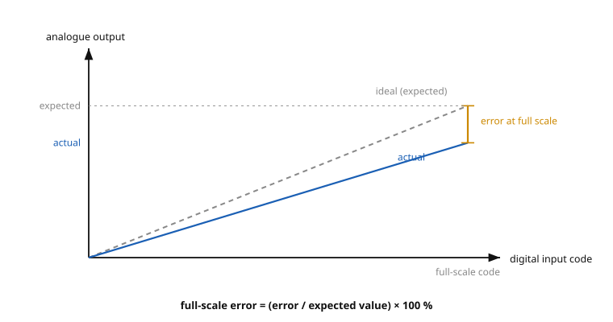

### [ex] Example 7 — full-scale error of a 2 mA converter

·CH4 slide 38

> A converter has a max-full scale error of $\pm 19\,\%$. Given the converter's full scale current
> output of 2 mA, find the full-scale error.

The question gives the percentage and asks for the error in amperes. Rearranging the definition:

$$19\,\% = \frac{E}{2\ \text{mA}}\times 100\,\%$$

$$E = \frac{19}{100}\times 2\ \text{mA} = 0.19 \times 2\ \text{mA}$$

$$E = 0.38\ \text{mA} = \boxed{\;380\ \mu\text{A}\;}$$

So the output at full scale may lie anywhere between $2 - 0.38 = 1.62$ mA and
$2 + 0.38 = 2.38$ mA.

⚠ VERIFY (V06-8) — the slide prints $E = \dfrac{2\ \text{mA}\times 0.19}{100} = 3.8\ \mu\text{A}$.
The factor of 100 has been applied twice: $0.19$ **is** $19/100$ already. The printed answer is 100
times too small. Sanity check: 19 % of 2 mA cannot be a few microamps — it must be a few tenths of a
milliamp.

---

## 6.5 The binary-weighted-input DAC

·CH4 slide 39

| Symbol | Meaning | Units | Typical |
|---|---|---|---|
| $V$ | input HIGH level voltage applied to a resistor | V | $+5.0$ V, $+3.0$ V |
| $R$ | smallest input resistor, on the MSB | $\Omega$ | 25 kΩ |
| $R_f$ | op-amp feedback resistor | $\Omega$ | 10 kΩ |
| $I_i$ | current injected by bit $i$ | A | 0.025 mA |
| $I_f$ | total current through $R_f$ | A | 0.375 mA |
| $V_{\text{out}}$ | analogue output voltage | V | $-3.75$ V |
| $D_i$ | logic level on bit $i$; $D_0$ is the LSB | logic | 0 or 1 |

[def] The **binary-weighted-input DAC** is a basic DAC in which the input current in each resistor is
proportional to the column weight in the binary numbering system ·CH4 slide 39.

How it works ·CH4 slide 39:

1. Each input drives its own resistor into the inverting input of an op-amp.
2. The inverting input sits at **virtual ground**, so the current in each resistor is fixed by that
   input's logic level alone and is unaffected by the other inputs.
3. The MSB is represented by the **largest** current, so it gets the **smallest** resistor.
4. To simplify analysis, assume all the current goes through $R_f$ and none into the op-amp.

[eq: binary-weighted-current] — for the four-bit case drawn on slide 39, with $R$ on the MSB:

$$I_0 = \frac{V}{8R},\qquad I_1 = \frac{V}{4R},\qquad I_2 = \frac{V}{2R},\qquad I_3 = \frac{V}{R}$$

which is the single rule [added] — the deck prints the four currents but never the general form:

$$\boxed{\;I_i = \frac{V}{2^{\,n-1-i}\,R}\;}$$

- $i$ — bit number, $i = 0$ for the LSB
- $n$ — number of bits; the resistor on bit $i$ is $2^{\,n-1-i}R$, so the weights double each step

[eq: binary-weighted-output]

$$\boxed{\;V_{\text{out}} = -R_f \sum_{i} I_i \;}$$

⚠ VERIFY (C06-5) — slide 39 annotates the circuit $V_{\text{out}} = I_f R_f$, with no minus sign,
even though the amplifier is in the inverting configuration; slide 41 then relies on the output
being negative and slide 42 tabulates negative values throughout. The minus belongs in the formula.

- The requirement the slide states twice, on slides 39 and 40: the circuit needs **very accurate
  resistors** and **identical HIGH level voltages** for accuracy. That is its weakness — an 8-bit
  version needs resistors spanning a 128:1 range, all matched.

[fig] **Fig. 6-3** — binary-weighted-input DAC, 4 bits; redrawn from the textbook figure on
·CH4 slide 39

```yaml
figure_data:
  type: schematic
  converter: binary-weighted-input
  bits: 4
  amplifier: op-amp, inverting, non-inverting input grounded
  summing_node: virtual ground (0 V)
  branches:
    - {bit: D0, weight: 2^0, role: LSB, resistor: 8R, current: V/8R}
    - {bit: D1, weight: 2^1, resistor: 4R, current: V/4R}
    - {bit: D2, weight: 2^2, resistor: 2R, current: V/2R}
    - {bit: D3, weight: 2^3, role: MSB, resistor: R, current: V/R}
  feedback: {resistor: R_f}
  output: "V_out = -R_f (I_0 + I_1 + I_2 + I_3)"
```

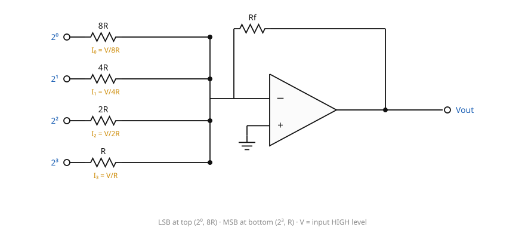

### [ex] Example 8 — output for a 4-bit counting sequence

·CH4 slides 40, 41 and 42

> Determine the output of the DAC in Figure (a) below if the waveforms representing a sequence of
> 4-bit numbers in Figure (b) below are applied to the inputs. Input $D_0$ is the least significant
> bit (LSB).

[fig] **Fig. 6-4** — the converter of ·CH4 slide 40(a), redrawn

```yaml
figure_data:
  type: schematic
  converter: binary-weighted-input
  bits: 4
  high_level: +5.0 V
  low_level: 0 V
  branches:
    - {bit: D0, role: LSB, resistor: 200 kohm, current_when_high: 0.025 mA}
    - {bit: D1, resistor: 100 kohm, current_when_high: 0.05 mA}
    - {bit: D2, resistor: 50 kohm, current_when_high: 0.1 mA}
    - {bit: D3, role: MSB, resistor: 25 kohm, current_when_high: 0.2 mA}
  feedback: {resistor: 10 kohm}
  step: {current: 0.025 mA, voltage: -0.25 V}
```

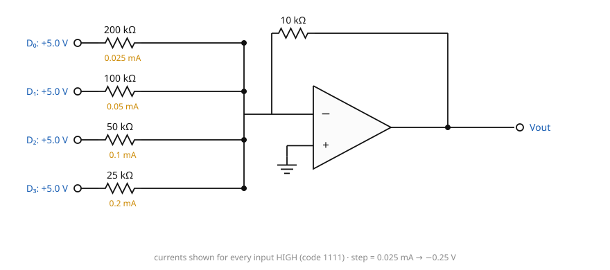

[fig] **Fig. 6-5** — the input waveforms of ·CH4 slide 40(b), redrawn: a 4-bit binary count

```yaml
figure_data:
  type: timing-diagram
  intervals: 16
  levels: {high: +5 V, low: 0 V}
  sequence: "0000, 0001, 0010, ... , 1111 — one code per interval"
  traces:
    D0: toggles every interval
    D1: toggles every 2 intervals
    D2: toggles every 4 intervals
    D3: toggles every 8 intervals
```

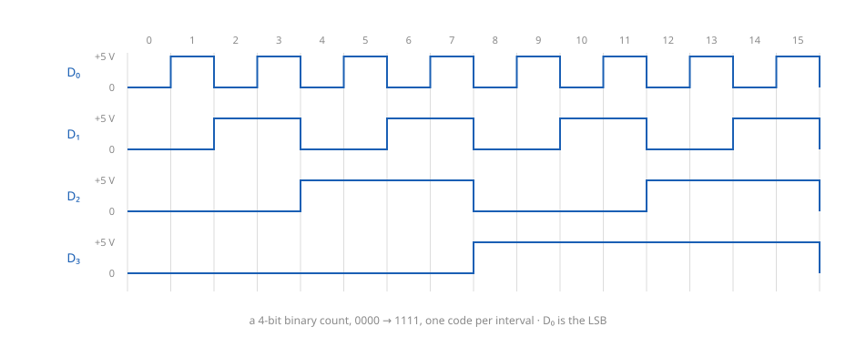

**Step 1 — the branch currents** ·CH4 slide 41. The inverting input is at 0 V (virtual ground) and a
binary 1 is $+5$ V, so the current through any input resistor is 5 V divided by that resistance:

$$I_0 = \frac{5\ \text{V}}{200\ \text{k}\Omega} = 0.025\ \text{mA}$$

$$I_1 = \frac{5\ \text{V}}{100\ \text{k}\Omega} = 0.05\ \text{mA}$$

$$I_2 = \frac{5\ \text{V}}{50\ \text{k}\Omega} = 0.1\ \text{mA}$$

$$I_3 = \frac{5\ \text{V}}{25\ \text{k}\Omega} = 0.2\ \text{mA}$$

Almost no current enters the op-amp's inverting input because of its extremely high impedance, so
all of it flows through $R_f$; and since one end of $R_f$ is at virtual ground, the drop across $R_f$
**is** the output voltage, negative with respect to ground ·CH4 slide 41.

**Step 2 — the single-bit outputs** ·CH4 slide 41:

$$V_{\text{out}(D_0)} = (10\ \text{k}\Omega)(-0.025\ \text{mA}) = -0.25\ \text{V}$$

$$V_{\text{out}(D_1)} = (10\ \text{k}\Omega)(-0.05\ \text{mA}) = -0.5\ \text{V}$$

$$V_{\text{out}(D_2)} = (10\ \text{k}\Omega)(-0.1\ \text{mA}) = -1\ \text{V}$$

$$V_{\text{out}(D_3)} = (10\ \text{k}\Omega)(-0.2\ \text{mA}) = -2\ \text{V}$$

Each is exactly twice the one below it, which is the whole point of the resistor ratios.

**Step 3 — the full table** ·CH4 slide 42. Every row was rederived by summing the branch currents
for that code and multiplying by $-10\ \text{k}\Omega$; all sixteen agree with the slide.

| Input | $I_{\text{in}}$ (mA) | $V_{\text{out}}$ (V) | Input | $I_{\text{in}}$ (mA) | $V_{\text{out}}$ (V) |
|---|---|---|---|---|---|
| 0000 | 0 | 0 | 1000 | 0.2 | $-2$ |
| 0001 | 0.025 | $-0.25$ | 1001 | 0.225 | $-2.25$ |
| 0010 | 0.05 | $-0.5$ | 1010 | 0.25 | $-2.5$ |
| 0011 | 0.075 | $-0.75$ | 1011 | 0.275 | $-2.75$ |
| 0100 | 0.1 | $-1$ | 1100 | 0.3 | $-3$ |
| 0101 | 0.125 | $-1.25$ | 1101 | 0.325 | $-3.25$ |
| 0110 | 0.15 | $-1.5$ | 1110 | 0.35 | $-3.5$ |
| 0111 | 0.175 | $-1.75$ | 1111 | 0.375 | $-3.75$ |

The step is $0.025$ mA, or $-0.25$ V, per LSB — and $-0.25\ \text{V}\times 15 = -3.75$ V is the
full-scale output, consistent with $V_{\text{FS}}/(2^N-1)$ from §6.3.

[fig] **Fig. 6-6** — output staircase for the counting sequence ·CH4 slide 42, redrawn

```yaml
figure_data:
  type: transfer-staircase
  bits: 4
  x_axis: binary input, 0000 to 1111
  y_axis: V_out in volts, running negative downwards
  step: -0.25 V
  endpoints: {"0000": 0 V, "1111": -3.75 V}
  monotonic: true
```

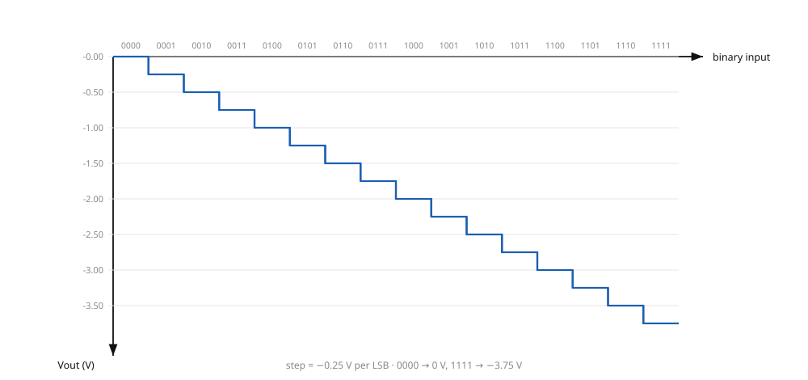

### [ex] Example 9 — binary-weighted DAC with a 3 V HIGH level

·CH4 slide 43

> A certain binary-weighted-input DAC has a binary input of 1101. If a HIGH $= +3.0$ V and a
> LOW $= 0$ V, what is $V_{\text{out}}$?

The circuit has $120\ \text{k}\Omega$ on $D_0$, $60\ \text{k}\Omega$ on $D_1$,
$30\ \text{k}\Omega$ on $D_2$, $15\ \text{k}\Omega$ on $D_3$, and $R_f = 10\ \text{k}\Omega$
·CH4 slide 43. The code $1101$ means $D_3 = 1$, $D_2 = 1$, $D_1 = 0$, $D_0 = 1$.

$$I_{\text{out}} = -\left(\frac{3.0\ \text{V}}{120\ \text{k}\Omega} + \frac{0\ \text{V}}{60\ \text{k}\Omega} + \frac{3.0\ \text{V}}{30\ \text{k}\Omega} + \frac{3.0\ \text{V}}{15\ \text{k}\Omega}\right)$$

$$I_{\text{out}} = -\left(0.025 + 0 + 0.1 + 0.2\right)\ \text{mA} = -0.325\ \text{mA}$$

$$V_{\text{out}} = I_{\text{out}}R_f = (-0.325\ \text{mA})(10\ \text{k}\Omega) = \boxed{\;-3.25\ \text{V}\;}$$

Recomputed and confirmed. Cross-check against Example 8: the branch currents are the same four
values, because halving the HIGH level from 5 V to 3 V and shrinking every resistor by the same
$0.6$ factor leaves each ratio $V/R$ unchanged.

⚠ VERIFY (C06-4) — inside the current sum the slide writes the $D_1$ term as "$+\,0\ \text{V}$", a
voltage sitting in a list of currents. It should be $0\ \text{V}/60\ \text{k}\Omega = 0$ mA. The
total is unaffected.

[fig] **Fig. 6-7** — the slide-43 converter, redrawn with the applied levels shown

```yaml
figure_data:
  type: schematic
  converter: binary-weighted-input
  bits: 4
  code: "1101"
  high_level: +3.0 V
  low_level: 0 V
  branches:
    - {bit: D0, level: +3.0 V, resistor: 120 kohm, current: 0.025 mA}
    - {bit: D1, level: 0 V, resistor: 60 kohm, current: 0 mA}
    - {bit: D2, level: +3.0 V, resistor: 30 kohm, current: 0.1 mA}
    - {bit: D3, level: +3.0 V, resistor: 15 kohm, current: 0.2 mA}
  feedback: {resistor: 10 kohm}
  result: "V_out = -3.25 V"
```

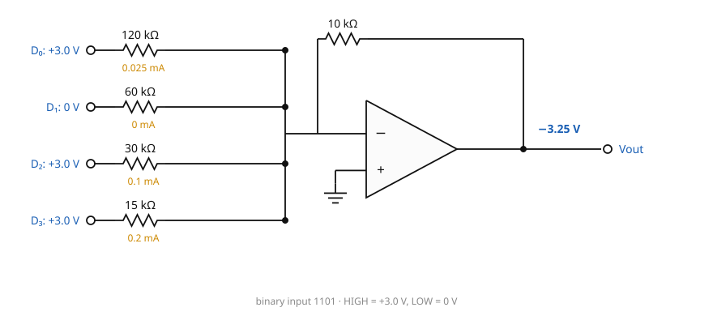

---

## 6.6 The R/2R ladder DAC

·CH4 slide 44

| Symbol | Meaning | Units | Typical |
|---|---|---|---|
| $V_S$ | input HIGH level voltage | V | $+5.0$ V |
| $R$ | the smaller of the two resistor values (series arms) | $\Omega$ | 25 kΩ |
| $2R$ | the larger value (input legs, terminator, feedback) | $\Omega$ | 50 kΩ |
| $R_f$ | feedback resistor, equal to $2R$ | $\Omega$ | 50 kΩ |
| $R_{\text{EQ}}$ | equivalent resistance of the ladder seen from a node | $\Omega$ | $2R$ |
| $V_{\text{TH}}$ | Thévenin voltage of the ladder to the left of a node | V | 2.5 V |
| $R_{\text{TH}}$ | Thévenin resistance of that same section | $\Omega$ | $R$ |
| $n$ | number of bits | — | 4 |
| $i$ | bit number, $i = 0$ for the LSB | — | 0 to $n-1$ |

Why it exists ·CH4 slide 44:

- The $R$–$2R$ ladder requires **only two values of resistors**, whatever the bit count. The
  binary-weighted DAC of §6.5 needs a new value for every bit.
- For accuracy the resistors must be **precise ratios** rather than precise absolute values, which
  is easily done in integrated circuits.
- By calculating a Thévenin equivalent circuit for each input, the output can be shown to be
  proportional to the binary weight of the inputs that are HIGH.

[fig] **Fig. 6-8** — 4-bit R/2R ladder DAC ·CH4 slide 44, redrawn

```yaml
figure_data:
  type: schematic
  converter: R-2R ladder
  bits: 4
  series_arms:  {R4: R, R6: R, R8: R}       # rail, left to right
  input_legs:   {R1: 2R, R3: 2R, R5: 2R, R7: 2R}   # D0, D1, D2, D3
  terminator:   {R2: 2R, to: ground}
  feedback:     {Rf: 2R}
  amplifier: op-amp, inverting, non-inverting input grounded
  node_order: "ground - R2 - [D0] - R4 - [D1] - R6 - [D2] - R8 - [D3] = summing junction"
  note: "D3 (MSB) shares the summing junction; each lower bit is one R-2R section further away"
```

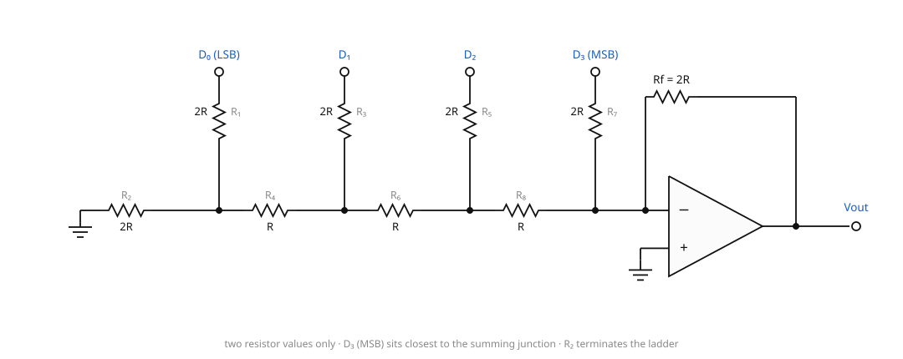

### The Thévenin argument

·CH4 slides 45 and 46 — two slides that carry **no text layer at all**; they are pure figures, read
here from the rendered pages.

The trick is that at every node the ladder looks like $2R$ in both directions, so each section
halves the voltage passed to the next.

**(a) $D_3 = 1$, all others 0** ·CH4 slide 45(a). With $D_2$, $D_1$, $D_0$ grounded the whole ladder
to the left collapses to $R_{\text{EQ}} = 2R$, which hangs off the virtual-ground node and therefore
carries no current:

$$I = \frac{5\ \text{V}}{2R}$$

$$V_{\text{out}} = -I R_f = -\left(\frac{5\ \text{V}}{2R}\right)2R = -5\ \text{V}$$

[fig] **Fig. 6-9** — equivalent circuit for $D_3 = 1$, $D_2 = D_1 = D_0 = 0$ ·CH4 slide 45(a),
redrawn

```yaml
figure_data:
  type: schematic
  case: "D3 = 1, D2 = D1 = D0 = 0"
  source: +5 V through R7 = 2R
  ladder_collapse: {R_EQ: 2R, reason: "D2, D1, D0 grounded"}
  summing_node: "virtual ground, so R_EQ carries no current"
  current: "I = 5 V / 2R"
  feedback: {Rf: 2R}
  result: "V_out = -5 V"
```

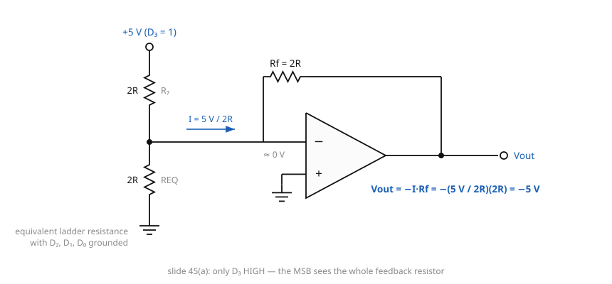

**(b), (c), (d) — the lower bits** ·CH4 slides 45(b), 46(c), 46(d). Each lower bit is separated from
the summing junction by one more $R$–$2R$ section, and each section halves the Thévenin voltage while
leaving $R_{\text{TH}} = R$:

| Input HIGH | $V_{\text{TH}}$ | $I = V_{\text{TH}}/2R$ | $V_{\text{out}} = -I R_f$ | Slide |
|---|---|---|---|---|
| $D_3$ only | $5$ V direct | $5\ \text{V}/2R$ | $-5$ V | 45(a) |
| $D_2$ only | $+2.5$ V | $2.5\ \text{V}/2R$ | $-2.5$ V | 45(b) |
| $D_1$ only | $+1.25$ V | $1.25\ \text{V}/2R$ | $-1.25$ V | 46(c) |
| $D_0$ only | $+0.625$ V | $0.625\ \text{V}/2R$ | $-0.625$ V | 46(d) |

Worked once, for $D_2$ ·CH4 slide 45(b): the $+5$ V source drives $R_5 = 2R$ with $R_{\text{EQ}} = 2R$
to ground, so

$$V_{\text{TH}} = 5\ \text{V}\times\frac{2R}{2R+2R} = 2.5\ \text{V},\qquad R_{\text{TH}} = 2R\parallel 2R = R$$

That source then reaches the summing junction through $R_8 = R$, giving a total of $2R$ in the path,
while $R_7 = 2R$ hangs off the virtual ground and takes $I \cong 0$:

$$I = \frac{2.5\ \text{V}}{2R},\qquad V_{\text{out}} = -\left(\frac{2.5\ \text{V}}{2R}\right)2R = -2.5\ \text{V}$$

[fig] **Fig. 6-10** — the reduced form common to slides 45(b), 46(c) and 46(d), redrawn

```yaml
figure_data:
  type: schematic
  case: "one lower bit HIGH, Thevenin reduction of everything to its left"
  chain: "V_TH - R_TH(R) - R8(R) - summing junction"
  shunt: {R7: 2R, current: "approximately 0, held at virtual ground"}
  feedback: {Rf: 2R}
  cases:
    - {bit: D2, V_TH: 2.5 V, V_out: -2.5 V}
    - {bit: D1, V_TH: 1.25 V, V_out: -1.25 V}
    - {bit: D0, V_TH: 0.625 V, V_out: -0.625 V}
  rule: "each further R-2R section halves V_TH; R_TH stays at R"
```

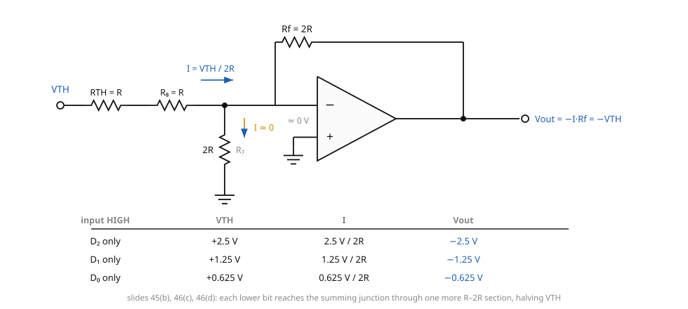

### The bit-contribution formula

[eq: r2r-bit-contribution] — each input that is HIGH contributes, independently of the others:

$$\boxed{\;V_{\text{out}}(D_i) = -\frac{V_S}{2^{\,n-1-i}}\;}$$

- $V_S$ — input HIGH level voltage, in volts
- $n$ — number of bits
- $i$ — bit number, with $i = 0$ the LSB, matching the deck's own $D_0 \ldots D_3$ labelling
- valid for the standard ladder with $R_f = 2R$

⚠ VERIFY (V06-9) — slide 44 prints this as $V_{\text{out}} = -\dfrac{V_S}{2^{\,n-i}}$, which is out
by one power of two against the deck's own labelling. Substituting $n = 4$, $i = 3$ (the MSB) into
the printed form gives $-V_S/2 = -2.5$ V, but slides 45(a) and 46 analyse that exact case from the
circuit and get $-5$ V. A nodal solution of the network confirms the circuit, not the formula:
the four single-bit outputs are $-0.625$, $-1.25$, $-2.5$ and $-5$ V. The printed form would be
correct only if the bits were numbered $1$ to $n$; they are numbered $0$ to $n-1$ throughout.

[eq: r2r-full-transfer] [added] — summing the corrected contributions over all HIGH bits gives the
whole transfer characteristic in one line:

$$\boxed{\;V_{\text{out}} = -\frac{V_S}{2^{\,n-1}}\,D\;}$$

- $D$ — decimal value of the input code
- so full scale is $-V_S(2^n-1)/2^{\,n-1}$, which for $n=4$, $V_S = 5$ V is $-9.375$ V, and the step
  is $-V_S/2^{\,n-1} = -0.625$ V. Verified against a nodal solution for all sixteen codes.

### [ex] Example 10 — R/2R ladder with input 1011

·CH4 slide 47

> An R-2R ladder has a binary input of 1011. If a HIGH $= +5.0$ V and a LOW $= 0$ V, what is
> $V_{\text{out}}$?

The circuit has $R_1 = R_3 = R_5 = R_7 = 50\ \text{k}\Omega$ ($2R$),
$R_2 = 50\ \text{k}\Omega$ (the terminator), $R_4 = R_6 = R_8 = 25\ \text{k}\Omega$ ($R$) and
$R_f = 50\ \text{k}\Omega$ ·CH4 slide 47. The code $1011$ means $D_3 = 1$, $D_2 = 0$, $D_1 = 1$,
$D_0 = 1$.

Apply the corrected contribution formula to each HIGH input and sum:

$$V_{\text{out}}(D_3) = -\frac{5\ \text{V}}{2^{\,4-1-3}} = -\frac{5}{1} = -5\ \text{V}$$

$$V_{\text{out}}(D_1) = -\frac{5\ \text{V}}{2^{\,4-1-1}} = -\frac{5}{4} = -1.25\ \text{V}$$

$$V_{\text{out}}(D_0) = -\frac{5\ \text{V}}{2^{\,4-1-0}} = -\frac{5}{8} = -0.625\ \text{V}$$

$$V_{\text{out}} = -5 - 1.25 - 0.625 = \boxed{\;-6.875\ \text{V}\;}$$

The one-line check with [eq: r2r-full-transfer]: $1011_2 = 11$, so
$V_{\text{out}} = -\dfrac{5}{8}\times 11 = -6.875$ V.

⚠ VERIFY (V06-9, continued) — the slide reaches $-3.4375$ V, exactly half of the correct value,
because it applies the off-by-one formula: it prints $V_{\text{out}}(D_0) = -5/2^{4-0} = -0.3125$ V,
$V_{\text{out}}(D_1) = -5/2^{4-1} = -0.625$ V and $V_{\text{out}}(D_3) = -5/2^{4-3} = -2.5$ V. Those
three lines are arithmetically consistent with each other and with the printed sum, so the slide is
internally tidy — it simply contradicts slides 45 and 46, which analyse the same network. A nodal
solution of the network with the printed component values gives $-6.875$ V.

⚠ VERIFY (C06-3) — every resistance on slides 44 and 47 is printed as "kW" — "50 kW", "25 kW",
"$R_f = 50\ \text{kW}$". The ohm sign has been replaced by a W somewhere in the file's font
handling. Read all of them as $\text{k}\Omega$.

[fig] **Fig. 6-11** — the slide-47 ladder with its component values and applied levels, redrawn

```yaml
figure_data:
  type: schematic
  converter: R-2R ladder
  bits: 4
  code: "1011"
  high_level: +5.0 V
  levels: {D0: +5.0 V, D1: +5.0 V, D2: 0 V, D3: +5.0 V}
  input_legs: {R1: 50 kohm, R3: 50 kohm, R5: 50 kohm, R7: 50 kohm}
  series_arms: {R4: 25 kohm, R6: 25 kohm, R8: 25 kohm}
  terminator: {R2: 50 kohm}
  feedback: {Rf: 50 kohm}
  result_corrected: "-6.875 V"
  result_printed: "-3.4375 V (slide 47 — see V06-9)"
```

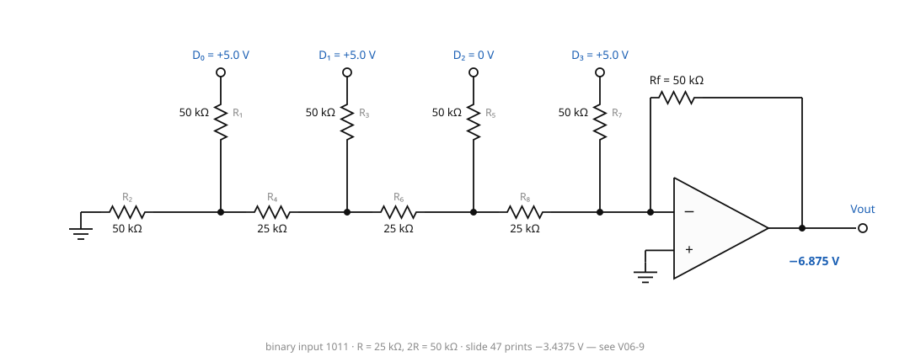

---

## 6.7 Resolution and accuracy as data-sheet specifications

·CH4 slide 48

| Symbol | Meaning | Units | Typical |
|---|---|---|---|
| LSB | one least-significant-bit step of the output | V or A | — |
| $\%\,\text{res}$ | resolution as a fraction of full scale | % | 0.39 % |
| accuracy | agreement between actual and expected output | % or LSB | $\pm\tfrac{1}{2}$ LSB |

Practical points ·CH4 slide 48:

- The $R$–$2R$ ladder is relatively easy to manufacture and is available in IC packages.
- DACs based on the $R$–$2R$ network are available in **8, 10 and 12-bit** versions.
- **Resolution** is defined here as the reciprocal of the number of steps in the output — the
  percentage form of [eq: dac-percentage-resolution].
- **Accuracy** is derived from a comparison of the actual output to the expected output. It is a
  different specification from resolution: a converter can resolve finely and still be inaccurate.

### [ex] Example 11 — resolution and accuracy of an 8-bit ladder

·CH4 slide 48

> What is the resolution of the BCN31 R-2R ladder network, which has 8 bits?

$$2^8 - 1 = 255\ \text{steps}$$

$$\%\ \text{resolution} = \frac{1}{255}\times 100\,\% = 0.392\,\% \approx 0.39\,\%$$

And the accuracy quoted for the same part ·CH4 slide 48:

$$\pm\tfrac{1}{2}\ \text{LSB} = \pm\tfrac{1}{2} \times 0.392\,\% = \pm 0.196\,\% \approx \pm 0.2\,\%$$

Both recomputed and confirmed — this slide handles the percentage conversion correctly, which is
what makes the $0.244\,\%$ on slide 37 identifiable as an error (V06-6).

⚠ VERIFY (C06-6) — the bit count is written as upper-case $N$ on slides 34–37 and as lower-case $n$
on slides 44 and 47, for the same quantity. Both appear within this one range; treat them as
identical.

---

## 6.8 Homework

[exercise] ·CH4 slide 49. Transcribed in full and left **unsolved** — this is set for the student.

> 1. Discuss the following concepts as used in ADC & DAC
>     - i. Resolution
>     - ii. Accuracy
>     - iii. Full scale error
>     - iv. Monotonicity
>     - v. Linearity error
>     - vi. Maximum sampling frequency – Settling time
>
> 2. Analyze various applications of ADC & DAC

Where the answers live, for orientation only:

- **Resolution** — §6.3 and §6.7 here; §5.6 and §5.8 in the ADC file.
- **Accuracy** — §6.7 here.
- **Full scale error** — §6.4 here.
- **Maximum sampling frequency** — §5.3 in the ADC file (the Nyquist criterion).
- **Monotonicity**, **linearity error** and **settling time** are named nowhere else in any of the
  six decks — a search of all six confirms they appear only on this slide. The question deliberately
  sends the student outside the course material for those three.

---

## Verification flags raised in this file

| ID | Slide | One-line summary |
|---|---|---|
| V06-1 | 34 | "$2^N-1$ = no of states"; $2^N-1$ is the number of **steps**, states are $2^N$ |
| V06-2 | 35 | $5/1023$ printed as $8.888\times10^{-3}$ V; it is $4.888\times10^{-3}$ V |
| V06-3 | 36 | every inequality reversed; the printed chain yields $N \le 7$, the answer given is 8 |
| V06-4 | 37 | BCD-coded DAC worked with the binary count 4095; it should be 999 |
| V06-5 | 37 | "Step size $=2^N-1=4095$" labels a dimensionless count as a voltage |
| V06-6 | 37 | $0.00244$ V restated as $0.244\,\%$; the percentage resolution is $0.0244\,\%$ (0.1 % corrected) |
| V06-7 | 37 | $695\times0.00244$ printed as $1.6978$; the product is $1.6958$, corrected answer $6.95$ V |
| V06-8 | 38 | 19 % of 2 mA printed as $3.8\ \mu$A; it is $380\ \mu$A — divided by 100 twice |
| V06-9 | 44, 47 | $V_{\text{out}} = -V_S/2^{\,n-i}$ is off by one; gives $-3.4375$ V where the circuit gives $-6.875$ V |
| C06-1 | 32, 33 | working headed "For 0110," when the code is 0011 and 11101 |
| C06-2 | 36 | "How may bit are required" |
| C06-3 | 44, 47 | resistances printed as "kW" instead of kΩ |
| C06-4 | 43 | a voltage term "$+\,0$ V" inside a sum of currents |
| C06-5 | 39 | $V_{\text{out}} = I_f R_f$ written without the minus sign of the inverting amplifier |
| C06-6 | 34–37 vs 44, 47 | bit count as $N$ in one half and $n$ in the other |

Full entries, with what each slide prints and why it is wrong, are in `flags/06.md`.

---

## Slide coverage

| Slide | Content | Where it is taught |
|---|---|---|
| 30 | Digital-to-Analog Conversion Methods — one bullet | §6.1 |
| 31 | D/A conversion, $K$, worked example (code 0110) | §6.2, Example 1 |
| 32 | Example — code 0011 | §6.2, Example 2 |
| 33 | Example — 5-bit, code 11101 | §6.2, Example 3 |
| 34 | Resolution, formula and gloss | §6.3 |
| 35 | Example — 10-bit, 5 V full scale | §6.3, Example 4 |
| 36 | Example — bits needed for a 40 µA resolution | §6.3, Example 5 |
| 37 | Example — 12-bit BCD DAC | §6.3, Example 6 |
| 38 | Full-scale error, definition and example | §6.4, Example 7 |
| 39 | Binary-weighted-input DAC, circuit and currents | §6.5, Fig. 6-3 |
| 40 | Example — counting sequence: circuit (a) and waveforms (b) | §6.5, Example 8, Figs 6-4, 6-5 |
| 41 | Solution part 1 — branch currents and single-bit outputs | §6.5, Example 8 |
| 42 | Solution part 2 — 16-row table and output staircase | §6.5, Example 8, Fig. 6-6 |
| 43 | Example — 120/60/30/15 kΩ ladder, code 1101 | §6.5, Example 9, Fig. 6-7 |
| 44 | R/2R ladder DAC, circuit and contribution formula | §6.6, Fig. 6-8 |
| 45 | **Image only, no text layer** — equivalent circuits (a) $D_3$ and (b) $D_2$ | §6.6, Figs 6-9, 6-10 |
| 46 | **Image only, no text layer** — equivalent circuits (c) $D_1$ and (d) $D_0$ | §6.6, Fig. 6-10 |
| 47 | Example — R/2R ladder, input 1011 | §6.6, Example 10, Fig. 6-11 |
| 48 | Resolution and accuracy of DACs, 8-bit example | §6.7, Example 11 |
| 49 | Homework | §6.8 |

Every slide in the range 30–49 is accounted for. Slide 40 repeats slide 39's closing bullet about
accurate resistors verbatim; it is taught once, in §6.5.

Figures on slides 39, 40, 41, 43, 44, 45, 46 and 47 are textbook scans. None is reproduced: all
eight have been redrawn as SVG from the rendered pages, and Figs 6-1 and 6-2 are our own additions
where the deck states a definition but draws nothing.
