# 07 — FSM Fundamentals and Sequential Circuit Analysis

Covers slides 1–38 of Chapter 5, plus the separate one-page excitation-table handout.

Chapter 5 is 118 slides long and is carried across three files:

- **07** (this file) — FSM fundamentals and sequential-circuit **analysis**, slides 1–38.
- **08 — Sequential Circuit Design and Sequence Detectors** — the design procedure and sequence
  detectors, from slide 39 on.
- **09** — the remainder of the chapter, state reduction and state assignment.

Handout codes used here: `CH5` for the chapter deck, `EXC` for the excitation-table page. The
printed footer number equals the PDF page number, so `·CH5 slide 29` is the slide headed
"Analysis with JK Flip-Flops" (its diagrams and table).

**Analysis versus design.** Everything in this file runs in one direction ·CH5 slide 19:

$$\text{circuit diagram}\;\longrightarrow\;\text{equations}\;\longrightarrow\;\text{state table}\;\longrightarrow\;\text{state diagram}$$

Design runs the other way — specification to logic diagram — and is file 08.

Seven defects were raised against these pages: three substantive, four cosmetic. Each is flagged
inline at the point of use and collected in `flags/07.md`.

---

## 7.1 What a finite state machine is

·CH5 slides 3–4

| Symbol | Meaning | Units | Typical |
|---|---|---|---|
| $n$ | number of storage bits (flip-flops) in the machine | — | 1–8 |
| $2^n$ | number of distinct states those bits can hold | — | 2, 4, 8, 256 |

Combinational design rested on two things ·CH5 slide 3:

1. a **formal way to describe** the desired circuit behaviour — a Boolean equation, or a truth table;
2. a **well-defined process** for converting that behaviour into a circuit.

Sequential design needs the same two things, and the finite-state machine supplies the first.

[def] A **finite-state machine (FSM)** is a way to describe the desired behaviour of a sequential
circuit — the counterpart of the Boolean equation for combinational behaviour ·CH5 slide 3.

[def] A **state machine** describes a system in terms of the set of states the system passes
through ·CH5 slide 3. Two things are required:

- the system **must** have memory;
- the machine must have a **set of inputs** and a **set of outputs**.

[def] A synchronous sequential circuit is called a **finite-state machine** when it has a *finite*
number of states ·CH5 slide 4.

An FSM is a **reactive system**: its response to a given stimulus is not the same on every
occasion, because the response depends on the current state ·CH5 slide 4.

The set of states corresponds to all possible combinations of the internal storage ·CH5 slide 4:

$$\boxed{\;\text{number of possible states} = 2^{\,n}\;}$$

[eq: fsm-state-count] — $n$ is the number of bits of storage. Three flip-flops therefore give at
most eight states.

---

## 7.2 The clocked synchronous FSM structure

·CH5 slides 5–7

| Symbol | Meaning | Units | Typical |
|---|---|---|---|
| $Q_0 \ldots Q_{m-1}$ | flip-flop outputs — together, the current state | logic level | 0 or 1 |
| $m$ | number of flip-flops | — | 1–4 |
| $F$ | next-state logic (combinational) | — | — |
| $G$ | output logic (combinational) | — | — |

Three definitions carry the whole structure ·CH5 slide 5:

- [def] **States** — determined by the possible values held in the sequential storage elements.
- [def] **Transitions** — a change of state.
- [def] **Clock** — controls *when* the state may change, by controlling the storage elements.

[fig] **Fig. 7-1** — general structure of a clocked synchronous FSM ·CH5 slide 5

```yaml
figure_data:
  type: block-diagram
  blocks:
    combinational_logic: {inputs: [external inputs, current state], outputs: [external outputs, next state]}
    storage_elements:    {count: m, clocked: true, holds: current state}
  nets:
    current_state: storage element outputs fed back into the combinational logic
    next_state:    combinational logic outputs fed into the storage element inputs
    clock:         common to every storage element
  note: the only feedback path in the machine passes through the storage elements
```

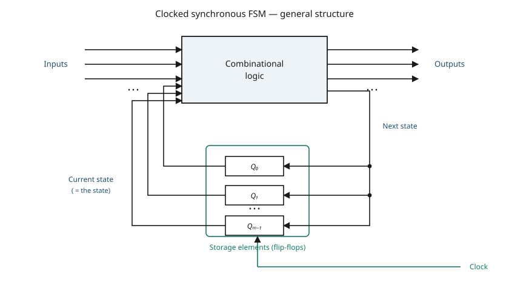

Implementing an FSM therefore comes down to implementing the **transition functions** in
combinational logic, with the current state arriving from the flip-flop outputs and the next state
being written back into the flip-flop inputs ·CH5 slide 6.

### The two common models

·CH5 slide 7

**Mealy** ·CH5 slide 7:

- the output is a function of **both** the present state and the input;
- Mealy machines have **fewer states**;
- an input change can cause an output change as soon as the logic settles;
- they react faster to inputs — in the *same* cycle, without waiting for a clock edge.

**Moore** ·CH5 slide 7:

- the output is a function of the **present state only**;
- Moore machines have **more states**;
- they are **safer** to use, because outputs change only at a clock edge — always one cycle later;
- more logic *may* be needed to decode state into outputs, so there *may* be more gate delay after
  the clock edge.

---

## 7.3 Mealy and Moore machines side by side

·CH5 slides 8–9

| Symbol | Meaning | Units | Typical |
|---|---|---|---|
| $F_1, F_2$ | next-state function, Mealy and Moore respectively | — | — |
| $G_1, G_2$ | output function, Mealy and Moore respectively | — | — |

Both models use the same three blocks — next-state logic, state memory, output logic — and differ
only in what is wired into the output logic ·CH5 slide 8.

$$\text{Mealy:}\qquad \text{next state} = F_1(\text{current state},\,\text{inputs})$$

$$\text{Mealy:}\qquad \text{output} = G_1(\text{current state},\,\text{inputs})$$

[eq: mealy-model] ·CH5 slide 8

$$\text{Moore:}\qquad \text{next state} = F_2(\text{current state},\,\text{inputs})$$

$$\text{Moore:}\qquad \text{output} = G_2(\text{current state})$$

[eq: moore-model] ·CH5 slide 8

The next-state function is identical in form; only the output function differs. That single
difference is what the whole Mealy/Moore distinction reduces to.

[fig] **Fig. 7-2** — Mealy and Moore structures ·CH5 slide 8

```yaml
figure_data:
  type: block-diagram-pair
  common_blocks: [next-state logic F, state memory, output logic G]
  signals: {excitation: F -> state memory, current_state: state memory -> G and back to F, clock: into state memory}
  mealy:
    output_logic_inputs: [current state, external inputs]
  moore:
    output_logic_inputs: [current state]
```

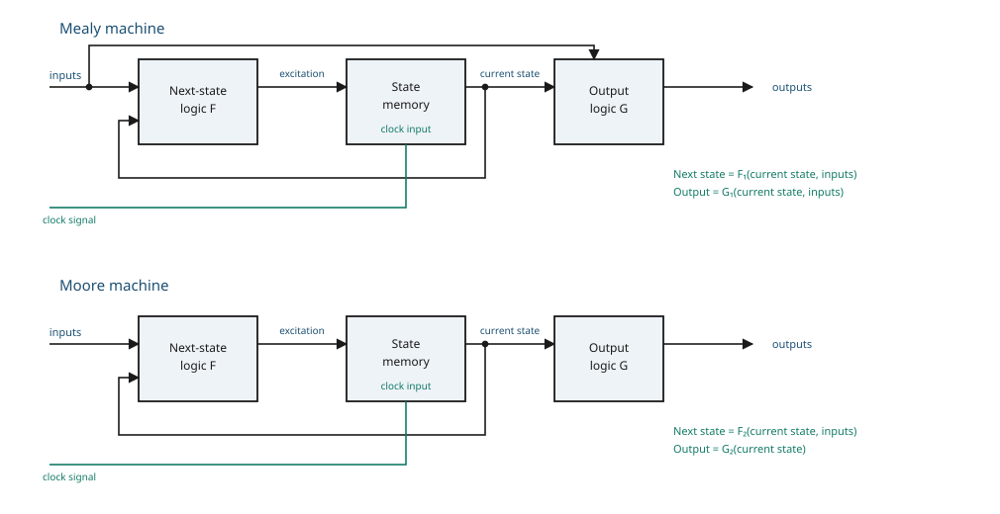

### The comparison table

·CH5 slide 9

| | Mealy machine | Moore machine |
|---|---|---|
| **Output** | depends on both the present state and the present input | depends on the present state only |
| **Number of states** | generally **fewer** than Moore | generally **more** than Mealy |
| **Output function** | a function of the transitions, and changes when the input logic on the present state has settled | a function of the current state, and changes at the clock edges, whenever state changes occur |
| **Speed** | reacts faster; generally reacts in the **same** clock cycle | more logic is needed to decode the outputs, giving more circuit delay; generally reacts **one clock cycle later** |

---

## 7.4 The four steps to build an FSM

·CH5 slide 10

| Step | What it produces | What the deck says about it |
|---|---|---|
| **1 — state diagram and state table** | the behavioural description | there are no set procedures; it is application-dependent. Choose a state to be the **starting state** when power is first applied. A state diagram may be represented by a graph *or* by a table |
| **2 — state assignment** | a binary code per state | assign a unique binary number to each state, then rewrite the state table using the assigned number for each state |
| **3 — combinational logic** | next-state and output equations | derive the logic for the next-state function and the output function |
| **4 — implementation** | the circuit | — (the slide gives no further detail) |

Steps 1 and 2 are worked in full in this file's examples; steps 3 and 4 are the subject of file 08.

---

## 7.5 Application example — a binary counter

·CH5 slides 11–12 (slide 11 is a section title with no content)

| Symbol | Meaning | Units | Typical |
|---|---|---|---|
| — | the counter has no data input; only the clock advances it | — | — |

[ex] **Binary counter** ·CH5 slide 12. Consider a circuit that stores a number and increments the
value on every clock edge; on reaching the largest value it starts again from 0.

The deck asks two questions and answers them with the diagram ·CH5 slide 12:

- **How many states?** Eight — the diagram shows $000$ through $111$, so three flip-flops
  ($2^3 = 8$) [added].
- **How many inputs?** None. There is no data input at all; every transition is taken on the clock
  edge alone [added].

The output of each state is the state's own code, printed under the circle — so this is a **Moore**
machine whose output logic is the identity.

[fig] **Fig. 7-3** — state diagram of the three-bit binary counter ·CH5 slide 12

```yaml
figure_data:
  type: state-diagram
  model: Moore
  states: ["000","001","010","011","100","101","110","111"]
  reset: "000"
  inputs: none
  outputs: {"000":"000","001":"001","010":"010","011":"011","100":"100","101":"101","110":"110","111":"111"}
  transitions:
    - {from: "000", on: "clock edge", to: "001"}
    - {from: "001", on: "clock edge", to: "010"}
    - {from: "010", on: "clock edge", to: "011"}
    - {from: "011", on: "clock edge", to: "100"}
    - {from: "100", on: "clock edge", to: "101"}
    - {from: "101", on: "clock edge", to: "110"}
    - {from: "110", on: "clock edge", to: "111"}
    - {from: "111", on: "clock edge", to: "000"}
```

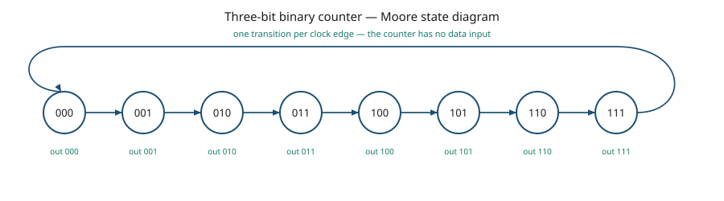

---

## 7.6 Application example — a serial adder

·CH5 slides 13–17

| Symbol | Meaning | Units | Typical |
|---|---|---|---|
| $a$ | first input bit stream, LSB first | logic level | 0 or 1 |
| $b$ | second input bit stream, LSB first | logic level | 0 or 1 |
| $z$ | output sum bit for the current column | logic level | 0 or 1 |
| $s$ | present state — the carry **into** the current column | logic level | 0 or 1 |
| $s'$ | next state — the carry **out** of the current column | logic level | 0 or 1 |
| $S_0$ | the state "no carry in" | — | encoded $s = 0$ |
| $S_1$ | the state "carry in" | — | encoded $s = 1$ |

Note the clash: $s'$ here means the **next** value of $s$, not the complement of $s$. The deck
uses a prime for both meanings in different places — see §7.17.

[ex] **Serial adder.** Add two infinite input bit streams; the streams arrive with the
least-significant bit first ·CH5 slide 13. The deck sets out six sub-steps ·CH5 slide 13:

1. how many states are needed to represent the FSM;
2. draw a state diagram (a Mealy machine, say);
3. write output and next-state tables;
4. encode states, inputs and outputs as bits;
5. determine logic equations for the next state and the outputs;
6. draw the circuit.

All six are then worked in the deck itself, on slides 14–17.

### Step 1 — how many states

·CH5 slide 14

Column-by-column addition needs to remember exactly one thing: whether a carry is coming in. So
·CH5 slide 14:

- **Two states**: $S_0$ (no carry in) and $S_1$ (carry in);
- **Inputs**: $a$ and $b$;
- **Output**: $z$ — the sum of the inputs $a$, $b$ and the carry-in, one bit at a time;
- a **carry-out is the next carry-in state**.

The deck illustrates this with the pair $a = \ldots 10110$ and $b = \ldots 01111$ giving
$z = \ldots 00101$ ·CH5 slide 14.

[ex] **Checking that example arithmetic** [added]. Working the five low columns, right to left,
with $c$ for the carry:

$$a_0 + b_0 + c_0 = 0 + 1 + 0 = 1 \;\Rightarrow\; z_0 = 1,\; c_1 = 0$$

$$a_1 + b_1 + c_1 = 1 + 1 + 0 = 2 \;\Rightarrow\; z_1 = 0,\; c_2 = 1$$

$$a_2 + b_2 + c_2 = 1 + 1 + 1 = 3 \;\Rightarrow\; z_2 = 1,\; c_3 = 1$$

$$a_3 + b_3 + c_3 = 0 + 1 + 1 = 2 \;\Rightarrow\; z_3 = 0,\; c_4 = 1$$

$$a_4 + b_4 + c_4 = 1 + 0 + 1 = 2 \;\Rightarrow\; z_4 = 0,\; c_5 = 1$$

Reading $z_4 z_3 z_2 z_1 z_0$ gives $00101$, which is what the slide prints. As a decimal check,
$10110_2 = 22$ and $01111_2 = 15$, and $22 + 15 = 37 = 100101_2$ — the low five bits are $00101$
with a carry out of 1.

### Step 2 — the state diagram

·CH5 slide 15

[fig] **Fig. 7-4** — Mealy state diagram of the serial adder ·CH5 slide 15

```yaml
figure_data:
  type: state-diagram
  model: Mealy
  states: [S0, S1]
  reset: S0
  state_meaning: {S0: carry-in = 0, S1: carry-in = 1}
  edge_label_format: "a b / z"
  transitions:
    - {from: S0, on: "00", to: S0, out: 0}
    - {from: S0, on: "01", to: S0, out: 1}
    - {from: S0, on: "10", to: S0, out: 1}
    - {from: S0, on: "11", to: S1, out: 0}
    - {from: S1, on: "00", to: S0, out: 1}
    - {from: S1, on: "01", to: S1, out: 0}
    - {from: S1, on: "10", to: S1, out: 0}
    - {from: S1, on: "11", to: S1, out: 1}
```

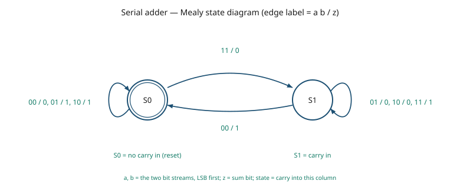

Every one of these eight transitions was rederived from $z = a + b + s \bmod 2$ and
$s' = \lfloor (a+b+s)/2 \rfloor$ and matches the deck cell for cell.

### Step 3 — the state table

·CH5 slide 16, symbolic form

| $a$ | $b$ | current state | $z$ | next state |
|---|---|---|---|---|
| 0 | 0 | $S_0$ | 0 | $S_0$ |
| 0 | 1 | $S_0$ | 1 | $S_0$ |
| 1 | 0 | $S_0$ | 1 | $S_0$ |
| 1 | 1 | $S_0$ | 0 | $S_1$ |
| 0 | 0 | $S_1$ | 1 | $S_0$ |
| 0 | 1 | $S_1$ | 0 | $S_1$ |
| 1 | 0 | $S_1$ | 0 | $S_1$ |
| 1 | 1 | $S_1$ | 1 | $S_1$ |

### Step 4 — encode states, inputs and outputs as bits

·CH5 slide 16, encoded form, with $S_0 \to s = 0$ and $S_1 \to s = 1$

| $a$ | $b$ | $s$ | $z$ | $s'$ |
|---|---|---|---|---|
| 0 | 0 | 0 | 0 | 0 |
| 0 | 1 | 0 | 1 | 0 |
| 1 | 0 | 0 | 1 | 0 |
| 1 | 1 | 0 | 0 | 1 |
| 0 | 0 | 1 | 1 | 0 |
| 0 | 1 | 1 | 0 | 1 |
| 1 | 0 | 1 | 0 | 1 |
| 1 | 1 | 1 | 1 | 1 |

Both forms were regenerated from the full-adder relations and agree with the deck in all
sixteen entries.

### Step 5 — logic equations

·CH5 slide 17

The deck fills two Karnaugh maps with $a$ down the side and $b, \text{CS}$ across the top
(the column order is $00, 01, 11, 10$, where CS is the current state $s$), and then reads off a
sum of products.

⚠ VERIFY (V07-1) — for the output the deck prints

$$z = \bar{a}b\bar{s} \;+\; a\,\overline{bs} \;+\; \overline{ab}\,s \;+\; abs$$

with a **single continuous overbar spanning two letters** in the second and third terms. Read
literally, $\overline{bs} = \bar b + \bar s$, and the expression evaluates to 1 for seven of the
eight input combinations instead of four. The intended — and correct — form gives each literal its
own bar:

$$\boxed{\;z = \bar{a}\,b\,\bar{s} \;+\; a\,\bar{b}\,\bar{s} \;+\; \bar{a}\,\bar{b}\,s \;+\; a\,b\,s\;}$$

[eq: serial-adder-sum] ·CH5 slide 17, corrected. That is exactly the three-input exclusive-OR:

$$z = a \oplus b \oplus s$$

The next-state equation is printed correctly, with individual bars ·CH5 slide 17:

$$s' = a\,b\,\bar{s} \;+\; \bar{a}\,b\,s \;+\; a\,\bar{b}\,s \;+\; a\,b\,s$$

⚠ VERIFY (C07-1) — the K-map on the same slide is grouped into three overlapping pairs, which is
the working for the **minimal** majority form. The printed equation is the unminimised canonical
sum instead. Both describe the same function; the minimal form is the one worth carrying:

$$\boxed{\;s' = ab + bs + as\;}$$

[eq: serial-adder-carry] ·CH5 slide 17, minimised [added]. This is the familiar full-adder
carry: a carry out whenever at least two of $a$, $b$, $s$ are 1.

### Step 6 — the circuit

·CH5 slide 17

[fig] **Fig. 7-5** — serial-adder implementation ·CH5 slide 17

```yaml
figure_data:
  type: circuit
  storage: {type: D flip-flop, count: 1, holds: carry, D_input: s', Q_output: s}
  combinational_block:
    inputs: [a, b, s]
    outputs: {z: "a XOR b XOR s", s_next: "ab + bs + as"}
  nets:
    - {from: comb.s_next, to: FF.D}
    - {from: FF.Q, to: comb.s}
    - {from: comb.z, to: external output}
  clock: single, into the flip-flop
```

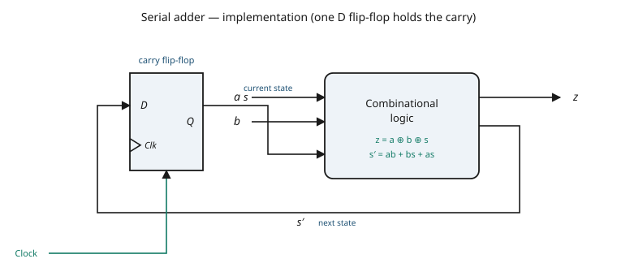

---

## 7.7 State analysis — what it is

·CH5 slides 18–19 (slide 18 is a section title, slide 20 a sub-section title, both without content)

Two one-line statements set the direction of travel ·CH5 slide 19:

- [def] The **analysis** of sequential circuits starts from a **circuit diagram** and culminates in
  a **state table or state diagram**.
- [def] The **design** of a sequential circuit starts from a **set of specifications** and
  culminates in a **logic diagram**.

The rest of this file is analysis. The chain is
circuit diagram $\to$ equations $\to$ state table $\to$ state diagram ·CH5 slide 23.

---

## 7.8 State equations

·CH5 slide 21

| Symbol | Meaning | Units | Typical |
|---|---|---|---|
| $A, B$ | flip-flop outputs — the two state variables | logic level | 0 or 1 |
| $A'$, $B'$ | complements of $A$ and $B$ | logic level | 0 or 1 |
| $x$ | external input | logic level | 0 or 1 |
| $y$ | external output | logic level | 0 or 1 |
| $A(t+1)$ | value of $A$ one clock edge later | logic level | 0 or 1 |
| $t$ | present clock period index | — | — |

[def] A **state equation** — also called a **transition equation** — is an algebraic expression
that specifies the condition for a flip-flop state transition ·CH5 slide 21. It gives the next
state as a function of the present state and the inputs.

- $(t+1)$ denotes the next state of the flip-flop, one clock edge later ·CH5 slide 21.
- The right side is a Boolean expression giving the present-state and input conditions that make
  the next state equal to 1 ·CH5 slide 21.
- For a D flip-flop the $D$ input **determines the value of the next state** ·CH5 slide 21, which
  is why reading $D$ off the schematic is the whole of the analysis.

The deck's example circuit has two D flip-flops and gives ·CH5 slide 21:

$$A(t+1) = A(t)\,x(t) + B(t)\,x(t)$$

$$B(t+1) = A'(t)\,x(t)$$

$$Y(t) = \big[A(t) + B(t)\big]\,x'(t)$$

Dropping the explicit time arguments on the right, as the slide then does:

$$\boxed{\;A(t+1) = A x + B x\;}$$

[eq: state-equation-a] ·CH5 slide 21

$$\boxed{\;B(t+1) = A' x\;}$$

[eq: state-equation-b] ·CH5 slide 21

$$\boxed{\;Y(t) = (A + B)\,x'\;}$$

[eq: output-equation-y] ·CH5 slide 21. Slide 22 prints the same output equation multiplied out as
$Y(t) = Ax' + Bx'$; the two are identical.

[fig] **Fig. 7-6** — the example sequential circuit ·CH5 slide 21

```yaml
figure_data:
  type: circuit
  storage: [{name: FF_A, type: D, outputs: [A, A']}, {name: FF_B, type: D, outputs: [B, B']}]
  gates:
    - {id: AND1, inputs: [A, x],  out: Ax}
    - {id: AND2, inputs: [B, x],  out: Bx}
    - {id: OR1,  inputs: [Ax, Bx], out: D_A}
    - {id: AND3, inputs: [A', x], out: D_B}
    - {id: OR2,  inputs: [A, B],  out: "A+B"}
    - {id: NOT1, inputs: [x],     out: "x'"}
    - {id: AND4, inputs: ["A+B", "x'"], out: y}
  equations:
    D_A: "A x + B x"
    D_B: "A' x"
    y:   "(A + B) x'"
  clock: common to both flip-flops
```

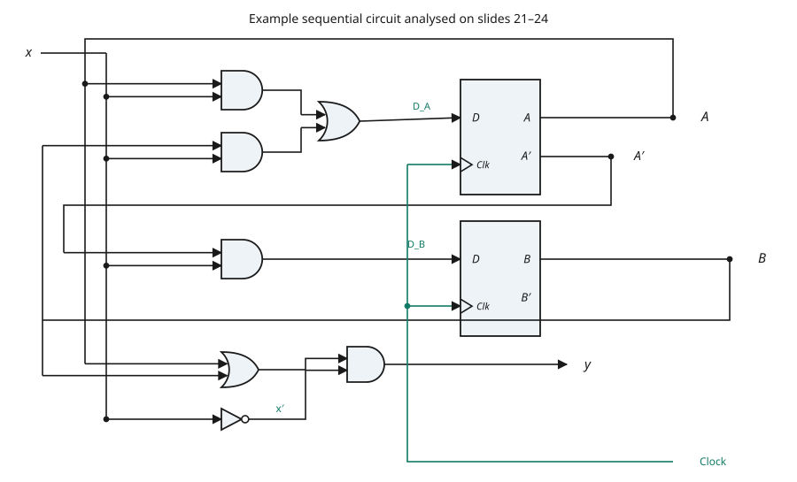

---

## 7.9 State tables

·CH5 slide 22

| Symbol | Meaning | Units | Typical |
|---|---|---|---|
| $m$ | number of flip-flops | — | 2 |
| $n$ | number of external inputs | — | 1 |
| $2^{m+n}$ | number of rows the state table needs | — | 8 |

[def] The time sequence of inputs, outputs and flip-flop states can be enumerated in a **state
table**, sometimes called a **transition table** ·CH5 slide 22.

$$\boxed{\;\text{rows} = 2^{\,m+n}\;}$$

[eq: state-table-rows] ·CH5 slide 22 — a circuit with $m$ flip-flops and $n$ inputs needs
$2^{m+n}$ rows. Here $m = 2$ and $n = 1$, so eight rows.

[ex] **State table for the slide-21 circuit** ·CH5 slide 22. Each row is evaluated from
$A(t+1) = (A+B)x$, $B(t+1) = A'x$, $y = (A+B)x'$.

| $A$ | $B$ | $x$ | $A(t+1)$ | $B(t+1)$ | $y$ |
|---|---|---|---|---|---|
| 0 | 0 | 0 | 0 | 0 | 0 |
| 0 | 0 | 1 | 0 | 1 | 0 |
| 0 | 1 | 0 | 0 | 0 | 1 |
| 0 | 1 | 1 | 1 | 1 | 0 |
| 1 | 0 | 0 | 0 | 0 | 1 |
| 1 | 0 | 1 | 1 | 0 | 0 |
| 1 | 1 | 0 | 0 | 0 | 1 |
| 1 | 1 | 1 | 1 | 0 | 0 |

All eight rows were recomputed from the equations and agree with the deck.

**Second form of the state table** ·CH5 slide 22 — the same information with the input moved into
the column headings, so there is one row per state instead of one row per state-and-input:

| present state $A\,B$ | next state, $x=0$ | next state, $x=1$ | $y$, $x=0$ | $y$, $x=1$ |
|---|---|---|---|---|
| 0 0 | 0 0 | 0 1 | 0 | 0 |
| 0 1 | 0 0 | 1 1 | 1 | 0 |
| 1 0 | 0 0 | 1 0 | 1 | 0 |
| 1 1 | 0 0 | 1 0 | 1 | 0 |

Reading the "next state, $x=0$" column: **whatever the present state, $x = 0$ sends the machine to
$00$** [added]. That falls straight out of $A(t+1) = (A+B)x$ and $B(t+1) = A'x$, both of which
carry a factor $x$.

---

## 7.10 State diagrams

·CH5 slides 23–24

| Symbol | Meaning | Units | Typical |
|---|---|---|---|
| circle | one state | — | labelled with the state code |
| directed line | one transition | — | labelled $x/y$ |
| $x/y$ | input $x$, output $y$ on that transition | — | e.g. $1/0$ |

[def] A **state diagram** graphically represents the information available in a state table
·CH5 slide 23. It is the pictorial representation of the behaviour of a sequential circuit, and it
shows clearly the transition of states from present state to next state, and the output, for a
corresponding input ·CH5 slide 23.

- A **state** is represented by a **circle** ·CH5 slide 23.
- The **transitions between states** are indicated by **directed lines** connecting the circles
  ·CH5 slide 23.
- The label $1/0$ means input $= 1$, output $= 0$ ·CH5 slide 23.

[fig] **Fig. 7-7** — state diagram of the slide-21 circuit ·CH5 slides 23–24

```yaml
figure_data:
  type: state-diagram
  model: Mealy
  states: ["00","01","10","11"]
  state_encoding: "A B"
  edge_label_format: "x / y"
  transitions:
    - {from: "00", on: 0, to: "00", out: 0}
    - {from: "00", on: 1, to: "01", out: 0}
    - {from: "01", on: 0, to: "00", out: 1}
    - {from: "01", on: 1, to: "11", out: 0}
    - {from: "10", on: 0, to: "00", out: 1}
    - {from: "10", on: 1, to: "10", out: 0}
    - {from: "11", on: 0, to: "00", out: 1}
    - {from: "11", on: 1, to: "10", out: 0}
```

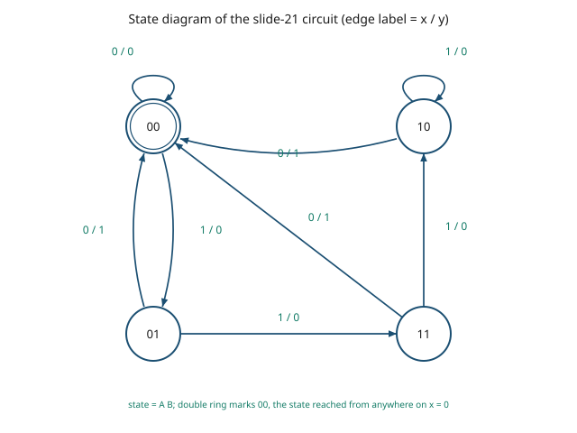

All eight edges were rederived from the state equations and match the deck's drawing.

---

## 7.11 Flip-flop input equations

·CH5 slide 25

| Symbol | Meaning | Units | Typical |
|---|---|---|---|
| $D_A$, $J_A$, $K_A$, $T_A$ | the input(s) driving the flip-flop whose output is $A$ | logic level | 0 or 1 |

Two definitions, and one consequence ·CH5 slide 25:

- [def] **Output equations** algebraically describe the part of the combinational circuit that
  generates the **external outputs**.
- [def] **Flip-flop input equations** describe the part of the circuit that generates the
  **inputs to the flip-flops**.
- The logic diagram of the circuit can therefore be expressed algebraically with **flip-flop input
  equations and output equations** — nothing else is needed.

The subscript carries the wiring: $D_A$ means "the $D$ input of the flip-flop whose output is $A$".

---

## 7.12 Analysis with D flip-flops

·CH5 slides 26–27

| Symbol | Meaning | Units | Typical |
|---|---|---|---|
| $D_A$ | the $D$ input of the flip-flop whose output is $A$ | logic level | 0 or 1 |
| $x, y$ | the two external inputs to this circuit | logic level | 0 or 1 |
| $\oplus$ | exclusive-OR | — | — |

[ex] **Analyse the circuit described by the input equation** ·CH5 slide 26:

$$D_A = A \oplus x \oplus y$$

The deck's reading of that one line ·CH5 slide 26:

- the symbol $D_A$ implies a **D flip-flop with output $A$**;
- $x$ and $y$ are the **inputs to the circuit**;
- **no output equations are given**, so the output is implied to come from the output of the
  flip-flop itself.

[fig] **Fig. 7-8** — the D flip-flop circuit ·CH5 slide 26

```yaml
figure_data:
  type: circuit
  storage: [{name: FF_A, type: D, output: A}]
  gates:
    - {id: XOR1, inputs: [x, y], out: "x XOR y"}
    - {id: XOR2, inputs: [A, "x XOR y"], out: D_A}
  equations: {D_A: "A XOR x XOR y"}
  note: A is fed back from the flip-flop output into XOR2
```

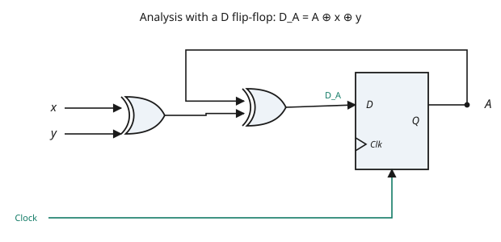

Because the next state of a D flip-flop *is* its $D$ input, the state equation follows immediately
[eq: d-analysis-state-equation] ·CH5 slide 27:

$$\boxed{\;A(t+1) = A \oplus x \oplus y\;}$$

The binary numbers under $A\,x\,y$ are listed from $000$ through $111$, and the next-state values
are obtained from that state equation ·CH5 slide 27:

| $A$ | $x$ | $y$ | $A(t+1)$ |
|---|---|---|---|
| 0 | 0 | 0 | 0 |
| 0 | 0 | 1 | 1 |
| 0 | 1 | 0 | 1 |
| 0 | 1 | 1 | 0 |
| 1 | 0 | 0 | 1 |
| 1 | 0 | 1 | 0 |
| 1 | 1 | 0 | 0 |
| 1 | 1 | 1 | 1 |

Every row was recomputed as $A \oplus x \oplus y$ and agrees with the deck. The pattern is the
odd-parity rule: $A(t+1) = 1$ exactly when an odd number of $A$, $x$, $y$ are 1.

The state diagram consists of **two circles — one for each state** ·CH5 slide 27.

[fig] **Fig. 7-9** — state diagram for $A(t+1) = A \oplus x \oplus y$ ·CH5 slide 27

```yaml
figure_data:
  type: state-diagram
  model: Moore (state is the output)
  states: ["0","1"]
  edge_label_format: "x y"
  transitions:
    - {from: "0", on: "00", to: "0"}
    - {from: "0", on: "11", to: "0"}
    - {from: "0", on: "01", to: "1"}
    - {from: "0", on: "10", to: "1"}
    - {from: "1", on: "00", to: "1"}
    - {from: "1", on: "11", to: "1"}
    - {from: "1", on: "01", to: "0"}
    - {from: "1", on: "10", to: "0"}
```

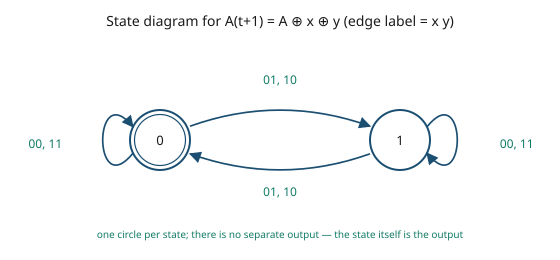

The state changes when exactly one of $x$, $y$ is 1, and holds when $x$ and $y$ agree.

---

## 7.13 Analysis with JK flip-flops

·CH5 slides 28–29

| Symbol | Meaning | Units | Typical |
|---|---|---|---|
| $J, K$ | the two inputs of a JK flip-flop | logic level | 0 or 1 |
| $J_A, K_A$ | the $J$ and $K$ inputs of the flip-flop whose output is $A$ | logic level | 0 or 1 |
| $J_B, K_B$ | the $J$ and $K$ inputs of the flip-flop whose output is $B$ | logic level | 0 or 1 |
| $Q(t+1)$ | next state of a generic flip-flop | logic level | 0 or 1 |

There are **two methods** for a circuit built from JK or T flip-flops ·CH5 slide 28:

1. the **characteristic table**;
2. the **characteristic equation**.

### Method 1 — the characteristic table

The next-state values of a sequential circuit that uses JK- or T-type flip-flops are derived like
this ·CH5 slide 28:

1. determine the flip-flop input equations in terms of the present state and input variables;
2. list the binary values of each input equation;
3. use the corresponding flip-flop **characteristic table** to determine the next-state values in
   the state table.

⚠ VERIFY (C07-2) — slide 28 prints the two characteristic equations as

$$D = JQ' + K'Q \qquad\text{and}\qquad D = T \oplus Q = T'Q + TQ'$$

using $D$ for the left-hand side. The standard form — and the one slide 31 itself uses — puts the
next state there:

$$Q(t+1) = JQ' + K'Q \qquad\text{and}\qquad Q(t+1) = T \oplus Q$$

Both readings agree numerically, because for a D flip-flop $Q(t+1) = D$; but the slide is about JK
and T flip-flops, which have no $D$ input, so writing $D$ invites confusion. Teach the
$Q(t+1)$ form.

### The worked JK circuit

·CH5 slide 29

[ex] **Analyse the two-JK-flip-flop circuit.** Reading the schematic gives four input equations
·CH5 slide 29:

$$J_A = B$$

$$K_A = B\,x'$$

$$J_B = x'$$

$$K_B = A \oplus x = A'x + Ax'$$

[fig] **Fig. 7-10** — the JK circuit ·CH5 slide 29

```yaml
figure_data:
  type: circuit
  storage: [{name: FF_A, type: JK, output: A}, {name: FF_B, type: JK, output: B}]
  gates:
    - {id: NOT1, inputs: [x], out: "x'"}
    - {id: AND1, inputs: [B, "x'"], out: K_A}
    - {id: XOR1, inputs: [A, x],   out: K_B}
  equations:
    J_A: "B"
    K_A: "B x'"
    J_B: "x'"
    K_B: "A XOR x"
  clock: common to both flip-flops
```

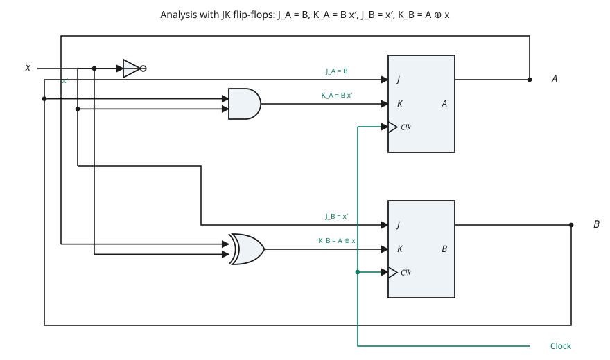

Applying the JK characteristic behaviour row by row gives the state table ·CH5 slide 29:

| $A$ | $B$ | $x$ | $A(t+1)$ | $B(t+1)$ | $J_A$ | $K_A$ | $J_B$ | $K_B$ |
|---|---|---|---|---|---|---|---|---|
| 0 | 0 | 0 | 0 | 1 | 0 | 0 | 1 | 0 |
| 0 | 0 | 1 | 0 | 0 | 0 | 0 | 0 | 1 |
| 0 | 1 | 0 | 1 | 1 | 1 | 1 | 1 | 0 |
| 0 | 1 | 1 | 1 | 0 | 1 | 0 | 0 | 1 |
| 1 | 0 | 0 | 1 | 1 | 0 | 0 | 1 | 1 |
| 1 | 0 | 1 | 1 | 0 | 0 | 0 | 0 | 0 |
| 1 | 1 | 0 | 0 | 0 | 1 | 1 | 1 | 1 |
| 1 | 1 | 1 | 1 | 1 | 1 | 0 | 0 | 0 |

All thirty-two entries — four flip-flop inputs and two next-state bits per row — were recomputed
from the input equations and the JK characteristic table, and every one agrees with the deck.

Reading two rows aloud, to show the method [added]:

- Row $A B x = 010$: $J_A = B = 1$ and $K_A = Bx' = 1$, so flip-flop $A$ **toggles**, giving
  $A(t+1) = 1$. And $J_B = x' = 1$, $K_B = A \oplus x = 0$, so flip-flop $B$ is **set**, giving
  $B(t+1) = 1$.
- Row $A B x = 111$: $J_A = 1$, $K_A = Bx' = 0$, so $A$ is **set** and stays 1. And $J_B = 0$,
  $K_B = 1 \oplus 1 = 0$, so $B$ **holds** at 1.

[fig] **Fig. 7-11** — state diagram of the JK circuit ·CH5 slide 29

```yaml
figure_data:
  type: state-diagram
  model: no external output
  states: ["00","01","10","11"]
  state_names: {"00": S0, "01": S1, "10": S2, "11": S3}
  state_encoding: "A B"
  edge_label_format: "x"
  transitions:
    - {from: "00", on: 0, to: "01"}
    - {from: "00", on: 1, to: "00"}
    - {from: "01", on: 0, to: "11"}
    - {from: "01", on: 1, to: "10"}
    - {from: "10", on: 0, to: "11"}
    - {from: "10", on: 1, to: "10"}
    - {from: "11", on: 0, to: "00"}
    - {from: "11", on: 1, to: "11"}
```

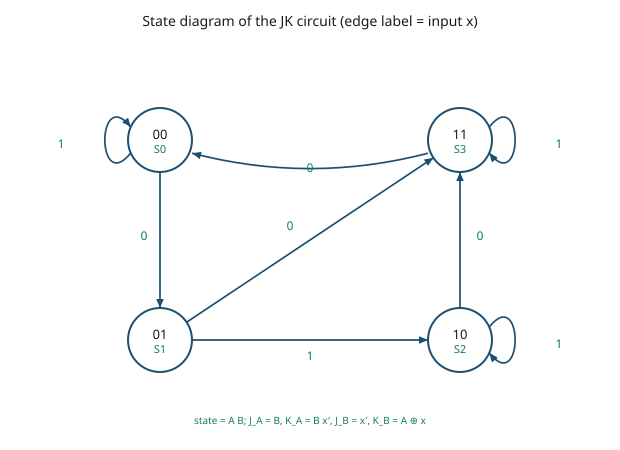

---

## 7.14 The characteristic equation

·CH5 slide 30

| Symbol | Meaning | Units | Typical |
|---|---|---|---|
| $Q$ | present state of a generic flip-flop | logic level | 0 or 1 |
| $Q(t+1)$ | next state of that flip-flop | logic level | 0 or 1 |
| $Q'$ | complement of the present state | logic level | 0 or 1 |

[def] The **characteristic equation** of a flip-flop expresses its next state algebraically, in
terms of its own inputs and its present state. It is the second of the two analysis methods
·CH5 slide 28.

**Procedure** ·CH5 slide 30:

1. determine the flip-flop input equations in terms of the present state and input variables;
2. **substitute** the input equations into the flip-flop characteristic equation, to obtain the
   state equations;
3. use those state equations to determine the next-state values in the state table.

Applied to the JK circuit of §7.13, the deck starts from ·CH5 slide 30:

$$A(t+1) = J A' + K' A$$

$$B(t+1) = J B' + K' B$$

⚠ VERIFY (C07-3) — both lines are printed with **unsubscripted** $J$ and $K$, although the two
flip-flops have different inputs. The equations should read

$$A(t+1) = J_A\,A' + K_A'\,A \qquad\text{and}\qquad B(t+1) = J_B\,B' + K_B'\,B$$

The substitution two lines later uses the correct per-flip-flop values, so only the notation is at
fault.

[derivation] **Substituting $J_A = B$ and $K_A = Bx'$** ·CH5 slide 30:

$$A(t+1) = B A' + (B x')' A$$

$$A(t+1) = A'B + (B' + x)A$$

$$\boxed{\;A(t+1) = A'B + AB' + Ax\;}$$

[eq: jk-state-equation] ·CH5 slide 30

[derivation] **Substituting $J_B = x'$ and $K_B = A \oplus x$** ·CH5 slide 30:

$$B(t+1) = x'B' + (A \oplus x)'\,B$$

$$(A \oplus x)' = A'x' + Ax$$

$$B(t+1) = B'x' + (A'x' + Ax)B$$

$$\boxed{\;B(t+1) = B'x' + ABx + A'Bx'\;}$$

·CH5 slide 30

Both expansions were checked against the JK characteristic behaviour over all eight combinations of
$A$, $B$, $x$ and agree exactly — including with the state table of §7.13.

---

## 7.15 Characteristic tables and excitation tables

·EXC

| Symbol | Meaning | Units | Typical |
|---|---|---|---|
| $S, R$ | set and reset inputs of an SR flip-flop | logic level | 0 or 1 |
| $D$ | data input of a D flip-flop | logic level | 0 or 1 |
| $J, K$ | inputs of a JK flip-flop | logic level | 0 or 1 |
| $T$ | toggle input of a T flip-flop | logic level | 0 or 1 |
| $Q(t)$ | present state | logic level | 0 or 1 |
| $Q(t+1)$ | next state, one clock edge later | logic level | 0 or 1 |
| $\text{X}$ | don't-care — either value works | — | — |

This is the single most-consulted table in the unit, and the distinction it rests on is examined
constantly. Get the direction right:

- [def] A **characteristic table** answers: *given the inputs, what is the next state?* It runs
  forward, and it is the table used in **analysis**.
- [def] An **excitation table** answers: *given the required transition $Q(t) \to Q(t+1)$, what
  inputs are needed?* It runs backward, and it is the table used in **design** ·EXC.

The handout states the purpose in one line: the excitation table is used during the **design**
process to find the flip-flop input conditions that will cause the required transitions, since the
present and next states are known ·EXC.

Every entry below was rederived from the corresponding characteristic table and matches ·EXC.

### SR flip-flop

**Characteristic table** ·EXC

| $S$ | $R$ | $Q(t+1)$ | |
|---|---|---|---|
| 0 | 0 | $Q(t)$ | no change |
| 0 | 1 | 0 | reset |
| 1 | 0 | 1 | set |
| 1 | 1 | ? | undefined |

**Excitation table** ·EXC

| $Q(t)$ | $Q(t+1)$ | $S$ | $R$ |
|---|---|---|---|
| 0 | 0 | 0 | X |
| 0 | 1 | 1 | 0 |
| 1 | 0 | 0 | 1 |
| 1 | 1 | X | 0 |

$$\boxed{\;Q(t+1) = S + R'Q\;}$$

[eq: sr-characteristic] [added] — the handout gives the SR table but not its equation; this is the
standard closed form, valid under the condition $SR = 0$.

### D flip-flop

**Characteristic table** ·EXC

| $D$ | $Q(t+1)$ |
|---|---|
| 0 | 0 |
| 1 | 1 |

**Excitation table** ·EXC

| $Q(t)$ | $Q(t+1)$ | $D$ |
|---|---|---|
| 0 | 0 | 0 |
| 0 | 1 | 1 |
| 1 | 0 | 0 |
| 1 | 1 | 1 |

$$\boxed{\;Q(t+1) = D\;}$$

[eq: d-characteristic] ·EXC. The D excitation table is the trivial one — $D$ simply equals the
required next state, whatever the present state is. That is why D flip-flops make design easy.

### JK flip-flop

**Characteristic table** ·EXC

| $J$ | $K$ | $Q(t+1)$ | |
|---|---|---|---|
| 0 | 0 | $Q(t)$ | no change |
| 0 | 1 | 0 | reset |
| 1 | 0 | 1 | set |
| 1 | 1 | $Q'(t)$ | toggle |

**Excitation table** ·EXC

| $Q(t)$ | $Q(t+1)$ | $J$ | $K$ |
|---|---|---|---|
| 0 | 0 | 0 | X |
| 0 | 1 | 1 | X |
| 1 | 0 | X | 1 |
| 1 | 1 | X | 0 |

$$\boxed{\;Q(t+1) = J\,Q' + K'\,Q\;}$$

[eq: jk-characteristic] ·EXC, ·CH5 slide 28. Half the JK excitation entries are don't-cares, which
is exactly why JK-based designs often need less gating than D-based ones.

### T flip-flop

**Characteristic table** ·EXC

| $T$ | $Q(t+1)$ | |
|---|---|---|
| 0 | $Q(t)$ | no change |
| 1 | $Q'(t)$ | toggle |

⚠ VERIFY (V07-3) — the handout heads this column **$D$**, not $T$, although the section is titled
"T Flip-flop" and the rows describe toggling. Read as printed it would say that a D flip-flop
complements its output when $D = 1$, which is wrong. The column is $T$.

**Excitation table** ·EXC

| $Q(t)$ | $Q(t+1)$ | $T$ |
|---|---|---|
| 0 | 0 | 0 |
| 0 | 1 | 1 |
| 1 | 0 | 1 |
| 1 | 1 | 0 |

$$\boxed{\;Q(t+1) = T \oplus Q = T'Q + TQ'\;}$$

[eq: t-characteristic] ·EXC, ·CH5 slides 28 and 31. The excitation rule is equally compact:

$$T = Q(t) \oplus Q(t+1)$$

— set $T$ to 1 exactly when the state must change [added].

### All four excitation tables on one grid

·EXC, consolidated [added] — this is the form worth memorising, and the four columns are simply the
four excitation tables above set side by side.

| $Q(t)$ | $Q(t+1)$ | $S$ $R$ | $D$ | $J$ $K$ | $T$ |
|---|---|---|---|---|---|
| 0 | 0 | 0 X | 0 | 0 X | 0 |
| 0 | 1 | 1 0 | 1 | 1 X | 1 |
| 1 | 0 | 0 1 | 0 | X 1 | 1 |
| 1 | 1 | X 0 | 1 | X 0 | 0 |

[eq: excitation-rules] The four rules behind the grid:

$$\boxed{\;D = Q(t+1)\;}$$

$$\boxed{\;T = Q(t) \oplus Q(t+1)\;}$$

$$\boxed{\;S = Q'(t)\,Q(t+1),\qquad R = Q(t)\,Q'(t+1)\;}$$

$$\boxed{\;J = Q(t+1)\ \text{when}\ Q(t)=0,\qquad K = Q'(t+1)\ \text{when}\ Q(t)=1\;}$$

Each was checked against the eight rows of the grid; the SR and JK forms reproduce the tabulated
entries with the don't-cares filled in as 0.

### Reading the two tables in opposite directions

Take the transition $Q(t) = 1 \to Q(t+1) = 0$:

- **characteristic** direction — with $J = 1$, $K = 1$ the flip-flop toggles, so from 1 it goes
  to 0;
- **excitation** direction — to get from 1 to 0 the flip-flop must reset or toggle, so $K = 1$ and
  $J$ may be anything: $J = \text{X}$, $K = 1$.

Same fact, two directions of use. Analysis uses the first; design uses the second.

---

## 7.16 Analysis with T flip-flops

·CH5 slide 31

| Symbol | Meaning | Units | Typical |
|---|---|---|---|
| $T_A$, $T_B$ | $T$ inputs of the flip-flops whose outputs are $A$ and $B$ | logic level | 0 or 1 |
| $x$ | external input (count enable) | logic level | 0 or 1 |
| $y$ | external output | logic level | 0 or 1 |
| $R$ | active-low asynchronous reset | logic level | 0 or 1 |

The characteristic equation is restated in its proper form on this slide ·CH5 slide 31:

$$Q(t+1) = T \oplus Q = T'Q + TQ'$$

[ex] **Analyse the two-T-flip-flop circuit** ·CH5 slide 31. Reading the schematic:

$$T_A = B\,x$$

$$T_B = x$$

$$y = A\,B$$

[fig] **Fig. 7-12** — the T flip-flop circuit ·CH5 slide 31

```yaml
figure_data:
  type: circuit
  storage:
    - {name: FF_A, type: T, output: A, reset: active-low R}
    - {name: FF_B, type: T, output: B, reset: active-low R}
  gates:
    - {id: AND1, inputs: [B, x], out: T_A}
    - {id: AND2, inputs: [A, B], out: y}
  equations: {T_A: "B x", T_B: "x", y: "A B"}
  clock: common to both flip-flops
  note: the output y depends on the state only, so this is a Moore machine
```

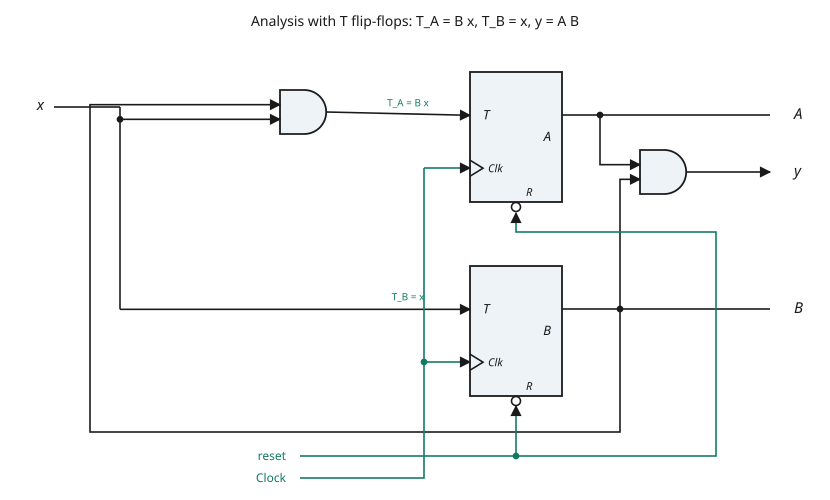

[derivation] **The state equation for $A$** ·CH5 slide 31:

$$A(t+1) = (Bx)'A + (Bx)A'$$

$$A(t+1) = A(B' + x') + A'Bx$$

$$\boxed{\;A(t+1) = AB' + Ax' + A'Bx\;}$$

[eq: t-state-equation] ·CH5 slide 31

$$\boxed{\;B(t+1) = x \oplus B\;}$$

·CH5 slide 31

Both expansions were verified against $A(t+1) = A \oplus (Bx)$ over all eight combinations.

**State table** ·CH5 slide 31:

| $A$ | $B$ | $x$ | $A(t+1)$ | $B(t+1)$ | $y$ |
|---|---|---|---|---|---|
| 0 | 0 | 0 | 0 | 0 | 0 |
| 0 | 0 | 1 | 0 | 1 | 0 |
| 0 | 1 | 0 | 0 | 1 | 0 |
| 0 | 1 | 1 | 1 | 0 | 0 |
| 1 | 0 | 0 | 1 | 0 | 0 |
| 1 | 0 | 1 | 1 | 1 | 0 |
| 1 | 1 | 0 | 1 | 1 | 1 |
| 1 | 1 | 1 | 0 | 0 | 1 |

All twenty-four entries were recomputed and agree with the deck.

The notation $00/0$ means **state is 00, output is 0** ·CH5 slide 31 — the Moore convention, with
the output written inside the state rather than on the transition.

[fig] **Fig. 7-13** — Moore state diagram of the T flip-flop circuit ·CH5 slide 31

```yaml
figure_data:
  type: state-diagram
  model: Moore
  states: ["00","01","10","11"]
  state_encoding: "A B"
  outputs: {"00": 0, "01": 0, "10": 0, "11": 1}
  edge_label_format: "x"
  transitions:
    - {from: "00", on: 0, to: "00"}
    - {from: "00", on: 1, to: "01"}
    - {from: "01", on: 0, to: "01"}
    - {from: "01", on: 1, to: "10"}
    - {from: "10", on: 0, to: "10"}
    - {from: "10", on: 1, to: "11"}
    - {from: "11", on: 0, to: "11"}
    - {from: "11", on: 1, to: "00"}
```

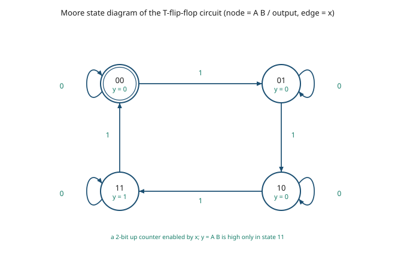

The behaviour the diagram exposes: with $x = 1$ the machine walks $00 \to 01 \to 10 \to 11 \to 00$,
and with $x = 0$ it holds. It is a **two-bit binary up-counter with a count-enable input**, and
$y = AB$ is the terminal-count flag [added].

---

## 7.17 Worked analysis example — three D flip-flops

·CH5 slides 32–33

| Symbol | Meaning | Units | Typical |
|---|---|---|---|
| $A, B, C$ | the three flip-flop outputs — the state, MSB first | logic level | 0 or 1 |
| $Z$ | external output | logic level | 0 or 1 |
| $D_A, D_B, D_C$ | the $D$ inputs of the three flip-flops | logic level | 0 or 1 |

[ex] **Develop the state diagram of the circuit on slide 32** ·CH5 slide 32. The circuit holds
three D flip-flops with outputs $A$, $B$, $C$, a common clock and a common reset, and one external
output $Z$. There is **no data input**.

Reading the schematic gives the equations ·CH5 slide 33:

⚠ VERIFY (V07-2) — the slide prints them as

$$A = BC,\qquad B = B'C + BC',\qquad C = A'C',\qquad Z = A$$

Two of these are **self-referential**: $B$ appears on both sides of the second, and $C$ on both
sides of the third, so as ordinary Boolean equations they are false. What is meant is the
flip-flop input equations, equivalently the next-state equations [eq: three-d-analysis-equations]:

$$\boxed{\;D_A = BC \;\Longleftrightarrow\; A(t+1) = BC\;}$$

$$\boxed{\;D_B = B'C + BC' = B \oplus C \;\Longleftrightarrow\; B(t+1) = B \oplus C\;}$$

$$\boxed{\;D_C = A'C' \;\Longleftrightarrow\; C(t+1) = A'C'\;}$$

$$\boxed{\;Z = A\;}$$

·CH5 slide 33, corrected. Only $Z = A$ is well-formed as printed, because $Z$ is a combinational
output and not a state variable.

[fig] **Fig. 7-14** — the three-flip-flop circuit ·CH5 slides 32–33

```yaml
figure_data:
  type: circuit
  storage:
    - {name: FF_A, type: D, output: A, reset: R}
    - {name: FF_B, type: D, output: B, reset: R}
    - {name: FF_C, type: D, output: C, reset: R}
  gates:
    - {id: AND1, inputs: [B, C],    out: D_A}
    - {id: NOT1, inputs: [B],       out: "B'"}
    - {id: NOT2, inputs: [C],       out: "C'"}
    - {id: NOT3, inputs: [A],       out: "A'"}
    - {id: AND2, inputs: ["B'", C], out: "B'C"}
    - {id: AND3, inputs: [B, "C'"], out: "BC'"}
    - {id: OR1,  inputs: ["B'C", "BC'"], out: D_B}
    - {id: AND4, inputs: ["A'", "C'"],   out: D_C}
  equations: {D_A: "B C", D_B: "B XOR C", D_C: "A' C'", Z: "A"}
  clock: common to all three flip-flops
  reset: common to all three flip-flops
```

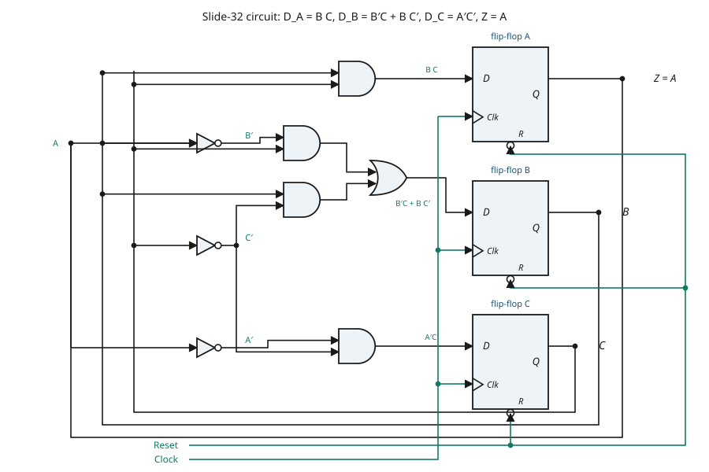

**State table** ·CH5 slide 33. The deck heads the next-state columns $A'\,B'\,C'$ at $(t+1)$.

⚠ VERIFY (C07-4) — that heading uses a **prime for the next state**, while the equations directly
above it use a **prime for the complement** ($C = A'C'$). Two meanings for one mark on one slide.
This file writes the next state as $A(t+1)$ throughout and reserves the prime for complement.

| $A\,B\,C$ at $t$ | $A\,B\,C$ at $t+1$ | $Z$ |
|---|---|---|
| 0 0 0 | 0 0 1 | 0 |
| 0 0 1 | 0 1 0 | 0 |
| 0 1 0 | 0 1 1 | 0 |
| 0 1 1 | 1 0 0 | 0 |
| 1 0 0 | 0 0 0 | 1 |
| 1 0 1 | 0 1 0 | 1 |
| 1 1 0 | 0 1 0 | 1 |
| 1 1 1 | 1 0 0 | 1 |

All thirty-two entries were recomputed from $A(t+1) = BC$, $B(t+1) = B \oplus C$,
$C(t+1) = A'C'$ and $Z = A$, and every one agrees with the deck.

[fig] **Fig. 7-15** — state diagram of the three-flip-flop circuit ·CH5 slide 33

```yaml
figure_data:
  type: state-diagram
  model: Moore
  states: ["000","001","010","011","100","101","110","111"]
  reset: "000"
  inputs: none
  outputs: {"000":0,"001":0,"010":0,"011":0,"100":1,"101":1,"110":1,"111":1}
  transitions:
    - {from: "000", to: "001"}
    - {from: "001", to: "010"}
    - {from: "010", to: "011"}
    - {from: "011", to: "100"}
    - {from: "100", to: "000"}
    - {from: "101", to: "010"}
    - {from: "110", to: "010"}
    - {from: "111", to: "100"}
```

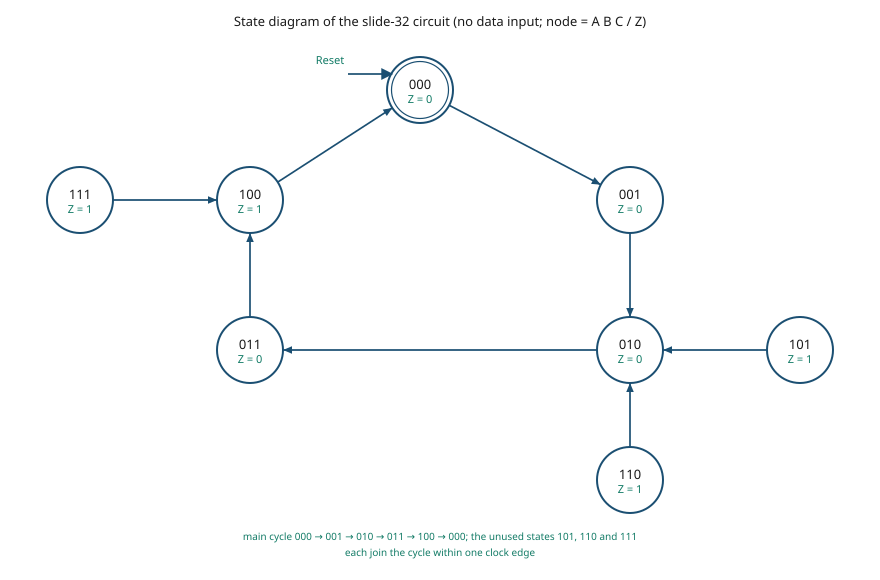

Two things the diagram makes visible [added]:

- the machine runs a **five-state cycle**, $000 \to 001 \to 010 \to 011 \to 100 \to 000$, so it is
  a modulo-5 counter with $Z$ marking the last state of the cycle;
- the three states outside that cycle — $101$, $110$, $111$ — are **self-correcting**: each of them
  rejoins the cycle within a single clock edge, so the circuit cannot get stuck if it powers up
  outside the intended sequence.

---

## 7.18 Equivalent states

·CH5 slides 34–36

| Symbol | Meaning | Units | Typical |
|---|---|---|---|
| $S_0 \ldots S_3$ | named states of a Mealy machine | — | — |
| $x$ | external input | logic level | 0 or 1 |
| $y$ | external output | logic level | 0 or 1 |

Three definitions ·CH5 slide 34:

1. [def] Two states are **equivalent** if their response to **each possible input sequence** is an
   identical output sequence.
2. [def] Two states are **equivalent** if their outputs produced for **each input symbol** are
   identical *and* their next states for each input symbol are the **same or equivalent**.
3. [def] Two states that are **not equivalent** are **distinguishable**.

Definition 1 is the meaning; definition 2 is the **test you can actually apply**, because it looks
only one step ahead.

[ex] **Equivalent-state example** ·CH5 slides 35–36. The starting machine has four states. $S_0$
is drawn as a Moore state with output 0; $S_1$, $S_2$, $S_3$ carry Mealy labels of the form
$x/y$.

**Step 1 — test $S_2$ against $S_3$** ·CH5 slide 35. For states $S_3$ and $S_2$ the output for
input 0 is 1 and for input 1 is 0, and the next state for input 0 is $S_0$ and for input 1 is
$S_2$. Both conditions of definition 2 hold, so **$S_3$ and $S_2$ are equivalent** ·CH5 slide 35.

**Step 2 — merge and re-test** ·CH5 slide 36. Replacing $S_3$ and $S_2$ by a single state gives a
three-state diagram. Examining it, $S_1$ and $S_2$ are equivalent since ·CH5 slide 36:

- their outputs for input 0 are 1 and for input 1 are 0, and
- their next state for input 0 is $S_0$ and for input 1 is $S_2$.

**Step 3 — merge again** ·CH5 slide 36. Replacing $S_1$ and $S_2$ by a single state leaves a
two-state machine.

[fig] **Fig. 7-16** — state reduction in three steps ·CH5 slides 35–36

```yaml
figure_data:
  type: state-diagram-sequence
  edge_label_format: "x / y"
  note: S0 is a Moore state with output 0; the other states carry Mealy labels
  step1_original:
    states: [S0, S1, S2, S3]
    transitions:
      - {from: S0, on: 0, to: S0, out: 0}
      - {from: S0, on: 1, to: S1, out: 0}
      - {from: S1, on: 0, to: S0, out: 1}
      - {from: S1, on: 1, to: S3, out: 0}
      - {from: S2, on: 0, to: S0, out: 1}
      - {from: S2, on: 1, to: S2, out: 0}
      - {from: S3, on: 0, to: S0, out: 1}
      - {from: S3, on: 1, to: S2, out: 0}
    finding: S2 and S3 equivalent
  step2_after_merging_S3_into_S2:
    states: [S0, S1, S2]
    transitions:
      - {from: S0, on: 0, to: S0, out: 0}
      - {from: S0, on: 1, to: S1, out: 0}
      - {from: S1, on: 0, to: S0, out: 1}
      - {from: S1, on: 1, to: S2, out: 0}
      - {from: S2, on: 0, to: S0, out: 1}
      - {from: S2, on: 1, to: S2, out: 0}
    finding: S1 and S2 equivalent
  step3_minimal:
    states: [S0, S1]
    transitions:
      - {from: S0, on: 0, to: S0, out: 0}
      - {from: S0, on: 1, to: S1, out: 0}
      - {from: S1, on: 0, to: S0, out: 1}
      - {from: S1, on: 1, to: S1, out: 0}
```

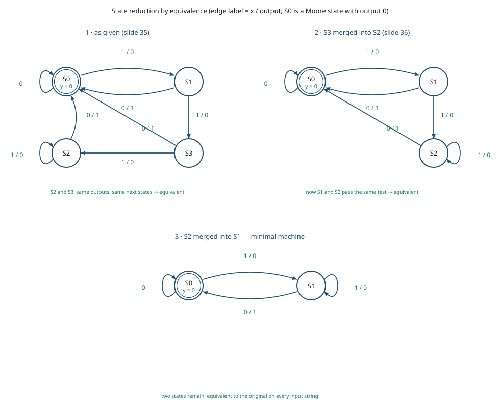

**Verification.** The four-state machine and the final two-state machine were simulated against
every input string up to length 10 — 2046 strings — starting from $S_0$. The output sequences are
identical in every case, so the reduction is sound.

Two observations the slides leave implicit [added]:

- $S_1$, $S_2$ and $S_3$ are **all three** mutually equivalent in the original machine. A single
  pass of the partition-refinement algorithm therefore collapses four states to two in one step;
  the deck reaches the same answer in two passes, which is easier to follow by hand.
- $S_0$ and $S_1$ are **not** equivalent: on input 0 the machine emits 0 from $S_0$ but 1 from
  $S_1$. Two states is the minimum, and the reduction stops there.

What the reduced machine does: it emits 1 on every 0 that is immediately preceded by a 1 —
it is a detector for the two-bit pattern $10$ [added]. On the input string $0110010$ it emits
$0001001$.

---

## 7.19 Moore and Mealy example diagrams and tables

·CH5 slide 37

| Symbol | Meaning | Units | Typical |
|---|---|---|---|
| $x$ | input | logic level | 0 or 1 |
| $o$ | output | logic level | 0 or 1 |

[def] A **Mealy model state diagram maps inputs and state to output** ·CH5 slide 37.

[def] A **Moore model state diagram maps states to outputs** ·CH5 slide 37.

[ex] **The same behaviour in both models** ·CH5 slide 37.

**Mealy table** ·CH5 slide 37:

| present state | next state, $x=0$ | next state, $x=1$ | output, $x=0$ | output, $x=1$ |
|---|---|---|---|---|
| 0 | 0 | 1 | 0 | 0 |
| 1 | 0 | 1 | 0 | 1 |

**Moore table** ·CH5 slide 37:

| present state | next state, $x=0$ | next state, $x=1$ | output |
|---|---|---|---|
| 0 | 0 | 1 | 0 |
| 1 | 0 | 2 | 0 |
| 2 | 0 | 2 | 1 |

Both tables were checked against the two diagrams on the slide, transition by transition, and
agree.

[fig] **Fig. 7-17** — the same behaviour as Mealy and as Moore ·CH5 slide 37

```yaml
figure_data:
  type: state-diagram-pair
  mealy:
    states: ["0","1"]
    edge_label_format: "x = ? / o = ?"
    transitions:
      - {from: "0", on: 0, to: "0", out: 0}
      - {from: "0", on: 1, to: "1", out: 0}
      - {from: "1", on: 0, to: "0", out: 0}
      - {from: "1", on: 1, to: "1", out: 1}
  moore:
    states: ["0","1","2"]
    outputs: {"0": 0, "1": 0, "2": 1}
    edge_label_format: "x = ?"
    transitions:
      - {from: "0", on: 0, to: "0"}
      - {from: "0", on: 1, to: "1"}
      - {from: "1", on: 0, to: "0"}
      - {from: "1", on: 1, to: "2"}
      - {from: "2", on: 0, to: "0"}
      - {from: "2", on: 1, to: "2"}
```

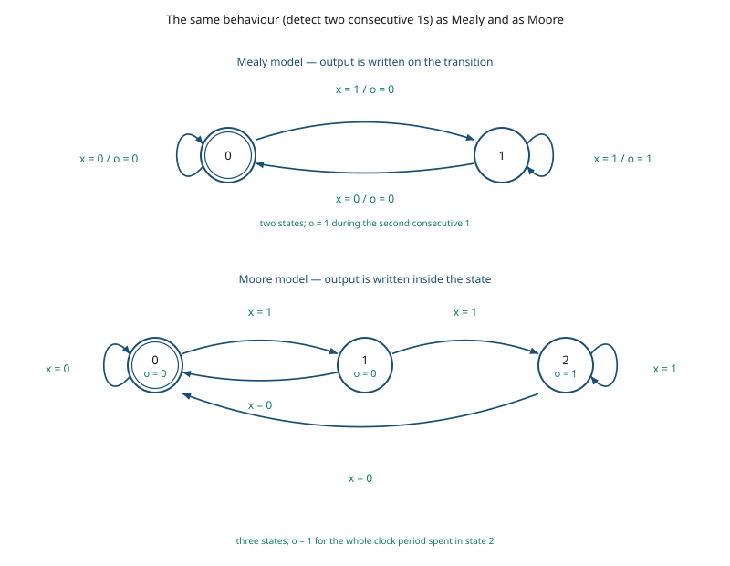

Both machines detect **two consecutive 1s** [added]. Simulating the input string
$0\,1\,1\,0\,1\,1\,1$ through each gives the same output string $0\,0\,1\,0\,0\,1\,1$. The
slide-7 and slide-9 claims are visible here directly: the Mealy version needs **two** states, the
Moore version **three**.

---

## 7.20 Mixed Moore and Mealy outputs

·CH5 slide 38

In real designs, **some outputs may be Moore type and other outputs may be Mealy type**
·CH5 slide 38.

[ex] **The slide-24 machine redrawn with mixed outputs** ·CH5 slide 38:

- **state 00: Moore**
- **states 01, 10 and 11: Mealy**

and the deck's reason: **this simplifies output specification** ·CH5 slide 38.

Why state 00 may be promoted to Moore [added]: from §7.8, $y = (A+B)x'$. In state $00$ both $A$ and
$B$ are 0, so $y = 0$ regardless of $x$. An output that does not depend on the input in that state
can be written once inside the circle instead of twice on the outgoing edges. The other three
states have $A + B = 1$, so their output does depend on $x$ and must stay on the transitions.

[fig] **Fig. 7-18** — mixed Moore and Mealy outputs ·CH5 slide 38

```yaml
figure_data:
  type: state-diagram
  model: mixed
  states: ["00","01","10","11"]
  state_encoding: "A B"
  moore_states: {"00": 0}
  mealy_states: ["01","10","11"]
  transitions:
    - {from: "00", on: 0, to: "00", out: "(Moore, 0)"}
    - {from: "00", on: 1, to: "01", out: "(Moore, 0)"}
    - {from: "01", on: 0, to: "00", out: 1}
    - {from: "01", on: 1, to: "11", out: 0}
    - {from: "10", on: 0, to: "00", out: 1}
    - {from: "10", on: 1, to: "10", out: 0}
    - {from: "11", on: 0, to: "00", out: 1}
    - {from: "11", on: 1, to: "10", out: 0}
```

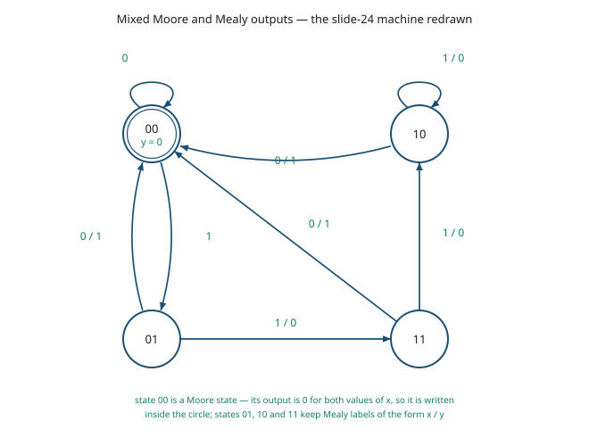

Every transition was checked against the state equations of §7.8 and matches; the machine is the
same one, drawn a different way.

---

## Slide coverage

| Slide(s) | Status | Where |
|---|---|---|
| 1 | chapter title slide, no content | — |
| 2 | chapter contents list, no teachable content | — |
| 3–4 | taught | §7.1 |
| 5–7 | taught | §7.2 |
| 8–9 | taught | §7.3 |
| 10 | taught | §7.4 |
| 11 | section title "Application Examples", blank | — |
| 12 | taught | §7.5 |
| 13–17 | taught | §7.6 |
| 18 | section title "State Analysis", blank | — |
| 19 | taught | §7.7 |
| 20 | sub-section title "State Equations Diagram and Tables", blank | — |
| 21 | taught | §7.8 |
| 22 | taught | §7.9 |
| 23–24 | taught | §7.10 |
| 25 | taught | §7.11 |
| 26–27 | taught | §7.12 |
| 28–29 | taught | §7.13 |
| 30 | taught | §7.14 |
| 31 | taught | §7.16 |
| 32–33 | taught | §7.17 |
| 34 | taught | §7.18 |
| 35–36 | taught | §7.18 |
| 37 | taught | §7.19 |
| 38 | taught | §7.20 |
| EXC (1 p.) | taught | §7.15 |

Slides 39–118 of the same deck belong to files **08** and **09**.

**Worked examples: 10.** Binary counter (§7.5), serial adder (§7.6), the two-D-flip-flop circuit
(§7.8–7.10), the D flip-flop analysis (§7.12), the JK analysis (§7.13), the JK characteristic-equation
substitution (§7.14), the T flip-flop analysis (§7.16), the three-D-flip-flop circuit (§7.17), the
equivalent-state reduction (§7.18), and the Moore/Mealy pair (§7.19), plus the mixed-output redraw
(§7.20).

**Exercises: none.** These 38 slides set no homework — every question the deck poses
("How many states?", "How many inputs?", the six sub-steps of slide 13) is answered on the slide
that follows it. The first unsolved exercises in Chapter 5 fall after slide 38.

**File size.** This file is about 55 KB, past the ~40 KB guideline. It is one continuous argument — the analysis chain
from circuit to state diagram, with the flip-flop tables the chain depends on — so it is left
whole. If a split ever becomes necessary, the natural cut is between §7.6 and §7.7, that is,
between **FSM fundamentals** (slides 3–17) and **sequential-circuit analysis** (slides 18–38 plus
the excitation page).
