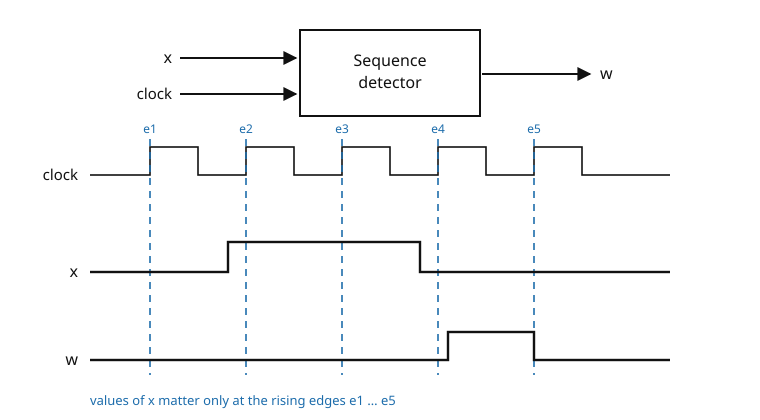
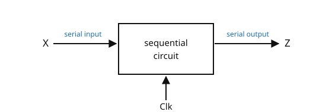
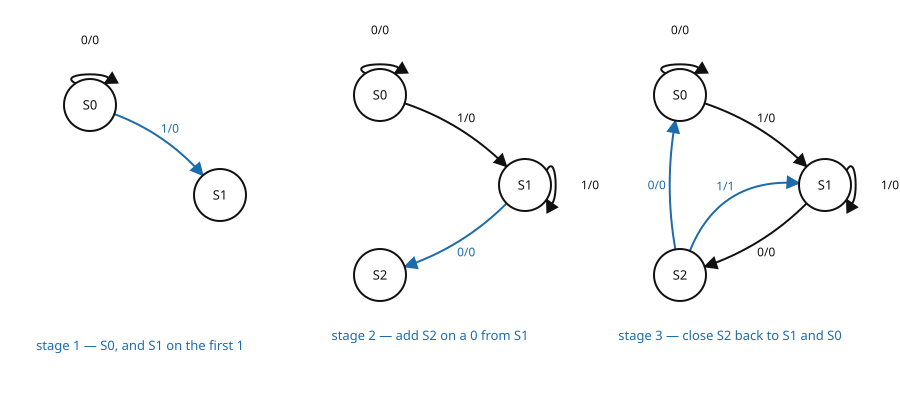
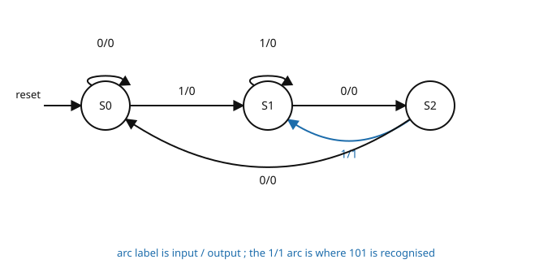
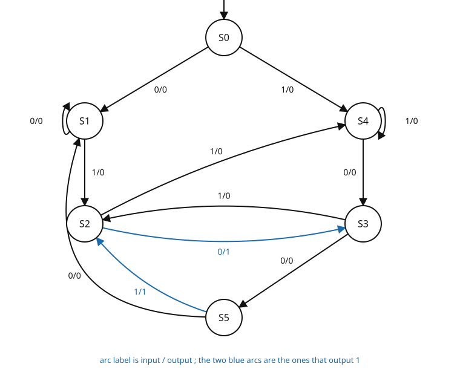
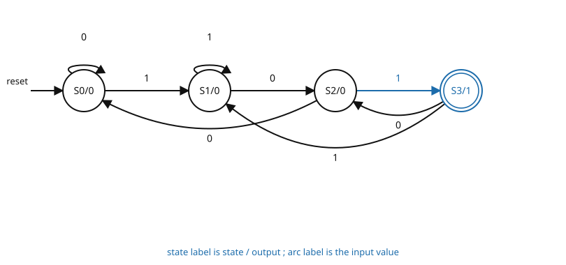
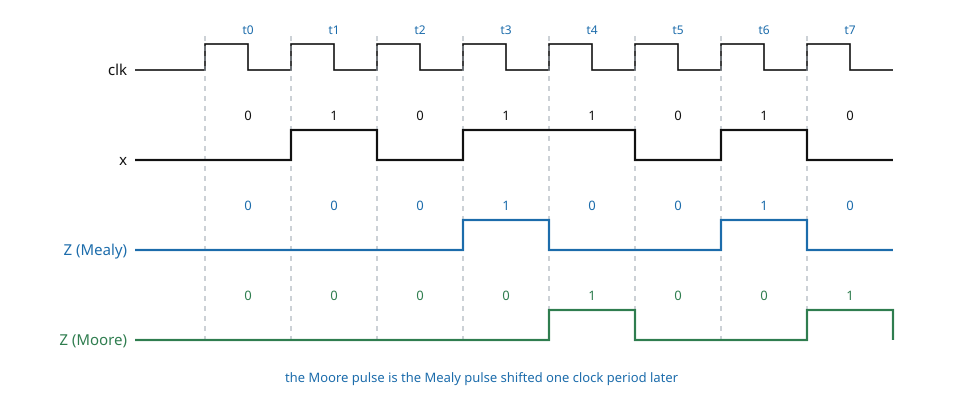
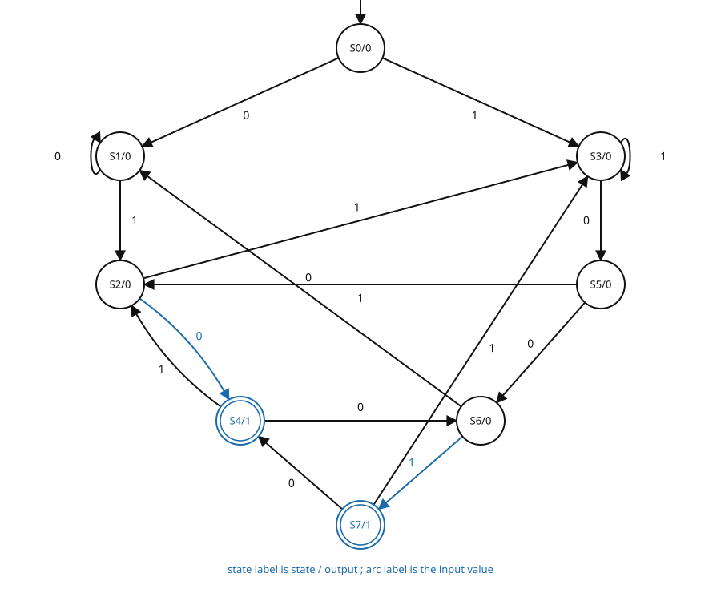
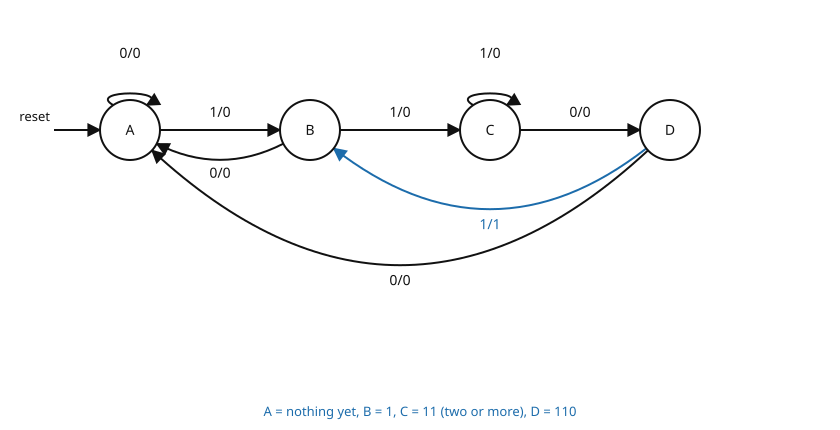
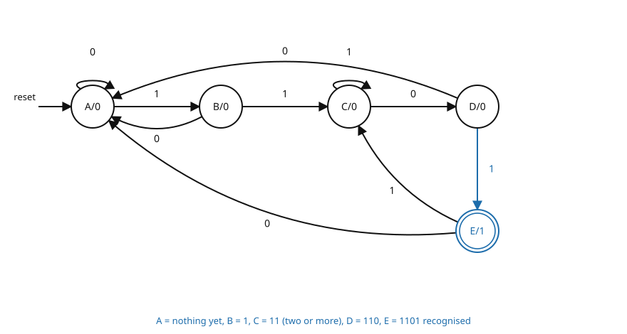

# 08 — Sequential Circuit Design and Sequence Detectors

Covers slides 39–71 of Chapter 5. The chapter is one continuous argument and is split across three
files:

- slides 1–38 — **07 — FSM Fundamentals and Sequential Circuit Analysis** (what a state machine is,
  how to *analyse* a given circuit);
- **slides 39–71 — this file** (how to *design* one, from a written specification to a state table);
- slides 72–118 — **09 — State Reduction and State Assignment** (turning that state table into
  flip-flop input equations and gates).

Handout code used throughout: `CH5`. The printed footer number equals the PDF page number, so
`·CH5 slide 48` is the slide titled "The Full State Diagram".

This range is where the course does its worked design problems. Six complete machines are built —
three specifications, each done twice, once as a Mealy machine and once as a Moore machine. Every
one of them has been rebuilt in software from the printed state diagram, re-derived in the opposite
direction from the printed state table, simulated over every input string up to sixteen bits, and
checked for completeness and reachability. All six are functionally correct; the defects raised are
in the surrounding prose. Eight are flagged — two substantive, six cosmetic — and collected in
`flags/08.md`.

---

## 8.1 The system design procedure

·CH5 slide 39

The deck gives eight steps, in this order. Steps 1–2 are the whole of this file; steps 3–8 are
file 09.

1. **Specification** — the problem statement fixes the desired relationship between the input
   sequence and the output sequence ·CH5 slide 39.
2. **Formulation** — obtain a state diagram or state table. This is the first real step: translate
   the specification into a state table or state graph ·CH5 slide 39.
3. **State assignment** — assign binary codes to the states ·CH5 slide 39.
4. **Flip-flop input equation determination** — select flip-flop types and derive the flip-flop
   equations from the state table ·CH5 slide 39.
5. **Output equation determination** — derive the output equations from the state table
   ·CH5 slide 39.
6. **Optimisation** — optimise the equations ·CH5 slide 39.
7. **Technology mapping** — find the circuit from the equations and map it onto flip-flops and a
   gate technology ·CH5 slide 39.
8. **Verification** — verify the correctness of the final design ·CH5 slide 39.

---

## 8.2 Formulation — deriving state graphs and tables

·CH5 slide 40

| Symbol | Meaning | Units | Typical value |
|---|---|---|---|
| $X$ | serial input bit applied once per clock | — | 0 or 1 |
| $Z$ | serial output bit | — | 0 or 1 |
| $t$ | clock-period index | — | $0,1,2,\ldots$ |
| $S(t)$ | present state during period $t$ | — | $S_0,S_1,\ldots$ |
| $\delta$ | next-state function | — | — |
| $\lambda$ | output function | — | — |

[def] In specifying a circuit, **states** are used to remember the meaningful properties of past
input sequences that are essential to predicting future output values ·CH5 slide 40.

[def] A **sequence detector** is a sequential state machine that takes an input string of bits and
generates an output 1 whenever the target sequence has been detected ·CH5 slide 40. Equivalently, it
is a sequential circuit that produces a distinct output value whenever a prescribed pattern of input
symbols occurs in sequence — it recognises an input-sequence occurrence ·CH5 slide 40.

The route the deck follows ·CH5 slide 40:

- develop a procedure specific to sequence recognisers that converts a problem statement into a
  **state diagram**;
- convert that state diagram into a **state table**;
- design the circuit from the state table.

[added] The two functions that the rest of this file manipulates, written formally. The next state
is a function of the present state and the present input:

$$\boxed{\;S(t+1)=\delta\big(S(t),X(t)\big)\;}$$

[eq: next-state-function] where $S(t)$ is the present state during clock period $t$, $X(t)$ the
input sampled at the end of that period, and $\delta$ the next-state function.

In a **Mealy** machine the output depends on both the present state and the present input:

$$\boxed{\;Z(t)=\lambda\big(S(t),X(t)\big)\;}$$

[eq: mealy-output-function] which is why the Mealy output is written on the **arc** ·CH5 slide 67.

In a **Moore** machine the output depends on the present state alone:

$$\boxed{\;Z(t)=\lambda\big(S(t)\big)\;}$$

[eq: moore-output-function] which is why the Moore output is written **inside the state**, not on
the transition ·CH5 slide 54.

---

## 8.3 Sequence detectors

·CH5 slide 41

| Symbol | Meaning | Units | Typical value |
|---|---|---|---|
| $x$ | serial input to the detector (the deck's lower-case name on slide 41) | — | 0 or 1 |
| $w$ | detector output (the deck's name on slide 41) | — | 0 or 1 |
| clock | sampling clock; values matter only on its rising edges | — | — |

[def] **Sequence detection** is the act of recognising a predefined series of inputs
·CH5 slide 41.

- A sequence detector is a sequential circuit, which is basically a circuit that can store
  information ·CH5 slide 41.

There are two kinds ·CH5 slide 41:

1. **Overlapping** — the last bit of one sequence becomes the first bit of the next sequence.
2. **Non-overlapping** — the last bit of one sequence does not become the first bit of the next.

[added] Every worked machine in slides 44–71 is of the **overlapping** kind. Slide 44 says so
explicitly for Example 1 — "the circuit does not reset when a 1 output occurs" — and slide 65 makes
the same point for Example 3 by pointing out that 1101101 contains 1101 twice with the middle 1
shared.

[fig] **Fig. 8-1** — the sequence detector as a block, and the clocked waveform beneath it
·CH5 slide 41

```yaml
figure_data:
  type: block-and-timing
  block:
    name: sequence detector
    inputs: [x, clock]
    outputs: [w]
  timing:
    rising_edges: [e1, e2, e3, e4, e5]
    x_sampled_at_edges: [0, 1, 1, 0, 0]
    w: asserted for the one clock period that follows e4, released at e5
  note_on_slide: "Values are only important on the rising edges of the clock pulses"
```



- The deck does **not** state which sequence this particular waveform is detecting.
- [added] What can be read off the drawing without guessing: $x$ samples to $0,1,1,0,0$ at the five
  rising edges, and $w$ is drawn as a **registered** output — it rises after the fourth edge and
  falls at the fifth, so it is high for exactly one clock period. That is Moore-style output timing
  (§8.9), not Mealy.

---

## 8.4 The sequence-recogniser procedure

·CH5 slide 42

Five steps, to be followed in order, to develop a sequence-recogniser state diagram ·CH5 slide 42:

1. **Begin in an initial state** in which none of the initial portion of the sequence has occurred —
   typically a "reset" state.
2. **Add a state** that recognises that the first symbol has occurred.
3. **Add states** that recognise each successive symbol occurring.
4. **The final state** represents the input-sequence occurrence — possibly less the final input
   value. ⚠ VERIFY (C08-1)
5. **Add state transition arcs** which specify what happens when a symbol *not* in the proper
   sequence has occurred, considering transition to states that represent an input subsequence that
   has occurred.

- Step 5 is required because the circuit must recognise the input sequence **regardless of where it
  occurs** within the overall sequence applied since reset ·CH5 slide 42.

⚠ VERIFY (C08-1) — the slide prints "feasibly less the final input value". Read it as **possibly**
less the final input value. The point is real and is the single most useful sentence on the slide:
in a *Mealy* machine the last state reached represents the sequence **minus its final bit**, because
the final bit is consumed by the arc that carries the output 1. In a *Moore* machine the final state
represents the whole sequence, because the output lives in the state.

---

## 8.5 Guidelines for construction of state graphs

·CH5 slide 43

Seven working rules ·CH5 slide 43:

1. First, construct some **sample input and output sequences** to make sure the problem is
   understood.
2. Determine under what conditions the circuit is in the **reset state**.
3. If only one or two sequences lead to a 1 output, construct a **partial state graph**.
4. Or determine what sequences, or groups of sequences, must be **remembered**.
5. When adding transitions, see whether the transition goes to an already-defined state or whether a
   **new state** must be added.
6. Make sure **all states have a transition for both a 0 and a 1 — but only one of each**.
   ⚠ VERIFY (C08-2)
7. Add annotation, or create a table, to expound the **meaning of each state**.

⚠ VERIFY (C08-2) — the slide prints "Make sure all state have a transition for both a 0 and a 1 but
only 1of each!". Two typographical slips ("all state", "1of"); the rule itself is correct and is the
completeness test applied to every machine below.

[added] Rules 6 and 7 give the two mechanical checks worth running on any finished graph:

- **completeness** — with a single input $X$, every state must have exactly two outgoing arcs, one
  for $X=0$ and one for $X=1$; a state with three arcs or one arc is wrong;
- **reachability** — every state must be reachable from the reset state, otherwise it is dead code.

Both checks were run in software on all six machines in this file; all six pass.

---

## 8.6 Example 1a — Mealy machine for the sequence 101

·CH5 slides 44–48

| Symbol | Meaning | Units | Typical value |
|---|---|---|---|
| $X$ | serial input stream | — | 0 or 1 |
| $Z$ | serial output stream | — | 0 or 1 |
| Clk | the clock | — | — |
| $S_0,S_1,S_2$ | the three states | — | — |

### The specification

[ex] **Recognise the sequence 101** ·CH5 slide 44.

- The circuit examines a string of 0s and 1s applied serially, once per clock, to the input $X$, and
  produces a 1 only when the prescribed input sequence occurs ·CH5 slide 44.
- Any sequence **ending in** 101 produces an output $Z=1$ coincident with the last 1 input
  ·CH5 slide 44.
- The circuit **does not reset** when a 1 output occurs, so whenever a 101 is in the data stream a 1
  is output coincident with the last 1 ·CH5 slides 44, 53. ⚠ VERIFY (C08-3)

⚠ VERIFY (C08-3) — slide 44 prints "produce and output of Z=1" (for "an output"), and its final
sentence is cut off mid-clause at "coincident with the last". Slide 53 repeats the same paragraph
and completes it as "…coincident with the last 1." The version above is the completed one.

### The general form of the circuit

[fig] **Fig. 8-2** — the circuit as a black box ·CH5 slide 45

```yaml
figure_data:
  type: block-diagram
  block: sequential circuit
  ports:
    X: serial input stream
    Z: serial output stream
    Clk: the clock
```



The deck then prints one sample input stream and the output it must produce ·CH5 slide 45. The
figure on the slide is a scan; the data is transcribed here instead.

| $t$ | 0 | 1 | 2 | 3 | 4 | 5 | 6 | 7 | 8 | 9 | 10 | 11 | 12 | 13 | 14 | 15 |
|---|---|---|---|---|---|---|---|---|---|---|---|---|---|---|---|---|
| $X$ | 0 | 0 | 1 | 1 | 0 | 1 | 1 | 0 | 0 | 1 | 0 | 1 | 0 | 1 | 0 | 0 |
| $Z$ | 0 | 0 | 0 | 0 | 0 | **1** | 0 | 0 | 0 | 0 | 0 | **1** | 0 | **1** | 0 | 0 |

Checked: $Z=1$ exactly at $t=5,\;11,\;13$, and at each of those three instants the last three input
bits are $1,0,1$. No other position in the stream ends in 101. The slide's printed $Z$ is correct.

### Constructing the graph

[derivation] The deck builds the graph one state at a time ·CH5 slides 46–47.

**Choose a starting state and give it a meaning.** The starting state is typically a reset state.
Here $S_0$ can mean either ·CH5 slide 46:

- the system has been reset and this is the initial state, or
- a sequence of two or more 0s has been received.

**Transitions from $S_0$** — two possible transitions, 0 and 1 ·CH5 slide 46:

- on a 0, stay in $S_0$;
- on a 1, go to a **new state $S_1$** with a new meaning. ⚠ VERIFY (C08-4)

**Add $S_1$.** Its meaning ·CH5 slide 46:

- a sequence $0\ldots01$ has been received when coming from $S_0$;
- that is, the **first 1** has been received.

**Transitions from $S_1$** ·CH5 slide 47:

- a 0 input causes a transition to a **new state $S_2$** with a new meaning;
- a 1 keeps the machine in $S_1$, where the first 1 of a possible 101 has occurred.

**State $S_2$** — when the transition into it is from $S_1$, it means an input stream of $\ldots10$
has been received ·CH5 slide 47.

**Transitions from $S_2$** ·CH5 slide 47:

- a 1 arrives, so the machine now has the sequence 101 — **output a 1**, and it also holds the first
  1 of a new sequence, so go to $S_1$;
- a 0 arrives, so the machine now has 100 — move back to $S_0$, where not even the start of a
  sequence is held, i.e. one or more 0 inputs.

⚠ VERIFY (C08-4) — slide 46 prints "transition to a new state S1 with an new meaning". Read "a new
meaning".

[fig] **Fig. 8-3** — the three construction stages of the Mealy 101 graph ·CH5 slides 46–47

```yaml
figure_data:
  type: state-diagram-stages
  model: Mealy
  stage_1: {states: [S0, S1], arcs: ["S0 -0/0-> S0", "S0 -1/0-> S1"]}
  stage_2: {states: [S0, S1, S2], arcs: ["S1 -1/0-> S1", "S1 -0/0-> S2"]}
  stage_3: {states: [S0, S1, S2], arcs: ["S2 -1/1-> S1", "S2 -0/0-> S0"]}
```



### The full state diagram

[fig] **Fig. 8-4** — completed Mealy state diagram for the 101 detector ·CH5 slide 48

```yaml
figure_data:
  type: state-diagram
  model: Mealy
  states: [S0, S1, S2]
  reset: S0
  meanings:
    S0: reset, or one or more 0s received
    S1: the first 1 of a possible 101 has been received
    S2: the input stream ends in 10
  transitions:
    - {from: S0, on: "X=0", to: S0, out: 0}
    - {from: S0, on: "X=1", to: S1, out: 0}
    - {from: S1, on: "X=0", to: S2, out: 0}
    - {from: S1, on: "X=1", to: S1, out: 0}
    - {from: S2, on: "X=0", to: S0, out: 0}
    - {from: S2, on: "X=1", to: S1, out: 1}
```



This diagram can now be used to generate a state table ·CH5 slide 48. The table itself appears on
slide 57 and is reproduced in §8.9.

### Trace against the deck's own stream

[ex] [added] Running the machine on the slide-45 stream. The present state is the state the machine
is in *during* period $t$; $Z$ is produced during the same period, because this is a Mealy machine.

| $t$ | $X$ | present state | $Z$ | next state |
|---|---|---|---|---|
| 0 | 0 | $S_0$ | 0 | $S_0$ |
| 1 | 0 | $S_0$ | 0 | $S_0$ |
| 2 | 1 | $S_0$ | 0 | $S_1$ |
| 3 | 1 | $S_1$ | 0 | $S_1$ |
| 4 | 0 | $S_1$ | 0 | $S_2$ |
| 5 | 1 | $S_2$ | **1** | $S_1$ |
| 6 | 1 | $S_1$ | 0 | $S_1$ |
| 7 | 0 | $S_1$ | 0 | $S_2$ |
| 8 | 0 | $S_2$ | 0 | $S_0$ |
| 9 | 1 | $S_0$ | 0 | $S_1$ |
| 10 | 0 | $S_1$ | 0 | $S_2$ |
| 11 | 1 | $S_2$ | **1** | $S_1$ |
| 12 | 0 | $S_1$ | 0 | $S_2$ |
| 13 | 1 | $S_2$ | **1** | $S_1$ |
| 14 | 0 | $S_1$ | 0 | $S_2$ |
| 15 | 0 | $S_2$ | 0 | $S_0$ |

The $Z$ column reproduces the slide's printed $Z$ exactly. Note $t=11$ and $t=13$: the 1 that ends
one 101 is immediately the 1 that starts the next — that is the overlap, and it is why the arc out
of $S_2$ on a 1 goes to $S_1$ and not back to $S_0$.

---

## 8.7 Example 2a — Mealy machine for 010 or 1001

·CH5 slides 49–52

| Symbol | Meaning | Units | Typical value |
|---|---|---|---|
| $X$ | serial input stream | — | 0 or 1 |
| $Z$ | serial output stream | — | 0 or 1 |
| $S_0\ldots S_5$ | the six states | — | — |
| $a\ldots f$ | the deck's markers for the six detections in the sample stream | — | — |

### The specification

[ex] The circuit has the same form as before. It **detects input sequences that end in 010 or
1001**. When a sequence is detected the output $Z$ is 1, otherwise $Z$ is 0 ·CH5 slide 49.

The deck prints one sample stream, with the six detections marked $a$ to $f$ ·CH5 slide 49:

| $t$ | 0 | 1 | 2 | 3 | 4 | 5 | 6 | 7 | 8 | 9 | 10 | 11 | 12 | 13 | 14 | 15 | 16 |
|---|---|---|---|---|---|---|---|---|---|---|---|---|---|---|---|---|---|
| $X$ | 0 | 0 | 1 | 0 | 1 | 0 | 0 | 1 | 0 | 0 | 0 | 1 | 0 | 0 | 1 | 1 | 0 |
| marker | | | | $a$ | | $b$ | | $c$ | $d$ | | | | $e$ | | $f$ | | |
| $Z$ | 0 | 0 | 0 | **1** | 0 | **1** | 0 | **1** | **1** | 0 | 0 | 0 | **1** | 0 | **1** | 0 | 0 |

Checked, detection by detection:

| marker | $t$ | tail of the stream at that instant | pattern matched |
|---|---|---|---|
| $a$ | 3 | 0**010** | 010 |
| $b$ | 5 | 1**010** | 010 |
| $c$ | 7 | **1001** | 1001 |
| $d$ | 8 | 0**010** | 010 |
| $e$ | 12 | 0**010** | 010 |
| $f$ | 14 | **1001** | 1001 |

No other position in the stream ends in either pattern. The slide's printed $Z$ is correct, and the
six arrow markers sit over exactly those six positions.

### Building the graph

[derivation] The deck adds states in four passes ·CH5 slides 50–52.

**Pass 1 — the initial state** ·CH5 slide 50. $S_0$ is the RESET state: no inputs yet.

- on a 0 the output is 0 — go to $S_1$;
- on a 1 the output is 0 — go to $S_4$.

Meanings so far ·CH5 slide 50: $S_0$ reset; $S_1$ = 0 but not 10; $S_4$ = 1 but not 01.

**Pass 2 — more states** ·CH5 slide 50.

- add $S_2$, meaning a 01 sequence has been received;
- add $S_3$, meaning the sequence 10 has been received.

**Pass 3 — inputs when in $S_2$ and $S_3$** ·CH5 slide 51.

- in $S_2$ (holding 01) and a 0 arrives — the stream now ends 010, so **output a 1** and go to
  $S_3$, which holds 10;
- in $S_3$ (holding 10) and a 1 arrives — the stream now ends 101, which ends in 01, so go to $S_2$.

**Pass 4 — the last state** ·CH5 slides 51–52.

- add $S_5$, meaning the input sequence 100 has been received;
- in $S_5$, an input of 1 means the machine has had 1001, so **$Z$ is 1** and it goes to $S_2$,
  because the input sequence now ends in 01;
- complete the transitions not yet covered — each state must have an outgoing transition for both a
  0 and a 1 ·CH5 slide 52.

### Meaning of the six states

·CH5 slide 52

| State | Meaning |
|---|---|
| $S_0$ | reset — nothing received yet |
| $S_1$ | ends in 0, but not in 10 |
| $S_2$ | ends in the sequence 01 |
| $S_3$ | ends in the sequence 10 |
| $S_4$ | ends in 1, but not in 01 |
| $S_5$ | ends in the sequence 100 |

### The full state diagram

[fig] **Fig. 8-5** — completed Mealy state diagram for the 010 / 1001 detector ·CH5 slides 52, 63

```yaml
figure_data:
  type: state-diagram
  model: Mealy
  states: [S0, S1, S2, S3, S4, S5]
  reset: S0
  transitions:
    - {from: S0, on: "X=0", to: S1, out: 0}
    - {from: S0, on: "X=1", to: S4, out: 0}
    - {from: S1, on: "X=0", to: S1, out: 0}
    - {from: S1, on: "X=1", to: S2, out: 0}
    - {from: S2, on: "X=0", to: S3, out: 1}
    - {from: S2, on: "X=1", to: S4, out: 0}
    - {from: S3, on: "X=0", to: S5, out: 0}
    - {from: S3, on: "X=1", to: S2, out: 0}
    - {from: S4, on: "X=0", to: S3, out: 0}
    - {from: S4, on: "X=1", to: S4, out: 0}
    - {from: S5, on: "X=0", to: S1, out: 0}
    - {from: S5, on: "X=1", to: S2, out: 1}
```



Twelve arcs, six states, two arcs out of every state — the completeness rule of §8.5 is satisfied.
The only two arcs carrying an output 1 are $S_2 \xrightarrow{0/1} S_3$ and
$S_5 \xrightarrow{1/1} S_2$, matching the two patterns.

### The state table

·CH5 slide 63

| Present state | Next state $(X=0)$ | Next state $(X=1)$ | Output $(X=0)$ | Output $(X=1)$ |
|---|---|---|---|---|
| $S_0$ | $S_1$ | $S_4$ | 0 | 0 |
| $S_1$ | $S_1$ | $S_2$ | 0 | 0 |
| $S_2$ | $S_3$ | $S_4$ | **1** | 0 |
| $S_3$ | $S_5$ | $S_2$ | 0 | 0 |
| $S_4$ | $S_3$ | $S_4$ | 0 | 0 |
| $S_5$ | $S_1$ | $S_2$ | 0 | **1** |

Checked cell by cell against Fig. 8-5 in both directions — table rebuilt from the diagram, diagram
rebuilt from the table, all 24 cells agree. Simulated over every input string up to sixteen bits:
$Z=1$ exactly when the stream ends in 010 or in 1001, never otherwise.

[added] **$S_0$ is never re-entered.** No arc in the whole graph terminates on $S_0$ — it is the
power-on reset state, and once the first bit has arrived the machine can never return to it. That is
normal, not a defect; the row is still needed because the machine starts there.

[added] Running partition refinement on this table produces six singleton classes, so the machine is
**already minimal** — file 09 will not be able to remove any of these six states.

---

## 8.8 Example 1b — Moore machine for the sequence 101

·CH5 slides 53–56

| Symbol | Meaning | Units | Typical value |
|---|---|---|---|
| $S_n/Z$ | Moore state label — state name, then the output produced *in* that state | — | $S_3/1$ |
| $S_0\ldots S_3$ | the four states | — | — |

### The specification

[ex] **Recognise the sequence 101 using a Moore machine** ·CH5 slide 53. The paragraph is otherwise
word-for-word the specification of Example 1a: a string of 0s and 1s applied serially, once per
clock, to the input $X$; any sequence ending in 101 produces $Z=1$; the circuit does not reset when
a 1 output occurs ·CH5 slide 53. ⚠ VERIFY (V08-1)

⚠ VERIFY (V08-1) — slide 53 keeps the Mealy phrase "**coincident with the last 1 input**". A Moore
machine cannot do that. Its output is a function of the state alone [eq: moore-output-function], and
the state that means "101 has been received" is only *entered* on the clock edge that samples the
last 1. So the 1 on $Z$ appears during the **following** clock period. Teach it as: the Moore output
is the Mealy output **delayed by one clock period**. §8.9 gives the timing figure and the general
statement. The state diagram on slides 55–56 is itself correct; only the copied specification
sentence is wrong.

### Constructing the graph

[derivation] ·CH5 slides 54–55.

**Start in $S_0$** ·CH5 slide 54:

- $S_0$ is a state where a non-middle 0, or a long string of 0s, has been received. Its output is 0.
- The output is indicated **within the state**, not on the transition.

**Transitions from $S_0$** ·CH5 slide 54. ⚠ VERIFY (V08-2)

- on a 0, stay in $S_0$;
- on a 1, go to $S_1$;
- meaning of $S_1$ — the first 1 of a sequence has been received.

⚠ VERIFY (V08-2) — slide 54 heads this block "**Transitions from State 1**" and its first sub-bullet
reads "On a 0 you stay in state 1". Both should say **state 0** / **$S_0$**. The block is describing
$S_0$'s two arcs, as the diagram beside it shows and as the very next block on the same slide
confirms by starting again with "Transition from S1". A reader who follows the printed words rather
than the picture builds a machine in which $S_1$ loops to itself on both inputs, which detects
nothing.

**Transitions from $S_1$** ·CH5 slide 54:

- on a 1, the first 1 of a sequence is held — stay in $S_1$;
- on a 0, the sequence now ends in 10, so define a new state $S_2$ and go to it.

**State $S_2$** — the input sequence ends in 10 so far ·CH5 slide 55:

- on a 0 — back to $S_0$;
- on a 1 — a valid sequence, so go to a new state $S_3$, **which outputs a 1**.

**State $S_3$** — an input sequence ending in 101 has been received ·CH5 slide 55:

- on a 0 — the sequence now ends in 10, so back to $S_2$;
- on a 1 — the sequence now ends in 11, so back to $S_1$, holding a first 1.

### The full state diagram and table

[fig] **Fig. 8-6** — completed Moore state diagram for the 101 detector ·CH5 slides 56, 57

```yaml
figure_data:
  type: state-diagram
  model: Moore
  states: [S0/0, S1/0, S2/0, S3/1]
  reset: S0
  meanings:
    S0: non-middle 0, or a long string of 0s
    S1: the first 1 of a sequence has been received
    S2: the input sequence ends in 10
    S3: the input sequence ends in 101 — output 1
  transitions:
    - {from: S0, on: "X=0", to: S0}
    - {from: S0, on: "X=1", to: S1}
    - {from: S1, on: "X=0", to: S2}
    - {from: S1, on: "X=1", to: S1}
    - {from: S2, on: "X=0", to: S0}
    - {from: S2, on: "X=1", to: S3}
    - {from: S3, on: "X=0", to: S2}
    - {from: S3, on: "X=1", to: S1}
  outputs: {S0: 0, S1: 0, S2: 0, S3: 1}
```



The state table printed beside it ·CH5 slide 56:

| Present state | Next state $(X=0)$ | Next state $(X=1)$ | Present output $(Z)$ |
|---|---|---|---|
| $S_0$ | $S_0$ | $S_1$ | 0 |
| $S_1$ | $S_2$ | $S_1$ | 0 |
| $S_2$ | $S_0$ | $S_3$ | 0 |
| $S_3$ | $S_2$ | $S_1$ | **1** |

Checked cell by cell against the diagram in both directions; all 12 cells agree. Note the shape of
the Moore table: **one** output column, because the output does not depend on $X$.

---

## 8.9 Mealy against Moore — the 101 pair

·CH5 slide 57

| Symbol | Meaning | Units | Typical value |
|---|---|---|---|
| $Z_{\text{Mealy}}(t)$ | Mealy output present during clock period $t$ | — | 0 or 1 |
| $Z_{\text{Moore}}(t)$ | Moore output present during clock period $t$ | — | 0 or 1 |

Slide 57 sets the two solutions of the same specification side by side. The Moore table above and
the Mealy table below ·CH5 slide 57:

| Present state | Next state $(X=0)$ | Next state $(X=1)$ | Output $(X=0)$ | Output $(X=1)$ |
|---|---|---|---|---|
| $S_0$ | $S_0$ | $S_1$ | 0 | 0 |
| $S_1$ | $S_2$ | $S_1$ | 0 | 0 |
| $S_2$ | $S_0$ | $S_1$ | 0 | **1** |

Read off the two tables ·CH5 slide 57:

- the Mealy machine needs **three** states, the Moore machine **four**;
- the Mealy table has **two** output columns, one per input value; the Moore table has **one**;
- the extra Moore state, $S_3$, exists only to carry the output 1. Its next-state row,
  $S_2$ then $S_1$, is identical to $S_1$'s row in the Mealy machine — it is $S_1$ with a flag on
  it.

### The one-clock delay

[added] This is the point that decides marks in an examination, so it is worth stating precisely.

$$\boxed{\;Z_{\text{Moore}}(t+1)=Z_{\text{Mealy}}(t)\;}$$

[eq: moore-mealy-delay] where $Z_{\text{Mealy}}(t)$ is the Mealy output present during clock period
$t$ — the period in which the input bit $X(t)$ is applied — and $Z_{\text{Moore}}(t+1)$ is the Moore
output present during the following period, after $X(t)$ has been clocked in.

- Verified exhaustively for this pair: for **every** input string up to sixteen bits the Moore output
  is the Mealy output shifted one clock period later, with no other difference.
- The same check passes for the pairs in §8.11 and §8.12.
- If a Mealy and a Moore answer to the same specification disagree by anything **other** than that
  shift, one of them is wrong.

[fig] **Fig. 8-7** — [added] Mealy and Moore output timing for the 101 detector, same input stream

```yaml
figure_data:
  type: timing-diagram
  note: added — not on any slide; drawn to make [eq: moore-mealy-delay] visible
  periods: [t0, t1, t2, t3, t4, t5, t6, t7]
  X:        [0, 1, 0, 1, 1, 0, 1, 0]
  Z_mealy:  [0, 0, 0, 1, 0, 0, 1, 0]
  Z_moore:  [0, 0, 0, 0, 1, 0, 0, 1]
  detections_at: [t3, t6]
```



---

## 8.10 Example 2b — Moore machine for 010 or 1001

·CH5 slides 58–62

| Symbol | Meaning | Units | Typical value |
|---|---|---|---|
| $S_0\ldots S_7$ | the eight Moore states | — | — |
| $S_n/Z$ | state label — state name, then its output | — | $S_4/1$ |

### The specification

[ex] **Detect the sequences 010 and 1001 and on those output a 1** ·CH5 slide 58. Same specification
as Example 2a, now built as a Moore machine.

### Building the graph

[derivation] The deck adds states in six passes ·CH5 slides 59–62.

**The initial state** ·CH5 slide 59. The starting state on reset is $S_0/0$.

- on a 0, go to $S_1$ — output 0 — having a first 0;
- on a 1, go to $S_3$ — output 0 — having a first 1.

**In $S_1/0$** — holds the first 0 of a possible 010 ·CH5 slide 59:

- on a 1, the stream now ends 01 — go to a new state $S_2/0$ with that meaning;
- on a 0, stay in $S_1/0$.

**From $S_2/0$** — holds 01 so far ·CH5 slide 60:

- on a 0 — a new state $S_4$ is needed, meaning 010 has been received, **so its output is a 1**, and
  it also holds a 10 for the start of the next string;
- on a 1 — the input is now 011, so go to $S_3$, whereas this is the first 1. ⚠ VERIFY (C08-5)

⚠ VERIFY (C08-5) — slide 60 prints "Go to S3 where as this is the first 1". Read "whereas".

**From $S_3/0$** — holds the first 1 of the 1001 sequence ·CH5 slide 60:

- on a 0 — go to $S_5$, meaning the stream ends in 10;
- on a 1 — stay in $S_3$.

**From $S_4/1$** — the sequence has been 010 so far ·CH5 slide 61:

- on a 0 — the stream now ends 100, which needs a new state $S_6/0$;
- on a 1 — the stream now ends 101, so go back to $S_2/0$.

**From $S_5/0$** — holds 10 so far ·CH5 slide 61:

- on a 0 — go to $S_6/0$, holding 100;
- on a 1 — the stream now ends 101, that is 01, which is the meaning of $S_2/0$.

**From $S_6/0$** — holds 100 so far ·CH5 slide 62:

- on a 1 — the stream is 1001, so a new state $S_7/1$ is added to signal that sequence;
- on a 0 — the stream is 1000, so back to $S_1$, holding a first 0.

**From $S_7/1$** — holds 1001, so it also holds the 01 that starts the next sequence
·CH5 slide 62:

- on a 0 — the stream now ends 010, so go to $S_4/1$;
- on a 1 — the stream now ends 011, so go to $S_3$, holding a first 1.

### Meaning of the eight states

[added] Collected from slides 59–62, in one place:

| State | Output | Meaning — what the stream ends in |
|---|---|---|
| $S_0$ | 0 | reset, nothing received |
| $S_1$ | 0 | 0, but not 10 |
| $S_2$ | 0 | 01 |
| $S_3$ | 0 | 1, but not 01 |
| $S_4$ | **1** | 010 — detected |
| $S_5$ | 0 | 10, but not 010 |
| $S_6$ | 0 | 100 |
| $S_7$ | **1** | 1001 — detected |

### The full state diagram

[fig] **Fig. 8-8** — completed Moore state diagram for the 010 / 1001 detector ·CH5 slides 62, 63

```yaml
figure_data:
  type: state-diagram
  model: Moore
  states: [S0/0, S1/0, S2/0, S3/0, S4/1, S5/0, S6/0, S7/1]
  reset: S0
  transitions:
    - {from: S0, on: "X=0", to: S1}
    - {from: S0, on: "X=1", to: S3}
    - {from: S1, on: "X=0", to: S1}
    - {from: S1, on: "X=1", to: S2}
    - {from: S2, on: "X=0", to: S4}
    - {from: S2, on: "X=1", to: S3}
    - {from: S3, on: "X=0", to: S5}
    - {from: S3, on: "X=1", to: S3}
    - {from: S4, on: "X=0", to: S6}
    - {from: S4, on: "X=1", to: S2}
    - {from: S5, on: "X=0", to: S6}
    - {from: S5, on: "X=1", to: S2}
    - {from: S6, on: "X=0", to: S1}
    - {from: S6, on: "X=1", to: S7}
    - {from: S7, on: "X=0", to: S4}
    - {from: S7, on: "X=1", to: S3}
  outputs: {S0: 0, S1: 0, S2: 0, S3: 0, S4: 1, S5: 0, S6: 0, S7: 1}
```



Sixteen arcs, eight states, two arcs out of every state.

---

## 8.11 Mealy against Moore — the 010/1001 pair

·CH5 slide 63

The Moore state table ·CH5 slide 63:

| Present state | Next state $(X=0)$ | Next state $(X=1)$ | Present output $(Z)$ |
|---|---|---|---|
| $S_0$ | $S_1$ | $S_3$ | 0 |
| $S_1$ | $S_1$ | $S_2$ | 0 |
| $S_2$ | $S_4$ | $S_3$ | 0 |
| $S_3$ | $S_5$ | $S_3$ | 0 |
| $S_4$ | $S_6$ | $S_2$ | **1** |
| $S_5$ | $S_6$ | $S_2$ | 0 |
| $S_6$ | $S_1$ | $S_7$ | 0 |
| $S_7$ | $S_4$ | $S_3$ | **1** |

The Mealy state table beneath it is the one already given in §8.7 ·CH5 slide 63.

What the comparison shows:

- **eight** Moore states against **six** Mealy states for the same specification;
- the two extra states are exactly the two "flag" states. Compare rows: $S_5$ and $S_4$ have the
  identical next-state pair $S_6,\,S_2$ and differ only in output; $S_2$ and $S_7$ have the
  identical next-state pair $S_4,\,S_3$ and differ only in output;
- the general rule the deck states elsewhere: the Moore model for a sequence recogniser usually has
  more states than the Mealy model ·CH5 slide 70.

Verified for this pair: table and diagram agree in all 24 cells, in both directions; every state is
reachable from $S_0$; every state has exactly one arc for $X=0$ and one for $X=1$; and over every
input string up to sixteen bits the Moore output is precisely the Mealy output delayed one clock
period, per [eq: moore-mealy-delay]. As in Example 2a, $S_0$ has no incoming arc and is never
re-entered after the first input bit.

---

## 8.12 Example 3 — recognising the sequence 1101

·CH5 slides 64–71

[ex] **Recognise the sequence 1101 using a Mealy machine and a Moore machine** ·CH5 slide 64.

| Symbol | Meaning | Units | Typical value |
|---|---|---|---|
| $A,B,C,D$ | the four Mealy states | — | — |
| $A,B,C,D,E$ | the five Moore states | — | — |
| $x$ | input (the deck switches to lower case in the tables of slides 69 and 71) | — | 0 or 1 |

### 8.12.1 Example 3a — the Mealy machine

·CH5 slides 65–69

Two observations that fix the design ·CH5 slide 65:

- the sequence **1111101** contains 1101, and "11" is a proper sub-sequence of the target. So the
  machine must **remember that the first two 1s have occurred** as it receives another symbol.
- the sequence **1101101** contains 1101 as both an initial and a final sub-sequence, with overlap:
  **1101**101 and 110**1101**. The 1 in the middle, 110**1**101, belongs to both sub-sequences.
- 1101 must therefore be recognised **each time** it occurs in the input sequence ·CH5 slide 65.

Checked: 1111101 has 1101 at positions 4–7; 1101101 has 1101 at positions 1–4 and again at 4–7,
sharing bit 4. Both of the deck's claims hold.

**Defining the states** ·CH5 slide 66. Start at the arrival of the first symbol, continue through
each symbol of the sequence, use output 1 to mean the full sequence has occurred and output 0
otherwise.

- start in the initial state, arbitrarily named $A$;
- add a state that recognises the first symbol, 1 — call it $B$; the arc $A \to B$ is labelled
  $1/0$, the 0 meaning the full sequence has not yet occurred;
- after one more 1, add $C$ — the state reached when the input sequence has two 1s ·CH5 slide 66;
- after 110 and then a 1, the chain is $A \to B \to C \to D$ with arc labels $1/0$, $1/0$, $0/0$,
  and the arc **out of** $D$ on a 1 carries output 1 ·CH5 slide 67.

**Where does the arc out of $D$ go?** ·CH5 slide 67

- transition arcs denote the output function, because this is the Mealy model;
- $D$ is the last state, but the output 1 occurs **for the input applied in $D$** — that is what a
  Mealy model means;
- the final 1 of a recognised 1101 can be the first 1 of a second 1101, and it follows a 0 which
  cannot belong to that second sub-sequence;
- so that 1 must represent the same state as is reached from the initial state after a first 1 —
  the arc $D \xrightarrow{1/1} B$.

**Abstract meaning of each state** ·CH5 slide 68. ⚠ VERIFY (C08-6)

| State | Meaning |
|---|---|
| $A$ | no proper sub-sequence of the target has occurred — reset |
| $B$ | the sub-sequence 1 has occurred |
| $C$ | the sub-sequence 11 has occurred |
| $D$ | the sub-sequence 110 has occurred |

- the $1/1$ on the arc from $D$ to $B$ means the last 1 has occurred and the sequence is recognised
  ·CH5 slide 68;
- the remaining arcs are added for the inputs not yet listed, and each must represent the fact that
  some input **sub-sequence** has occurred ·CH5 slide 68;
- the 1 arc from $C$ back to $C$ implies that $C$ means **two or more** 1s have occurred
  ·CH5 slide 68.

⚠ VERIFY (C08-6) — slide 68 prints "The state have the following abstract meanings". Read "The
states have".

[fig] **Fig. 8-9** — completed Mealy state diagram for the 1101 detector ·CH5 slides 68, 69, 71

```yaml
figure_data:
  type: state-diagram
  model: Mealy
  states: [A, B, C, D]
  reset: A
  meanings: {A: nothing yet, B: "1", C: "11 — two or more 1s", D: "110"}
  transitions:
    - {from: A, on: "x=0", to: A, out: 0}
    - {from: A, on: "x=1", to: B, out: 0}
    - {from: B, on: "x=0", to: A, out: 0}
    - {from: B, on: "x=1", to: C, out: 0}
    - {from: C, on: "x=0", to: D, out: 0}
    - {from: C, on: "x=1", to: C, out: 0}
    - {from: D, on: "x=0", to: A, out: 0}
    - {from: D, on: "x=1", to: B, out: 1}
```



**The state table** ·CH5 slide 69. There are four states, one input and one output, so the form
chosen has four rows, one per current state.

| Present state | Next state $(x=0)$ | Next state $(x=1)$ | Output $(x=0)$ | Output $(x=1)$ |
|---|---|---|---|---|
| $A$ | $A$ | $B$ | 0 | 0 |
| $B$ | $A$ | $C$ | 0 | 0 |
| $C$ | $D$ | $C$ | 0 | 0 |
| $D$ | $A$ | $B$ | 0 | **1** |

Checked cell by cell against Fig. 8-9 in both directions; all 16 cells agree.

[ex] [added] Trace on the deck's own overlap example, $x = 1101101$:

| $t$ | $x$ | present state | $Z$ | next state |
|---|---|---|---|---|
| 0 | 1 | $A$ | 0 | $B$ |
| 1 | 1 | $B$ | 0 | $C$ |
| 2 | 0 | $C$ | 0 | $D$ |
| 3 | 1 | $D$ | **1** | $B$ |
| 4 | 1 | $B$ | 0 | $C$ |
| 5 | 0 | $C$ | 0 | $D$ |
| 6 | 1 | $D$ | **1** | $B$ |

Two detections, at $t=3$ and $t=6$, sharing the bit at $t=3$ — exactly the overlap slide 65
describes.

### 8.12.2 Example 3b — the Moore model for 1101

·CH5 slides 70–71

For the Moore model, outputs are associated with **states** ·CH5 slide 70.

- a state $E$ with output value 1 must be added, for the final 1 in the recognised input sequence;
- this new state $E$, though similar to $B$, generates an output of 1 and is therefore different
  from $B$;
- **the Moore model for a sequence recogniser usually has more states than the Mealy model**
  ·CH5 slide 70.

Procedure ·CH5 slide 70:

1. mark outputs on states for the Moore model;
2. arcs now show only state transitions;
3. add a new state $E$ to produce the output 1;
4. the new state $E$ produces the same behaviour in the future as state $B$, but it gives a
   different output at the present time — so the two states do represent a different abstraction of
   the input history.

Checked: $E$ and $B$ do have identical next-state rows — $A$ on a 0 and $C$ on a 1 — and differ only
in output, exactly as the slide claims.

[fig] **Fig. 8-10** — Moore state diagram for the 1101 detector ·CH5 slides 70, 71

```yaml
figure_data:
  type: state-diagram
  model: Moore
  states: [A/0, B/0, C/0, D/0, E/1]
  reset: A
  meanings: {A: nothing yet, B: "1", C: "11 — two or more 1s", D: "110", E: "1101 — detected"}
  transitions:
    - {from: A, on: "x=0", to: A}
    - {from: A, on: "x=1", to: B}
    - {from: B, on: "x=0", to: A}
    - {from: B, on: "x=1", to: C}
    - {from: C, on: "x=0", to: D}
    - {from: C, on: "x=1", to: C}
    - {from: D, on: "x=0", to: A}
    - {from: D, on: "x=1", to: E}
    - {from: E, on: "x=0", to: A}
    - {from: E, on: "x=1", to: C}
  outputs: {A: 0, B: 0, C: 0, D: 0, E: 1}
```



**The two state tables side by side** ·CH5 slide 71. The Mealy table is the one in §8.12.1; the
Moore table is:

| Present state | Next state $(x=0)$ | Next state $(x=1)$ | Output $y$ |
|---|---|---|---|
| $A$ | $A$ | $B$ | 0 |
| $B$ | $A$ | $C$ | 0 |
| $C$ | $D$ | $C$ | 0 |
| $D$ | $A$ | $E$ | 0 |
| $E$ | $A$ | $C$ | **1** |

- the output column is headed $y$ here, where slides 56, 57 and 63 head the same column $Z$. Same
  quantity, two names ·CH5 slides 63, 71.

Checked cell by cell against Fig. 8-10 in both directions; all 15 cells agree.

[ex] [added] The same $x = 1101101$ through the Moore machine. Because the output belongs to the
state, it is read **after** the edge that clocks the bit in:

| $t$ | $x$ | present state | next state | $Z$ during period $t+1$ |
|---|---|---|---|---|
| 0 | 1 | $A$ | $B$ | 0 |
| 1 | 1 | $B$ | $C$ | 0 |
| 2 | 0 | $C$ | $D$ | 0 |
| 3 | 1 | $D$ | $E$ | **1** |
| 4 | 1 | $E$ | $C$ | 0 |
| 5 | 0 | $C$ | $D$ | 0 |
| 6 | 1 | $D$ | $E$ | **1** |

Same two detections as the Mealy machine, one clock period later — [eq: moore-mealy-delay] again.
Verified exhaustively over every input string up to sixteen bits.

---

## 8.13 What this file hands to file 09

The output of every design in this file is a **state table**. Nothing here says how many flip-flops
are used, or what binary code each state carries — those are steps 3 to 8 of the procedure in §8.1
and belong to **09 — State Reduction and State Assignment**, which continues from slide 72 of the
same chapter.

Carried forward:

| From | State table handed on | States |
|---|---|---|
| §8.6 / §8.9 | Mealy 101 | 3 |
| §8.8 / §8.9 | Moore 101 | 4 |
| §8.7 / §8.11 | Mealy 010 or 1001 | 6 |
| §8.10 / §8.11 | Moore 010 or 1001 | 8 |
| §8.12.1 | Mealy 1101 | 4 |
| §8.12.2 | Moore 1101 | 5 |

[added] All three **Mealy** machines above are already minimal — partition refinement on each state
table yields only singleton classes, so state reduction cannot remove a state from any of them. The
Moore machines are not minimal in that sense: their extra states exist to carry the output and can
only be removed by converting back to a Mealy model.

---

## Verification summary

What was checked, and how:

1. **Diagram against table, both directions.** For all six machines the state table was rebuilt in
   software from the printed state diagram, and the diagram rebuilt from the printed table, and the
   two compared cell by cell. Every cell agrees: 24 cells (Ex2a), 12 (Ex1b), 24 (Ex2b), 16 (Ex3a),
   15 (Ex3b), and the 3-state Mealy 101 table of slide 57 against the slide-48 diagram.
2. **Behaviour.** Each machine was simulated over **every** input string of length 1 to 16 —
   $2^{17}-2$ strings in total — and its output compared against the specification "output 1 exactly
   when the stream so far ends in the target pattern". All six match, with the overlap behaviour the
   slides require.
3. **Mealy against Moore.** For each of the three specifications, the Moore output was compared with
   the Mealy output over the same exhaustive set. In every case the Moore output equals the Mealy
   output delayed by exactly one clock period, with no other difference — [eq: moore-mealy-delay].
4. **Completeness.** Every state of every machine has exactly one arc for $X=0$ and one for $X=1$.
   No state has a missing or duplicated transition.
5. **Reachability.** Every state of every machine is reachable from its reset state. In Examples 2a
   and 2b the reset state $S_0$ has no incoming arc and is never re-entered; that is a property of
   the specification, not a defect.
6. **Printed data streams.** The $X$ / $Z$ pair on slide 45 (16 bits) and the $X$ / $Z$ pair with
   markers $a$ to $f$ on slide 49 (17 bits) were both regenerated from the corresponding machine and
   matched bit for bit.
7. **Sub-sequence claims.** The claims on slide 65 about 1111101 and 1101101 containing 1101 were
   checked by direct substring search.

Defects raised: **8** — two substantive (V08-1, V08-2), six cosmetic (C08-1 … C08-6). None of them
is in a state diagram or a state table; all six machines as drawn and tabulated are correct. Full
entries in `flags/08.md`.

**No exercise or homework is set anywhere in slides 39–71.** Every example in the range is worked to
completion on the slides themselves, so this file contains no `[exercise]` entries. The rhetorical
question on slide 68 — "Which arcs are missing?" — is answered on the same slide.

---

## Slide coverage

| Slide | Treated in | Note |
|---|---|---|
| 39 | §8.1 | system design procedure, all eight steps |
| 40 | §8.2 | formulation; definition of a sequence detector |
| 41 | §8.3 | sequence detectors, overlap, Fig. 8-1 |
| 42 | §8.4 | sequence-recogniser procedure — C08-1 |
| 43 | §8.5 | guidelines for state-graph construction — C08-2 |
| 44 | §8.6 | Example 1a specification — C08-3 |
| 45 | §8.6 | general circuit form, Fig. 8-2; sample stream transcribed and verified |
| 46 | §8.6 | graph construction, first two states — C08-4 |
| 47 | §8.6 | graph construction, $S_1$ and $S_2$ |
| 48 | §8.6 | full Mealy 101 state diagram, Fig. 8-4 |
| 49 | §8.7 | Example 2a specification; sample stream with markers verified |
| 50 | §8.7 | initial state, first four states |
| 51 | §8.7 | transitions from $S_2$, $S_3$; state $S_5$ added |
| 52 | §8.7 | full Mealy 010/1001 diagram, Fig. 8-5; state meanings |
| 53 | §8.8 | Example 1b specification — V08-1, C08-3 |
| 54 | §8.8 | Moore graph construction, $S_0$ and $S_1$ — V08-2 |
| 55 | §8.8 | states $S_2$, $S_3$ |
| 56 | §8.8 | full Moore 101 diagram and table, Fig. 8-6 |
| 57 | §8.9 | Mealy and Moore 101 tables side by side |
| 58 | §8.10 | Example 2b specification (title slide, one line) |
| 59 | §8.10 | initial state and $S_1$, $S_2$ |
| 60 | §8.10 | transitions from $S_2$ and $S_3$ — C08-5 |
| 61 | §8.10 | transitions from $S_4$ and $S_5$ |
| 62 | §8.10 | transitions from $S_6$ and $S_7$; full Moore diagram, Fig. 8-8 |
| 63 | §8.11 | Mealy and Moore 010/1001 tables and diagrams side by side |
| 64 | §8.12 | Example 3 statement (title slide, one line) |
| 65 | §8.12.1 | overlap analysis of 1111101 and 1101101 |
| 66 | §8.12.1 | defining states $A$, $B$, $C$ |
| 67 | §8.12.1 | state $D$ and where its output arc goes |
| 68 | §8.12.1 | abstract meanings; remaining arcs; Fig. 8-9 — C08-6 |
| 69 | §8.12.1 | Mealy 1101 state table |
| 70 | §8.12.2 | Moore model for 1101, state $E$; Fig. 8-10 |
| 71 | §8.12.2 | both state tables side by side |

All 33 slides in the range 39–71 are accounted for. Slides 58 and 64 are one-line statement slides
with no other content; they are transcribed in full where they occur.

---

## File size note

This file is about 47 KB, above the ~25 KB split threshold in `docs/kb-format.md`. It is **not**
split, because the threshold applies only to a file covering two genuinely independent themes and
this one is a single continuous argument: one design procedure, applied six times, with each machine
compared against its counterpart. Splitting it would separate a Mealy machine from the Moore machine
it is compared with.

If a split ever becomes necessary, the only clean cut is after §8.9 — Examples 1a, 2a, 1b and the
first Mealy/Moore comparison in one file, Examples 2b and 3 plus the second comparison in another.
That cut still breaks the §8.7 / §8.10 pairing, which is why it has not been made.
