# 09 — State Reduction and State Assignment

Covers slides 72–118 of Chapter 5 and **completes** that deck. Slides 1–45 are carried in
**07 — Finite State Machines and State Analysis**; slides 46–71 in
**08 — Sequential Circuit Design and Sequence Detectors**. The design procedure those two files set
up stops at "draw a state graph"; this file is what happens next — shrink the graph, then give every
state a binary code.

Handout code used throughout: `CH5`. The printed footer number equals the PDF page number, so
`·CH5 slide 83` is the slide titled "Implication Tables".

Six defects were raised against these slides — three substantive, three cosmetic. Each is flagged
inline at the point of use and collected in `flags/09.md`.

Two things in this range are what a CAT actually asks for: the **implication-table method**
(§9.5) and the **four worked Cases** (§9.10). Both are reproduced in full.

---

## 9.1 Why states are reduced

·CH5 slide 73

| Symbol | Meaning | Units | Typical |
|---|---|---|---|
| $m$ | number of states in a state table | — | 3 to 20 |
| $n$ | number of flip-flops (state variables) | — | 2 to 5 |
| $X$ | the circuit's input | — | 0 or 1 |
| $Z$ | the circuit's output | — | 0 or 1 |

[def] **State reduction** prevents the addition of duplicate states by reducing the number of states
in the state table to the minimum ·CH5 slide 73. Two things achieve it:

- remove **redundant states**;
- use **don't-cares** effectively.

Reducing to the minimum number of states reduces ·CH5 slide 73:

- the number of flip-flops needed;
- the number of next states that has to be generated — and therefore the logic.

Removal of redundant states matters for three reasons the deck names explicitly ·CH5 slide 73:

1. **Cost** — the number of memory elements is directly related to the number of states.
2. **Complexity** — the more states the circuit contains, the more complex the design and
   implementation becomes.
3. **Aids failure analysis** — diagnostic routines are often predicated on the assumption that no
   redundant states exist.

---

## 9.2 The minimisation procedure

·CH5 slide 74

Select a set of **compatibility classes** so that three conditions hold ·CH5 slide 74:

| Condition | What it demands |
|---|---|
| **Completeness** | all states of the original machine must be covered |
| **Consistency** | the chosen set of compatibility classes must be closed |
| **Minimality** | the smallest number of compatibility classes is used |

*Closed* means: if two states are put in the same class, then for every input their next states must
also fall in one class together. Every method below — inspection, partitioning, implication tables —
is a way of finding such a set.

---

## 9.3 Reduction by inspection — the 0101 / 1001 recogniser

·CH5 slides 75–81

| Symbol | Meaning | Units | Typical |
|---|---|---|---|
| $X$ | serial input, one bit per clock | — | 0 or 1 |
| $Z$ | output, asserted on the fourth bit of a match | — | 0 or 1 |
| $A \ldots P$ | state names (the letter $O$ is skipped) | — | — |

### 9.3.1 The problem

[ex] A sequential circuit has one input $X$ and one output $Z$ ·CH5 slide 75.

- The circuit looks at **groups of four consecutive inputs** and sets $Z = 1$ if the input sequence
  0101 or 1001 occurs.
- The circuit **returns to the reset state after four inputs**.
- Design the **Mealy** machine.

Because the machine resets every four bits, the sequences never overlap, and every possible
four-bit history can simply be written down as a tree.

### 9.3.2 The full tree

The deck builds the tree in three stages: reset plus $B$ and $C$ ·CH5 slide 77, then $D$, $E$, $F$,
$G$ ·CH5 slide 77, then the eight leaves ·CH5 slide 78.

⚠ VERIFY (V09-1) — on both slide 77 and slide 78 the node reached from $B$ on $X = 1$ is
**labelled $D$**, so the printed figure shows two nodes called $D$ and no node called $E$. It must be
$E$: the state table on slide 76 gives $B$ the next states $D$ (on 0) and $E$ (on 1), the second node
has $E$'s successors $J$ and $K$, and the whole reduction on slides 79–81 refers to $E$. Teach the
tree with $E$ in place; recognise the duplicated $D$ if the printed page is in front of you.

[fig] **Fig. 9-1** — full 15-state tree for the 0101 / 1001 recogniser ·CH5 slides 75, 77, 78

```yaml
figure_data:
  type: state-diagram
  model: Mealy
  reset: A
  states: [A, B, C, D, E, F, G, H, I, J, K, L, M, N, P]
  transitions:
    - {from: A, on: "X=0", to: B, out: 0}
    - {from: A, on: "X=1", to: C, out: 0}
    - {from: B, on: "X=0", to: D, out: 0}
    - {from: B, on: "X=1", to: E, out: 0}   # printed as a second "D" — V09-1
    - {from: C, on: "X=0", to: F, out: 0}
    - {from: C, on: "X=1", to: G, out: 0}
    - {from: D, on: "X=0", to: H, out: 0}
    - {from: D, on: "X=1", to: I, out: 0}
    - {from: E, on: "X=0", to: J, out: 0}
    - {from: E, on: "X=1", to: K, out: 0}
    - {from: F, on: "X=0", to: L, out: 0}
    - {from: F, on: "X=1", to: M, out: 0}
    - {from: G, on: "X=0", to: N, out: 0}
    - {from: G, on: "X=1", to: P, out: 0}
    - {from: H, on: "X=0", to: A, out: 0}
    - {from: H, on: "X=1", to: A, out: 0}
    - {from: I, on: "X=0", to: A, out: 0}
    - {from: I, on: "X=1", to: A, out: 0}
    - {from: J, on: "X=0", to: A, out: 0}
    - {from: J, on: "X=1", to: A, out: 1}
    - {from: K, on: "X=0", to: A, out: 0}
    - {from: K, on: "X=1", to: A, out: 0}
    - {from: L, on: "X=0", to: A, out: 0}
    - {from: L, on: "X=1", to: A, out: 1}
    - {from: M, on: "X=0", to: A, out: 0}
    - {from: M, on: "X=1", to: A, out: 0}
    - {from: N, on: "X=0", to: A, out: 0}
    - {from: N, on: "X=1", to: A, out: 0}
    - {from: P, on: "X=0", to: A, out: 0}
    - {from: P, on: "X=1", to: A, out: 0}
```

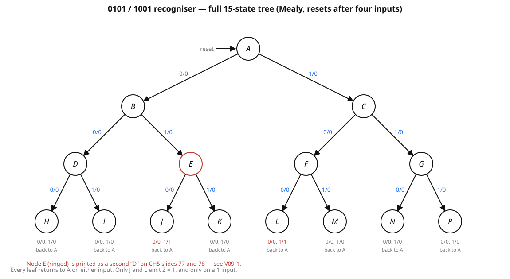

Only $J$ and $L$ produce $Z = 1$, and only on a 1 input:

- $J$ is reached by 0-1-0, so a fourth bit of 1 completes **0101**;
- $L$ is reached by 1-0-0, so a fourth bit of 1 completes **1001**.

[added] Checked by simulation: driving all sixteen four-bit groups through the table gives
$Z = 0,0,0,1$ for 0101 and 1001 and $Z = 0,0,0,0$ for the other fourteen, and the machine is back in
$A$ after every group.

### 9.3.3 The full state table

·CH5 slide 76. The deck sets the table up for **all** possible input combinations rather than
rationalising the state graph first — the point of the example is to then throw states away.

| Present state | Next state $X=0$ | Next state $X=1$ | $Z$ at $X=0$ | $Z$ at $X=1$ |
|---|---|---|---|---|
| $A$ | $B$ | $C$ | 0 | 0 |
| $B$ | $D$ | $E$ | 0 | 0 |
| $C$ | $F$ | $G$ | 0 | 0 |
| $D$ | $H$ | $I$ | 0 | 0 |
| $E$ | $J$ | $K$ | 0 | 0 |
| $F$ | $L$ | $M$ | 0 | 0 |
| $G$ | $N$ | $P$ | 0 | 0 |
| $H$ | $A$ | $A$ | 0 | 0 |
| $I$ | $A$ | $A$ | 0 | 0 |
| $J$ | $A$ | $A$ | 0 | **1** |
| $K$ | $A$ | $A$ | 0 | 0 |
| $L$ | $A$ | $A$ | 0 | **1** |
| $M$ | $A$ | $A$ | 0 | 0 |
| $N$ | $A$ | $A$ | 0 | 0 |
| $P$ | $A$ | $A$ | 0 | 0 |

### 9.3.4 First reduction — the leaves

·CH5 slides 77, 79

The deck's reasoning, verbatim in substance ·CH5 slide 77:

- There are states you cannot tell apart. $H$ and $I$ both have next state $A$ with $Z = 0$ on both
  inputs, so $H$ is equivalent to $I$ and $I$ can be removed.
- Examining the table shows $K$, $M$, $N$ and $P$ are also the same as $I$ was — they can be deleted.
- $J$ and $L$ are also equivalent.

So keep $H$ and $J$ and delete the other six leaves ·CH5 slide 79. Every reference to a deleted leaf
is rewritten:

| Row | Was | Becomes |
|---|---|---|
| $D$ | $H$, $I$ | $H$, $H$ |
| $E$ | $J$, $K$ | $J$, $H$ |
| $F$ | $L$, $M$ | $J$, $H$ |
| $G$ | $N$, $P$ | $H$, $H$ |

### 9.3.5 Second reduction — one level up

·CH5 slide 80. Having made those substitutions, move up to the $D$, $E$, $F$, $G$ section where the
next-state entries have changed:

- $D$ and $G$ are now identical ($H$, $H$ with $Z = 0,0$) — **$D \equiv G$**.
- $E$ and $F$ are now identical ($J$, $H$ with $Z = 0,0$) — **$E \equiv F$**.

Row $C$ is rewritten accordingly: $C$'s next states $F$ and $G$ become $E$ and $D$.

### 9.3.6 The result

·CH5 slide 81 — **original 15 states, reduced to 7**.

| Present state | Next state $X=0$ | Next state $X=1$ | $Z$ at $X=0$ | $Z$ at $X=1$ |
|---|---|---|---|---|
| $A$ | $B$ | $C$ | 0 | 0 |
| $B$ | $D$ | $E$ | 0 | 0 |
| $C$ | $E$ | $D$ | 0 | 0 |
| $D$ | $H$ | $H$ | 0 | 0 |
| $E$ | $J$ | $H$ | 0 | 0 |
| $H$ | $A$ | $A$ | 0 | 0 |
| $J$ | $A$ | $A$ | 0 | **1** |

[fig] **Fig. 9-2** — reduced 7-state graph ·CH5 slide 81(b)

```yaml
figure_data:
  type: state-diagram
  model: Mealy
  reset: A
  states: [A, B, C, D, E, H, J]
  merged_from:
    A: [A]
    B: [B]
    C: [C]
    D: [D, G]
    E: [E, F]
    H: [H, I, K, M, N, P]
    J: [J, L]
  transitions:
    - {from: A, on: "X=0", to: B, out: 0}
    - {from: A, on: "X=1", to: C, out: 0}
    - {from: B, on: "X=0", to: D, out: 0}
    - {from: B, on: "X=1", to: E, out: 0}
    - {from: C, on: "X=0", to: E, out: 0}
    - {from: C, on: "X=1", to: D, out: 0}
    - {from: D, on: "X=0", to: H, out: 0}
    - {from: D, on: "X=1", to: H, out: 0}
    - {from: E, on: "X=0", to: J, out: 0}
    - {from: E, on: "X=1", to: H, out: 0}
    - {from: H, on: "X=0", to: A, out: 0}
    - {from: H, on: "X=1", to: A, out: 0}
    - {from: J, on: "X=0", to: A, out: 0}
    - {from: J, on: "X=1", to: A, out: 1}
```

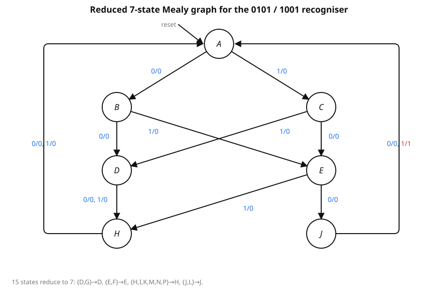

[added] Three independent checks were run on this reduction:

1. Partition refinement on the 15-state table returns exactly the classes
   $\{A\},\{B\},\{C\},\{D,G\},\{E,F\},\{H,I,K,M,N,P\},\{J,L\}$ — seven classes, matching the deck.
2. The printed graph on slide 81(b) agrees with the printed table on slide 81(a) arc for arc.
3. Exhaustive simulation of both machines over **every** input string up to 16 bits gives identical
   output strings, and the 7-state machine cannot be reduced further.

---

## 9.4 Equivalence — the formal test

·CH5 slide 82

| Symbol | Meaning | Units | Typical |
|---|---|---|---|
| $p$, $q$ | two states being compared | — | — |
| $\lambda(p,X)$ | output produced in state $p$ with input $X$ | — | 0 or 1 |
| $\delta(p,X)$ | next state entered from $p$ with input $X$ | — | a state name |
| $\equiv$ | "is equivalent to" | — | — |

[def] Two states are **equivalent** if there is **no way of telling them apart** through observation
of the circuit inputs and outputs ·CH5 slide 82.

**Theorem** ·CH5 slide 82. Two states $p$ and $q$ of a sequential circuit are equivalent if and only
if, for every single input $X$, the outputs are the same and the next states are equivalent:

$$\lambda(p, X) = \lambda(q, X)$$

$$\delta(p, X) \equiv \delta(q, X)$$

[eq: state-equivalence] Both conditions must hold, for **every** value of $X$ ·CH5 slide 82.

- $\lambda(p,X)$ — the output given present state $p$ and input $X$.
- $\delta(p,X)$ — the next state given present state $p$ and input $X$.

The definition is recursive, which is exactly why a mechanical procedure is needed: "the next states
are equivalent" is the same question one level down.

Three methods are named ·CH5 slide 82:

1. **Inspection** — what §9.3 used.
2. **Partitioning**.
3. **Implication tables**.

---

## 9.5 Implication tables

·CH5 slides 83–90

| Symbol | Meaning | Units | Typical |
|---|---|---|---|
| $a \ldots h$ | the eight states of the example machine | — | — |
| square $i$-$j$ | the chart cell for the pair of states $i$ and $j$ | — | — |
| implied pair | a pair whose equivalence is *required* for the square's pair to be equivalent | — | — |
| $\times$ | mark meaning "these two states are **not** equivalent" | — | — |

[def] An **implication table** (pair chart) is a chart with **a square for each pair of states**,
used to check each pair for possible equivalence ·CH5 slide 83. It is a procedure for finding *all*
the equivalent states in a state table.

### 9.5.1 The machine

[ex] ·CH5 slide 83. Eight states, one input, **Moore** — the output is a function of present state only.

| Present state | Next state $X=0$ | Next state $X=1$ | Present output |
|---|---|---|---|
| $a$ | $d$ | $c$ | 0 |
| $b$ | $f$ | $h$ | 0 |
| $c$ | $e$ | $d$ | 1 |
| $d$ | $a$ | $e$ | 0 |
| $e$ | $c$ | $a$ | 1 |
| $f$ | $f$ | $b$ | 1 |
| $g$ | $b$ | $h$ | 0 |
| $h$ | $c$ | $g$ | 1 |

Output groups: $\{a, b, d, g\}$ output 0, and $\{c, e, f, h\}$ output 1.

The chart is a staircase: rows $b$ down to $h$, columns $a$ across to $g$, one square per unordered
pair. Twenty-eight squares in all, since $\binom{8}{2} = 28$.

### 9.5.2 Step 1 — cross out output-incompatible pairs

·CH5 slide 84. Put an $\times$ in a square to eliminate **output-incompatible** states. The deck
starts with $a$: its output differs from $c$, $e$, $f$ and $h$, so those four squares are crossed;
then it continues the same way for every other state.

Sixteen squares go immediately — every pairing of a 0-output state with a 1-output state:

$$a\text{-}c,\; a\text{-}e,\; a\text{-}f,\; a\text{-}h,\; b\text{-}c,\; b\text{-}e,\; b\text{-}f,\; b\text{-}h$$

$$c\text{-}d,\; c\text{-}g,\; d\text{-}e,\; d\text{-}f,\; d\text{-}h,\; e\text{-}g,\; f\text{-}g,\; g\text{-}h$$

[fig] **Fig. 9-3** — implication chart after step 1 ·CH5 slide 84

```yaml
figure_data:
  type: implication-chart
  pass: "step 1 — output incompatibility"
  states: [a, b, c, d, e, f, g, h]
  outputs: {a: 0, b: 0, c: 1, d: 0, e: 1, f: 1, g: 0, h: 1}
  crossed: [a-c, a-e, a-f, a-h, b-c, b-e, b-f, b-h, c-d, c-g, d-e, d-f, d-h, e-g, f-g, g-h]
  surviving_count: 12
```

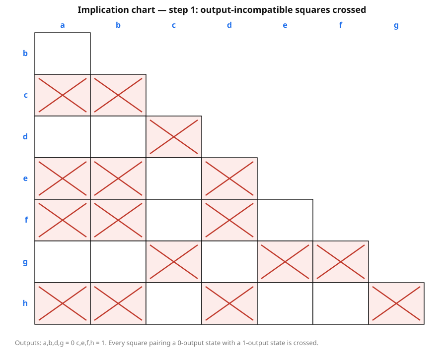

### 9.5.3 "Now what?" — entering the implied pairs

·CH5 slide 85. Implied pairs are now entered into each square that is **not** crossed.

- Square $a$-$b$: $a \equiv b$ only if $d \equiv f$ (from $X = 0$) **and** $c \equiv h$ (from
  $X = 1$). So "d-f, c-h" is written into the $a$-$b$ square.
- **Self-implied pairs are redundant, so eliminate them.** If the two states being compared go to the
  *same* next state on some input, that input imposes no condition and nothing is written down.

·CH5 slide 86 — **self-redundant pairs** are also removed: in square $a$-$d$ the entry $a$-$d$ is
the square's own pair and tells you nothing, so it is struck out. The deck's box reads

$$a \equiv d \ \text{iff}\ a \equiv d \ \text{and}\ c \equiv e$$

⚠ VERIFY (C09-1) — that line is circular as printed. After the self-redundant pair is struck the
statement is simply $a \equiv d$ **iff** $c \equiv e$, which is the whole point of striking it.
Cosmetic: the chart itself is right.

The twelve surviving squares and their conditions:

| Square | Implied pairs | Note |
|---|---|---|
| $a$-$b$ | $d$-$f$, $c$-$h$ | |
| $a$-$d$ | $c$-$e$ | $a$-$d$ struck as self-redundant |
| $a$-$g$ | $b$-$d$, $c$-$h$ | |
| $b$-$d$ | $a$-$f$, $e$-$h$ | |
| $b$-$g$ | $b$-$f$ | $h$-$h$ dropped, self-implied |
| $c$-$e$ | $a$-$d$ | $c$-$e$ struck as self-redundant |
| $c$-$f$ | $e$-$f$, $b$-$d$ | |
| $c$-$h$ | $c$-$e$, $d$-$g$ | |
| $d$-$g$ | $a$-$b$, $e$-$h$ | |
| $e$-$f$ | $c$-$f$, $a$-$b$ | |
| $e$-$h$ | $a$-$g$ | $c$-$c$ dropped, self-implied |
| $f$-$h$ | $c$-$f$, $b$-$g$ | |

[fig] **Fig. 9-4** — implied pairs entered, self-redundant pairs struck ·CH5 slides 85, 86

```yaml
figure_data:
  type: implication-chart
  pass: "implied pairs entered"
  implied:
    a-b: [d-f, c-h]
    a-d: [c-e]
    a-g: [b-d, c-h]
    b-d: [a-f, e-h]
    b-g: [b-f]
    c-e: [a-d]
    c-f: [e-f, b-d]
    c-h: [c-e, d-g]
    d-g: [a-b, e-h]
    e-f: [c-f, a-b]
    e-h: [a-g]
    f-h: [c-f, b-g]
  struck_self_redundant: [{square: a-d, pair: a-d}, {square: c-e, pair: c-e}]
  dropped_self_implied: [{square: b-g, pair: h-h}, {square: e-h, pair: c-c}]
```

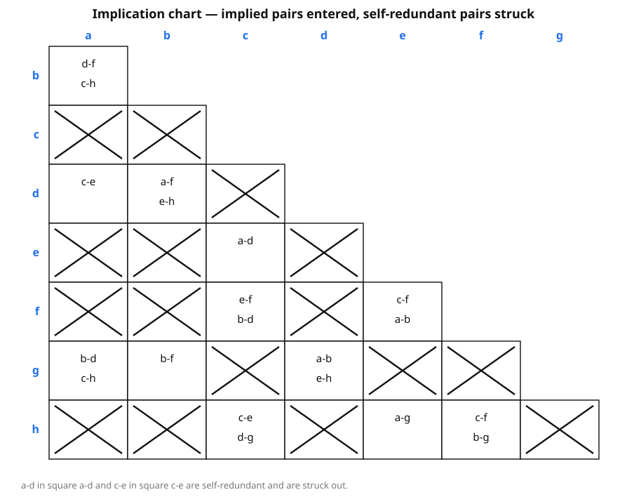

### 9.5.4 Next pass — cross out squares whose conditions have failed

·CH5 slide 87. $\times$ all squares with implied pairs that are not compatible. Work
**column by column**, $a$ through $g$, and run through the chart until no further crosses appear.

[derivation] The deck's own two worked cells:

- For square $a$-$b$ we need $d \equiv f$ and $c \equiv h$. But the $d$-$f$ square carries an
  $\times$, so $d$ is not equivalent to $f$; therefore $a$ is not equivalent to $b$ and $a$-$b$ is
  crossed.
- For square $a$-$d$ the square $c$-$e$ does **not** contain an $\times$, so at this point we cannot
  determine whether $a \equiv d$. Leave it.

Working the whole first pass in column order gives seven new crosses:

| Square crossed | Because this implied pair is already crossed |
|---|---|
| $a$-$b$ | $d$-$f$ (output-incompatible) |
| $b$-$d$ | $a$-$f$ (output-incompatible) |
| $b$-$g$ | $b$-$f$ (output-incompatible) |
| $c$-$f$ | $b$-$d$ (crossed earlier **this** pass, column $b$) |
| $d$-$g$ | $a$-$b$ (crossed earlier this pass, column $a$) |
| $e$-$f$ | $c$-$f$ (crossed earlier this pass, column $c$) |
| $f$-$h$ | $c$-$f$ (same) |

The column order matters: four of the seven only fall because an earlier column in the *same* pass
had already been crossed.

[fig] **Fig. 9-5** — the chart after the first pass ·CH5 slide 87

```yaml
figure_data:
  type: implication-chart
  pass: "first pass, columns a to g"
  newly_crossed: [a-b, b-d, b-g, c-f, d-g, e-f, f-h]
  still_open:
    a-d: [c-e]
    a-g: [b-d, c-h]
    c-e: [a-d]
    c-h: [c-e, d-g]
    e-h: [a-g]
```

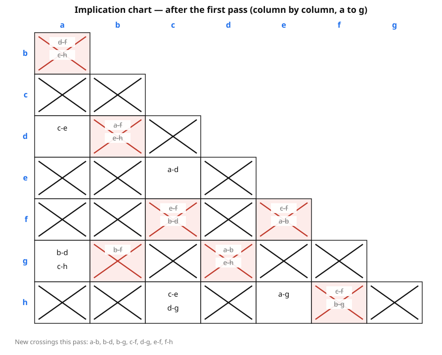

### 9.5.5 Final step

·CH5 slide 88

1. After the first pass, do a **second pass** from column $a$ again.
2. Then do a **third pass** and find no new crosses are added.
3. The process terminates.

Second pass — three more crosses:

| Square crossed | Because |
|---|---|
| $a$-$g$ | $b$-$d$ was crossed in pass 1 |
| $c$-$h$ | $d$-$g$ was crossed in pass 1 |
| $e$-$h$ | $a$-$g$, crossed a moment earlier in this same pass |

Third pass: $a$-$d$ still needs only $c$-$e$, and $c$-$e$ still needs only $a$-$d$; neither is
crossed, so nothing changes and the algorithm stops.

$$\boxed{\;a \equiv d \quad\text{and}\quad c \equiv e\;}$$

Replace $d$ with $a$ and $e$ with $c$, and delete rows $d$ and $e$ ·CH5 slide 88.

[fig] **Fig. 9-6** — the final chart; survivors are $a$-$d$ and $c$-$e$ ·CH5 slide 88

```yaml
figure_data:
  type: implication-chart
  pass: "second pass; third pass adds nothing"
  newly_crossed: [a-g, c-h, e-h]
  survivors: [a-d, c-e]
  conclusion: "a ≡ d, c ≡ e — eight states reduce to six"
```

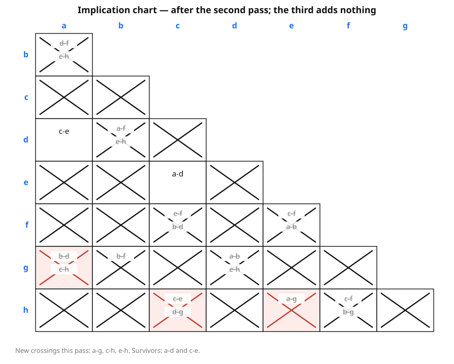

### 9.5.6 The reduced table

·CH5 slide 89 — removing equivalent states.

| Present state | Next state $X=0$ | Next state $X=1$ | Output |
|---|---|---|---|
| $a$ | $a$ | $c$ | 0 |
| $b$ | $f$ | $h$ | 0 |
| $c$ | $c$ | $a$ | 1 |
| $f$ | $f$ | $b$ | 1 |
| $g$ | $b$ | $h$ | 0 |
| $h$ | $c$ | $g$ | 1 |

Eight states down to six.

[added] Verified three ways: an implementation of the algorithm reproduces the deck's chart
**cell for cell at every pass** — same sixteen crosses at step 1, the same seven in pass 1, the same
three in pass 2, none in pass 3; independent partition refinement returns the classes
$\{a,d\},\{b\},\{c,e\},\{f\},\{g\},\{h\}$; and exhaustive simulation from every start state over all
strings up to 12 bits gives identical output sequences for the original and reduced machines.

### 9.5.7 Summary of method

·CH5 slide 90 — the five steps as printed:

1. Construct a chart with a square for each pair of states.
2. Compare each pair of rows in the state table. $\times$ a square if the outputs are different. If
   the output is the same, enter the implied pairs. Remove redundant pairs. If the implied pair is
   the same, place a check mark as $i \equiv j$.
3. Go through the implied pairs and $\times$ the square when an implied pair is incompatible.
4. Repeat until no more crosses are added.
5. For any remaining squares not crossed, $i \equiv j$.

---

## 9.6 State assignment — rules and guidelines

·CH5 slides 91–92

| Symbol | Meaning | Units | Typical |
|---|---|---|---|
| $m$ | number of states after reduction | — | 3 to 20 |
| $n$ | number of state variables (flip-flops) | — | $\lceil \log_2 m \rceil$ |
| $A$, $B$, $C$ | the state variables in the deck's seven-state example | — | 0 or 1 |
| adjacent | two codes differing in exactly one bit | — | — |

[def] **State assignment** is the choice of a binary code for each state ·CH5 slide 91. At this point
in the flow no further state reduction can be made — the table is already minimal.

The exhaustive approach — try all equivalent state assignments — is an **NP-complete** problem
·CH5 slide 91, so three heuristics are used instead.

⚠ VERIFY (C09-2) — slide 91 prints "This is a n-p complete problem"; the standard term is
**NP-complete**. Cosmetic.

**The three guidelines** ·CH5 slide 91, in priority order:

1. States which have the **same next state for a given input** should be given adjacent assignments.
2. States which are the **next states of the same state** should be given adjacent assignments.
3. States which have the **same output for a given input** should be given adjacent assignments.

Adjacency conditions from Guideline 1, and those from Guideline 2 that are **required two or more
times**, should be satisfied first ·CH5 slide 95.

### 9.6.1 How many bits

·CH5 slide 92. Each of the $m$ states must be assigned a **unique** code. The minimum number of bits
$n$ satisfies

$$n \ \geq\ \log_2 m$$

[eq: min-state-bits] equivalently

$$2^{\,n} \ \geq\ m$$

- $m$ — number of states, dimensionless.
- $n$ — number of state variables, dimensionless; being a bit count it is the smallest **integer**
  meeting the inequality.

There are useful state assignments that use **more** than the minimum number of bits — one-hot
coding is the obvious case ·CH5 slide 92.

The number of unused codes is

$$\text{unused states} \;=\; 2^{\,n} - m$$

[eq: unused-states] ·CH5 slide 92. For $m = 7$ and $n = 3$ that is $8 - 7 = 1$ unused code, and that
one code becomes a don't-care in every next-state map.

---

## 9.7 The starting state

·CH5 slides 93–94

[def] Assign the starting state to the **"0" square** on an **assignment map** ·CH5 slide 93. An
assignment map looks much like a K-map for logic minimisation: the state variables are the map
coordinates, and each cell holds the *name* of the state given that code.

Reasons for assigning the all-zero code to the starting state ·CH5 slide 94:

- The **clear** input on flip-flops can be used for initialisation.
- The clear input can also be used on a reset.
- The alternative is error-prone — using a combination of preset and clears to set a specific value
  can lead to implementation errors.
- It is good practice even when using FPGAs.

---

## 9.8 Applying the guidelines — the seven-state machine

·CH5 slides 93, 95–98

| Symbol | Meaning | Units | Typical |
|---|---|---|---|
| $S_0 \ldots S_6$ | the seven states | — | — |
| $A$, $B$, $C$ | state variables, present state code $ABC$ | — | 0 or 1 |
| $A^{+}$, $B^{+}$, $C^{+}$ | next values of those variables | — | 0 or 1 |
| $X$ | the input | — | 0 or 1 |
| $Z$ | the output | — | 0 or 1 |

### 9.8.1 The machine

[ex] ·CH5 slide 93. Seven states, one input, Mealy outputs.

| Present state | Next state $X=0$ | Next state $X=1$ | $Z$ at $X=0$ | $Z$ at $X=1$ | Code $ABC$ |
|---|---|---|---|---|---|
| $S_0$ | $S_1$ | $S_2$ | 0 | 0 | 000 |
| $S_1$ | $S_3$ | $S_2$ | 0 | 0 | 110 |
| $S_2$ | $S_1$ | $S_4$ | 0 | 0 | 001 |
| $S_3$ | $S_5$ | $S_2$ | 0 | 0 | 111 |
| $S_4$ | $S_1$ | $S_6$ | 0 | 0 | 011 |
| $S_5$ | $S_5$ | $S_2$ | **1** | 0 | 101 |
| $S_6$ | $S_1$ | $S_6$ | 0 | **1** | 010 |

### 9.8.2 Reading the guidelines off the table

·CH5 slide 95

**Guideline 1** — same next state for a given input:

- $S_0$, $S_2$, $S_4$ and $S_6$ should be made adjacent, as they all have $S_1$ as the next state on
  a **0** input.
- $S_3$ and $S_5$ should have adjacent assignment (both go to $S_5$ on 0).
- $S_4$ and $S_6$ should have adjacent assignment (both go to $S_6$ on 1).
- $S_0$, $S_1$, $S_3$ and $S_5$ should have adjacent assignments because they have $S_2$ as a next
  state, with input **1**.

**Guideline 2** — next states of the same state:

- $(S_1, S_2)$ — both next states of $S_0$.
- $(S_2, S_3)$ — both next states of $S_1$.
- $(S_1, S_4)$, $(S_2, S_5)$ **twice**, and $(S_1, S_6)$ **twice**.

[added] Each of these lists was regenerated from the state table and matches the slide exactly,
including the two pairs marked "two times".

### 9.8.3 Two possible assignment maps

·CH5 slide 96 gathers the requirements

- Guideline 1: $(S_0,S_1,S_3,S_5)$, $(S_3,S_5)$, $(S_4,S_6)$, $(S_0,S_2,S_4,S_6)$
- Guideline 2: $(S_1,S_2)$, $(S_2,S_3)$, $(S_1,S_4)$, $(S_2,S_5)\times 2$, $(S_1,S_6)\times 2$

and shows two maps that satisfy them.

⚠ VERIFY (C09-3) — the slide's lead-in reads "Two possible ways of satisfying the guidelines are:"
and is then followed by the two **guideline requirement lists**, not by two assignments. The two
*ways* are the two assignment maps beside them. Cosmetic wording only.

[fig] **Fig. 9-7** — the two assignment maps ·CH5 slide 96

```yaml
figure_data:
  type: assignment-map
  coordinates: {columns: A, rows: BC}
  map_a:   {S0: "000", S1: "110", S2: "001", S3: "111", S4: "011", S5: "101", S6: "010"}
  map_b:   {S0: "000", S1: "001", S2: "110", S3: "011", S4: "111", S5: "010", S6: "101"}
  unused_code: "100"
  starting_state_code: "000"
```

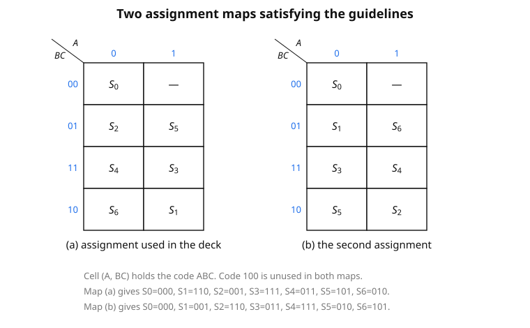

Map (a) is the one the deck carries forward. Note the starting state sits on 000, as §9.7 requires,
and the single unused code is 100.

### 9.8.4 The next-state map

·CH5 slide 97. Next-state maps may help choose the better assignment: look at the next state given
the current state and input, and how that will simplify the K-maps for the logic.

The map coordinates are $XA$ across and $BC$ down, so one map holds all fourteen defined
next-state entries plus two don't-cares.

[fig] **Fig. 9-8** — next-state map for assignment (a) ·CH5 slides 97, 98

```yaml
figure_data:
  type: next-state-map
  columns: XA
  rows: BC
  column_order: ["00", "01", "11", "10"]
  row_order: ["00", "01", "11", "10"]
  cells:
    "00,00": {state: S1, code: "110"}
    "01,00": don't-care
    "11,00": don't-care
    "10,00": {state: S2, code: "001"}
    "00,01": {state: S1, code: "110"}
    "01,01": {state: S5, code: "101"}
    "11,01": {state: S2, code: "001"}
    "10,01": {state: S4, code: "011"}
    "00,11": {state: S1, code: "110"}
    "01,11": {state: S5, code: "101"}
    "11,11": {state: S2, code: "001"}
    "10,11": {state: S6, code: "010"}
    "00,10": {state: S1, code: "110"}
    "01,10": {state: S3, code: "111"}
    "11,10": {state: S2, code: "001"}
    "10,10": {state: S6, code: "010"}
```

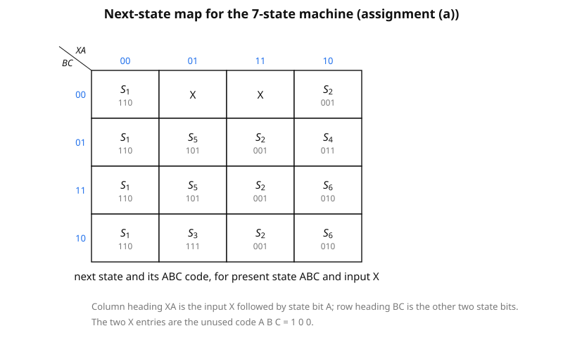

[added] All sixteen cells were regenerated from the state table and the assignment; every one agrees
with the printed map.

### 9.8.5 Choosing an assignment and reading the equations

·CH5 slide 98. Choose an assignment and implement in gates. Using the left assignment map, get the
next-state map with encoding, then map the encoding to K-maps.

$$A^{+} \;=\; X'$$

$$B^{+} \;=\; X'C' + A'C + A'B$$

$$C^{+} \;=\; A + XB'$$

[eq: seven-state-flipflop-equations] ·CH5 slide 98. With D flip-flops these are also
$D_A$, $D_B$ and $D_C$ directly.

⚠ VERIFY (V09-2) — in the printed $B^{+}$ map the cell at $XA = 10$, $BC = 00$ contains **1**; it
must be **0**. That cell is present state $ABC = 000 = S_0$ with $X = 1$, whose next state is
$S_2 = 001$, so $B^{+} = 0$. The deck's own next-state map on the same slide shows $S_2/001$ in that
position, and the printed equation $B^{+} = X'C' + A'C + A'B$ evaluates to 0 there — the map cell
contradicts both. Left as printed, that row of the map becomes all 1s and invites the grouping
$B^{+} = B'C' + A'C + A'B$, which sends $S_0$ to $S_4$ instead of $S_2$ on a 1 input.

[fig] **Fig. 9-9** — flip-flop input maps, with the corrected cell marked ·CH5 slide 98

```yaml
figure_data:
  type: k-map-set
  columns: XA
  rows: BC
  maps:
    A_plus:
      rows: {"00": [1, X, X, 0], "01": [1, 1, 0, 0], "11": [1, 1, 0, 0], "10": [1, 1, 0, 0]}
      equation: "A+ = X'"
    B_plus:
      rows: {"00": [1, X, X, 0], "01": [1, 0, 0, 1], "11": [1, 0, 0, 1], "10": [1, 1, 0, 1]}
      equation: "B+ = X'C' + A'C + A'B"
      corrected_cell: {at: "XA=10,BC=00", printed: 1, correct: 0, flag: V09-2}
    C_plus:
      rows: {"00": [0, X, X, 1], "01": [0, 1, 1, 1], "11": [0, 1, 1, 0], "10": [0, 1, 1, 0]}
      equation: "C+ = A + XB'"
```

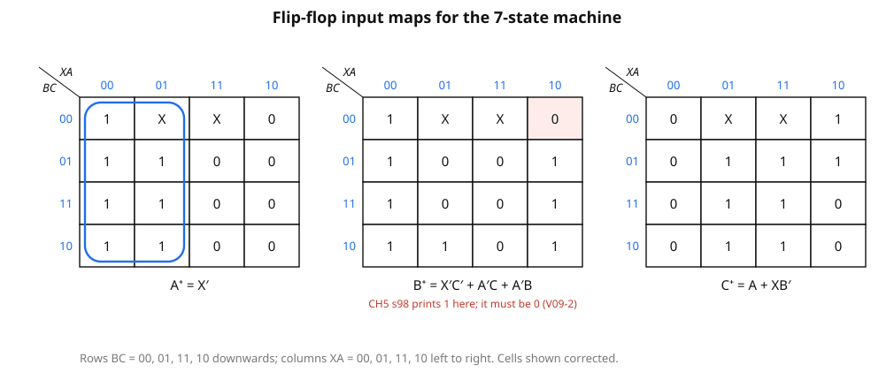

[added] All three equations were checked against the true next-state map at every defined cell: with
the corrected $B^{+}$ cell, all three are exactly right.

---

## 9.9 A second assignment — the six-state machine

·CH5 slides 99–101

| Symbol | Meaning | Units | Typical |
|---|---|---|---|
| $a \ldots f$ | the six states | — | — |
| $Q_1$, $Q_2$, $Q_3$ | state variables, present state $Q_1Q_2Q_3$ | — | 0 or 1 |
| $Q_1^{+}$ etc. | next values | — | 0 or 1 |
| $D_1$, $D_2$, $D_3$ | D flip-flop inputs | — | 0 or 1 |
| $Z$ | the output | — | 0 or 1 |

### 9.9.1 The machine

[ex] ·CH5 slide 100, Mealy.

| Present state | Next state $X=0$ | Next state $X=1$ | $Z$ at $X=0$ | $Z$ at $X=1$ |
|---|---|---|---|---|
| $a$ | $a$ | $c$ | 0 | 0 |
| $b$ | $d$ | $f$ | 0 | 1 |
| $c$ | $c$ | $a$ | 0 | 0 |
| $d$ | $d$ | $b$ | 0 | 1 |
| $e$ | $b$ | $f$ | 1 | 0 |
| $f$ | $c$ | $e$ | 1 | 0 |

### 9.9.2 The adjacency lists

·CH5 slide 99 — the sets of adjacent states specified by each guideline:

1. $(b,d)$, $(c,f)$, $(b,e)$
2. $(a,c)\times 2$, $(d,f)$, $(b,d)$, $(b,f)$, $(c,e)$
3. $(a,c)$, $(b,d)$, $(e,f)$

Then arrange the states on a map so as to satisfy as many of these pairs as possible, **giving
preference to the duplicated pairs $(b,d)$ and $(a,c)$** ·CH5 slide 99.

[added] All three lists were regenerated from the state table and match the slide exactly, including
the multiplicity 2 on $(a,c)$.

### 9.9.3 The two maps

[fig] **Fig. 9-10** — the two assignment maps ·CH5 slide 100

```yaml
figure_data:
  type: assignment-map
  coordinates: {columns: Q1, rows: Q2Q3}
  map_b: {a: "000", b: "111", c: "100", d: "011", e: "101", f: "110"}
  map_c: {a: "100", b: "111", c: "000", d: "011", e: "101", f: "010"}
  unused_codes: {map_b: ["001", "010"], map_c: ["001", "110"]}
  carried_forward: map_c
```

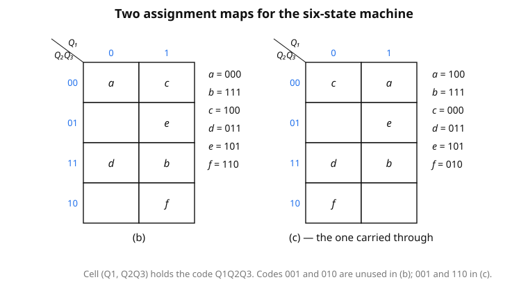

Both maps put $(b,d)$ and $(a,c)$ on adjacent squares. The transition table on slide 100 is built
from map **(c)**:

| $Q_1Q_2Q_3$ | State | $Q_1^{+}Q_2^{+}Q_3^{+}$ at $X=0$ | at $X=1$ | $Z$ at $X=0$ | $Z$ at $X=1$ |
|---|---|---|---|---|---|
| 100 | $a$ | 100 | 000 | 0 | 0 |
| 111 | $b$ | 011 | 010 | 0 | 1 |
| 000 | $c$ | 000 | 100 | 0 | 0 |
| 011 | $d$ | 011 | 111 | 0 | 1 |
| 101 | $e$ | 111 | 010 | 1 | 0 |
| 010 | $f$ | 000 | 101 | 1 | 0 |

[added] Rebuilt from the state table and assignment (c): every one of the twenty-four entries agrees
with the print.

### 9.9.4 The flip-flop input equations

·CH5 slide 101 — read directly from the maps:

$$D_1 \;=\; Q_1^{+} \;=\; X'Q_1Q_2' + XQ_1'$$

$$D_2 \;=\; Q_2^{+} \;=\; Q_3$$

$$D_3 \;=\; Q_3^{+} \;=\; XQ_1'Q_2 + X'Q_3$$

[eq: six-state-flipflop-equations] ·CH5 slide 101.

$$Z \;=\; XQ_2Q_3 + X'Q_2'Q_3 + X'Q_2Q_3'$$

⚠ VERIFY (V09-3) — the slide prints the third term of $Z$ as $XQ_2Q_3'$, without the prime on $X$.
It must be $X'Q_2Q_3'$. Two cells prove it: at $XQ_1 = 00$, $Q_2Q_3 = 10$ the printed map holds 1
(present state $010 = f$, input 0, output 1) but the printed equation gives 0; at $XQ_1 = 10$,
$Q_2Q_3 = 10$ the map holds 0 (state $f$, input 1, output 0) but the printed equation gives 1. The
K-map grouping drawn on the slide covers $X = 0$, so the loop is right and only the transcription
slipped. With $X'$ restored the equation matches the map at every defined cell.

**Cost** ·CH5 slide 101: **10 gates and 26 gate inputs**.

[added] Recounted. AND gates: two for $D_1$ (3-input and 2-input), two for $D_3$, three for $Z$
(3-input each) — seven. OR gates: one each for $D_1$, $D_3$ and $Z$ — three. Total ten.
Inputs: $D_1$ gives $3+2+2 = 7$, $D_3$ gives $3+2+2 = 7$, $Z$ gives $3+3+3+3 = 12$; total 26.
$D_2 = Q_3$ needs no gate. Both figures are correct as printed.

[fig] **Fig. 9-11** — the four maps of slide 101 ·CH5 slide 101

```yaml
figure_data:
  type: k-map-set
  columns: XQ1
  rows: Q2Q3
  maps:
    Q1_plus:
      rows: {"00": [0, 1, 0, 1], "01": [X, 1, 0, X], "11": [0, 0, 0, 1], "10": [0, X, X, 1]}
      equation: "D1 = X'Q1Q2' + XQ1'"
    Q2_plus:
      rows: {"00": [0, 0, 0, 0], "01": [X, 1, 1, X], "11": [1, 1, 1, 1], "10": [0, X, X, 0]}
      equation: "D2 = Q3"
    Q3_plus:
      rows: {"00": [0, 0, 0, 0], "01": [X, 1, 0, X], "11": [1, 1, 0, 1], "10": [0, X, X, 1]}
      equation: "D3 = XQ1'Q2 + X'Q3"
    Z:
      rows: {"00": [0, 0, 0, 0], "01": [X, 1, 0, X], "11": [0, 0, 1, 1], "10": [1, X, X, 0]}
      equation_printed: "Z = XQ2Q3 + X'Q2'Q3 + XQ2Q3'"
      equation_correct: "Z = XQ2Q3 + X'Q2'Q3 + X'Q2Q3'"
      flag: V09-3
  cost: {gates: 10, gate_inputs: 26}
```

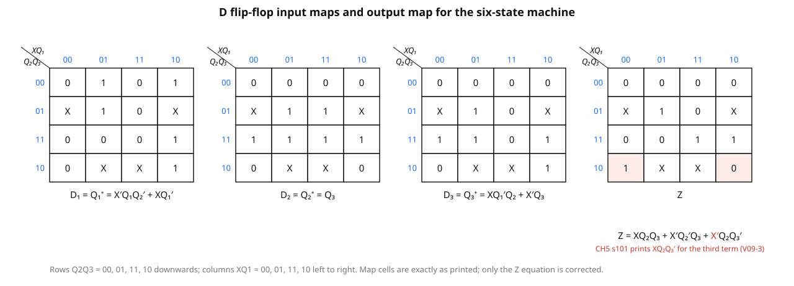

[added] All four printed **maps** were regenerated cell by cell from the state table and assignment
(c) and are correct; only the $Z$ equation is wrong.

---

## 9.10 Worked cases

·CH5 slides 102–112. Slide 102 is a section title, "Examples".

These four are the closest thing in the deck to exam questions. Each one starts from a written
specification, builds a state graph, and — for Case II — carries it all the way to gates.

### 9.10.1 Case I — 0101 and 1001, resetting every four inputs

·CH5 slides 103–104

| Symbol | Meaning | Units | Typical |
|---|---|---|---|
| $S_0 \ldots S_6$ | states, $S_0$ the reset state | — | — |
| $X$ | serial input | — | 0 or 1 |
| $Z$ | output, 1 on the fourth bit of a match | — | 0 or 1 |

[ex] Examine **groups of 4 consecutive inputs** and produce an output; **reset after every 4 inputs**
·CH5 slide 103.

Typical sequence ·CH5 slide 103:

$$X = 0101\ 0010\ 1001\ 0100$$

$$Z = 0001\ 0000\ 0001\ 0000$$

[added] Recomputed by simulating the completed graph: the output string is exactly
0001 0000 0001 0000, and the machine is back in $S_0$ at every group boundary. All sixteen possible
four-bit groups were also tested; only 0101 and 1001 raise $Z$, and only on the fourth bit.

The partial graph on slide 103 traces just the two winning paths:

$$S_0 \xrightarrow{0/0} S_1 \xrightarrow{1/0} S_3 \xrightarrow{0/0} S_4 \xrightarrow{1/1} S_0$$

$$S_0 \xrightarrow{1/0} S_2 \xrightarrow{0/0} S_3 \xrightarrow{0/0} S_4 \xrightarrow{1/1} S_0$$

Both 0101 and 1001 share the middle: after two bits both are "01 or 10", after three both are
"010 or 100". That shared middle is why seven states suffice rather than fifteen.

The complete graph ·CH5 slide 104 adds the two dead branches. $S_5$ and $S_6$ exist only to count out
the remaining clock ticks until the reset.

[fig] **Fig. 9-12** — Case I complete state graph ·CH5 slide 104

```yaml
figure_data:
  type: state-diagram
  model: Mealy
  reset: S0
  state_meanings:
    S0: reset
    S1: "sequence so far: 0"
    S2: "sequence so far: 1"
    S3: "01 or 10"
    S4: "010 or 100"
    S5: "two inputs in, no match possible"
    S6: "three inputs in, no match possible"
  transitions:
    - {from: S0, on: "X=0", to: S1, out: 0}
    - {from: S0, on: "X=1", to: S2, out: 0}
    - {from: S1, on: "X=0", to: S5, out: 0}
    - {from: S1, on: "X=1", to: S3, out: 0}
    - {from: S2, on: "X=0", to: S3, out: 0}
    - {from: S2, on: "X=1", to: S5, out: 0}
    - {from: S3, on: "X=0", to: S4, out: 0}
    - {from: S3, on: "X=1", to: S6, out: 0}
    - {from: S4, on: "X=0", to: S0, out: 0}
    - {from: S4, on: "X=1", to: S0, out: 1}
    - {from: S5, on: "X=0", to: S6, out: 0}
    - {from: S5, on: "X=1", to: S6, out: 0}
    - {from: S6, on: "X=0", to: S0, out: 0}
    - {from: S6, on: "X=1", to: S0, out: 0}
```

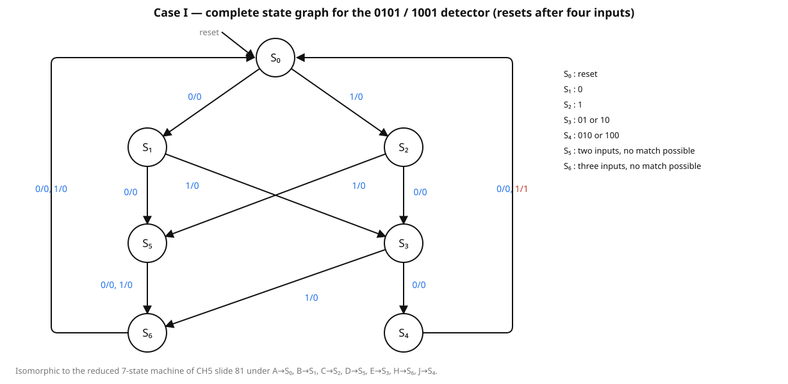

[added] This is the **same machine** as the reduced 7-state table of §9.3.6, reached directly instead
of by reduction. The isomorphism was verified arc by arc:

$$A \to S_0,\quad B \to S_1,\quad C \to S_2,\quad D \to S_5,\quad E \to S_3,\quad H \to S_6,\quad J \to S_4$$

That is the practical lesson of the whole first half of this file: think about **what has to be
remembered** and the graph comes out minimal; enumerate every input history and you get fifteen
states that then have to be reduced back to seven.

### 9.10.2 Case II — overlapping 101 detector (Mealy)

·CH5 slides 105–107

| Symbol | Meaning | Units | Typical |
|---|---|---|---|
| $S_0$, $S_1$, $S_2$ | states | — | — |
| $A$, $B$ | state variables, code $AB$ | — | 0 or 1 |
| $A^{+}$, $B^{+}$ | next values | — | 0 or 1 |
| $X$, $Z$ | input and output | — | 0 or 1 |

[ex] Examine **groups of 3 consecutive inputs** and produce an output; **no reset** ·CH5 slide 105.
Because there is no reset, groups overlap: every new bit forms a fresh group with its two
predecessors.

$$X = 0\ 0\ 1\ 1\ 0\ 1\ 1\ 0\ 0\ 1\ 0\ 1\ 0\ 1\ 0\ 0$$

$$Z = 0\ 0\ 0\ 0\ 0\ 1\ 0\ 0\ 0\ 0\ 0\ 1\ 0\ 1\ 0\ 0$$

[added] Recomputed. $Z_i = 1$ exactly when bits $i-2, i-1, i$ read 1, 0, 1 — that is at positions
6, 12 and 14. The printed string matches.

State meanings ·CH5 slide 105: $S_0$ initial, $S_1$ "got $\ldots 1$", $S_2$ "got $\ldots 10$".

[fig] **Fig. 9-13** — Case II Mealy graph ·CH5 slide 105

```yaml
figure_data:
  type: state-diagram
  model: Mealy
  reset: S0
  state_meanings: {S0: "initial / no useful history", S1: "ends in 1", S2: "ends in 10"}
  transitions:
    - {from: S0, on: "X=0", to: S0, out: 0}
    - {from: S0, on: "X=1", to: S1, out: 0}
    - {from: S1, on: "X=0", to: S2, out: 0}
    - {from: S1, on: "X=1", to: S1, out: 0}
    - {from: S2, on: "X=0", to: S0, out: 0}
    - {from: S2, on: "X=1", to: S1, out: 1}
```

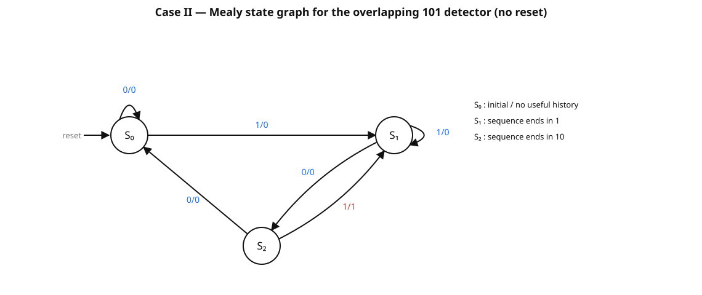

The arc that matters is $S_2 \xrightarrow{1/1} S_1$: it both reports the match **and** remembers that
the bit just consumed is a 1, which is what allows the next 101 to overlap this one.

**State table and assignment** ·CH5 slide 106, with $S_0 = 00$, $S_1 = 01$, $S_2 = 10$ and $AB = 11$
unused:

| $AB$ | $A^{+}B^{+}$ at $X=0$ | at $X=1$ | $Z$ at $X=0$ | $Z$ at $X=1$ |
|---|---|---|---|---|
| 00 | 00 | 01 | 0 | 0 |
| 01 | 10 | 01 | 0 | 0 |
| 10 | 00 | 01 | 0 | **1** |
| 11 | — | — | — | — |

$$A^{+} \;=\; X'B$$

$$B^{+} \;=\; X$$

$$Z \;=\; XA$$

[eq: case2-flipflop-equations] ·CH5 slide 106. All three follow immediately from the maps because the
unused code 11 is a don't-care in all of them.

[fig] **Fig. 9-14** — Case II state maps ·CH5 slides 106, 107

```yaml
figure_data:
  type: k-map-set
  columns: X
  rows: AB
  maps:
    A_plus: {rows: {"00": [0, 0], "01": [1, 0], "11": [X, X], "10": [0, 0]}, equation: "A+ = X'B"}
    B_plus: {rows: {"00": [0, 1], "01": [0, 1], "11": [X, X], "10": [0, 1]}, equation: "B+ = X"}
    Z:      {rows: {"00": [0, 0], "01": [0, 0], "11": [X, X], "10": [0, 1]}, equation: "Z = XA"}
```

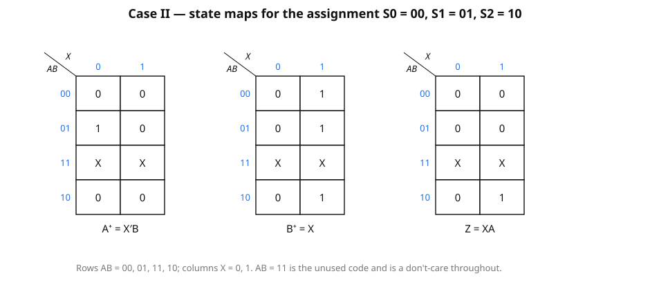

[added] All three equations were checked against every defined entry of the transition table and
reproduce it exactly.

**The circuit** ·CH5 slide 107. Two D flip-flops named $A$ and $B$, one inverter, two AND gates,
sharing one clock.

[fig] **Fig. 9-15** — Case II state realisation ·CH5 slide 107

```yaml
figure_data:
  type: logic-schematic
  flip_flops:
    - {name: A, type: D, d_input: "X'·B", clock: Clock}
    - {name: B, type: D, d_input: "X", clock: Clock}
  gates:
    - {id: INV1, type: NOT, in: [X], out: "X'"}
    - {id: AND1, type: AND2, in: ["X'", B], out: "D of A"}
    - {id: AND2, type: AND2, in: [X, A], out: Z}
  nets: [X, "X'", A, B, Z, Clock]
  assignment: {S0: "00", S1: "01", S2: "10"}
```

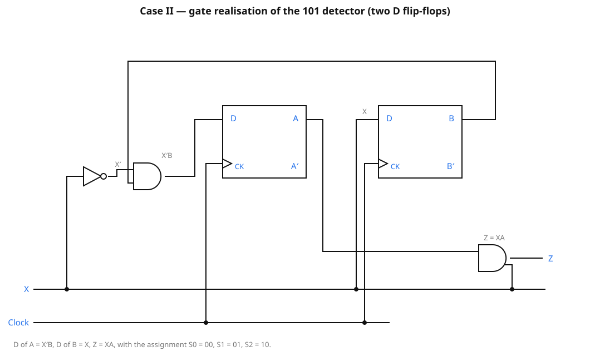

[exercise] ·CH5 slide 107, set for the student and **not solved here**:

> Check by yourself: $X = 0011011001010100$, $Z = 0000010000010100$ ??

The intent is to clock the realised circuit through the sixteen input bits and confirm the printed
output. Work it from the gates, not from the state graph — that is the point of the exercise.

### 9.10.3 Case II again — the Moore version

·CH5 slide 108

[ex] Same specification, one more state. $S_0$ initial, $S_1$ "got $\ldots 1$", $S_2$
"got $\ldots 10$", $S_3$ "got $\ldots 101$" — and $S_3$ is the state that carries the output.

| Present state | Next state $X=0$ | Next state $X=1$ | Present output |
|---|---|---|---|
| $S_0$ | $S_0$ | $S_1$ | 0 |
| $S_1$ | $S_2$ | $S_1$ | 0 |
| $S_2$ | $S_0$ | $S_3$ | 0 |
| $S_3$ | $S_2$ | $S_1$ | **1** |

With $S_0 = 00$, $S_1 = 01$, $S_2 = 10$, $S_3 = 11$ there are no unused codes:

| $AB$ | $A^{+}B^{+}$ at $X=0$ | at $X=1$ | $Z$ |
|---|---|---|---|
| 00 | 00 | 01 | 0 |
| 01 | 10 | 01 | 0 |
| 10 | 00 | 11 | 0 |
| 11 | 10 | 01 | **1** |

[fig] **Fig. 9-16** — Case II Moore graph ·CH5 slide 108

```yaml
figure_data:
  type: state-diagram
  model: Moore
  reset: S0
  outputs: {S0: 0, S1: 0, S2: 0, S3: 1}
  transitions:
    - {from: S0, on: "X=0", to: S0}
    - {from: S0, on: "X=1", to: S1}
    - {from: S1, on: "X=0", to: S2}
    - {from: S1, on: "X=1", to: S1}
    - {from: S2, on: "X=0", to: S0}
    - {from: S2, on: "X=1", to: S3}
    - {from: S3, on: "X=0", to: S2}
    - {from: S3, on: "X=1", to: S1}
```

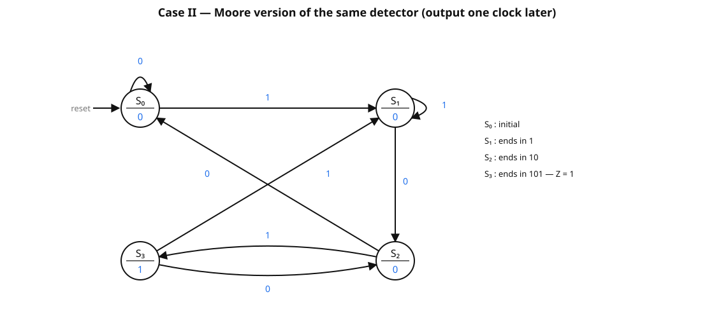

Note $S_3$'s next states are the same as $S_1$'s — $S_3$ *is* "ends in 1", with the extra fact that
the last three bits were 101 attached to it purely so a Moore output can be hung there.

[added] Simulated on the same 16-bit input. The Moore output, ignoring its first value, is exactly
the Mealy output of §9.10.2 **delayed by one clock**, which is the standard Mealy-to-Moore
relationship. The printed transition table matches the derivation entry for entry.

### 9.10.4 Case III — 010 and 1001 together

·CH5 slides 109–110

| Symbol | Meaning | Units | Typical |
|---|---|---|---|
| $S_0 \ldots S_5$ | states | — | — |
| $X$, $Z$ | input and output | — | 0 or 1 |

[ex] A **010 and 1001 detector**, overlapping, no reset ·CH5 slide 109.

$$X = 0\,0\,1\,0\,1\,0\,0\,1\,0\,0\,0\,1\,0\,0\,1\,1$$

$$Z = 0\,0\,0\,1\,0\,1\,0\,1\,1\,0\,0\,0\,1\,0\,1\,0$$

[added] Recomputed: $Z_i = 1$ when the last three bits are 010 **or** the last four are 1001 — that
is positions 4, 6, 8, 9, 13 and 15. The printed string matches exactly.

The deck builds the machine by designing the two detectors separately and then merging them
·CH5 slides 109–110:

| State | For "010" alone | For "1001" alone | Combined meaning |
|---|---|---|---|
| $S_0$ | reset | reset | reset |
| $S_1$ | 0 | 0 (but not 10) | ends in 0 but not 10 |
| $S_2$ | 01 | 01 | ends in 01 |
| $S_3$ | 010 | 10 | ends in 10 |
| $S_4$ | — | 1 (but not 01) | ends in 1 but not 01 |
| $S_5$ | — | 100 | ends in 100 |

The merged state set is the **union** — six states, and the two sub-machines share $S_0$, $S_1$ and
$S_2$ outright.

[fig] **Fig. 9-17** — Case III complete state graph ·CH5 slide 110

```yaml
figure_data:
  type: state-diagram
  model: Mealy
  reset: S0
  state_meanings:
    S0: reset
    S1: "ends in 0 but not 10"
    S2: "ends in 01"
    S3: "ends in 10"
    S4: "ends in 1 but not 01"
    S5: "ends in 100"
  transitions:
    - {from: S0, on: "X=0", to: S1, out: 0}
    - {from: S0, on: "X=1", to: S4, out: 0}
    - {from: S1, on: "X=0", to: S1, out: 0}
    - {from: S1, on: "X=1", to: S2, out: 0}
    - {from: S2, on: "X=0", to: S3, out: 1}     # completes 010
    - {from: S2, on: "X=1", to: S4, out: 0}
    - {from: S3, on: "X=0", to: S5, out: 0}
    - {from: S3, on: "X=1", to: S2, out: 0}
    - {from: S4, on: "X=0", to: S3, out: 0}
    - {from: S4, on: "X=1", to: S4, out: 0}
    - {from: S5, on: "X=0", to: S1, out: 0}
    - {from: S5, on: "X=1", to: S2, out: 1}     # completes 1001
```

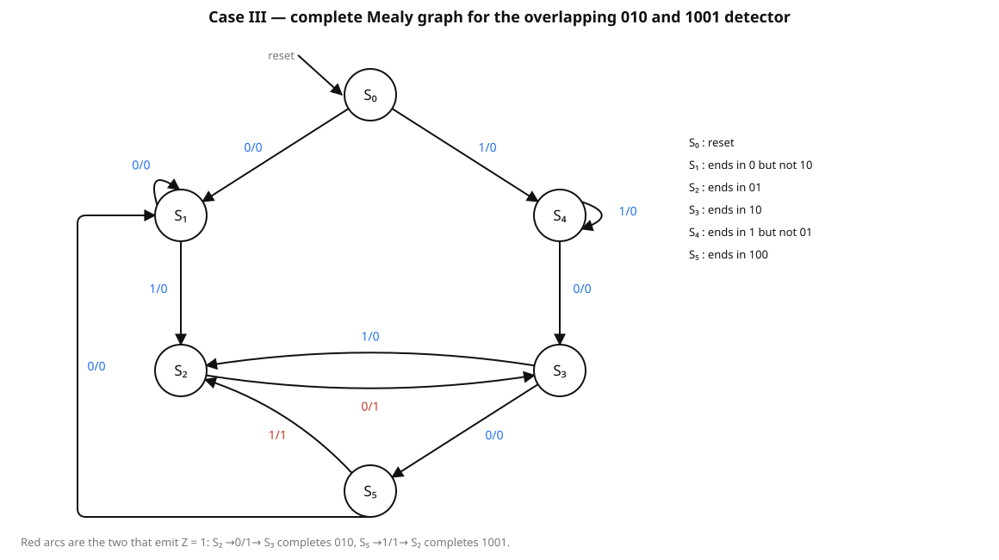

Two arcs carry $Z = 1$:

- $S_2 \xrightarrow{0/1} S_3$ — the 0 completes **010**, and the machine now ends in 10.
- $S_5 \xrightarrow{1/1} S_2$ — the 1 completes **1001**, and the machine now ends in 01.

The destinations matter as much as the outputs: landing in $S_3$ and $S_2$ rather than back at $S_0$
is what lets the next match overlap this one.

[added] Verified by exhaustive simulation against the specification for **every** input string up to
14 bits: the graph and the specification agree everywhere.

### 9.10.5 Case IV — odd parity together with two consecutive zeros

·CH5 slides 111–112

| Symbol | Meaning | Units | Typical |
|---|---|---|---|
| $S_0 \ldots S_5$ | states | — | — |
| $X$ | input | — | 0 or 1 |
| $Z$ | Moore output | — | 0 or 1 |

[ex] Specification ·CH5 slide 111: $Z = 1$ if the **total number of 1s is odd** **and** at least
**two consecutive 0s** have been received.

$$X = 1\ 0\ 1\ 1\ 0\ 0\ 1\ 1$$

$$Z = (0)\ 0\ 0\ 0\ 0\ 0\ 1\ 0\ 1$$

The bracketed leading 0 is the output **before** any input — the signature of a Moore machine, whose
output belongs to the state, not to the arc.

[added] Recomputed input by input. The 1s count runs 1, 1, 2, 3, 3, 3, 4, 5; a double zero first
completes at input 6. $Z = 1$ only where both conditions hold at once — inputs 6 and 8. The printed
string matches.

The deck builds it in two halves ·CH5 slides 111–112:

- **parity half**: $S_0$ (reset or even 1s) and $S_1$ (odd 1s), swapping on every 1;
- **zeros half**: $S_2$ (ends in 0), then $S_3$ (00 has occurred), and $S_4$ once both conditions
  hold.

Combining them needs one more state, $S_5$ — "odd 1s **and** ends in 0" — because the two halves have
to be tracked simultaneously.

| State | Meaning | $Z$ |
|---|---|---|
| $S_0$ | reset, or an even number of 1s | 0 |
| $S_1$ | odd number of 1s | 0 |
| $S_2$ | even 1s and ends in 0 | 0 |
| $S_3$ | even 1s and 00 has occurred | 0 |
| $S_4$ | 00 has occurred and odd 1s | **1** |
| $S_5$ | odd 1s and ends in 0 | 0 |

[fig] **Fig. 9-18** — Case IV complete state graph ·CH5 slide 112

```yaml
figure_data:
  type: state-diagram
  model: Moore
  reset: S0
  outputs: {S0: 0, S1: 0, S2: 0, S3: 0, S4: 1, S5: 0}
  layout_note: "left column = even number of 1s; right column = odd; a 1 input always crosses"
  transitions:
    - {from: S0, on: "X=0", to: S2}
    - {from: S0, on: "X=1", to: S1}
    - {from: S1, on: "X=0", to: S5}
    - {from: S1, on: "X=1", to: S0}
    - {from: S2, on: "X=0", to: S3}
    - {from: S2, on: "X=1", to: S1}
    - {from: S5, on: "X=0", to: S4}
    - {from: S5, on: "X=1", to: S0}
    - {from: S3, on: "X=0", to: S3}
    - {from: S3, on: "X=1", to: S4}
    - {from: S4, on: "X=0", to: S4}
    - {from: S4, on: "X=1", to: S3}
```

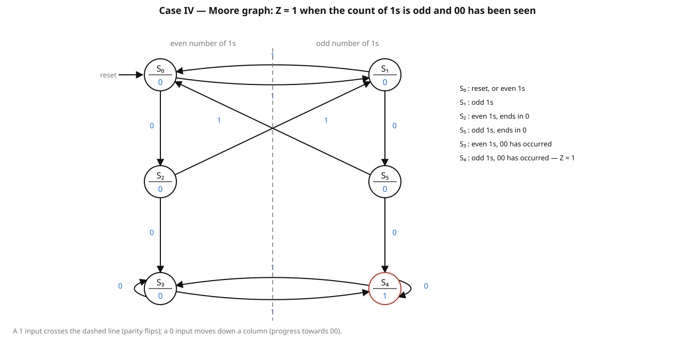

The graph reads as a two-by-three grid. Moving **across** the dashed line is what a 1 does — parity
flips. Moving **down** a column is what a 0 does — first "ends in 0", then "00 seen", after which the
row is sticky: once 00 has occurred it can never be un-occurred, so $S_3$ and $S_4$ self-loop on 0.

[added] Verified by exhaustive simulation against the specification for every input string up to 14
bits.

---

## 9.11 Guidelines for state-graph construction

·CH5 slide 113 — the six steps as printed:

1. **Construct sample sequences** to help you understand the problem.
2. **Determine under what conditions it should reset.**
3. If only one or two sequences lead to a nonzero output, **construct a partial state graph**.
   - Another way: determine what sequences or groups of sequences must be **remembered** by the
     circuit and set up states accordingly.
4. Each time you add an arrow to the state graph, determine whether it can go to one of the
   **previously defined states** or whether a new state must be added.
5. Check your graph to make sure there is **one and only one path leaving each state for each
   combination of values of the input variables**.
6. When your graph is complete, **verify it by applying the input sequences formulated in step 1**.

Each of the four Cases follows exactly this order: sample sequence first (steps 1 and 6 use the
same string), reset behaviour second, partial graph third, completion fourth.

---

## 9.12 Serial data transmission and line codes

·CH5 slide 114

| Symbol | Meaning | Units | Typical |
|---|---|---|---|
| bit time | duration of one data bit on the line | s | $1/f_{\text{bit}}$ |
| $d^{-}$ | the previous level on the line | — | 0 or 1 |
| NRZ | non-return-to-zero | — | — |
| NRZI | non-return-to-zero-inverted | — | — |
| RZ | return-to-zero | — | — |

Sending serial data on **two cables**, one for data and one for the clock, is "not good"
·CH5 slide 114. The alternative is one cable carrying data from which the receiver's **clock
recovery circuit** extracts the clock. That only works if the code guarantees enough transitions,
which is what the coding schemes are for.

The four schemes as printed ·CH5 slide 114:

| Scheme | Rule | Self-clocking? |
|---|---|---|
| **NRZ** | $0 \Rightarrow 0$; $1 \Rightarrow 1$ | no — a long run of equal bits has no edge |
| **NRZI** | $0 \Rightarrow d^{-}$ (hold); $1 \Rightarrow \overline{d^{-}}$ (toggle) | partly — a run of 0s has no edge |
| **RZ** | $0 \Rightarrow 0$; $1 \Rightarrow 10$ | partly — a run of 0s has no edge |
| **Manchester** | $0 \Rightarrow 01$; $1 \Rightarrow 10$ | **yes** — an edge in every bit cell |

[fig] **Fig. 9-19** — the four line codes for the deck's bit sequence ·CH5 slide 114

```yaml
figure_data:
  type: waveform
  bit_sequence: [0, 1, 1, 1, 0, 0, 1, 0]
  traces:
    NRZ:        [0, 1, 1, 1, 0, 0, 1, 0]
    NRZI:       [0, 1, 0, 1, 1, 1, 0, 0]
    RZ:         [0,0, 1,0, 1,0, 1,0, 0,0, 0,0, 1,0, 0,0]
    Manchester: [0,1, 1,0, 1,0, 1,0, 0,1, 0,1, 1,0, 0,1]
    clock:      [1,0, 1,0, 1,0, 1,0, 1,0, 1,0, 1,0, 1,0]
  note: "RZ, Manchester and the clock are given at half-bit resolution; NRZ and NRZI at bit resolution."
```

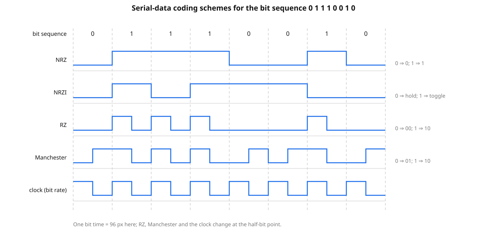

[added] All four traces were regenerated from the printed rules and match the slide's waveforms
sub-interval by sub-interval — including the NRZI level holding high across the two 0 bits in the
middle of the sequence.

---

## 9.13 NRZ to Manchester — a Mealy and a Moore solution

·CH5 slides 115–116

| Symbol | Meaning | Units | Typical |
|---|---|---|---|
| $X$ | NRZ data in | — | 0 or 1 |
| $Z$ | Manchester data out | — | 0 or 1 |
| Clock2 | clock at **twice** the bit rate | Hz | $2 f_{\text{bit}}$ |
| $S_0 \ldots S_3$ | states of the conversion network | — | — |

The conversion network takes NRZ data and Clock2 and produces Manchester data ·CH5 slides 115, 116.
Clock2 runs at twice the bit rate, so each bit cell is **two** clock periods long and $X$ is held
constant across both.

### 9.13.1 The Mealy version

[ex] ·CH5 slide 115. A Mealy output depends on the current state (synchronous) **and** the input
(which may be asynchronous), and needs **fewer states**.

| Present state | Next state $X=0$ | Next state $X=1$ | $Z$ at $X=0$ | $Z$ at $X=1$ |
|---|---|---|---|---|
| $S_0$ | $S_1$ | $S_2$ | 0 | 1 |
| $S_1$ | $S_0$ | — | 1 | — |
| $S_2$ | — | $S_0$ | — | 0 |

The dashes are genuine don't-cares: $X$ cannot change inside a bit cell, so $S_1$ is only ever
entered with $X = 0$ and $S_2$ only with $X = 1$. Starting state $S_0$ ·CH5 slide 115.

[fig] **Fig. 9-20** — Mealy conversion machine ·CH5 slide 115

```yaml
figure_data:
  type: state-diagram
  model: Mealy
  reset: S0
  state_meanings:
    S0: "first half of a bit cell"
    S1: "second half of a 0 cell"
    S2: "second half of a 1 cell"
  transitions:
    - {from: S0, on: "X=0", to: S1, out: 0}
    - {from: S0, on: "X=1", to: S2, out: 1}
    - {from: S1, on: "X=0", to: S0, out: 1}
    - {from: S2, on: "X=1", to: S0, out: 0}
  block_diagram: {inputs: ["NRZ data X", "Clock2"], block: "conversion network", output: "Z (Manchester data)"}
```

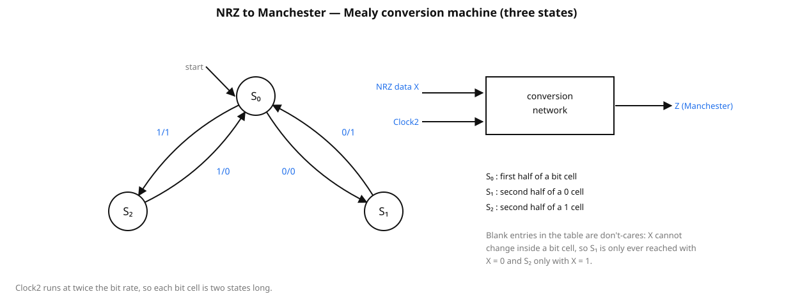

Trace it: a 0 bit gives $S_0 \xrightarrow{0/0} S_1 \xrightarrow{0/1} S_0$, emitting **01**; a 1 bit
gives $S_0 \xrightarrow{1/1} S_2 \xrightarrow{1/0} S_0$, emitting **10**. That is the Manchester rule
of §9.12 exactly.

The deck notes the price ·CH5 slide 115: because the output responds to $X$ immediately, the actual
$Z$ shows **glitches — false output** wherever $X$ moves off the clock edge.

### 9.13.2 The Moore version

[ex] ·CH5 slide 116. A Moore output depends only on the current state (synchronous), so there are
**more states** and a **one clock period delay**.

| Present state | Next state $X=0$ | Next state $X=1$ | Present output $Z$ |
|---|---|---|---|
| $S_0$ | $S_1$ | $S_3$ | 0 |
| $S_1$ | $S_2$ | — | 0 |
| $S_2$ | $S_1$ | $S_3$ | 1 |
| $S_3$ | — | $S_0$ | 1 |

Starting states: $S_0$ and $S_2$ ·CH5 slide 116 — which one depends on whether the first bit is 0 or
1, because a Moore machine has to already be in the right state to emit the first half-bit.

[fig] **Fig. 9-21** — Moore conversion machine ·CH5 slide 116

```yaml
figure_data:
  type: state-diagram
  model: Moore
  starting_states: [S0, S2]
  outputs: {S0: 0, S1: 0, S2: 1, S3: 1}
  transitions:
    - {from: S0, on: "X=0", to: S1}
    - {from: S0, on: "X=1", to: S3}
    - {from: S1, on: "X=0", to: S2}
    - {from: S2, on: "X=0", to: S1}
    - {from: S2, on: "X=1", to: S3}
    - {from: S3, on: "X=1", to: S0}
```

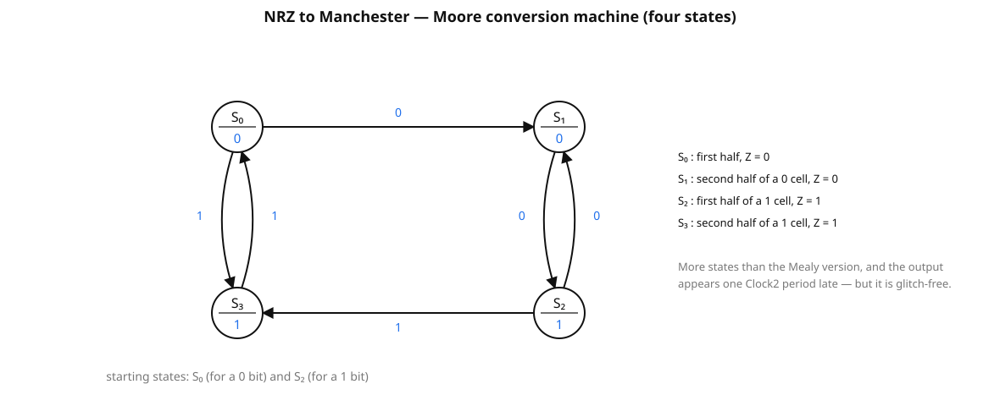

[fig] **Fig. 9-22** — timing for both machines ·CH5 slides 115, 116

```yaml
figure_data:
  type: waveform
  bit_sequence: [0, 1, 1, 1, 0, 0, 1, 0]
  X_nrz:        [0,0, 1,1, 1,1, 1,1, 0,0, 0,0, 1,1, 0,0]
  clock2:       [1,0, 1,0, 1,0, 1,0, 1,0, 1,0, 1,0, 1,0]
  mealy_state:  [S0,S1, S0,S2, S0,S2, S0,S2, S0,S1, S0,S1, S0,S2, S0,S1]
  mealy_Z:      [0,1, 1,0, 1,0, 1,0, 0,1, 0,1, 1,0, 0,1]
  moore_state:  [S0,S1, S2,S3, S0,S3, S0,S3, S0,S1, S2,S1, S2,S3, S0,S1]
  moore_Z:      [0,0, 1,1, 0,1, 0,1, 0,0, 1,0, 1,1, 0,0]
  manchester_target: [0,1, 1,0, 1,0, 1,0, 0,1, 0,1, 1,0, 0,1]
```

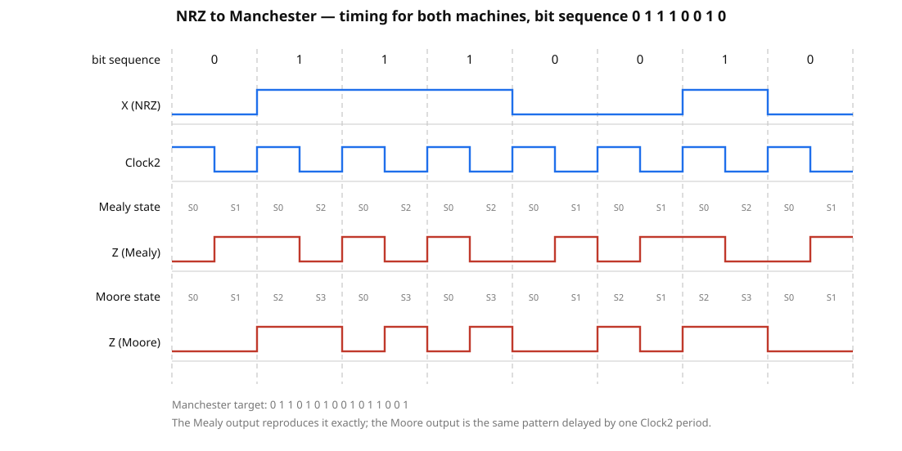

[added] Both machines were simulated over the deck's own bit sequence 0 1 1 1 0 0 1 0. Results:

- the Mealy state sequence is $S_0\,S_1\,S_0\,S_2\,S_0\,S_2\,S_0\,S_2\,S_0\,S_1\,S_0\,S_1\,S_0\,S_2\,S_0\,S_1$,
  identical to the slide-115 print;
- the Mealy $Z$ is 0110 1010 0101 1001, which is **exactly** the Manchester encoding of the bit
  sequence;
- the Moore state sequence is $S_0\,S_1\,S_2\,S_3\,S_0\,S_3\,S_0\,S_3\,S_0\,S_1\,S_2\,S_1\,S_2\,S_3\,S_0\,S_1$,
  identical to the slide-116 print;
- the Moore $Z$ is 0011 0101 0010 1100, which is the same Manchester pattern **delayed by one
  Clock2 period** — the "1 clock period delay" the slide claims.

So both encode NRZ as Manchester as advertised; the difference is glitch immunity against one
half-bit of latency.

---

## 9.14 Alphanumeric arc labels and the completeness tests

·CH5 slides 117–118

| Symbol | Meaning | Units | Typical |
|---|---|---|---|
| $F$ | "forward" input | — | 0 or 1 |
| $R$ | "reverse" input | — | 0 or 1 |
| $Z_1, Z_2, Z_3$ | the three outputs | — | 0 or 1 |
| $S_0, S_1, S_2$ | the three states | — | — |

[ex] When a sequential circuit has **several inputs**, label the state-graph arcs with
**alphanumeric input variable names** instead of 0s and 1s ·CH5 slide 117. With two inputs $F$ (forward) and $R$
(reverse), first **decide priority** — here $F$ has higher priority than $R$.

Labelling arcs simply $F$ and $R$ leaves the graph **incomplete** ·CH5 slide 117: nothing says what
happens when both are asserted, or neither. The complete labelling is

| Arc label | Means |
|---|---|
| $F$ | forward, whatever $R$ is — $F$ wins |
| $F'R$ | reverse only when forward is not asserted |
| $F'R'$ | neither — stay put |

[fig] **Fig. 9-23** — the complete three-state $F$/$R$ machine ·CH5 slides 117, 118

```yaml
figure_data:
  type: state-diagram
  model: Moore
  states: [S0, S1, S2]
  outputs: {S0: "Z1 (100)", S1: "Z2 (010)", S2: "Z3 (001)"}
  transitions:
    - {from: S0, on: "F",     to: S1}
    - {from: S0, on: "F'R",   to: S2}
    - {from: S0, on: "F'R'",  to: S0}
    - {from: S1, on: "F",     to: S2}
    - {from: S1, on: "F'R",   to: S0}
    - {from: S1, on: "F'R'",  to: S1}
    - {from: S2, on: "F",     to: S0}
    - {from: S2, on: "F'R",   to: S1}
    - {from: S2, on: "F'R'",  to: S2}
  table:
    header: "FR = 00, 01, 10, 11"
    S0: [S0, S2, S1, S1]
    S1: [S1, S0, S2, S2]
    S2: [S2, S1, S0, S0]
```

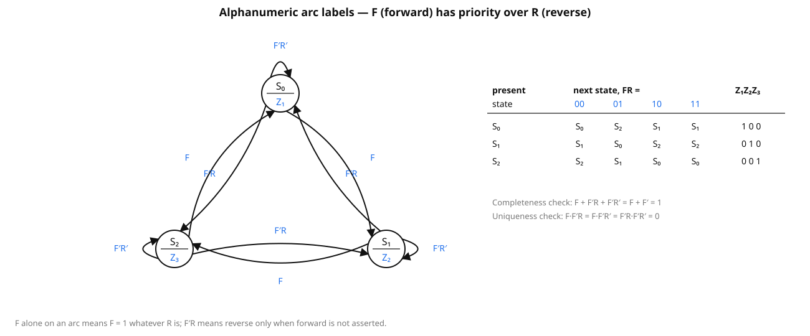

### 9.14.1 Is the graph complete?

·CH5 slide 118. Two mechanical checks on the arcs leaving **each** state.

**Completeness.** OR together all input labels on arcs emanating from a state; the result must reduce
to 1 — every input combination is covered:

$$F + F'R + F'R' \;=\; F + F'(R + R') \;=\; F + F' \;=\; 1$$

[eq: graph-completeness] ·CH5 slide 118.

**Mutual exclusion.** AND together any pair of input labels on arcs emanating from a state; the
result must reduce to 0 — only one arc is ever valid:

$$F \cdot F'R = 0, \qquad F \cdot F'R' = 0, \qquad F'R \cdot F'R' = 0$$

[eq: graph-mutual-exclusion] ·CH5 slide 118. Together these are step 5 of §9.11 done algebraically
instead of by eye.

### 9.14.2 Shorthand notation

·CH5 slide 118. With four inputs $X_1 X_2 X_3 X_4$ and four outputs $Z_1 Z_2 Z_3 Z_4$:

$$X_1 X_4' \,/\, Z_2 Z_3 \;\equiv\; 1\text{-}\text{-}0 \,/\, 0110$$

- On the left, only the variables that matter are written: $X_1$ asserted, $X_4$ negated, $X_2$ and
  $X_3$ irrelevant.
- On the right, the positional form: a dash for each don't-care input, and a 1 in each output
  position that is asserted.

$$-\,/\,Z_1 \;\equiv\; \text{-}\text{-}\text{-}\text{-} \,/\, 1000$$

A bare dash on the input side means **for any combination of input values** ·CH5 slide 118 — an
unconditional arc.

---

## Slide coverage

| Slide | Treatment |
|---|---|
| 72 | Section title, "State Reduction and Assignment" — no content |
| 73 | §9.1 |
| 74 | §9.2 |
| 75 | §9.3.1 — the problem statement |
| 76 | §9.3.3 — full state table |
| 77 | §9.3.2, §9.3.4 — tree stages 1 and 2, redundant-leaf reasoning; **V09-1** |
| 78 | §9.3.2 — full tree; **V09-1** |
| 79 | §9.3.4 — first reduction |
| 80 | §9.3.5 — second reduction |
| 81 | §9.3.6 — reduced table and graph |
| 82 | §9.4 |
| 83 | §9.5.1 — the implication-table machine |
| 84 | §9.5.2 — step 1 |
| 85 | §9.5.3 — implied pairs |
| 86 | §9.5.3 — self-redundant pairs; **C09-1** |
| 87 | §9.5.4 — first pass |
| 88 | §9.5.5 — final step |
| 89 | §9.5.6 — reduced table |
| 90 | §9.5.7 — summary of method |
| 91 | §9.6 — rules and guidelines; **C09-2** |
| 92 | §9.6.1 — bit count |
| 93 | §9.7, §9.8.1 — starting state and the seven-state table |
| 94 | §9.7 — reason for assigning 0 |
| 95 | §9.8.2 — guidelines applied |
| 96 | §9.8.3 — two assignment maps; **C09-3** |
| 97 | §9.8.4 — next-state map |
| 98 | §9.8.5 — encoded map and K-maps; **V09-2** |
| 99 | §9.9.2 — adjacency lists for the six-state machine |
| 100 | §9.9.1, §9.9.3 — state table, maps, transition table |
| 101 | §9.9.4 — equations and cost; **V09-3** |
| 102 | Section title, "Examples" — no content |
| 103 | §9.10.1 — Case I, partial graph |
| 104 | §9.10.1 — Case I, complete graph |
| 105 | §9.10.2 — Case II, Mealy graph |
| 106 | §9.10.2 — Case II, table and maps |
| 107 | §9.10.2 — Case II, circuit and the set exercise |
| 108 | §9.10.3 — Case II, Moore version |
| 109 | §9.10.4 — Case III, specification and state meanings |
| 110 | §9.10.4 — Case III, complete graph |
| 111 | §9.10.5 — Case IV, specification |
| 112 | §9.10.5 — Case IV, complete graph |
| 113 | §9.11 |
| 114 | §9.12 |
| 115 | §9.13.1 |
| 116 | §9.13.2 |
| 117 | §9.14 |
| 118 | §9.14.1, §9.14.2 |

All 47 slides accounted for: 45 taught, 2 (slides 72 and 102) are section-title slides with no
content.

---

## Note on file size and a possible split

This file is about 64 KB — well past the ~40 KB guideline — because 47 slides of continuous material
were assigned to it. It has **not** been truncated.

If it is ever split, the cut falls cleanly between **§9.5.7 (Summary of method)** and **§9.6 (State
assignment — rules and guidelines)** — that is, between CH5 slide 90 and slide 91. The two halves are
genuinely independent themes:

- **09a — State Reduction** (slides 72–90): §9.1 to §9.5, about 21 KB and 6 figures — the two
  recogniser graphs and the four implication charts.
- **09b — State Assignment and Worked Cases** (slides 91–118): §9.6 to §9.14, about 42 KB and 17
  figures — all the maps, all four Cases, and the serial-data material.

The argument for keeping them together is that the four Cases in §9.10 refer back to the reduction
example of §9.3 (Case I is the same machine reached a different way), and the deck itself runs the
two topics as one titled section, "State Reduction and Assignment" ·CH5 slide 72.
