# 10 — Algorithmic State Machines

**This is the final chapter of the taught unit.** It covers all 40 slides of Chapter 6, and nothing
follows it, so `leads_to` is empty.

Handout code used throughout: `CH6`. The printed footer number equals the PDF page number, so
`·CH6 slide 20` is the slide titled "PLA Table for Dice Game".

The chapter is almost entirely geometry: seven of its forty slides are pure diagrams with no text
layer at all (slides 13, 17, 37, 38, 39, 40 and most of 12). Every ASM chart in the range has been
redrawn as SVG and every table has been rebuilt from the corresponding chart in Python and compared
cell by cell.

Seven defects were raised — three substantive, four cosmetic. Each is flagged inline at the point of
use and collected in `flags/10.md`.

**No homework is set anywhere in Chapter 6.** Every problem in the deck is worked through on the
slides that follow it, so this file contains no `[exercise]` entries. Where the deck stops short of
a final expression — the minimised next-state equations of §10.13 — the result is supplied here and
tagged `[added]`.

---

## 10.1 Why state diagrams run out

·CH6 slides 2–3

| Symbol | Meaning | Units | Typical |
|---|---|---|---|
| $S_i$ | a state of the machine | — | $S_0, S_1, \ldots$ |
| $X_i$ | an input to the machine | — | 0 or 1 |
| $Z_i$ | an output of the machine | — | 0 or 1 |

A state diagram lists, on every arc, the value of **every** input and the value of **every** output.
For a real system that is unworkable ·CH6 slide 2:

- **Many inputs and many outputs** — awkward to list all of them on each transition arc.
- On any given arc, most inputs are **don't care**.
- On any given arc, most outputs are **unchanged** from their settings in the previous state.
- Listing them exhaustively is tedious and repetitive.

The deck makes the same point by analogy with combinational design ·CH6 slide 2:

- **Combinational** — truth tables are fine for small problems, but get out of hand for adders and
  multiplexers.
- **Sequential** — state diagrams are easy for small problems, but are not helpful for real,
  data-handling machines.

[def] An **algorithmic state machine (ASM) chart**, also called an **SM chart**, is the notation
used when a sequential circuit controls a digital system that carries out a **step-by-step
procedure** or **algorithm** ·CH6 slide 3.

- It describes the behaviour of a state machine.
- It is equivalent to a state graph, and it leads **directly** to a hardware realisation
  ·CH6 slide 3.
- It is like a state diagram but without the two drawbacks above: it does **not** list all inputs
  for each transition (don't-care inputs are simply omitted) and it does **not** list all outputs
  for each state (unchanged outputs are simply omitted) ·CH6 slide 3.

[def] The design route for a small problem is ·CH6 slide 4:

1. ASM chart or state diagram.
2. State assignment.
3. State table.
4. K-maps and gates, flip-flops, registers, multiplexers, decoders, EPROM — or, creatively, a
   combination of them.

- ASM charts are like flowcharts, **with a few crucial differences** — the timing in particular
  ·CH6 slide 4. The difference is that a flowchart box is an instruction executed in sequence,
  while an ASM state box is a **clock period**: everything inside one SM block happens in the same
  clock period, and the state change takes effect at the edge that ends it.

---

## 10.2 The three elements of an ASM chart

·CH6 slide 5

| Symbol | Meaning | Units | Typical |
|---|---|---|---|
| state name | the label written inside a state box | — | $S_0$, $T_1$ |
| state code | the assigned binary code, written **outside** the box at the top | — | 00, 011 |
| output list | outputs asserted for the whole clock period | — | Roll, Sp |
| condition | the Boolean expression tested by a decision box | — | $Rb$, $A + BC$ |

[fig] **Fig. 10-1** — the state box, the decision box and the conditional output box ·CH6 slide 5

```yaml
figure_data:
  type: asm-chart-legend
  elements:
    state_box:
      shape: rectangle
      holds: [state name, optional output list]
      state_code: outside the box, top right
      exits: exactly one
      output_kind: unconditional (Moore)
      rule: one box per system state
    decision_box:
      shape: diamond
      holds: Boolean expression
      exits: two - labelled 1 (true) and 0 (false)
    conditional_output_box:
      shape: rectangle with curved ends
      holds: conditional output list
      exits: one
      output_kind: conditional (Mealy) - depends on state AND inputs
      convention: only used for Mealy outputs; list an output only when it is 1
```

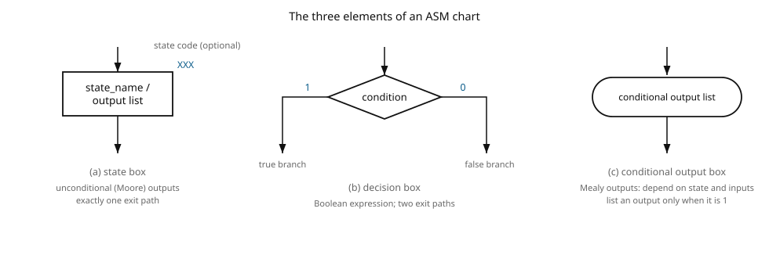

[def] **State box** ·CH6 slide 5

- Represents the **state** of the system.
- Contains a **state name**, and may contain an **output list**.
- A **state code** may be placed outside the box at the top.
- **One box per system state.**

[def] **Decision box** ·CH6 slide 5

- Represented by a **diamond-shaped** symbol with **true** and **false** branches.
- The condition placed in the box is a **Boolean expression** that is evaluated to determine which
  branch to take.

[def] **Conditional output box** ·CH6 slide 5

- Has **curved ends**.
- Contains a **conditional output list**.
- The conditional outputs depend on **both** the state of the system **and** the inputs.
- Only used for **Mealy** outputs.
- Only use it if the output is **high** — an output that is 0 is simply not listed.

> The distinction between the two output kinds is the single most examined point in the chapter.
> An output written **inside a state box** is asserted for the whole of that clock period regardless
> of the inputs. An output written **inside a conditional output box** is asserted only when the
> path through the decision boxes that leads to it is taken. Both take effect in the *same* clock
> period as the state box they belong to.

---

## 10.3 The SM block

·CH6 slide 6

| Symbol | Meaning | Units | Typical |
|---|---|---|---|
| entrance path | the single path by which control enters an SM block | — | 1 per block |
| exit path | a path by which control leaves an SM block | — | $n \ge 1$ per block |
| link path | a path from the entrance of one state box to the entrance of the next | — | — |

[def] An **SM block** contains exactly **one state box** together with the decision boxes and
conditional output boxes associated with that state ·CH6 slide 6.

[def] An SM block has exactly **one entrance path** and **one or more exit paths** ·CH6 slide 6.

[def] A **link path** is a path through the chart from the state box of one SM block to the state
box of the next. The deck marks two of them on slide 6 ·CH6 slide 6.

[fig] **Fig. 10-2** — an SM block with one state box, three decision boxes and two conditional
output boxes ·CH6 slide 6

```yaml
figure_data:
  type: sm-block
  state_box: {name: S1, outputs: [Z1, Z2]}
  decision_boxes: [X1, X2, X3]
  conditional_outputs:
    - {box: [Z3, Z4], reached_when: "X1 = 0"}
    - {box: [Z5], reached_when: "X1 = 1 and X3 = 0"}
  exit_paths:
    - {exit: 1, condition: "X1 = 0, X2 = 0", outputs_asserted: [Z1, Z2, Z3, Z4]}
    - {exit: 2, condition: "X1 = 0, X2 = 1", outputs_asserted: [Z1, Z2, Z3, Z4]}
    - {exit: 3, condition: "X1 = 1, X3 = 0", outputs_asserted: [Z1, Z2, Z5]}
    - {exit: n, condition: "X1 = 1, X3 = 1", outputs_asserted: [Z1, Z2]}
  note: "Z1 and Z2 are asserted on every path because they sit in the state box."
```

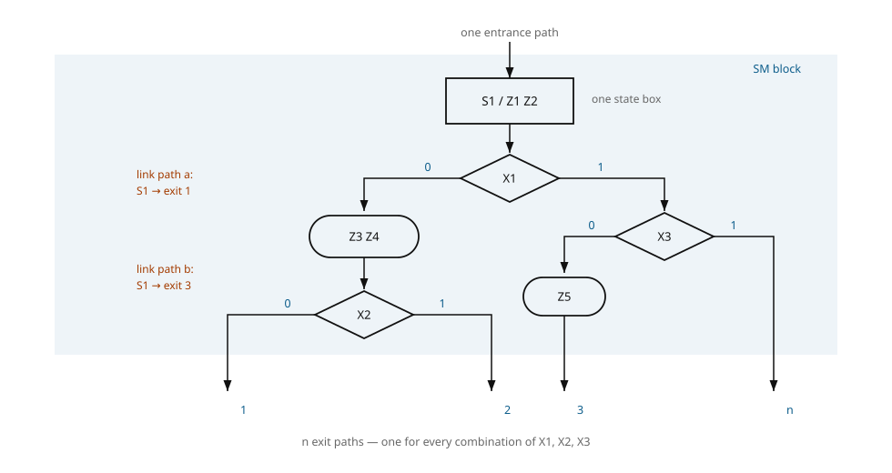

- $Z_1$ and $Z_2$ are in the state box, so they are asserted on **all** $n$ exit paths.
- $Z_3 Z_4$ and $Z_5$ are in conditional output boxes, so each is asserted on only some of them.

---

## 10.4 Equivalent SM blocks

·CH6 slide 7

Two SM blocks are **equivalent** when, for every combination of the inputs, they produce the same
set of outputs and the same next state. The order in which the inputs are tested, and how many
times each is tested, do not matter.

[fig] **Fig. 10-3** — two equivalent SM blocks ·CH6 slide 7

```yaml
figure_data:
  type: equivalent-sm-blocks
  block_a:
    state_box: {name: S1, outputs: [Z1]}
    order: [X1, X2]
    conditional_outputs: [{box: [Z2], reached_when: "X1 = 0"}]
    exits: [{to: S2, when: "X2 = 0"}, {to: S3, when: "X2 = 1"}]
  block_b:
    state_box: {name: S1, outputs: [Z1]}
    order: [X2, then X1 inside each branch]
    conditional_outputs:
      - {box: [Z2], reached_when: "X2 = 0 and X1 = 0"}
      - {box: [Z2], reached_when: "X2 = 1 and X1 = 0"}
    exits: [{to: S2, when: "X2 = 0"}, {to: S3, when: "X2 = 1"}]
  behaviour:
    - {X1: 0, X2: 0, next: S2, outputs: [Z1, Z2]}
    - {X1: 0, X2: 1, next: S3, outputs: [Z1, Z2]}
    - {X1: 1, X2: 0, next: S2, outputs: [Z1]}
    - {X1: 1, X2: 1, next: S3, outputs: [Z1]}
```

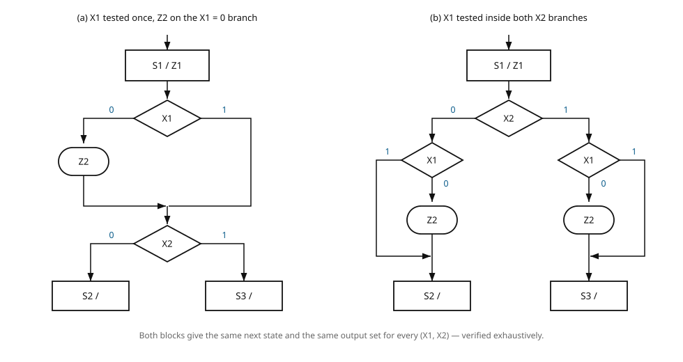

[added] **Equivalence check.** All four input combinations were enumerated in Python; the two blocks
agree on next state and on output set in every one of them, as the `behaviour` list above records.

---

## 10.5 Equivalent SM charts for a combinational circuit

·CH6 slide 8

| Symbol | Meaning | Units | Typical |
|---|---|---|---|
| $A, B, C$ | the three inputs of the combinational circuit | — | 0 or 1 |
| $Z_1$ | the single output | — | 0 or 1 |
| $S_0$ | the only state | — | — |

- Chart (a) represents a **combinational** circuit because there is only **one state and no state
  change occurs** ·CH6 slide 8. Its single decision box tests the compound condition $A + BC$.
- Chart (b) is an equivalent SM chart in which the input variables are tested **individually**
  ·CH6 slide 8.

[fig] **Fig. 10-4** — two equivalent SM charts for one combinational circuit ·CH6 slide 8

```yaml
figure_data:
  type: equivalent-sm-charts
  chart_a:
    states: [S0]
    decisions: ["A + BC"]
    conditional_outputs: [{box: [Z1], reached_when: "A + BC = 1"}]
  chart_b:
    states: [S0]
    decisions: [A, C, B]
    order: "test A; if A = 0 test C; if C = 1 test B"
    conditional_outputs: [{box: [Z1], reached_when: "A = 1, or A = 0 and C = 1 and B = 1"}]
  truth_table:
    ABC: [000, 001, 010, 011, 100, 101, 110, 111]
    Z1:  [0, 0, 0, 1, 1, 1, 1, 1]
```

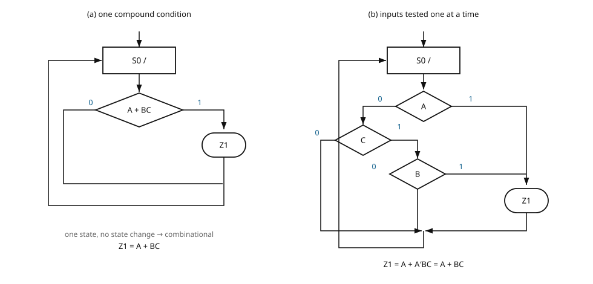

Chart (a) gives $Z_1 = 1$ if $A + BC = 1$, else $Z_1 = 0$ ·CH6 slide 8.

Chart (b) gives $Z_1 = 1$ if $A = 1$, or if $A = 0$, $B = 1$ and $C = 1$ ·CH6 slide 8. Hence

$$Z_1 = A + A'BC$$

$$Z_1 = A + BC$$

[eq: sm-chart-combinational-output]

- The step uses the absorption identity below with $X = A$ and $Y = BC$.
- Both forms were evaluated over all eight input combinations and agree in every one.

[eq: absorption-identity] The identity the deck relies on twice in this chapter:

$$\boxed{\;X + X'Y = X + Y\;}$$

where $X$ and $Y$ are any Boolean expressions.

---

## 10.6 The two rules for a valid SM chart

·CH6 slide 9

The deck states exactly two rules, and both are stated **correctly**:

1. **For every valid combination of input variables, there must be exactly one exit path defined.**
   This is necessary because each allowable input combination must lead to a single next state
   ·CH6 slide 9.
2. **No internal feedback within an SM block is allowed** ·CH6 slide 9.

[fig] **Fig. 10-5** — the internal-feedback rule ·CH6 slide 9

```yaml
figure_data:
  type: sm-block-rules
  incorrect:
    description: "the X = 0 branch re-enters the block above its own decision box"
    fault: "internal feedback inside the SM block"
  correct:
    description: "the X = 0 branch leaves the block and re-enters at the entrance path"
    why: "the loop is now a link path between clock periods, not a combinational loop"
```

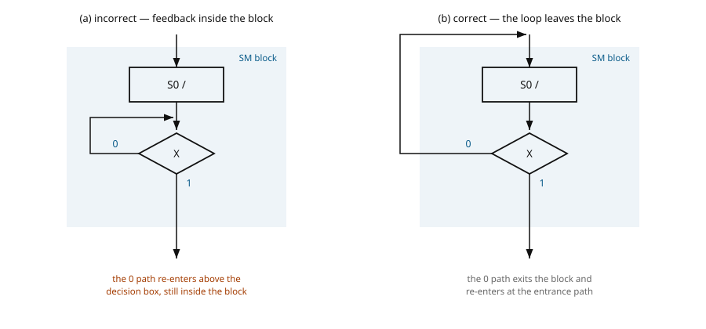

[added] Two further rules are commonly quoted for SM charts and are **consistent with, but not
printed in**, this deck: a **state box may have only one exit path**, and **no two paths may be
simultaneously active**. The first is implied by the geometry of the state box in Fig. 10-1; the
second is the same requirement as rule 1 above, stated the other way round. The classical rule
"every closed path through an SM chart must contain a state box" is exactly rule 2 restated: a
closed path with no state box in it would be a combinational loop.

---

## 10.7 Converting a state graph to an SM chart

·CH6 slide 10

| Symbol | Meaning | Units | Typical |
|---|---|---|---|
| $X$ | the single input | — | 0 or 1 |
| $Z_a, Z_b, Z_c$ | state (Moore) outputs, one per state | — | 0 or 1 |
| $Z_1, Z_2$ | conditional (Mealy) outputs, asserted in $S_2$ only | — | 0 or 1 |
| $AB$ | the two state variables | — | 00, 01, 11 |

The state graph is a mixed machine: $Z_a$, $Z_b$, $Z_c$ are attached to states, while $Z_1$ and
$Z_2$ are attached to the two transitions out of $S_2$.

[fig] **Fig. 10-6** — state graph and the equivalent SM chart ·CH6 slide 10

```yaml
figure_data:
  type: state-graph-and-sm-chart
  state_codes: {S0: "00", S1: "01", S2: "11"}
  moore_outputs: {S0: Za, S1: Zb, S2: Zc}
  transitions:
    - {from: S0, on: "X=0", to: S0, mealy_out: none}
    - {from: S0, on: "X=1", to: S1, mealy_out: none}
    - {from: S1, on: "X=0", to: S0, mealy_out: none}
    - {from: S1, on: "X=1", to: S2, mealy_out: none}
    - {from: S2, on: "X=0", to: S0, mealy_out: Z1}
    - {from: S2, on: "X=1", to: S2, mealy_out: Z2}
  link_paths:
    - {name: Link 1, from: S0, condition: "X = 1", to: S1}
    - {name: Link 2, from: S1, condition: "X = 1", to: S2}
    - {name: Link 3, from: S2, condition: "X = 1", to: S2}
```

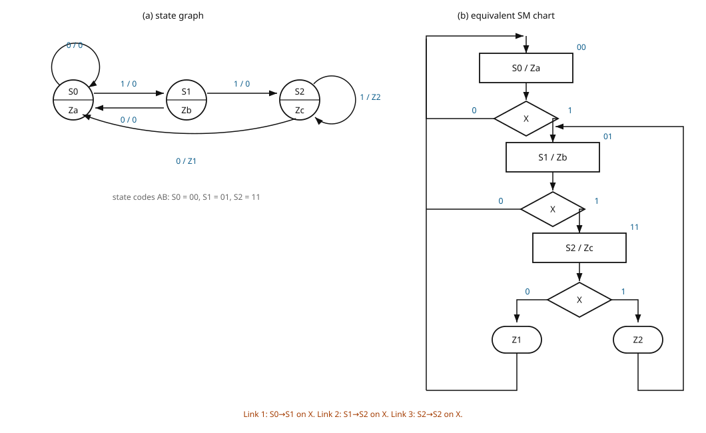

- Each state of the graph becomes one **SM block**: a state box carrying that state's Moore output,
  followed by a decision box on $X$.
- The two Mealy outputs $Z_1$ and $Z_2$ become **conditional output boxes** on the two exits of
  $S_2$'s block. They could not go in a state box, because they depend on $X$ as well as the state.

[ex] **Reading the timing chart** ·CH6 slide 10. For the input sequence

$$X = 1,\;1,\;1,\;0,\;0,\;0$$

[fig] **Fig. 10-7** — the timing chart for that input sequence ·CH6 slide 10

```yaml
figure_data:
  type: timing-chart
  clock_periods: 6
  input_X:  [1, 1, 1, 0, 0, 0]
  state:    [S0, S1, S2, S2, S0, S0]
  Za:       [1, 0, 0, 0, 1, 1]
  Zb:       [0, 1, 0, 0, 0, 0]
  Zc:       [0, 0, 1, 1, 0, 0]
  Z1:       [0, 0, 0, 1, 0, 0]
  Z2:       [0, 0, 1, 0, 0, 0]
```

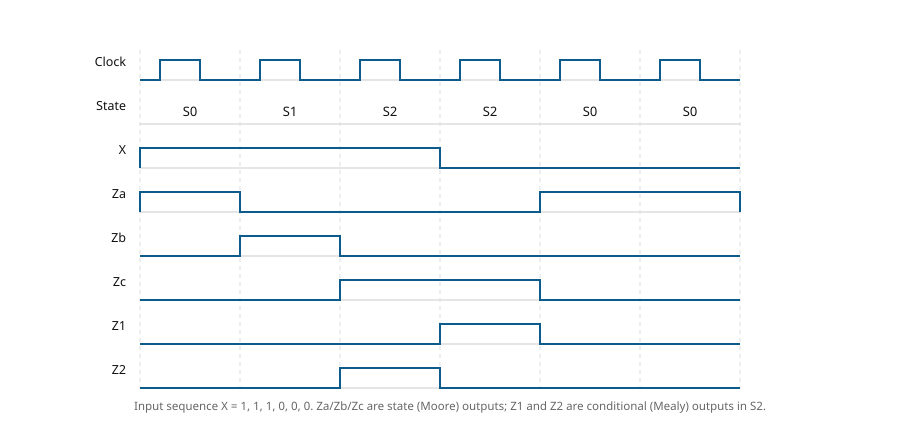

Working the sequence through:

$$S_0 \xrightarrow{X=1} S_1 \xrightarrow{X=1} S_2 \xrightarrow{X=1} S_2 \xrightarrow{X=0} S_0 \xrightarrow{X=0} S_0 \xrightarrow{X=0} S_0$$

- $Z_a$ is high in clock periods 1, 5, 6 — the periods in which the state is $S_0$.
- $Z_b$ is high in period 2 only, $Z_c$ in periods 3 and 4.
- $Z_2$ is high in period 3 only: the machine is in $S_2$ **and** $X = 1$.
- $Z_1$ is high in period 4 only: the machine is in $S_2$ **and** $X = 0$.

All six periods were recomputed in Python from the state graph and match the chart.

---

## 10.8 Next-state equations straight from the link paths

·CH6 slide 18

| Symbol | Meaning | Units | Typical |
|---|---|---|---|
| $Q$ | any one state variable (flip-flop) | — | $A$, $B$, $C$ |
| $Q^{+}$ | the next value of that state variable | — | 0 or 1 |
| $A^{+}, B^{+}$ | next values of the two state variables of Fig. 10-6 | — | 0 or 1 |

The realisation procedure the deck prints ·CH6 slide 18:

1. Identify all of the states in which $Q = 1$.
2. For each of these states, find all the link paths that lead into the state.
3. For each of these link paths, find a term that is 1 when the link path is followed — that is, for
   a link path from $S_i$ to $S_j$, the term is 1 if the machine is in $S_i$ **and** the conditions
   for exiting $S_i$ to $S_j$ are satisfied.
4. The expression for $Q^{+}$ is formed by **ORing** together the terms found in step 3.

⚠ VERIFY (C10-1) — steps 2 and 3 as printed have lost their symbols and part of their wording:
the slide reads "For each of these link paths that lead into the state" and "for a link path from
to, the term will be 1 if the machine is in state and the conditions for existing to are satisfied".
The corrected wording is given above; "existing" should read "exiting". The mathematics is
unaffected.

[eq: link-path-next-state] In general, for a state variable $Q$:

$$\boxed{\;Q^{+} \;=\; \sum_{\text{link paths into a state with } Q=1} (\text{state term}) \cdot (\text{exit condition})\;}$$

[derivation] Applying it to Fig. 10-6, with $S_0 = 00$, $S_1 = 01$, $S_2 = 11$ in the order $AB$:

Three link paths terminate in a state with $B = 1$ ·CH6 slide 18 —

$$B^{+} = \underbrace{A'B'X}_{\text{Link 1}} + \underbrace{A'BX}_{\text{Link 2}} + \underbrace{ABX}_{\text{Link 3}}$$

Two link paths terminate in a state with $A = 1$ ·CH6 slide 18 —

$$A^{+} = A'BX + ABX$$

[added] Simplifying:

$$B^{+} = X(A'B' + A'B + AB) = X(A' + B) = A'X + BX$$

$$A^{+} = BX(A' + A) = BX$$

Both printed expressions were rebuilt from the SM chart's own next-state table and agree in all six
reachable rows.

---

## 10.9 Deriving an SM chart from a design problem

·CH6 slide 11

The three steps the deck prints ·CH6 slide 11:

1. Draw a **block diagram** of the system being controlled.
2. Define the required **input** and **output** signals to and from the control circuit.
3. Construct an **SM chart** that tests the input signals and generates the proper sequence of
   output signals.

Everything that follows in the chapter is an application of these three steps.

---

## 10.10 Worked example — design of a binary multiplier

·CH6 slides 12–14

| Symbol | Meaning | Units | Typical |
|---|---|---|---|
| multiplicand | the number added repeatedly | — | 1101 |
| multiplier | the number whose bits select the additions | — | 1011 |
| ACC | accumulator, the upper part of the product register | — | 5 bits |
| $M$ | the multiplier bit currently in the least significant position | — | 0 or 1 |
| $St$ | start signal into the control | — | 0 or 1 |
| $K$ | counter flag, set to 1 just before the last shift | — | 0 or 1 |
| $Load$ | control output — load the registers | — | 0 or 1 |
| $Sh$ | control output — shift the product register right | — | 0 or 1 |
| $Ad$ | control output — add the multiplicand into ACC | — | 0 or 1 |
| $Done$ | control output — conversion finished | — | 0 or 1 |
| $C_4$ | carry out of the 4-bit adder | — | 0 or 1 |

Slide 13 shows the same algorithm in a different register set, and reuses four of the letters above
with completely different meanings. Its symbols are:

| Symbol | Meaning (slide 13 only) | Units | Typical |
|---|---|---|---|
| $B$ | register holding the **multiplicand** | — | 1101 |
| $Q$ | register holding the **multiplier**, its LSB being $Q_0$ | — | 1010 |
| $A$ | the accumulator | — | 0000…1111 |
| $C$ | the carry out of $A + B$ | — | 0 or 1 |
| $P$ | the shift counter, initialised to $n$ and decremented | — | 4, 3, 2, 1, 0 |
| $n$ | the word length | — | 4 |

> Watch the clash. In §10.11–§10.13 the letters $A$, $B$, $C$ are the three **state variables** of
> the dice-game controller; here they are the accumulator, the multiplicand register and the carry.
> $Q$ is the multiplier register here and a generic **state variable** in §10.8. Nothing carries
> over between the two.

### The arithmetic

[ex] **Hand multiplication** ·CH6 slide 12. Multiplicand $1101_2 = 13$, multiplier $1011_2 = 11$:

$$1101 + 11010 = 100111 \qquad (13 + 26 = 39)$$

$$100111 + 000000 = 100111 \qquad (39 + 0 = 39)$$

$$100111 + 1101000 = 10001111 \qquad (39 + 104 = 143)$$

$$\text{Product} = 10001111_2 = 143 = 13 \times 11 \;\checkmark$$

### The hardware and the add–shift trace

The datapath is a **9-bit product register** — a 5-bit accumulator ACC in bit positions 8…4 and the
4-bit multiplier in positions 3…0 — a 4-bit adder, and a control block with inputs $St$, $M$, $K$
and outputs $Load$, $Sh$, $Ad$, $Done$ ·CH6 slide 12.

[ex] **The add–shift trace printed on slide 12**, recomputed in full. $M$ is always the least
significant bit of the register; the dividing line between product and multiplier moves right by one
place on every shift.

| Step | 9-bit register | Comment |
|---|---|---|
| initial contents | 0 0 0 0 0 &#124; 1 0 1 1 | $M = 1$; multiplier = 1011 (11) |
| add multiplicand ($M = 1$) | + 1 1 0 1 | into ACC |
| after addition | 0 1 1 0 1 &#124; 1 0 1 1 | $0 + 13 = 13$ |
| after shift | 0 0 1 1 0 1 &#124; 1 0 1 | $M = 1$ |
| add multiplicand ($M = 1$) | + 1 1 0 1 | |
| after addition | 1 0 0 1 1 1 &#124; 1 0 1 | $6 + 13 = 19$ |
| after shift | 0 1 0 0 1 1 1 &#124; 1 0 | $M = 0$ |
| skip addition ($M = 0$) | — | |
| after shift | 0 0 1 0 0 1 1 1 &#124; 1 | $M = 1$ |
| add multiplicand ($M = 1$) | + 1 1 0 1 | |
| after addition | 1 0 0 0 1 1 1 1 &#124; 1 | $4 + 13 = 17$ |
| after shift (final answer) | 0 1 0 0 0 1 1 1 1 | $= 143$ ✓ |

Every one of these eleven lines was reproduced by a 9-bit shift-and-add simulation in Python and
matches the slide exactly.

### A second trace of the same algorithm

·CH6 slide 13 (image-only)

Slide 13 shows the same algorithm in the four-register form — multiplicand in $B$, multiplier in
$Q$, accumulator $A$, carry $C$, and a shift counter — with multiplicand $B = 1101$ (13) and
multiplier $Q = 1010$ (10).

[ex] **Slide 13's register trace**, recomputed:

| $B$ | $C$ | $A$ | $Q$ | Operation | Count |
|---|---|---|---|---|---|
| 1101 | 0 | 0000 | 1010 | $B \leftarrow$ multiplicand, $Q \leftarrow$ multiplier, $A \leftarrow 0$, $C \leftarrow 0$, $P \leftarrow n$ | 100 (4) |
| 1101 | 0 | 0000 | 1010 | $P \leftarrow P - 1$; $Q_0 = 0$ | 011 (3) |
| | 0 | 0000 | 0101 | $C\,A\,Q$ shifted right | |
| 1101 | 0 | 1101 | 0101 | $P \leftarrow P - 1$; $Q_0 = 1$, $A \leftarrow A + B$ | 010 (2) |
| | 0 | 0110 | 1010 | $C\,A\,Q$ shifted right | |
| 1101 | 0 | 0110 | 1010 | $P \leftarrow P - 1$; $Q_0 = 0$ | 001 (1) |
| | 0 | 0011 | 0101 | $C\,A\,Q$ shifted right | |
| 1101 | 1 | 0000 | 0101 | $P \leftarrow P - 1$; $Q_0 = 1$, $A \leftarrow A + B$ | 000 (0) |
| | 0 | 1000 | 0010 | $C\,A\,Q$ shifted right | |

$$A\,Q = 1000\;0010_2 = 130 = 13 \times 10 \;\checkmark$$

Every cell of this table was reproduced in Python and matches the slide.

⚠ VERIFY (V10-1) — the flowchart on the right of slide 13 prints the loop-exit test as
**"Is Count $n$ ?"**. It should read **"Is Count $= 0$ ?"**. The initialisation box on the same
flowchart sets the counter to $n$ and the loop body decrements it by 1, and the table on the same
slide runs the counter $100 \to 011 \to 010 \to 001 \to 000$ and stops at $000$. Taken as
printed, the loop would exit immediately on the first pass and no multiplication would take place.

### The SM chart for the multiplier controller

·CH6 slide 14

[fig] **Fig. 10-8** — SM chart for the binary-multiplier controller ·CH6 slide 14

```yaml
figure_data:
  type: sm-chart
  states:
    S0: {outputs: []}
    S1: {outputs: []}
    S2: {outputs: [Sh]}
    S3: {outputs: [Done]}
  blocks:
    - state: S0
      decisions: [St]
      conditional_outputs: [{box: [Load], reached_when: "St = 1"}]
      exits: [{when: "St = 0", to: S0}, {when: "St = 1", to: S1}]
    - state: S1
      decisions: [M, K]
      conditional_outputs:
        - {box: [Sh], reached_when: "M = 0"}
        - {box: [Ad], reached_when: "M = 1"}
      exits:
        - {when: "M = 0, K = 0", to: S1}
        - {when: "M = 0, K = 1", to: S3}
        - {when: "M = 1", to: S2}
    - state: S2
      decisions: [K]
      exits: [{when: "K = 0", to: S1}, {when: "K = 1", to: S3}]
    - state: S3
      decisions: []
      exits: [{when: unconditional, to: S0}]
```

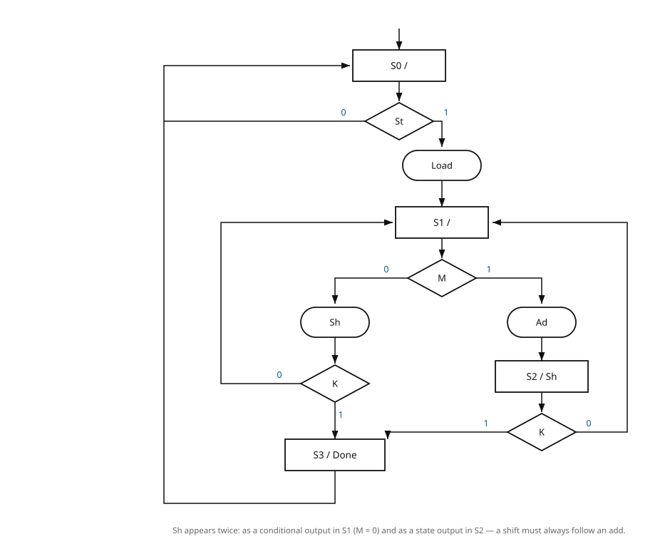

The deck's own reading of the chart ·CH6 slide 14:

- The counter counts the number of shifts and outputs $K = 1$ just before the last shift occurs.
- In state $S_0$, when the start signal $St$ is 1, $Load$ is turned on and the next state is $S_1$.
- In $S_1$, the multiplier bit $M$ is tested to decide whether to add or to shift:
  - if $M = 1$, an **add** signal is generated and the next state is $S_2$;
  - if $M = 0$, no addition is required, so a **shift** signal is generated and $K$ is tested.
- If $K = 1$ the circuit goes to the **Done** state $S_3$ at the time of the last shift; otherwise
  the next state is $S_1$.
- In $S_2$ a shift signal is generated because **a shift must always follow an add**, and $K$ is
  tested to determine the next state.

> This chart is the cleanest illustration in the deck of the state-box/conditional-box distinction.
> $Sh$ appears **twice**: once inside a conditional output box in $S_1$ (asserted only when
> $M = 0$), and once inside the **state box** of $S_2$ (asserted for the whole of $S_2$, whatever
> the inputs do).

---

## 10.11 Worked example — SM chart for an electronic dice game

·CH6 slides 15–17

| Symbol | Meaning | Units | Typical |
|---|---|---|---|
| $D_7$ | input — 1 if the sum of the dice is 7 | — | 0 or 1 |
| $D_{711}$ | input — 1 if the sum of the dice is 7 or 11 | — | 0 or 1 |
| $D_{2312}$ | input — 1 if the sum of the dice is 2, 3 or 12 | — | 0 or 1 |
| $Eq$ | input — 1 if the sum equals the number stored in the point register | — | 0 or 1 |
| $Rb$ | input — 1 when the roll button is pressed | — | 0 or 1 |
| $Reset$ | input — 1 when the reset button is pressed | — | 0 or 1 |
| $Roll$ | output — 1 enables the dice counters | — | 0 or 1 |
| $Sp$ | output — 1 causes the sum to be stored in the point register | — | 0 or 1 |
| $Win$ | output — 1 turns on the win light | — | 0 or 1 |
| $Lose$ | output — 1 turns on the lose light | — | 0 or 1 |
| $ABC$ | the three state variables | — | 000…101 |

### The system

- Two counters are used to simulate the roll of the dice ·CH6 slide 15.
- Each counter counts in the sequence 1, 2, 3, 4, 5, 6, 1, 2, …, so after the roll the **sum** of
  the two counters lies in the range **2 through 12** ·CH6 slide 15.

[fig] **Fig. 10-9** — block diagram of the dice-game module ·CH6 slides 15–16

```yaml
figure_data:
  type: block-diagram
  blocks: [display x2, 1-to-6 counter x2, adder, point register, comparator, test logic, control, Win lamp, Lose lamp]
  buses:
    - {from: counters, to: adder, name: dice values}
    - {from: adder, to: [point register, comparator, test logic], name: Sum}
  control_inputs: [D7, D711, D2312, Eq, Rb, Reset]
  control_outputs: [Roll, Sp, Win, Lose]
  signal_sources:
    D7: test logic
    D711: test logic
    D2312: test logic
    Eq: comparator (Sum vs point register)
  signal_destinations:
    Roll: enables both 1-to-6 counters
    Sp: loads the point register from Sum
```

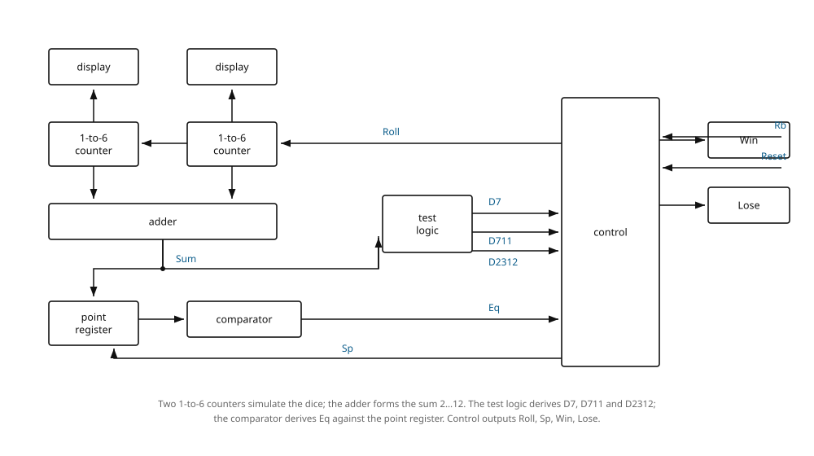

### The rules of the game

·CH6 slide 16

1. After the **first roll** of the dice, the player **wins** if the sum is **7 or 11**. He **loses**
   if the sum is **2, 3 or 12**. Otherwise, the sum he obtained on the first roll is referred to as
   **his point**, and he must roll the dice again.
2. On the **second or subsequent roll**, he **wins** if the sum equals his point, and he **loses**
   if the sum is **7**. Otherwise he must roll again until he finally wins or loses.

### The state graph and the SM chart

·CH6 slide 17 (image-only)

[fig] **Fig. 10-10** — state graph of the dice-game controller ·CH6 slide 17

```yaml
figure_data:
  type: state-diagram
  model: Mealy
  states: [S0, S1, S2, S3, S4, S5]
  state_codes: {S0: "000", S1: "001", S2: "010", S3: "011", S4: "100", S5: "101"}
  unused_codes: ["110", "111"]
  moore_outputs: {S2: Win, S3: Lose}
  transitions:
    - {from: S0, on: "Rb'", to: S0, out: 0}
    - {from: S0, on: "Rb", to: S1, out: 0}
    - {from: S1, on: "Rb", to: S1, out: Roll}
    - {from: S1, on: "Rb' D711", to: S2, out: 0}
    - {from: S1, on: "Rb' D711' D2312", to: S3, out: 0}
    - {from: S1, on: "Rb' D711' D2312'", to: S4, out: Sp}
    - {from: S2, on: "Reset'", to: S2, out: 0}
    - {from: S2, on: "Reset", to: S0, out: 0}
    - {from: S3, on: "Reset'", to: S3, out: 0}
    - {from: S3, on: "Reset", to: S0, out: 0}
    - {from: S4, on: "Rb'", to: S4, out: 0}
    - {from: S4, on: "Rb", to: S5, out: 0}
    - {from: S5, on: "Rb", to: S5, out: Roll}
    - {from: S5, on: "Rb' Eq", to: S2, out: 0}
    - {from: S5, on: "Rb' Eq' D7", to: S3, out: 0}
    - {from: S5, on: "Rb' Eq' D7'", to: S4, out: 0}
```

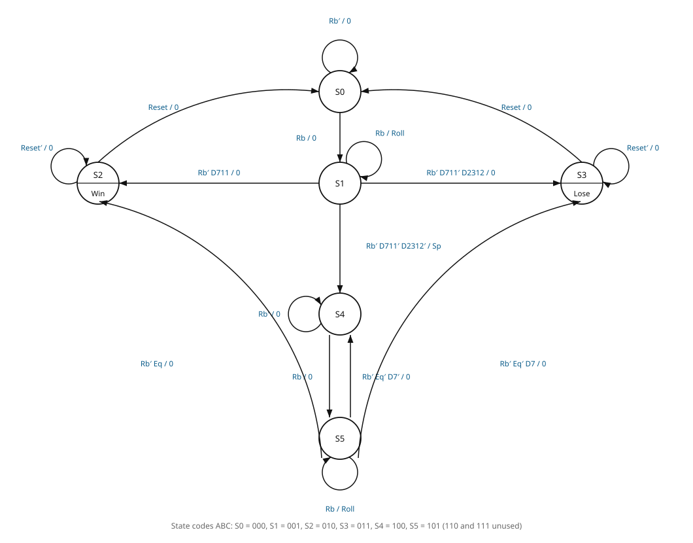

[fig] **Fig. 10-11** — the equivalent SM chart ·CH6 slide 17

```yaml
figure_data:
  type: sm-chart
  states:
    S0: {code: "000", outputs: []}
    S1: {code: "001", outputs: []}
    S2: {code: "010", outputs: [Win]}
    S3: {code: "011", outputs: [Lose]}
    S4: {code: "100", outputs: []}
    S5: {code: "101", outputs: []}
  blocks:
    - state: S0
      decisions: [Rb]
      exits: [{when: "Rb = 0", to: S0}, {when: "Rb = 1", to: S1}]
    - state: S1
      decisions: [Rb, D711, D2312]
      conditional_outputs:
        - {box: [Roll], reached_when: "Rb = 1"}
        - {box: [Sp],   reached_when: "Rb = 0, D711 = 0, D2312 = 0"}
      exits:
        - {when: "Rb = 1", to: S1}
        - {when: "Rb = 0, D711 = 1", to: S2}
        - {when: "Rb = 0, D711 = 0, D2312 = 1", to: S3}
        - {when: "Rb = 0, D711 = 0, D2312 = 0", to: S4}
    - state: S2
      decisions: [Reset]
      exits: [{when: "Reset = 0", to: S2}, {when: "Reset = 1", to: S0}]
    - state: S3
      decisions: [Reset]
      exits: [{when: "Reset = 0", to: S3}, {when: "Reset = 1", to: S0}]
    - state: S4
      decisions: [Rb]
      exits: [{when: "Rb = 0", to: S4}, {when: "Rb = 1", to: S5}]
    - state: S5
      decisions: [Rb, Eq, D7]
      conditional_outputs: [{box: [Roll], reached_when: "Rb = 1"}]
      exits:
        - {when: "Rb = 1", to: S5}
        - {when: "Rb = 0, Eq = 1", to: S2}
        - {when: "Rb = 0, Eq = 0, D7 = 1", to: S3}
        - {when: "Rb = 0, Eq = 0, D7 = 0", to: S4}
```

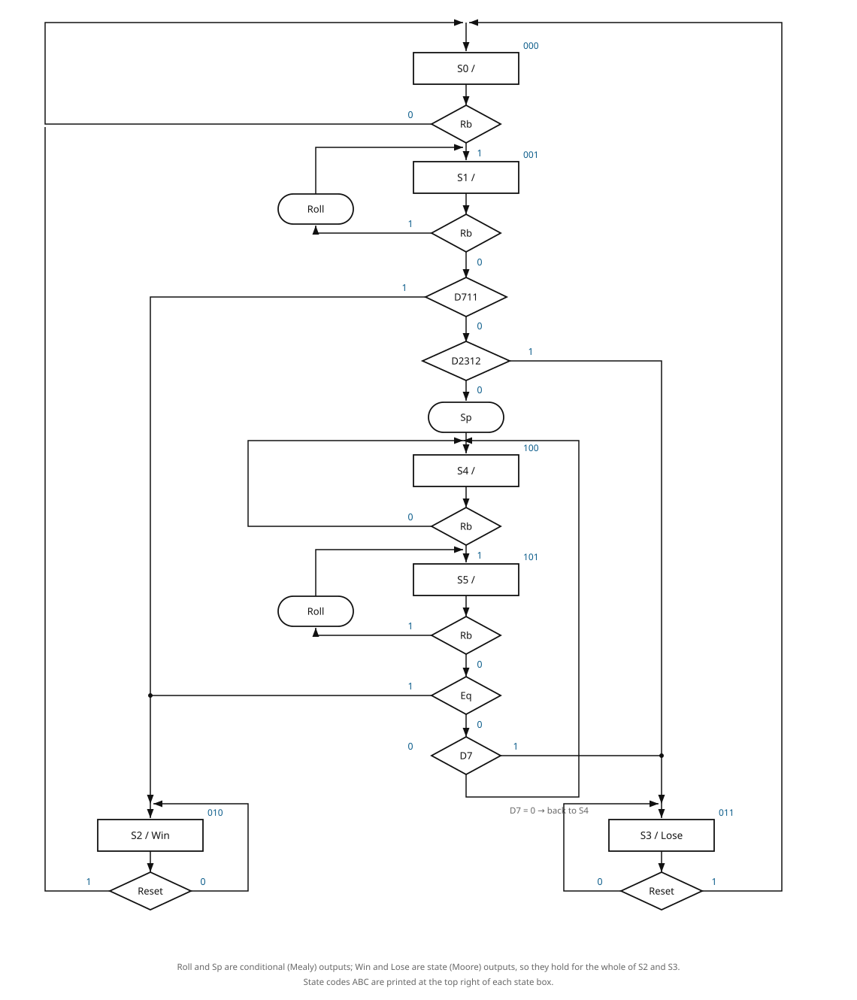

Reading the chart against the rules:

- $S_0$ is the idle state; pressing the roll button moves the machine to $S_1$.
- In $S_1$ the counters are enabled while the button is held ($Roll$ is a **conditional** output).
  When the button is released the sum is tested: $D_{711}$ wins, then $D_{2312}$ loses, otherwise
  $Sp$ stores the point and the machine moves to $S_4$.
- $S_4$ and $S_5$ are the second-and-subsequent-roll pair, with $Eq$ winning and $D_7$ losing.
- $Win$ and $Lose$ are written in the **state boxes** of $S_2$ and $S_3$, so the lamp stays on for
  as long as the machine sits in that state — which is until $Reset$ is pressed.

---

## 10.12 Realisation of the SM chart: PLA plus flip-flops

·CH6 slides 19–21

| Symbol | Meaning | Units | Typical |
|---|---|---|---|
| $A, B, C$ | present-state variables of the dice-game controller | — | 0 or 1 |
| $A^{+}, B^{+}, C^{+}$ | next-state variables | — | 0 or 1 |
| — (dash) | a don't-care entry in the PLA table | — | — |

[fig] **Fig. 10-12** — PLA realisation of the dice-game controller ·CH6 slide 19

```yaml
figure_data:
  type: block-diagram
  pla_inputs: [Rb, Reset, D711, D7, D2312, Eq, C, B, A]
  pla_outputs: [Win, Lose, Roll, Sp, C+, B+, A+]
  flip_flops: [D flip-flop for C, D flip-flop for B, D flip-flop for A]
  feedback: "Q of each flip-flop returns to the PLA as C, B, A"
  clock: common to all three flip-flops
```

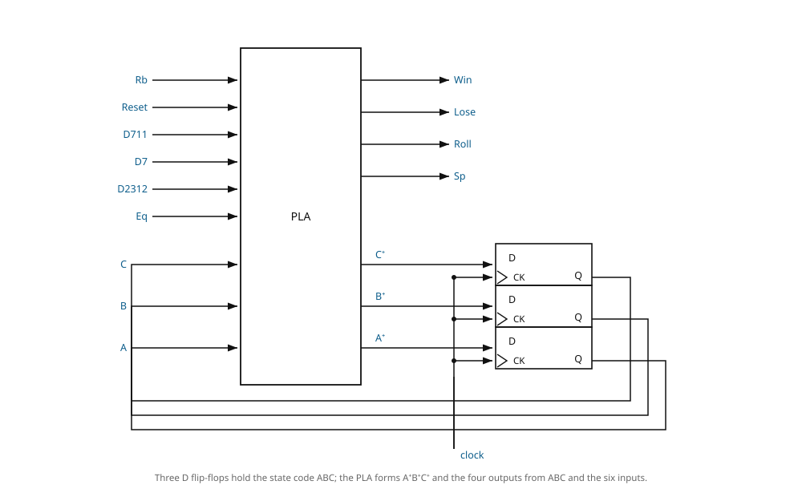

### The PLA table

·CH6 slide 20. Transcribed in full. A dash is a don't care.

| # | $ABC$ | $Rb$ | $Reset$ | $D_7$ | $D_{711}$ | $D_{2312}$ | $Eq$ | $A^{+}B^{+}C^{+}$ | $Win$ | $Lose$ | $Roll$ | $Sp$ |
|---|---|---|---|---|---|---|---|---|---|---|---|---|
| 1 | 000 | 0 | — | — | — | — | — | 000 | 0 | 0 | 0 | 0 |
| 2 | 000 | 1 | — | — | — | — | — | 001 | 0 | 0 | 0 | 0 |
| 3 | 001 | 1 | — | — | — | — | — | 001 | 0 | 0 | 1 | 0 |
| 4 | 001 | 0 | — | — | 0 | 0 | — | 100 | 0 | 0 | 0 | 1 |
| 5 | 001 | 0 | — | — | 0 | 1 | — | 011 | 0 | 0 | 0 | 0 |
| 6 | 001 | 0 | — | — | 1 | — | — | 010 | 0 | 0 | 0 | 0 |
| 7 | 010 | — | 0 | — | — | — | — | 010 | 1 | 0 | 0 | 0 |
| 8 | 010 | — | 1 | — | — | — | — | 000 | 1 | 0 | 0 | 0 |
| 9 | 011 | — | 1 | — | — | — | — | 000 | 0 | 1 | 0 | 0 |
| 10 | 011 | — | 0 | — | — | — | — | 011 | 0 | 1 | 0 | 0 |
| 11 | 100 | 0 | — | — | — | — | — | 100 | 0 | 0 | 0 | 0 |
| 12 | 100 | 1 | — | — | — | — | — | 101 | 0 | 0 | 0 | 0 |
| 13 | 101 | 0 | — | 0 | — | — | 0 | 100 | 0 | 0 | 0 | 0 |
| 14 | 101 | 0 | — | 1 | — | — | 0 | 011 | 0 | 0 | 0 | 0 |
| 15 | 101 | 0 | — | — | — | — | 1 | 010 | 0 | 0 | 0 | 0 |
| 16 | 101 | 1 | — | — | — | — | — | 101 | 0 | 0 | 1 | 0 |
| 17 | 110 | — | — | — | — | — | — | – – – | — | — | — | — |
| 18 | 111 | — | — | — | — | — | — | – – – | — | — | — | — |

- Rows 17 and 18 are the two **unused** state codes; every entry is a don't care.
- Each dash in a row stands for both values of that input, so a single row covers $2^d$ input
  combinations, where $d$ is the number of dashes.

[added] **Verification.** Every one of the sixteen specified rows was expanded into its full set of
input combinations and checked against the SM chart of Fig. 10-11 — $6 \times 64 = 384$ combinations
of used state and inputs. Every combination is covered by exactly **one** row (no gaps, no overlaps)
and every next state and every output agrees with the chart. Rows 3 and 16 are the only rows with
$Roll = 1$; row 4 is the only row with $Sp = 1$; $Win$ is 1 exactly in the two rows for state 010
and $Lose$ exactly in the two rows for state 011 — which is what "state output" means.

### Expanding a row of the table

·CH6 slide 21

A PLA row with dashes must be expanded into one row per input combination before it can be
programmed into a device that has no don't-care facility. The deck expands **row 5** ·CH6 slide 21:

- Row 5 is $ABC = 001$, $Rb = 0$, $D_{711} = 0$, $D_{2312} = 1$, with $Reset$, $D_7$ and $Eq$ all
  don't care. Three dashes give $2^3 = 8$ rows, all with the same output side
  $A^{+}B^{+}C^{+} = 011$ and $Win = Lose = Roll = Sp = 0$.

The correct expansion, in the order the slide uses, is:

| # | $Reset$ | $D_7$ | $Eq$ | slide prints |
|---|---|---|---|---|
| 1 | 0 | 0 | 0 | 0 0 0 ✓ |
| 2 | 0 | 0 | 1 | 0 0 1 ✓ |
| 3 | 0 | 1 | 0 | 0 1 0 ✓ |
| 4 | 0 | 1 | 1 | 0 1 1 ✓ |
| 5 | 1 | 0 | 0 | 1 0 0 ✓ |
| 6 | 1 | 0 | 1 | 1 0 1 ✓ |
| 7 | **1** | **1** | **0** | 1 **0** 0 ⚠ |
| 8 | **1** | **1** | **1** | 1 **0** 1 ⚠ |

⚠ VERIFY (V10-2) — the last two of the eight rows printed on slide 21 read
"001 0 **1 0** 0 1 **0**" and "001 0 **1 0** 0 1 **1**", which are byte-for-byte duplicates of the
fifth and sixth rows. They should carry $D_7 = 1$, i.e. "001 0 **1 1** 0 1 0" and
"001 0 **1 1** 0 1 1". As printed the expansion covers only six of the eight combinations, and the
two combinations $Reset = 1$, $D_7 = 1$ are left unprogrammed — the machine would have no defined
next state for them.

---

## 10.13 Maps derived from the PLA table

·CH6 slide 22

| Symbol | Meaning | Units | Typical |
|---|---|---|---|
| $E_1 \ldots E_4$ | map-entered variables — expressions written into a K-map cell | — | — |
| $R$ | shorthand for $Reset$ on this slide only | — | 0 or 1 |
| X | a don't-care cell (states 110 and 111) | — | — |

[def] A **map-entered variable** is an expression written into a K-map cell instead of a 0 or a 1.
The cell is 1 only when that expression is 1. It lets a 4-variable map summarise a 9-variable
function.

[fig] **Fig. 10-13** — the three maps the deck derives ·CH6 slide 22

```yaml
figure_data:
  type: karnaugh-maps
  map_variables: {columns: AB, rows: CRb}
  cell_order: {columns: ["00","01","11","10"], rows: ["00","01","11","10"]}
  maps:
    A_plus:
      rows:
        "00": ["0", "0", "X", "1"]
        "01": ["0", "0", "X", "1"]
        "11": ["0", "0", "X", "1"]
        "10": ["E1", "0", "X", "E2"]
      loops:
        - {cells: "AB = 11,10 x CRb = 00,01", term: "A C'"}
        - {cells: "AB = 11,10 x CRb = 01,11", term: "A Rb"}
        - {cells: "AB = 11,10 x all CRb",     term: "A E2"}
    B_plus:
      rows:
        "00": ["0", "R'", "X", "0"]
        "01": ["0", "R'", "X", "0"]
        "11": ["0", "R'", "X", "0"]
        "10": ["E3", "R'", "X", "E4"]
      loops:
        - {cells: "AB = 01,11 x all CRb", term: "B R'"}
        - {cells: "AB = 11,10 x CRb = 10", term: "A C Rb' E4"}
    Win:
      rows:
        "00": ["0", "1", "X", "0"]
        "01": ["0", "1", "X", "0"]
        "11": ["0", "0", "X", "0"]
        "10": ["0", "0", "X", "0"]
      loops:
        - {cells: "AB = 01,11 x CRb = 00,01", term: "B C'"}
  map_entered_variables:
    E1: "D711' D2312'"
    E2: "D7' Eq'"
    E3: "D711 + D711' D2312 = D711 + D2312"
    E4: "Eq + Eq' D7 = Eq + D7"
```

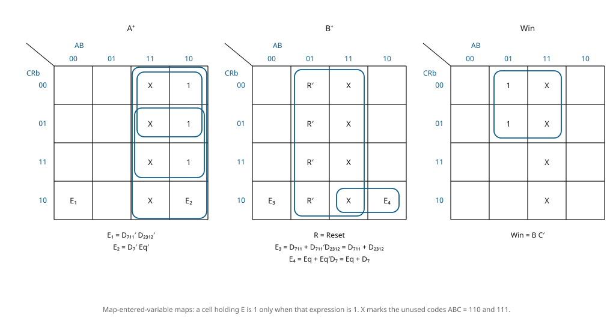

The four map-entered variables the deck prints ·CH6 slide 22:

$$E_1 = D_{711}'\,D_{2312}'$$

$$E_2 = D_7'\,Eq'$$

$$R = Reset$$

$$E_3 = D_{711} + D_{711}'D_{2312} = D_{711} + D_{2312}$$

$$E_4 = Eq + Eq'D_7 = Eq + D_7$$

[added] **Verification of all four.** Each cell was rebuilt from the SM chart:

- $E_1$ sits at $A = 0, B = 0, C = 1, Rb = 0$ — that is, state $S_1$ with the roll button released.
  From there $A^{+} = 1$ only when the next state is $S_4 = 100$, which happens exactly when
  $D_{711} = 0$ **and** $D_{2312} = 0$. Hence $E_1 = D_{711}'D_{2312}'$ ✓.
- $E_2$ sits at $A = 1, B = 0, C = 1, Rb = 0$ — state $S_5$ with the button released. $A^{+} = 1$
  only for the exit to $S_4$, which needs $Eq = 0$ and $D_7 = 0$. Hence $E_2 = D_7'Eq'$ ✓.
- $E_3$ is the same cell as $E_1$ but for $B^{+}$: $B^{+} = 1$ when the next state is $S_2 = 010$ or
  $S_3 = 011$, i.e. when $D_{711} = 1$, or $D_{711} = 0$ and $D_{2312} = 1$ ✓.
- $E_4$ is the same cell as $E_2$ but for $B^{+}$: $Eq = 1$ gives $S_2$, and $Eq = 0$ with
  $D_7 = 1$ gives $S_3$ ✓.
- Both simplifications are instances of $X + X'Y = X + Y$ [eq: absorption-identity], and both were
  checked over all four combinations of their two variables.

[added] The deck stops at the map-entered variables and refers the reader to the textbook for the
final expressions. Reading the loops drawn on the maps gives:

$$A^{+} = A\,C' + A\,Rb + A\,D_7'\,Eq' + A'B'C\,Rb'\,D_{711}'\,D_{2312}'$$

[eq: dice-next-state-a]

$$B^{+} = B\,Reset' + A\,C\,Rb'\,(Eq + D_7) + A'B'C\,Rb'\,(D_{711} + D_{2312})$$

[eq: dice-next-state-b]

$$C^{+} = B'Rb + BC\,Reset' + A'B'C\,Rb'\,D_{711}'\,D_{2312} + AB'C\,Rb'\,Eq'\,D_7$$

[eq: dice-next-state-c]

$$Win = B\,C' \qquad Lose = B\,C \qquad Roll = B'\,C\,Rb$$

[eq: dice-outputs]

- All four expressions were checked against the PLA table over every used state and all 64 input
  combinations — $384$ rows each — with the two unused codes treated as don't cares.
- $C^{+}$ is not mapped on the slide; it is supplied here for completeness and carries `[added]`.
- $Roll = B'C\,Rb$ reads directly off the table: $Roll = 1$ only in rows 3 and 16, which are states
  $001$ and $101$ with $Rb = 1$.

---

## Appendix — worked examples

·CH6 slide 23 is the appendix title slide; the examples run from slide 24 to slide 40.
The four sections that follow sit inside it.

---

## 10.14 Example 1 — the design problem and its ASM chart

·CH6 slides 24–28

| Symbol | Meaning | Units | Typical |
|---|---|---|---|
| $A$ | a 4-bit binary counter | — | 0000…1111 |
| $A_4, A_3, A_2, A_1$ | the individual flip-flops of $A$, $A_4$ holding the MSB | — | 0 or 1 |
| $E$ | a flip-flop set or cleared according to $A_3$ | — | 0 or 1 |
| $F$ | a flip-flop set at the end of the run | — | 0 or 1 |
| $S$ | the start signal | — | 0 or 1 |
| $T_0, T_1, T_2$ | the three control states | — | one-hot decoded |

[ex] **The design problem, transcribed in full** ·CH6 slide 24. The deck states the problem and
then works it through slides 25–35, so this is a worked example, not homework. It is reproduced in
full because a CAT can lift it as it stands.

> Design a digital system with two flip-flops, $E$ and $F$, and one 4-bit binary counter, $A$. The
> individual flip-flops of $A$ are denoted by $A_4$, $A_3$, $A_2$ and $A_1$ (where $A_4$ holds the
> MSB).
>
> A start signal $S$ initiates system operation by clearing the counter $A$ and the flip-flop $F$.
> The counter is then **incremented** by 1 starting from the next clock pulse and continues to
> increment until the operations stop. Counter bits $A_3$ and $A_4$ determine the sequence of
> operations:
>
> - If $A_3 = 0$, $E$ is **cleared** to 0 and the count continues.
> - If $A_3 = 1$, $E$ is **set** to 1; then if $A_4 = 0$ the count continues, but if $A_4 = 1$,
>   $F$ is set to 1 on the next clock pulse and the system stops counting.

[fig] **Fig. 10-14** — ASM chart for Example 1 ·CH6 slide 25

```yaml
figure_data:
  type: asm-chart
  states:
    T0: {box: "initial state", outputs: []}
    T1: {box: "A <- A + 1",    outputs: [incr A]}
    T2: {box: "F <- 1",        outputs: [set F]}
  blocks:
    - state: T0
      decisions: [S]
      conditional_outputs: [{box: ["A <- 0", "F <- 0"], reached_when: "S = 1"}]
      exits: [{when: "S = 0", to: T0}, {when: "S = 1", to: T1}]
    - state: T1
      decisions: [A3, A4]
      conditional_outputs:
        - {box: ["E <- 0"], reached_when: "A3 = 0"}
        - {box: ["E <- 1"], reached_when: "A3 = 1"}
      exits:
        - {when: "A3 = 0", to: T1}
        - {when: "A3 = 1, A4 = 0", to: T1}
        - {when: "A3 = 1, A4 = 1", to: T2}
    - state: T2
      decisions: []
      exits: [{when: unconditional, to: T0}]
```

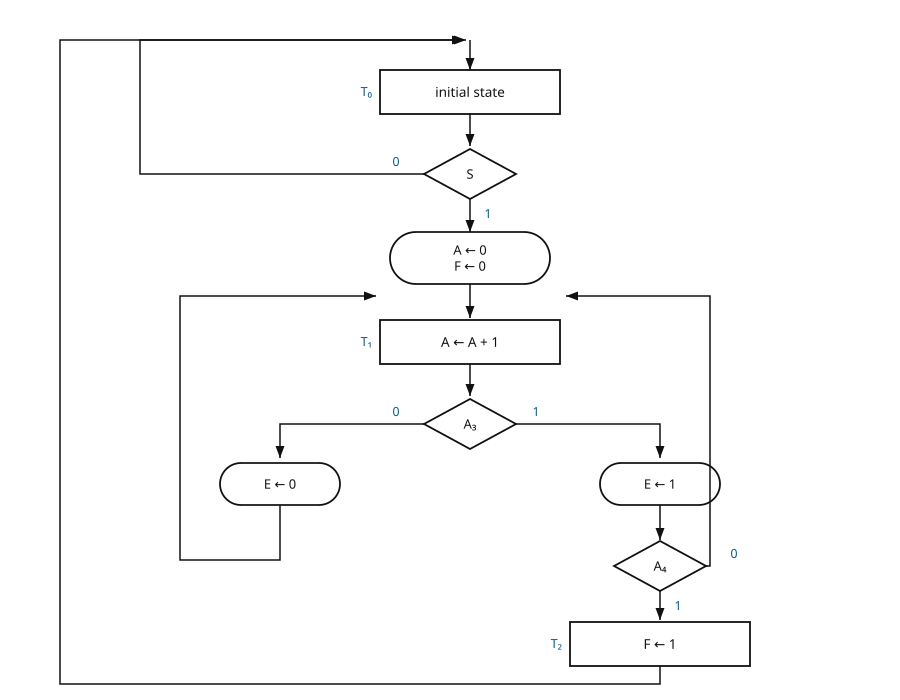

- $A \leftarrow A + 1$ is written **inside** the state box of $T_1$: the counter is incremented
  every clock period the machine spends in $T_1$, whatever $A_3$ and $A_4$ do.
- $A \leftarrow 0, F \leftarrow 0$ and $E \leftarrow 0$ / $E \leftarrow 1$ are in **conditional
  output boxes**: they happen only on the paths that reach them.
- All of them take effect on the **same** clock edge — the edge that ends the clock period of the
  state box they belong to.

The deck's own split of the work ·CH6 slide 28:

- **Datapath** — the state boxes and the conditional output boxes.
- **Control logic** — the decision boxes and the state transitions.

### The sequence of operations

·CH6 slides 26–27 (the two slides are identical apart from the annotations L1, L2, L3 on slide 26)

[ex] **The trace table**, recomputed line by line. $E$ starts at 1 because that is the value the
previous run left in it; the table begins at the first clock period in $T_1$.

| $A_4$ | $A_3$ | $A_2$ | $A_1$ | $E$ | $F$ | conditions | state |
|---|---|---|---|---|---|---|---|
| 0 | 0 | 0 | 0 | 1 | 0 | $A_3 = 0$, $A_4 = 0$ (path L1) | $T_1$ |
| 0 | 0 | 0 | 1 | 0 | 0 | | $T_1$ |
| 0 | 0 | 1 | 0 | 0 | 0 | | $T_1$ |
| 0 | 0 | 1 | 1 | 0 | 0 | | $T_1$ |
| 0 | 1 | 0 | 0 | 0 | 0 | $A_3 = 1$, $A_4 = 0$ (path L2) | $T_1$ |
| 0 | 1 | 0 | 1 | 1 | 0 | | $T_1$ |
| 0 | 1 | 1 | 0 | 1 | 0 | | $T_1$ |
| 0 | 1 | 1 | 1 | 1 | 0 | | $T_1$ |
| 1 | 0 | 0 | 0 | 1 | 0 | $A_3 = 0$, $A_4 = 1$ (path L3) | $T_1$ |
| 1 | 0 | 0 | 1 | 0 | 0 | | $T_1$ |
| 1 | 0 | 1 | 0 | 0 | 0 | | $T_1$ |
| 1 | 0 | 1 | 1 | 0 | 0 | | $T_1$ |
| 1 | 1 | 0 | 0 | 0 | 0 | | $T_1$ |
| 1 | 1 | 0 | 1 | 1 | 0 | | $T_2$ |
| 1 | 1 | 0 | 1 | 1 | 1 | | $T_0$ |

- The rule that produces the $E$ column is $E^{+} = A_3$ evaluated on the **current** count, so $E$
  always lags $A_3$ by one clock period. That is why $E = 1$ at $A = 0101$ but $E = 0$ at
  $A = 0100$.
- $A$ stops at $1101$: the last increment happens in the clock period that has $A = 1100$, i.e. the
  first period with $A_3 = 1$ **and** $A_4 = 1$, and that period also moves the machine to $T_2$.
- $T_2$ sets $F$ and the machine returns to $T_0$.
- L1 and L3 both leave the $A_3$ decision on its **0** branch; L2 leaves it on the **1** branch —
  which is why slide 26 annotates the chart with "L1, L3" on one side and "L2" on the other.

Every one of the fifteen rows was reproduced by simulating the ASM chart in Python and matches the
slide.

### The datapath

·CH6 slide 29

[fig] **Fig. 10-15** — datapath for Example 1 ·CH6 slide 29

```yaml
figure_data:
  type: schematic
  blocks:
    control: {inputs: [Start (S), A4, A3, clock], outputs: [T0, T1, T2]}
    counter: {type: 4-bit with synchronous clear, inputs: [count, clear-A, clock], outputs: [A4, A3, A2, A1]}
    E: {type: JK flip-flop}
    F: {type: JK flip-flop}
  equations:
    Clear_A: "T0 . S"
    count:   "T1"
    J_E:     "T1 . A3"
    K_E:     "T1 . A3'"
    J_F:     "T2"
    K_F:     "T0 . S      (the same Clear-A signal)"
  note: "one AND gate produces T0.S, which clears the counter and clears F, implementing the
         conditional output box A <- 0, F <- 0 with a single control signal"
```

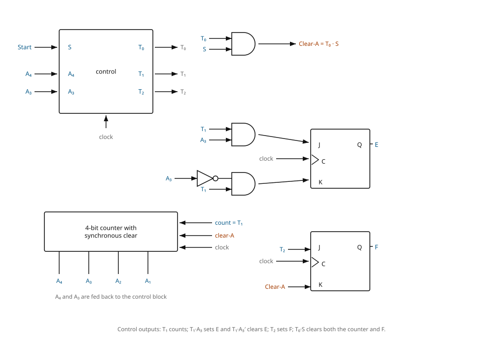

[fig] **Fig. 10-16** — the same design redrawn with named control signals ·CH6 slide 30.
*Caption only — the slide is a redraw of Fig. 10-15 from a different edition of the source
textbook.* It replaces $T_0$, $T_1$, $T_2$ with the named controller outputs $set\_E$, $clr\_E$,
$set\_F$, $clr\_A\_F$ and $incr\_A$, adds an active-low $reset\_b$, and shows the same 4-bit counter
and the same two JK flip-flops inside a shaded "datapath" region.

⚠ VERIFY (C10-2) — slide 30 numbers the counter bits $A_3\,A_2\,A_1\,A_0$ and feeds $A_2$ and $A_3$
to the controller, whereas slides 24–29 and 31–34 number them $A_4\,A_3\,A_2\,A_1$ and feed $A_3$
and $A_4$. The two figures describe the **same** two bits — the MSB and the bit below it — but a
reader moving between the slides will read $A_3$ as two different flip-flops. This file uses the
$A_4 \ldots A_1$ numbering throughout, because that is what the problem statement on slide 24 uses.

---

## 10.15 Example 1 — the control logic

·CH6 slides 31–35

| Symbol | Meaning | Units | Typical |
|---|---|---|---|
| $G_1, G_0$ | the two state flip-flops of the control | — | 0 or 1 |
| $D_{G1}, D_{G0}$ | the D inputs of those flip-flops | — | 0 or 1 |
| $T_0, T_1, T_2$ | decoded control-state signals | — | one active at a time |

### State diagram for control

·CH6 slide 31

[fig] **Fig. 10-17** — state diagram for the Example 1 controller ·CH6 slide 31

```yaml
figure_data:
  type: state-diagram
  model: Moore (the control states are decoded)
  states: [T0, T1, T2]
  transitions:
    - {from: T0, on: "S = 0", to: T0}
    - {from: T0, on: "S = 1", to: T1}
    - {from: T1, on: "A3 = 0", to: T1}
    - {from: T1, on: "A3A4 = 10", to: T1}
    - {from: T1, on: "A3A4 = 11", to: T2}
    - {from: T2, on: unconditional, to: T0}
  register_transfers:
    T0: "if (S = 1) then A <- 0, F <- 0"
    T1: "A <- A + 1;  if (A3 = 1) then E <- 1;  if (A3 = 0) then E <- 0"
    T2: "F <- 1"
```

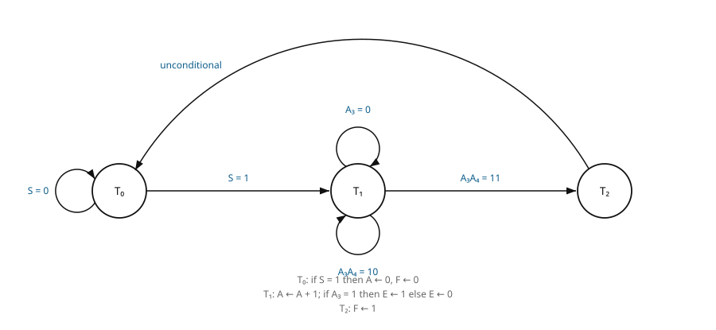

The register-transfer summary the slide prints ·CH6 slide 31:

$$T_0:\ \text{if } (S = 1) \text{ then } A \leftarrow 0,\; F \leftarrow 0$$

$$T_1:\ A \leftarrow A + 1$$

$$\text{if } (A_3 = 1) \text{ then } E \leftarrow 1$$

$$\text{if } (A_3 = 0) \text{ then } E \leftarrow 0$$

$$T_2:\ F \leftarrow 1$$

The two self-loops on $T_1$ are $A_3 = 0$ (any $A_4$) and $A_3A_4 = 10$; together they cover every
case except $A_3A_4 = 11$, which is the only exit.

### State table

·CH6 slides 32–33. State assignment $G_1G_0$: $T_0 = 00$, $T_1 = 01$, $T_2 = 11$. The code 10 is
never reached and is treated as a don't care.

| present state | $G_1$ | $G_0$ | $S$ | $A_3$ | $A_4$ | $G_1^{+}$ | $G_0^{+}$ | $T_0$ | $T_1$ | $T_2$ |
|---|---|---|---|---|---|---|---|---|---|---|
| $T_0$ | 0 | 0 | 0 | X | X | 0 | 0 | 1 | 0 | 0 |
| $T_0$ | 0 | 0 | 1 | X | X | 0 | 1 | 1 | 0 | 0 |
| $T_1$ | 0 | 1 | X | 0 | X | 0 | 1 | 0 | 1 | 0 |
| $T_1$ | 0 | 1 | X | 1 | 0 | 0 | 1 | 0 | 1 | 0 |
| $T_1$ | 0 | 1 | X | 1 | 1 | 1 | 1 | 0 | 1 | 0 |
| $T_2$ | 1 | 1 | X | X | X | 0 | 0 | 0 | 0 | 1 |

Every row was rebuilt from the state diagram and matches the slide.

The excitation and decoding equations ·CH6 slide 33:

$$D_{G1} = T_1\,A_3\,A_4$$

$$D_{G0} = T_0\,S + T_1$$

[eq: example1-next-state]

$$T_0 = G_0' \qquad T_1 = G_1'\,G_0 \qquad T_2 = G_1$$

[eq: example1-state-decode]

- $D_{G1}$ is 1 in exactly one row of the table — the row with $G_1G_0 = 01$ and $A_3A_4 = 11$ —
  which is the single term $T_1A_3A_4$.
- $D_{G0}$ is 1 in the second row ($T_0$ with $S = 1$) and in all three $T_1$ rows, giving
  $T_0S + T_1$.
- The three decoding expressions are minimal only because the code 10 is unreachable and therefore a
  don't care. Verified by exhaustive substitution over all three reachable states and all eight
  combinations of $S$, $A_3$, $A_4$.

### The control logic diagram

·CH6 slide 34

[fig] **Fig. 10-18** — logic diagram of the Example 1 control, **corrected** ·CH6 slide 34

```yaml
figure_data:
  type: schematic
  flip_flops: [D flip-flop G0, D flip-flop G1]
  gates:
    - {out: "Clear-A", type: AND, in: [T0, S]}
    - {out: "D_G0",    type: OR,  in: ["T0.S", T1]}
    - {out: "D_G1",    type: AND, in: [T1, A3, A4]}
    - {out: "T1",      type: AND, in: ["G1'", G0]}
  wires:
    T0: "Q' of the G0 flip-flop"
    T2: "Q of the G1 flip-flop"
  correction: "the deck draws the gate combining A3.A4 with T1 as an OR; it must be an AND"
```

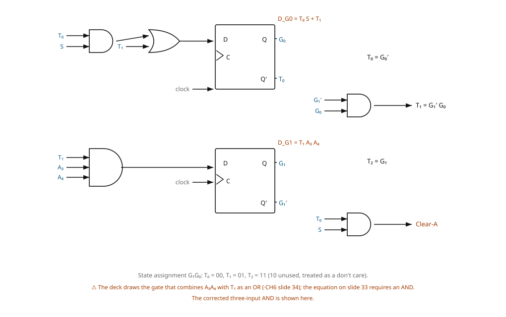

⚠ VERIFY (V10-3) — on slide 34 the two-input AND gate fed by $A_3$ and $A_4$ has its output taken
into an **OR** gate whose other input is $T_1$; the OR gate's output drives the D input of the $G_1$
flip-flop. As drawn the circuit implements

$$D_{G1} = A_3A_4 + T_1 \qquad \text{(as printed)}$$

but slide 33 requires

$$D_{G1} = T_1\,A_3\,A_4 \qquad \text{(correct)}$$

The two disagree on **10 of the 24** combinations of state and input. The worst case is benign to
spot and fatal to run: in $T_1$ the printed circuit gives $D_{G1} = 1$ unconditionally, so the
machine would leave $T_1$ for $T_2$ after a single clock period no matter what the counter held, and
the counter would stop at 0001. The gate must be a **three-input AND** on $T_1$, $A_3$ and $A_4$;
Fig. 10-18 shows the corrected form. The identical gate one row above — the OR that forms
$D_{G0} = T_0S + T_1$ — is drawn correctly, which is what makes the error easy to miss.

[fig] **Fig. 10-19** — the same control redrawn with named outputs ·CH6 slide 35.
*Caption only — a redraw from a different edition of the source textbook.* It shows the same two D
flip-flops $G_0$ and $G_1$ with three internal product terms labelled $w1$, $w2$, $w3$, and produces
the named controller outputs $clr\_A\_F$, $incr\_A$, $set\_E$, $set\_F$ and $clr\_E$, the last of
these through an inverter. It carries no numerical claim.

---

## 10.16 ASM for a weighing machine

·CH6 slides 36–38

| Symbol | Meaning | Units | Typical |
|---|---|---|---|
| $R$ | right-shift register holding the binary number being weighed | — | 1011 |
| $W$ | up-counter holding the running weight | — | 0000…1111 |
| $F$ | flip-flop holding the bit just shifted out of $R$ | — | 0 or 1 |
| $Z$ | zero flag — 1 when $R = 0$ | — | 0 or 1 |
| $S$ | start signal | — | 0 or 1 |
| $T_0 \ldots T_3$ | the four control-state signals | — | one active at a time |

[def] The **weight** of a binary number is the number of 1s present in its binary representation
·CH6 slide 36.

⚠ VERIFY (C10-4) — slide 36 prints "The weight of a binary number is defined by as the number of
1's present in it binary representation". Read it as "…is defined as the number of 1s present in
its binary representation". Cosmetic only.

### The datapath

·CH6 slide 36

[fig] **Fig. 10-20** — datapath subsystem for the weighing machine ·CH6 slide 36

```yaml
figure_data:
  type: schematic
  blocks:
    R: {type: right shift register, inputs: [input data, shift right, serial input = 0, load]}
    zero_check: {out: "Z = 1 if R = 0"}
    F: {type: D flip-flop, d_input: "the LSB shifted out of R", clocked: true}
    W: {type: counter, inputs: [increment, load], load_value: all 1s}
    control: {inputs: [S, Z, F], outputs: [T0, T1, T2, T3]}
  control_equations:
    load_R: "T0 . S"
    load_W: "T0 . S     (loads all 1s)"
    increment_W: "T1"
    shift_right_R: "T2"
    T3: "drives nothing"
  output: "the final contents of W is the weight of the input word"
```

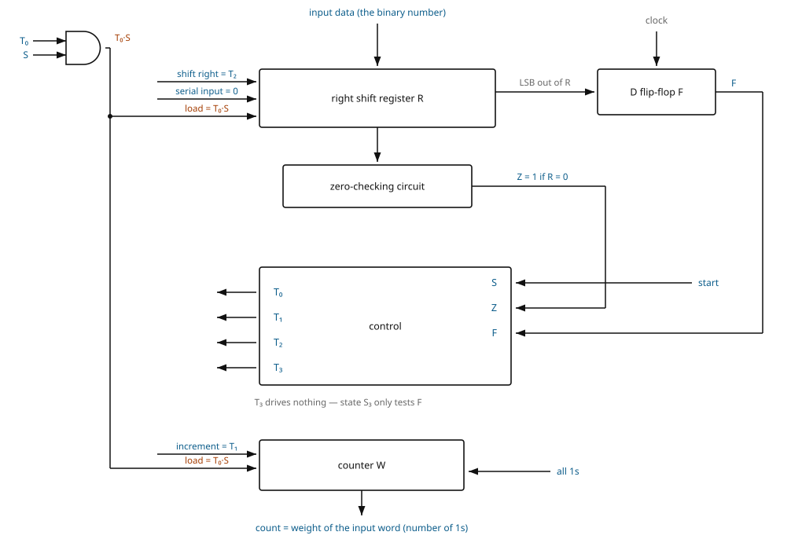

- $T_3$ has no wire attached to it in the slide's figure. That is correct: state $S_3$ carries no
  data operation, it only tests $F$.
- $W$ is loaded with **all 1s** rather than 0 so that the first increment brings it to 0. Without
  that trick the machine would count one too many, because $S_1$ is entered once before any bit has
  been examined.

### The ASM chart

·CH6 slide 37 (image-only)

[fig] **Fig. 10-21** — ASM chart for the weighing machine ·CH6 slide 37

```yaml
figure_data:
  type: asm-chart
  states:
    S0: {code: "00", box: "initial state"}
    S1: {code: "01", box: "W <- W + 1"}
    S2: {code: "10", box: "shift right into F"}
    S3: {code: "11", box: "(no operation)"}
  blocks:
    - state: S0
      decisions: [S]
      conditional_outputs: [{box: ["R <- input", "W <- all 1s"], reached_when: "S = 1"}]
      exits: [{when: "S = 0", to: S0}, {when: "S = 1", to: S1}]
    - state: S1
      decisions: [Z]
      exits: [{when: "Z = 1", to: S0}, {when: "Z = 0", to: S2}]
    - state: S2
      decisions: []
      exits: [{when: unconditional, to: S3}]
    - state: S3
      decisions: [F]
      exits: [{when: "F = 0", to: S2}, {when: "F = 1", to: S1}]
```

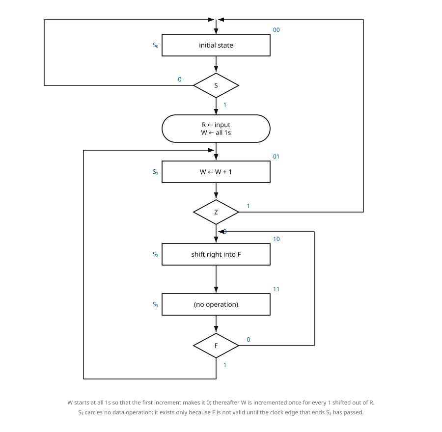

The deck's state-by-state description ·CH6 slide 38:

- **State $S_0$.** Initially the weighing machine is in state $S_0$. The weighing process starts
  when the start signal $S$ becomes 1. While in $S_0$, if $S$ is 1, the clock pulse causes three
  jobs to be done simultaneously:
  1. the binary number is loaded into register $R$;
  2. the $W$ register is set to all 1s;
  3. the machine is transferred to state $S_1$.
- **State $S_1$.** While in $S_1$, the clock pulse causes two jobs to be done simultaneously:
  1. counter $W$ is incremented by 1 (in the first round, all 1s become all 0s);
  2. if $Z$ is 0 the machine goes to state $S_2$; if $Z$ is 1 the machine goes to state $S_0$.
- **State $S_2$.** In this state, register $R$ is shifted right by 1 bit so that the LSB goes into
  $F$ and the MSB is loaded with 0.
- **State $S_3$.** In this state the value of $F$ is checked. If it is 0 the machine is transferred
  to state $S_2$, otherwise to state $S_1$. Thus, **when $F = 1$, $W$ is incremented**.

All the operations occur in coincidence with the clock pulse while in the corresponding state. The
register $R$ eventually contains all 0s when the last 1 has been shifted out of it ·CH6 slide 38.

> $S_3$ exists only because of timing. $F$ is loaded on the clock edge that *ends* $S_2$, so its new
> value cannot be tested until the following clock period. A flowchart would test the bit
> immediately; an ASM chart cannot, and this is exactly the "be careful, especially with timing"
> warning of slide 4.

[ex] [added] **Worked trace for $R = 1011$** (weight 3). Not in the deck; supplied because the
chapter gives the weighing machine no numerical example.

| clock period | state | $R$ after the edge | $W$ after the edge | test |
|---|---|---|---|---|
| 0 | $S_0$, $S = 1$ | 1011 | 1111 | → $S_1$ |
| 1 | $S_1$ | 1011 | 0000 | $Z = 0$ → $S_2$ |
| 2 | $S_2$ | 0101 | 0000 | $F = 1$ → $S_3$ |
| 3 | $S_3$ | 0101 | 0000 | $F = 1$ → $S_1$ |
| 4 | $S_1$ | 0101 | 0001 | $Z = 0$ → $S_2$ |
| 5 | $S_2$ | 0010 | 0001 | $F = 1$ → $S_3$ |
| 6 | $S_3$ | 0010 | 0001 | $F = 1$ → $S_1$ |
| 7 | $S_1$ | 0010 | 0010 | $Z = 0$ → $S_2$ |
| 8 | $S_2$ | 0001 | 0010 | $F = 0$ → $S_3$ |
| 9 | $S_3$ | 0001 | 0010 | $F = 0$ → $S_2$ |
| 10 | $S_2$ | 0000 | 0010 | $F = 1$ → $S_3$ |
| 11 | $S_3$ | 0000 | 0010 | $F = 1$ → $S_1$ |
| 12 | $S_1$ | 0000 | 0011 | $Z = 1$ → $S_0$, done |

$$W_{\text{final}} = 0011_2 = 3 = \text{number of 1s in } 1011 \;\checkmark$$

The chart was simulated in Python for **all 256** eight-bit inputs; the final value of $W$ equals
the population count of the input in every case.

---

## 10.17 D and JK flip-flops written as ASM charts

·CH6 slides 39–40 (both image-only)

| Symbol | Meaning | Units | Typical |
|---|---|---|---|
| $D$ | the D flip-flop input | — | 0 or 1 |
| $J, K$ | the JK flip-flop inputs | — | 0 or 1 |
| $Q$ | the stored state | — | 0 or 1 |
| $Q^{+}$ | the next state | — | 0 or 1 |
| $Z$ | the flip-flop output, equal to $Q$ | — | 0 or 1 |
| $A, B$ | the two states, $A$ meaning $Q = 0$ and $B$ meaning $Q = 1$ | — | — |

Both charts are **Moore**: the output is written inside the state box, so $Z = Q$ and there is no
conditional output box anywhere.

[fig] **Fig. 10-22** — the D and JK flip-flops as ASM charts ·CH6 slides 39–40

```yaml
figure_data:
  type: asm-charts
  d_flip_flop:
    states: {A: {Z: 0}, B: {Z: 1}}
    state_table:
      A: {"D=0": [A, 0], "D=1": [B, 1]}
      B: {"D=0": [A, 0], "D=1": [B, 1]}
    chart: "each state box is followed by one decision box on D; 0 goes to A, 1 goes to B"
  jk_flip_flop:
    states: {A: {Z: 0}, B: {Z: 1}}
    state_table:
      A: {"JK=00": [A, 0], "JK=01": [A, 0], "JK=10": [B, 1], "JK=11": [B, 1]}
      B: {"JK=00": [B, 1], "JK=01": [A, 0], "JK=10": [B, 1], "JK=11": [A, 0]}
    chart: "state A tests J then K; state B tests K then J; the second test in each block
            changes nothing"
```

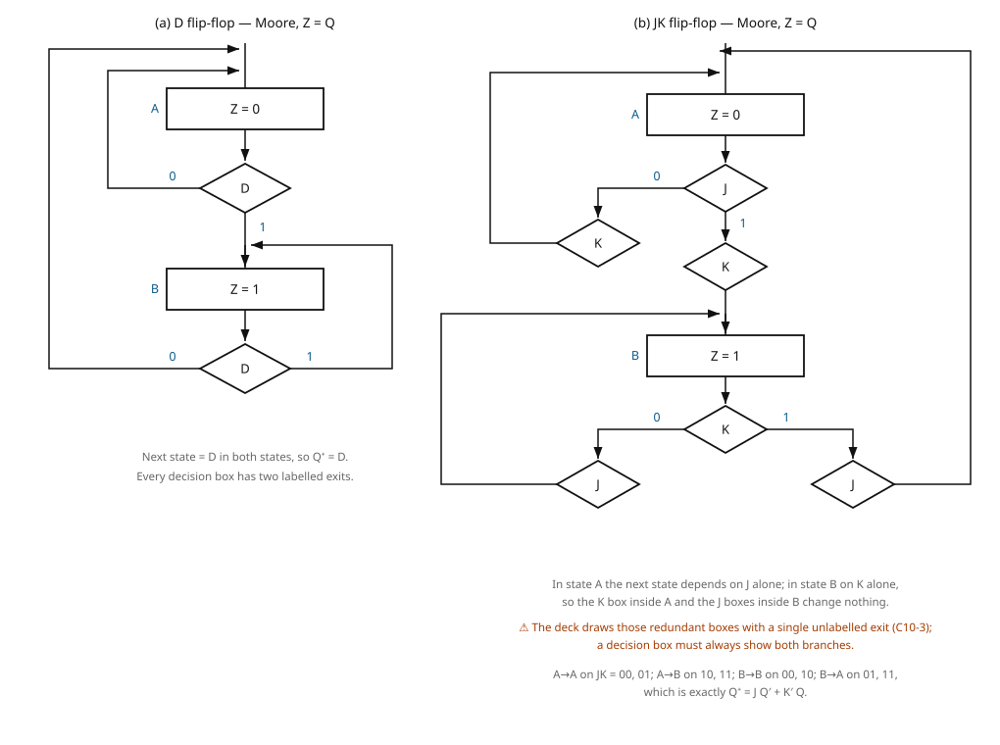

**The D flip-flop** ·CH6 slide 39. State table, in the deck's own layout:

| present state | $D = 0$ | $D = 1$ |
|---|---|---|
| $A$ | $A$, 0 | $B$, 1 |
| $B$ | $A$, 0 | $B$, 1 |

Both rows are identical, which is the whole content of a D flip-flop: $Q^{+} = D$.

**The JK flip-flop** ·CH6 slide 40. State table:

| present state | $JK = 00$ | $JK = 01$ | $JK = 10$ | $JK = 11$ |
|---|---|---|---|---|
| $A$ | $A$, 0 | $A$, 0 | $B$, 1 | $B$, 1 |
| $B$ | $B$, 1 | $A$, 0 | $B$, 1 | $A$, 0 |

Every entry agrees with the characteristic equation

$$\boxed{\;Q^{+} = J\,Q' + K'\,Q\;}$$

[eq: jk-characteristic]

- In state $A$ ($Q = 0$) the next state depends on $J$ alone: $Q^{+} = J$.
- In state $B$ ($Q = 1$) the next state depends on $K$ alone: $Q^{+} = K'$.

⚠ VERIFY (C10-3) — for that reason the $K$ box drawn inside state $A$'s block, and the two $J$ boxes
drawn inside state $B$'s block, cannot change the outcome. The deck draws each of them with a
**single, unlabelled exit**, which is not valid ASM notation: a decision box must show both branches
and both must be labelled 0 and 1. Either delete the redundant boxes, or draw both branches and let
them merge. The behaviour of the chart as drawn is correct; only the notation is wrong. Both state
tables were checked against $Q^{+} = JQ' + K'Q$ for all eight state-and-input combinations.

---

## Verification summary

Everything numeric or tabular in slides 1–40 was rebuilt independently in Python and compared cell
by cell:

- the equivalence of the two SM blocks on slide 7 and the two SM charts on slide 8, by exhaustive
  enumeration of their input/output behaviour;
- the state sequence, the Moore outputs and the two conditional outputs of the slide-10 timing chart;
- the link-path expressions $A^{+}$ and $B^{+}$ on slide 18, against the next-state table of the
  slide-10 chart;
- the hand multiplication and the eleven-line add–shift trace on slide 12;
- the nine-line four-register trace on slide 13;
- all sixteen specified rows of the slide-20 PLA table against the slide-17 SM chart, expanded to
  all 384 state-and-input combinations, checking for gaps and overlaps as well as for wrong entries;
- the eight-row expansion of PLA row 5 on slide 21;
- every cell of the three K-maps on slide 22 and all four map-entered variables;
- the fifteen-row sequence-of-operations table on slides 26–27;
- the six-row state table on slides 32–33 and the four equations derived from it;
- the drawn gate topology of slide 34 against those equations;
- the weighing-machine ASM chart of slide 37, simulated for all 256 eight-bit inputs;
- both flip-flop state tables on slides 39–40 against their characteristic equations.

**Seven defects: three substantive, four cosmetic.** Full entries in `flags/10.md`.

| ID | Slide | One line |
|---|---|---|
| V10-1 | 13 | loop-exit test prints "Is Count $n$ ?"; must be "Is Count $= 0$ ?" |
| V10-2 | 21 | rows 7 and 8 of the row-5 expansion duplicate rows 5 and 6; $D_7$ should be 1 |
| V10-3 | 34 | the gate forming $D_{G1}$ is drawn as an OR; the equation requires an AND |
| C10-1 | 18 | steps 2 and 3 of the realisation procedure have lost their symbols; "existing" for "exiting" |
| C10-2 | 30 | counter bits renumbered $A_3 \ldots A_0$, contradicting $A_4 \ldots A_1$ elsewhere |
| C10-3 | 40 | redundant decision boxes drawn with a single unlabelled exit |
| C10-4 | 36 | "defined by as the number of 1's present in it binary representation" |

---

## Slide coverage

| Slides | Treatment |
|---|---|
| 1 | Chapter title slide — no content. |
| 2–3 | §10.1, drawbacks of state diagrams and the definition of an ASM chart. |
| 4 | §10.1, the design route and the three chart elements named. |
| 5 | §10.2, Fig. 10-1. |
| 6 | §10.3, Fig. 10-2. |
| 7 | §10.4, Fig. 10-3. |
| 8 | §10.5, Fig. 10-4, [eq: sm-chart-combinational-output]. |
| 9 | §10.6, Fig. 10-5. |
| 10 | §10.7, Figs. 10-6 and 10-7. |
| 11 | §10.9, the three derivation steps. |
| 12 | §10.10, hand multiplication and the add–shift trace. |
| 13 | §10.10, four-register trace; **image-only slide**; V10-1. |
| 14 | §10.10, Fig. 10-8. |
| 15–16 | §10.11, Fig. 10-9 and the rules of the game. |
| 17 | §10.11, Figs. 10-10 and 10-11; **image-only slide**. |
| 18 | §10.8, [eq: link-path-next-state]; C10-1. |
| 19 | §10.12, Fig. 10-12. |
| 20 | §10.12, the PLA table transcribed in full. |
| 21 | §10.12, the row-5 expansion; V10-2. |
| 22 | §10.13, Fig. 10-13 and $E_1 \ldots E_4$. |
| 23 | Appendix title slide — no content. |
| 24 | §10.14, the design problem transcribed in full. |
| 25 | §10.14, Fig. 10-14. |
| 26–27 | §10.14, the sequence-of-operations table. Slide 27 is slide 26 without the L1/L2/L3 annotations — treated as a duplicate. |
| 28 | §10.14, the datapath/control-logic split. |
| 29 | §10.14, Fig. 10-15. |
| 30 | §10.14, Fig. 10-16 — caption only, third-party redraw; C10-2. |
| 31 | §10.15, Fig. 10-17 and the register-transfer summary. |
| 32–33 | §10.15, the state table and the four equations. Slide 32 is slide 33 without the coloured groupings — treated as a duplicate. |
| 34 | §10.15, Fig. 10-18; V10-3. |
| 35 | §10.15, Fig. 10-19 — caption only, third-party redraw. |
| 36 | §10.16, Fig. 10-20; C10-4. |
| 37 | §10.16, Fig. 10-21; **image-only slide**. |
| 38 | §10.16, the four state descriptions; **image-only slide**. |
| 39–40 | §10.17, Fig. 10-22; **both image-only slides**; C10-3. |

Nothing in slides 1–40 is unread or unaccounted for. No slide in the range was illegible.

---

## Note on file size

This file is about 66 KB, above the ~40 KB guide figure in the build brief. It is **not** split,
because the chapter is one continuous argument: every example after slide 11 is an application of
the SM-block rules established in slides 5–9, and the PLA table, the row expansion and the K-maps of
slides 20–22 are three views of the single dice-game chart on slide 17.

If a split ever becomes necessary, the natural cut is **between slide 22 and slide 23** — the deck's
own appendix boundary:

- `10-algorithmic-state-machines.md` — slides 1–22, the notation and the two main worked examples;
- `11-asm-design-examples.md` — slides 23–40, the appendix (Example 1, the weighing machine and the
  flip-flop charts).

That would leave the first file at roughly 40 KB and the second at roughly 20 KB, with no
cross-reference broken except the two mentions of the SM-block rules in §10.17.

<sub><i>Every figure in this file was redrawn from the rendered slide; none is reproduced from the
source deck.</i></sub>
