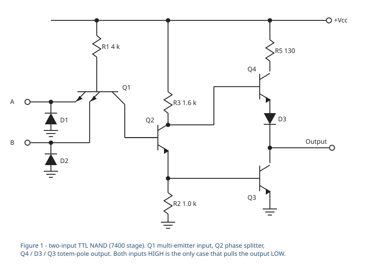
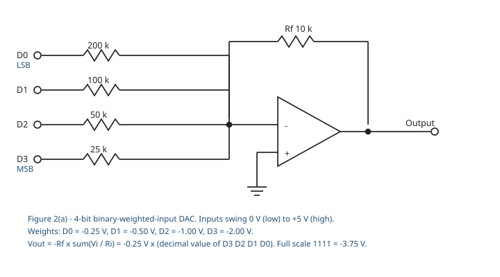

<!-- Compiled by Jotham-JS, 2026. Digital Electronics BEE 3102 knowledge base — past papers. -->

<!-- FOR FUTURE CLAUDE — how to use this file:
  · [q] blocks are the paper's wording, VERBATIM. Quote them exactly; do not silently tidy them.
    Where the paper is wrong it stays wrong in the [q] block and carries a marker; the correction is
    in the Errata section at the foot of this file.
  · Each question is answered in two parts, deliberately: **Exam answer** is what he would write in
    the exam, sized to the mark allocation. **Working** comes after. Do not merge them.
  · Every figure exists twice: a figure_data block (authoritative, in text) and an SVG in figures/.
    Reason from the block; show him the SVG. Never re-measure from SVG path coordinates.
  · Every number here was recomputed in Python before it was written down.
  · THE PAPER ITSELF IS NOT IN THE REPOSITORY. Rule 4 of docs/kb-format.md forbids committing
    photographs or scans of examination papers. This transcription is the only copy held.
  · Question 8's waveform could not be read from the photograph. That is stated honestly at Q8 and
    is NOT guessed at. See Errata P3.
-->

# BEE 3102 CAT 1 — 6 August 2024

**Digital Electronics II · 1 hr 20 min · 30 marks · 8 questions**

Strathmore University, School of Computing and Engineering Sciences —
Bachelor of Electrical and Electronics Engineering.

---

## Question map

| Q | Marks | Topic | KB section | Figure |
|---|---|---|---|---|
| 1 | 3 | Monotonicity, linearity, sensitivity as converter specifications | **none — not taught** | — |
| 2 | 4 | Truth table for a TTL circuit, and identify the gate | `02-digital-logic-families` | `q2` |
| 3 | 4 | Draw a DTL NAND gate | `02-digital-logic-families` | — |
| 4 | 4 | Implement four Boolean functions on an $8\times4$ PROM | `04-programmable-logic-devices` | — |
| 5 | 4 | 16-bit BCD DAC — percentage resolution and $V_{\text{out}}$ | `06-digital-to-analogue-conversion` | — |
| 6 | 2 | 8-bit weighted-resistor DAC — LSB resistor from the MSB resistor | `06-digital-to-analogue-conversion` | — |
| 7 | 3 | 6-bit DAC — output for a second input code | `06-digital-to-analogue-conversion` | — |
| 8 | 6 | Output of a binary-weighted DAC for an applied input sequence | `06-digital-to-analogue-conversion` | `q8` |

*Marks: 3 + 4 + 4 + 4 + 4 + 2 + 3 + 6 = **30** ✓*

---

## What this paper says about examinable scope

Traced question by question against all 348 slides.

| Source | Marks | Share |
|---|---|---|
| **CH4 — Signal conversion (DAC half)** | **15** | **50 %** |
| CH2 — Digital logic families | 8 | 27 % |
| CH3 — Memory and programmable logic | 4 | 13 % |
| **Not taught in any of the six decks** | **3** | 10 % |
| CH5 + CH6 — FSMs and ASMs | **0** | 0 % |

Four things follow, and they matter more than any single answer in this file.

- **Half the paper is the DAC half of Chapter 4** — twenty slides, `../06-digital-to-analogue-conversion.md`.
  Four of the eight questions come from it. It is the highest marks-per-slide material in the unit
  by a wide margin.
- **Chapters 5 and 6 scored nothing.** That is 158 slides — the largest block in the unit — with
  zero marks. Expected for a CAT 1 sat in the first half of the semester, but it tells you where
  CAT 2 and the final examination will go instead.
- **Question 1 is not taught anywhere.** Monotonicity, linearity and sensitivity appear in no deck
  except the Chapter 4 slide 49 homework, which merely lists them as topics to go and read about;
  *sensitivity* appears nowhere at all. A search of all six decks confirms this. That is 3 marks —
  a tenth of the paper — deliberately outside the taught material.
- **Question 5 is the deck's own worked example with one more digit — and the deck gets that example
  wrong.** Slide 37 works a 3-digit BCD converter with a 9.99 V full scale; this question is the
  4-digit version of it. The deck's version is defective (**V06-4**, **V06-6**, **V06-7** in
  `../_verification-log.md`) because it pushes a BCD converter through the *binary* resolution
  formula. Anyone who revised from slide 37 as printed would carry that error straight into this
  question.

---

## Question 1 — converter specifications *(3 marks)*

> [q] What is monotonicity, Linearity, and Sensitivity as applied to Digital Electronics?

### Exam answer

One mark each; a sentence apiece is the right size.

- **Monotonicity** — a converter is monotonic if its output moves in one direction only as the input
  code counts up: every one-step increase in code gives an equal or larger output, never a smaller
  one. A DAC loses monotonicity when its differential non-linearity is worse than $-1$ LSB.
- **Linearity** — how closely the actual transfer characteristic follows the ideal straight line
  from zero to full scale. Quoted as *integral* non-linearity, the worst departure from that line,
  and *differential* non-linearity, the worst departure of a single step from 1 LSB.
- **Sensitivity** — the change in output produced by a unit change in input. For a converter this is
  the step size, one LSB, so it is the smallest input change that produces a distinguishable change
  at the output. Usually quoted as a percentage of full scale.

### Working

[added] **None of this comes from the decks.** All three terms were searched for across all 348
slides. *Monotonicity* and *linearity error* appear only in the list of reading topics set as
homework on CH4 slide 49; *sensitivity* does not appear at all. The definitions above are the
standard converter-specification ones and are supplied by us — see
`../06-digital-to-analogue-conversion.md` § "Where the answers live" for the same finding stated from
the other direction.

The three are related, and saying so is worth a mark if the examiner wants depth:

$$\text{sensitivity} \;=\; 1\ \text{LSB} \;=\; \frac{V_{\text{FS}}}{2^{N}-1}$$

Differential non-linearity measures how far each real step departs from that ideal one, and once
any step's error passes $-1$ LSB the output goes backwards — so **monotonicity is the failure
threshold of differential linearity, not an independent property.**

---

## Question 2 — truth table and gate identification *(4 marks)*

> [q] Develop the truth table for the circuit in figure 1 and determine its logic gate.

[fig] **Figure 1** — two-input TTL gate, drawn with a multi-emitter input transistor and a
totem-pole output.

```yaml
figure_data:
  type: schematic
  family: TTL
  supply: +Vcc
  resistors: {R1: 4 kohm, R3: 1.6 kohm, R5: 130 ohm, R2: 1.0 kohm}
  devices:
    - {id: Q1, type: npn-multi-emitter, role: input, emitters: [A, B]}
    - {id: Q2, type: npn, role: phase splitter}
    - {id: Q4, type: npn, role: totem-pole pull-up}
    - {id: Q3, type: npn, role: totem-pole pull-down}
    - {id: D1, type: diode, role: input clamp on A, cathode: input}
    - {id: D2, type: diode, role: input clamp on B, cathode: input}
    - {id: D3, type: diode, role: level shift, between: [Q4 emitter, output]}
  nets:
    - "R1 from +Vcc to base of Q1"
    - "emitters of Q1 are inputs A and B"
    - "collector of Q1 to base of Q2"
    - "R3 from +Vcc to collector of Q2; that node also drives the base of Q4"
    - "R2 from emitter of Q2 to ground; that node also drives the base of Q3"
    - "R5 from +Vcc to collector of Q4"
    - "emitter of Q4 through D3 to the output"
    - "collector of Q3 to the output, emitter of Q3 to ground"
  note: >
    resistor values as printed on the paper. The transistor subscripts were read from a
    photograph; the function does not depend on them. This is the standard 7400 stage, and the
    same circuit appears in the knowledge base at CH2 slides 28-31.
```



### Exam answer

| $A$ | $B$ | $Q_1$ | $Q_2$ | $Q_3$ | $Q_4$ | Output |
|---|---|---|---|---|---|---|
| 0 | 0 | saturated | off | off | on | **1** |
| 0 | 1 | saturated | off | off | on | **1** |
| 1 | 0 | saturated | off | off | on | **1** |
| 1 | 1 | reverse active | on | on | off | **0** |

$$\boxed{\;Z = \overline{A \cdot B}\;}$$

**It is a two-input NAND gate.**

### Working

**Any input LOW.** That emitter's base-emitter junction is forward biased, so $Q_1$ saturates and
its collector — the base of $Q_2$ — is pulled down to roughly $0.2\ \text{V}$. That is far below the
$\approx 1.4\ \text{V}$ needed to turn on $Q_2$'s base-emitter junction *and* $Q_3$'s in series, so
$Q_2$ is off. With $Q_2$ off, no current flows in $R_2$, $Q_3$ is off, and the base of $Q_4$ sits
near $V_{CC}$ through $R_3$. $Q_4$ conducts and pulls the output up through $R_5$ and $D_3$ —
**output HIGH**.

**Both inputs HIGH.** Neither emitter can conduct. Current from $R_1$ instead flows through $Q_1$'s
base-collector junction, which is forward biased, into the base of $Q_2$ — $Q_1$ is in the reverse
active mode. $Q_2$ turns on, its emitter current through $R_2$ drives $Q_3$ into saturation, and
$Q_3$ pulls the output down to $V_{CE(\text{sat})} \approx 0.2\ \text{V}$. At the same time $Q_2$'s
collector falls, turning $Q_4$ off, so the two output transistors are never on together —
**output LOW**.

Only the all-HIGH row gives a LOW output. That is NAND.

$D_1$ and $D_2$ take no part in the logic; they are clamps that conduct only if an input is driven
below ground, limiting negative undershoot on the line. $D_3$ raises the turn-on threshold of the
pull-up so that $Q_4$ is firmly off while $Q_3$ is saturated.

**KB:** `../02-digital-logic-families.md` §§ TTL, especially the standard 3-input TTL NAND of
·CH2 slide 31 — the same stage with a third emitter. `../labs/lab-01-ttl-nand-nor.md` measures this
circuit on a real 7400 (working copy only; not in the public repository).

---

## Question 3 — DTL NAND gate *(4 marks)*

> [q] Draw a Diode Transistor Logic for a NAND gate

### Exam answer

Draw and label:

- inputs $A$ and $B$, each through a diode ($D_1$, $D_2$) with its **cathode at the input** and its
  anode joined to a common node $P$;
- $R_1$ from $+V_{CC}$ down to $P$;
- two series level-shifting diodes $D_3$, $D_4$ from $P$ to the base of NPN transistor $Q_1$;
- $R_2$ from that base to ground (or to $-V_{BB}$);
- $R_C$ from $+V_{CC}$ to the collector of $Q_1$, which is the output;
- emitter of $Q_1$ to ground.

State the operation in one line each:

- **Any input LOW** — that input diode conducts and holds $P$ at about $0.7\ \text{V}$, which cannot
  supply the $\approx 2.1\ \text{V}$ needed across $D_3$, $D_4$ and $V_{BE}$. $Q_1$ is off and the
  **output is HIGH**.
- **All inputs HIGH** — both input diodes are reverse biased, $P$ rises, current flows through
  $D_3$ and $D_4$ into the base, $Q_1$ saturates and the **output is LOW**.

Hence $Z = \overline{A \cdot B}$ — a NAND.

### Working

The three-diode-drop threshold is the whole design. Without $D_3$ and $D_4$ the node $P$ at
$0.7\ \text{V}$ would already be enough to start turning $Q_1$ on, and the gate would have no noise
margin at all. Each series diode adds $0.7\ \text{V}$ to the voltage $P$ must reach:

$$V_P(\text{on}) \;=\; V_{D3} + V_{D4} + V_{BE} \;=\; 0.7 + 0.7 + 0.7 \;=\; 2.1\ \text{V}$$

$$V_P(\text{input LOW}) \;=\; V_{D1} \;\approx\; 0.7\ \text{V}$$

so the LOW state sits $1.4\ \text{V}$ clear of the turn-on threshold.

[added] Two marks of the four are almost certainly for the circuit and two for the explanation —
draw it *and* say how it works.

**KB:** `../02-digital-logic-families.md` § "Diode-transistor logic (DTL)", ·CH2 slide 26. Note that
·CH2 slide 27 draws a DTL **NOR**, not a NAND — the diode orientation is reversed there. Do not
copy slide 27 for this question.

---

## Question 4 — four functions on an $8\times4$ PROM *(4 marks)*

> [q] Implement the following Boolean functions using 8x4 PROM.
> $W(a,b,c) = \sum m(0,1,3,5,7)$,  $Xm(a,b,c) = \sum m(0,2,4,5)$,  $Y(a,b,c) = \sum m(1,2,4,7)$,
> $Z(a,b,c) = \sum m(0,3,5,6,7)$

*(The paper prints "$Xm(a,b,c)$" for $X(a,b,c)$ — see Errata P2.)*

### Exam answer

Three inputs $a$, $b$, $c$ drive the PROM's fixed $3 \to 8$ decoder; the four outputs $W$, $X$, $Y$,
$Z$ are taken from the programmable OR array. The programming table is the truth table itself:

| $m$ | $a$ | $b$ | $c$ | $W$ | $X$ | $Y$ | $Z$ |
|---|---|---|---|---|---|---|---|
| 0 | 0 | 0 | 0 | 1 | 1 | 0 | 1 |
| 1 | 0 | 0 | 1 | 1 | 0 | 1 | 0 |
| 2 | 0 | 1 | 0 | 0 | 1 | 1 | 0 |
| 3 | 0 | 1 | 1 | 1 | 0 | 0 | 1 |
| 4 | 1 | 0 | 0 | 0 | 1 | 1 | 0 |
| 5 | 1 | 0 | 1 | 1 | 1 | 0 | 1 |
| 6 | 1 | 1 | 0 | 0 | 0 | 0 | 1 |
| 7 | 1 | 1 | 1 | 1 | 0 | 1 | 1 |

A **1** means the link at that crosspoint is left intact; a **0** means it is blown. Counting the
ones column by column — 5 in $W$, 4 in $X$, 4 in $Y$, 5 in $Z$ — **18 of the 32 crosspoints stay
intact** and the other 14 are blown.

### Working

An $8 \times 4$ PROM is 8 words of 4 bits. With three address inputs it holds $2^3 = 8$ words, so
$a$, $b$, $c$ map onto the address lines with $a$ as the most significant — that is what makes the
row index equal the minterm number.

**Nothing is minimised, and nothing needs to be.** This is the property that separates a PROM from
a PLA: the AND array is *fixed* and already generates all eight minterms, one per decoder output
line, so any function of three variables is programmed simply by marking which minterms it contains.
Only the OR array is programmable.

Building each column straight from the given lists:

$$W = \sum m(0,1,3,5,7) \quad\Rightarrow\quad \text{1 in rows } 0,1,3,5,7$$
$$X = \sum m(0,2,4,5) \quad\Rightarrow\quad \text{1 in rows } 0,2,4,5$$
$$Y = \sum m(1,2,4,7) \quad\Rightarrow\quad \text{1 in rows } 1,2,4,7$$
$$Z = \sum m(0,3,5,6,7) \quad\Rightarrow\quad \text{1 in rows } 0,3,5,6,7$$

Every row was rebuilt independently in Python and matched cell for cell.

[added] Worth one line in the answer if there is room: had the question said **PLA** rather than
**PROM**, minimisation *would* be required, because a PLA's AND array is programmable and has fewer
product-term lines than there are minterms — you would first reduce each function and then share
product terms between outputs.

**KB:** `../04-programmable-logic-devices.md` § PROM, ·CH3 slides 41-43, which works a $32 \times 8$
PROM the same way; and § "ROM, PAL and PLA configurations", ·CH3 slide 38, for which array is
programmable in each device. **Watch V04-1** — the PAL fuse map on ·CH3 slide 52 has a mislabelled
column.

---

## Question 5 — 16-bit BCD DAC *(4 marks)*

> [q] A 16-bit Digital-to-Analog Converter (DAC) using a Binary Coded Decimal (BCD) input code has a
> full-scale output of 9.99V. Calculate the percentage resolution and the output voltage ($V_{out}$)
> for an input code of 0110 1001 0101 0111.

### Exam answer

16 bits of BCD is four decimal digits, so the largest code is 9999 and there are 9999 steps.

$$\%\,\text{resolution} \;=\; \frac{1}{10^{4}-1}\times 100\,\% \;=\; \frac{1}{9999}\times 100\,\%
\;=\; \boxed{0.01\,\%}$$

Step size:

$$\text{step} \;=\; \frac{V_{\text{FS}}}{10^{4}-1} \;=\; \frac{9.99}{9999} \;=\; 0.999\ \text{mV}$$

The input code $0110\,1001\,0101\,0111$ reads digit by digit as $6\,|\,9\,|\,5\,|\,7 = 6957$.

$$V_{\text{out}} \;=\; 6957 \times 0.999\ \text{mV} \;=\; \boxed{6.95\ \text{V}}$$

### Working

**Read the code as BCD, not as binary.** Each nibble is one decimal digit:

$$0110_2 = 6,\qquad 1001_2 = 9,\qquad 0101_2 = 5,\qquad 0111_2 = 7$$

so the decimal equivalent is $6957$, **not** $0110100101010111_2 = 27\,\!,\!\!991$. Treating it as
straight binary is the single most common way to lose this question.

**The divisor is $10^d - 1$, not $2^N - 1$.** A BCD converter's four-bit groups only ever count 0 to
9, so 16 bits reach 9999 and not 65 535. The general form:

$$\text{step} \;=\; \frac{V_{\text{FS}}}{10^{d}-1}, \qquad
\%\,\text{res} \;=\; \frac{1}{10^{d}-1}\times100\,\%$$

where $d$ is the number of BCD digits, here 4. Substituting binary's $2^{16}-1 = 65\,\!535$ instead
would give a step of $0.152\ \text{mV}$ and an output of $4.27\ \text{V}$ — both wrong.

$$V_{\text{out}} = \frac{9.99}{9999}\times 6957 = 6.9507\ \text{V}$$

⚠ **The full-scale figure looks like a typo — see Errata P1.** Four BCD digits reaching 9999 with a
$1\ \text{mV}$ step would give a full scale of $9.999\ \text{V}$, not $9.99\ \text{V}$. On that
reading the step is exactly $1.000\ \text{mV}$ and $V_{\text{out}} = 6.957\ \text{V}$. Answer the
paper as printed — $6.95\ \text{V}$ — and note the discrepancy in one line; the two differ by
$6\ \text{mV}$ and the percentage resolution is $0.01\,\%$ either way.

⚠ **Cross-reference — the deck gets this same example wrong.** ·CH4 slide 37 is the 3-digit version
of this question, with the same $9.99\ \text{V}$ full scale, and it works the BCD converter through
the binary formula. Three of its printed numbers are wrong. See **V06-4**, **V06-5**, **V06-6** and
**V06-7** in `../_verification-log.md` before revising from that slide.

**KB:** `../06-digital-to-analogue-conversion.md` §§ 6.3 resolution and the boxed
$2^{N}$-versus-$2^{N}-1$ convention note.

---

## Question 6 — LSB resistor of a weighted-resistor DAC *(2 marks)*

> [q] In an 8-bit weighted resistor DAC, the resistor value that corresponds to MSB is 64KΩ.
> Determine the resistor value that corresponds to LSB.

### Exam answer

In a binary-weighted-input DAC each resistor doubles as the bit significance halves, so across
$n = 8$ bits the LSB resistor is $2^{\,n-1}$ times the MSB resistor:

$$R_{\text{LSB}} \;=\; 2^{\,n-1}\,R_{\text{MSB}} \;=\; 2^{7}\times 64\ \text{k}\Omega
\;=\; 128 \times 64\ \text{k}\Omega$$

$$\boxed{R_{\text{LSB}} = 8192\ \text{k}\Omega = 8.192\ \text{M}\Omega}$$

### Working

Two marks, so the line above plus the substitution is the whole answer. The full ladder, if the
examiner wants it shown:

| Bit | $b_7$ (MSB) | $b_6$ | $b_5$ | $b_4$ | $b_3$ | $b_2$ | $b_1$ | $b_0$ (LSB) |
|---|---|---|---|---|---|---|---|---|
| $R$ | 64 k | 128 k | 256 k | 512 k | 1.024 M | 2.048 M | 4.096 M | 8.192 M |

The current a bit injects into the summing node is $V/R$, so halving the significance means doubling
the resistance. The **MSB gets the smallest resistor** — if your answer came out smaller than
64 kΩ, the ladder has been built upside down.

[added] This number is the standard argument for why binary-weighted DACs stop at about four bits:
a 128:1 spread of resistor values, every one of which must hold its ratio to better than half an
LSB, is not practical to make on a chip. It is exactly the problem the R/2R ladder exists to solve,
using only two values.

**KB:** `../06-digital-to-analogue-conversion.md` § 6.5 the binary-weighted-input DAC, ·CH4 slide 39;
§ 6.6 for the R/2R alternative. **Watch V06-9** — the deck's R/2R formula is off by one in the
exponent.

---

## Question 7 — output for a second input code *(3 marks)*

> [q] A 6-bit D/A converter produces an output voltage of 12 V for an input code of 101010. What
> will be the value of the output voltage for an input code of 110110?

### Exam answer

A DAC output is proportional to the decimal value of the input code, $V_{\text{out}} = K D$.

$$101010_2 = 32 + 8 + 2 = 42, \qquad 110110_2 = 32 + 16 + 4 + 2 = 54$$

Find the constant from the given point:

$$K \;=\; \frac{12\ \text{V}}{42} \;=\; 0.2857\ \text{V per step}$$

Then:

$$V_{\text{out}} \;=\; 54 \times 0.2857 \;=\; \boxed{15.43\ \text{V}}$$

### Working

The one-line route, which avoids rounding altogether:

$$V_{\text{out}} \;=\; 12 \times \frac{54}{42} \;=\; \frac{108}{7} \;=\; 15.4286\ \text{V}$$

Both codes were converted independently and the ratio checked in Python.

Two things to be careful of:

- **Do not compute a step size from full scale.** Nothing here says what full scale is. The
  proportionality constant comes from the one data point the question gives, and that is enough.
- **The relationship is proportional, not merely linear** — it assumes zero offset, so a code of
  $000000$ gives $0\ \text{V}$. That is the standard assumption for an ideal DAC and is what the
  question intends.

**KB:** `../06-digital-to-analogue-conversion.md` § 6.2, the transfer relation
$\text{analogue output} = K \times D$, ·CH4 slide 31, and the worked examples on ·CH4 slides 32-33.

---

## Question 8 — output of the DAC in Figure 2 *(6 marks)*

> [q] Determine the output of the DAC in Figure 2 if the sequence of 4-bit numbers in part (b) is
> applied to the inputs. The data inputs have a low value of 0 V and a high value of +5 V.
> show all the steps.

[fig] **Figure 2(a)** — 4-bit binary-weighted-input DAC.

```yaml
figure_data:
  type: schematic
  converter: binary-weighted-input DAC
  amplifier: inverting summing amplifier
  feedback_resistor: 10 kohm
  inputs:
    - {bit: D0, weight: LSB, resistor: 200 kohm}
    - {bit: D1, resistor: 100 kohm}
    - {bit: D2, resistor: 50 kohm}
    - {bit: D3, weight: MSB, resistor: 25 kohm}
  logic_levels: {low: 0 V, high: +5 V}
  nets:
    - "each input resistor from its data line to the inverting summing node"
    - "Rf 10 kohm from the summing node to the output"
    - "non-inverting input to ground"
  derived:
    step: -0.25 V per LSB
    full_scale_1111: -3.75 V
```



### Exam answer

**Step 1 — the current each bit injects when HIGH.**

$$I_{D0} = \frac{5}{200\ \text{k}} = 25\ \mu\text{A}, \qquad
I_{D1} = \frac{5}{100\ \text{k}} = 50\ \mu\text{A}$$

$$I_{D2} = \frac{5}{50\ \text{k}} = 100\ \mu\text{A}, \qquad
I_{D3} = \frac{5}{25\ \text{k}} = 200\ \mu\text{A}$$

**Step 2 — the output contribution of each bit**, through the inverting summing amplifier:

$$V_{\text{out}} = -R_f \sum_i \frac{V_i}{R_i}$$

| Bit | $R_i$ | $I_i$ | Contribution $-R_f I_i$ |
|---|---|---|---|
| $D_0$ (LSB) | 200 kΩ | 25 µA | $-0.25\ \text{V}$ |
| $D_1$ | 100 kΩ | 50 µA | $-0.50\ \text{V}$ |
| $D_2$ | 50 kΩ | 100 µA | $-1.00\ \text{V}$ |
| $D_3$ (MSB) | 25 kΩ | 200 µA | $-2.00\ \text{V}$ |

**Step 3 — the transfer relation.** The contributions are in the ratio $1:2:4:8$, so

$$\boxed{\;V_{\text{out}} = -0.25\ \text{V} \times D\;}$$

where $D$ is the decimal value of $D_3D_2D_1D_0$. Full scale, code $1111$, is $-3.75\ \text{V}$.

**Step 4 — read the sequence off Figure 2(b) and look up each code:**

| $D$ | Code | $V_{\text{out}}$ | | $D$ | Code | $V_{\text{out}}$ |
|---|---|---|---|---|---|---|
| 0 | 0000 | $0.00$ V | | 8 | 1000 | $-2.00$ V |
| 1 | 0001 | $-0.25$ V | | 9 | 1001 | $-2.25$ V |
| 2 | 0010 | $-0.50$ V | | 10 | 1010 | $-2.50$ V |
| 3 | 0011 | $-0.75$ V | | 11 | 1011 | $-2.75$ V |
| 4 | 0100 | $-1.00$ V | | 12 | 1100 | $-3.00$ V |
| 5 | 0101 | $-1.25$ V | | 13 | 1101 | $-3.25$ V |
| 6 | 0110 | $-1.50$ V | | 14 | 1110 | $-3.50$ V |
| 7 | 0111 | $-1.75$ V | | 15 | 1111 | $-3.75$ V |

Sketch the output as a staircase, one tread per applied code, each step $0.25\ \text{V}$ deep.

⚠ **The waveform in Figure 2(b) could not be read** from the photograph of the paper — the
individual bit values on the four data lines are not legible at that resolution. The table above
resolves any sequence on sight, but the specific staircase this question asks for is **not
reproduced here rather than guessed at.** See Errata P3.

### Working

**Why the sum is negative.** The op-amp is an inverting summing amplifier: the data lines feed the
inverting input through their weighting resistors, and the non-inverting input is grounded. The
summing node is a virtual earth, so each input current is fixed by its own resistor alone, all of
them flow into $R_f$, and the output sits at $-R_f I_{\text{total}}$. If the question expects a
positive staircase, an inverting stage has been left out of the reading of the figure.

**Why the virtual earth matters.** Because the summing node is held at $0\ \text{V}$, the branches
do not interact — the current through the 25 kΩ resistor is $5/25\ \text{k}$ whatever the other
three bits are doing. That independence is what makes the weights add cleanly, and it is the reason
the answer is a simple lookup rather than a network solution.

**Check the weighting is really binary.** $200 : 100 : 50 : 25$ is $8 : 4 : 2 : 1$ inverted, so the
currents go $1 : 2 : 4 : 8$ from $D_0$ to $D_3$. $D_0$ carries the smallest current through the
largest resistor and is correctly the LSB.

**KB:** `../06-digital-to-analogue-conversion.md` § 6.5, ·CH4 slides 39-43. The deck's own worked
example on ·CH4 slides 40-42 is this circuit with different values, and its staircase figure is the
model for the sketch this question wants.

---

## Errata — defects in the paper itself

Numbered `P1`, `P2`, … within this past-papers folder. These are **separate** from the `V`/`C`
numbering in `../_verification-log.md`, which catalogues defects in the lecture decks.

### P1 · Question 5 · full-scale output inconsistent with a 4-digit BCD converter

**Prints:** "a full-scale output of 9.99V" for a 16-bit BCD converter.
**Should be:** $9.999\ \text{V}$, if the intended step is a round $1\ \text{mV}$.
**Why:** 16 bits of BCD is four digits, maximum code 9999. A $9.99\ \text{V}$ full scale gives a
step of $9.99/9999 = 0.999\ \text{mV}$ and $V_{\text{out}} = 6.9507\ \text{V}$; a $9.999\ \text{V}$
full scale gives exactly $1.000\ \text{mV}$ and $6.957\ \text{V}$. The value $9.99\ \text{V}$ is
the correct full scale for the **three**-digit converter on ·CH4 slide 37, which this question
appears to be adapted from — a digit was very likely lost in the adaptation.
**Effect:** $6\ \text{mV}$ on the final answer. The percentage resolution is $0.01\,\%$ either way.
**Class:** substantive but low impact — answer as printed and note the discrepancy.

### P2 · Question 4 · stray subscript in a function name

**Prints:** $Xm(a,b,c) = \sum m(0,2,4,5)$
**Should be:** $X(a,b,c) = \sum m(0,2,4,5)$
**Why:** the other three functions are written $W(a,b,c)$, $Y(a,b,c)$, $Z(a,b,c)$. The output is
named $X$; the $m$ has migrated from the $\sum m$ that follows.
**Class:** cosmetic.

### P3 · Question 8 · Figure 2(b) not legible in the source photograph

**Not a defect in the paper.** The waveform diagram giving the applied 4-bit sequence is present on
the paper but could not be read from the photograph supplied. The bit values on $D_0$ to $D_3$ have
**not been inferred**. Everything else in Question 8 — the currents, the weights, the transfer
relation and the full code-to-voltage table — is worked and verified, so a clearer photograph of
that one figure is all that is needed to complete the staircase.

---

## Verification

Every numerical answer in this file was recomputed in Python before it was written:

- Q4 — all 32 cells of the PROM programming table rebuilt from the four minterm lists, and the
  intact-link count recomputed (18, not the 20 first written — corrected 20 Aug 2026).
- Q5 — BCD digit extraction, step size and $V_{\text{out}}$ computed exactly as fractions, both for
  the printed $9.99\ \text{V}$ and the suspected $9.999\ \text{V}$; the ·CH4 slide 37 comparison
  recomputed alongside.
- Q6 — the whole eight-resistor ladder generated from $2^{\,n-1}R$.
- Q7 — both codes converted, the constant taken as an exact fraction, $108/7$ confirmed.
- Q8 — all four branch currents, all four contributions, and all sixteen output levels.

Q1, Q2 and Q3 carry no arithmetic. Q2's truth table was derived from the circuit topology and
cross-checked against the standard 7400 stage in `../02-digital-logic-families.md`.

---

<sub><i>Compiled by Jotham-JS — Jotham Siror · Jesus Saves · 2026. Questions transcribed from a
photograph of the printed paper; the paper itself is not committed, per
<code>docs/kb-format.md</code> rule 4.</i></sub>
